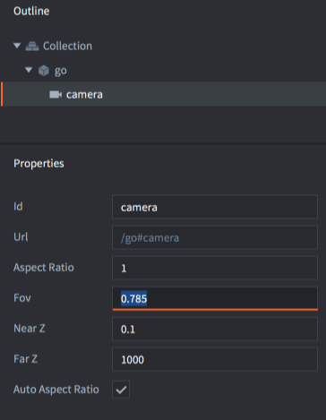
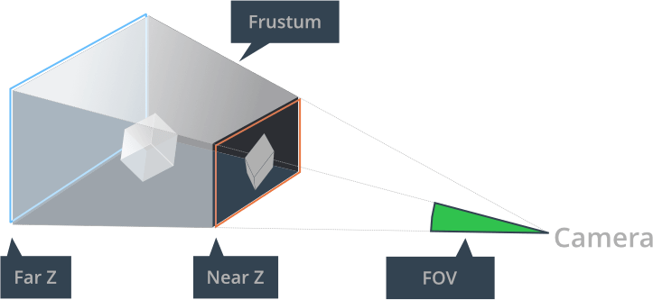
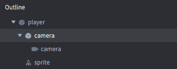

# Kamera

Kamera (ang. camera) w Defoldzie jest komponentem, który zmienia widok i projekcję świata gry. Komponent kamery definiuje podstawową kamerę perspektywiczną lub ortograficzną, która dostarcza macierz widoku i projekcji do skryptu renderującego (ang. render script).

Kamera perspektywiczna jest zazwyczaj używana w grach 3D, gdzie widok kamery oraz wielkość i perspektywa obiektów oparte są na tzw. bryle widokowej (ang. view frustum) oraz odległości i kącie widzenia od kamery do obiektów w grze.

W grach 2D często pożądane jest renderowanie sceny za pomocą rzutu ortograficznego. Oznacza to, że widok kamery jest określany przez specjalną bryłę widokową - prostopadłościan. Rzut ortograficzny jest nierealistyczny, ponieważ nie zmienia rozmiaru obiektów na podstawie ich odległości. Obiekt oddalony o 1000 jednostek zostanie narysowany w takim samym rozmiarze jak obiekt tuż przed kamerą.


## Tworzenie kamery

Aby utworzyć kamerę, <kbd>kliknij prawym przyciskiem myszy</kbd> na obiekcie gry i wybierz <kbd>Add Component ▸ Camera</kbd>. Możesz także utworzyć plik komponentu w hierarchii projektu (*Outline*) i dodać go do obiektu gry.



Komponent kamery ma następujące właściwości, które definiują bryłę kamery (*frustum*):



Id
: Identyfikator komponentu

Aspect Ratio
: (**Tylko dla kamery perspektywicznej**) Współczynnik proporcji - stosunek szerokości bryły widokowej do jej wysokości. Wartość 1.0 oznacza założenie kwadratowego widoku. 1.33 jest odpowiednie dla widoku 4:3, takiego jak 1024x768. 1.78 jest odpowiednie dla widoku 16:9. To ustawienie jest ignorowane, jeśli jest ustawiony *Auto Aspect Ratio*.

Fov
: (**Tylko dla kamery perspektywicznej**) Pionowe pole widzenia kamery wyrażone w radianach. Im szersze pole widzenia, tym więcej zobaczy kamera.

Near Z
: wartość Z bliskiej płaszczyzny odcięcia (ang. clipping plane).

Far Z
: Wartość Z dalekiej płaszczyzny odcięcia.

Auto Aspect Ratio
: (**Tylko dla kamery perspektywicznej**) - Automatyczny współczynnik proporcji - ustaw tę opcję, aby kamera automatycznie obliczała współczynnik proporcji.

Orthographic Projection
: Projekcja ortograficzna - ustaw tę opcję, aby przełączyć kamerę na projekcję ortograficzną (patrz niżej).

Orthographic Zoom
: (**Tylko dla kamery ortograficznej**) - Powiększenie używane dla rzutu ortograficznego (> 1 = przybliż, < 1 = oddal).


## Używanie kamery

Aby aktywować kamerę i przekazać jej macierze widoku i projekcji do skryptu renderującego, wyślij komponentowi wiadomość `acquire_camera_focus`:

```lua
msg.post("#camera", "acquire_camera_focus")
```

Co klatkę, komponent kamery, który obecnie ma fokus kamery, wyśle wiadomość `set_view_projection` do gniazda `"@render"`, czyli dotrze to do twojego skryptu renderującego:

```lua
-- builtins/render/default.render_script
--
function on_message(self, message_id, message)
    if message_id == hash("set_view_projection") then
        self.view = message.view                    -- [1]
        self.projection = message.projection
    end
end
```

1. Wiadomość wysłana z komponentu kamery zawiera macierz widoku (view matrix) i macierz projekcji (projection matrix).

Komponent kamery dostarcza skryptowi renderującemu macierz projekcji albo perspektywiczną, albo ortograficzną, w zależności od właściwości *Orthographic Projection* kamery. Macierz projekcji uwzględnia również określone płaszczyzny odcięcia bliskie i dalekie (near Z, far Z), pole widzenia (FOV) oraz ustawienia współczynnika proporcji kamery.

Macierz widoku dostarczana przez kamerę określa położenie i orientację kamery. Kamera z Projekcją Ortograficzną (*Orthographic Projection*) będzie miała widok wycentrowany na pozycji obiektu gry, do którego jest podłączona, podczas gdy kamera z Projekcją Perspektywiczną (*Perspective Projection*) będzie miała lewy dolny róg widoku na obiekcie gry, do którego jest podłączona.

::: important
Dla zachowania kompatybilności wstecznej domyślny skrypt renderujący ignoruje projekcję dostarczoną przez kamerę i zawsze używa rzutu ortograficznego. Dowiedz się więcej o skrypcie renderującym oraz macierzach widoku i projekcji w [instrukcji do renderowania](/manuals/render/#default-view-projection).
:::

Możesz powiedzieć skryptowi renderującemu, aby używał projekcji dostarczonej przez kamerę, wysyłając wiadomość do skryptu renderującego.

```lua
msg.post("@render:", "use_camera_projection")
```

### Poruszanie kamerą

Aby przesuwać kamerę po obszarze gry, należy przesuwać obiekt gry, do którego jest przypisany komponent kamery. Komponent kamery automatycznie będzie wysyłał zaktualizowaną macierz widoku na podstawie bieżącej pozycji kamery wzdłuż osi X i Y.

### Zoomowanie kamery

Możesz przybliżać i oddalać, używając kamery perspektywicznej, przesuwając obiekt gry, do którego jest przypisana kamera, wzdłuż osi Z. Komponent kamery automatycznie będzie wysyłał zaktualizowaną macierz widoku na podstawie bieżącej pozycji kamery wzdłuż osi Z.

Możesz również przybliżać i oddalać, używając kamery ortograficznej, poprzez zmianę właściwości *Orthographic Zoom* kamery:

```lua
go.set("#camera", "orthographic_zoom", 2)
```

### Śledzenie obiektu gry

Kamerę można ustawić tak, aby śledziła obiekt gry, ustawiając obiekt gry, do którego przypisany jest komponent kamery, jako potomka obiektu gry, który ma być śledzony:



Alternatywnym sposobem jest aktualizacja pozycji obiektu gry, do którego przypisany jest komponent kamery, co klatkę, w miarę jak obiekt gry do śledzenia się przemieszcza.

### Konwersja współrzędnych ekranu na współrzędne świata

Gdy kamera jest przesunięta, przybliżona lub zmieniła projekcję względem domyślnego rozciągniętego rzutu ortograficznego, współrzędne myszy na ekranie dostarczone w funkcji cyklu życia `on_input()` nie będą już odpowiadać współrzędnym świata twoich obiektów gry. Musisz ręcznie uwzględnić zmianę widoku lub projekcji. Konwersja z współrzędnych myszy/ekranu na współrzędne świata z domyślnego skryptu renderującego wygląda tak:

::: sidenote
[Rozwiązania dla kamer od społeczności](/manuals/camera/#rozwiązania-dla-kamer-od-społeczności) wymienione w tym podręczniku oferują funkcje do konwersji między współrzędnymi ekranu a świata.
:::

```Lua
-- builtins/render/default.render_script
--
local function screen_to_world(x, y, z)
	local inv = vmath.inv(self.projection * self.view)
	x = (2 * x / render.get_width()) - 1
	y = (2 * y / render.get_height()) - 1
	z = (2 * z) - 1
	local x1 = x * inv.m00 + y * inv.m01 + z * inv.m02 + inv.m03
	local y1 = x * inv.m10 + y * inv.m11 + z * inv.m12 + inv.m13
	local z1 = x * inv.m20 + y * inv.m21 + z * inv.m22 + inv.m23
	return x1, y1, z1
end
```

## Manipulacja w czasie rzeczywistym

Kamery można manipulować w czasie rzeczywistym za pomocą różnych wiadomości i właściwości ([patrz w dokumentacji API](/ref/camera/)).).

Kamera ma wiele różnych właściwości (properties), które można manipulować za pomocą `go.get()` i `go.set()`:

`fov`
: Pole widzenia kamery (typ `number`).

`near_z`
: Bliska wartość Z kamery (typ `number`).

`far_z`
: Daleka wartość Z kamery (typ `number`).

`orthographic_zoom`
: Zoom kamery ortograficznej (typ `number`).

`aspect_ratio`
: Dodane w Defold 1.4.8. Stosunek szerokości bryły widokowej do jej wysokości. Używane do obliczania projekcji kamery perspektywicznej (typ `number`).

`view`
: Dodane w Defold 1.4.8. Obliczona macierz widoku kamery. TYLKO DO ODCZYTU. (typ `matrix4`).

`projection`
: Dodane w Defold 1.4.8. Obliczona macierz projekcji kamery.  TYLKO DO ODCZYTU. (typ `matrix4`).


## Rozwiązania dla kamer od społeczności

Istnieje biblioteka wspomagająca kamery, która implementuje wspólne funkcje, takie jak śledzenie obiektu gry, trzęsienie ekranu, konwersja współrzędnych ekranu na współrzędne świata i inne. Jest dostępna na portalu zasobów społeczności Defold (Assets portal):

- [Orthographic Camera](https://defold.com/assets/orthographic/) - tylko 2D, autor: Björn Ritzl.
