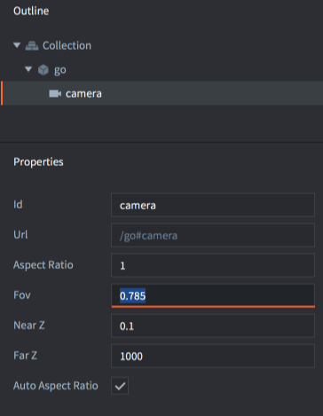
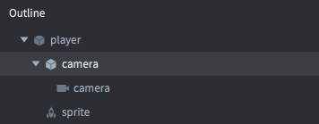

# Kamery

Kamera (ang. camera) w silniku Defold jest komponentem, który zmienia obszar widoczny i projekcję świata gry. Komponent Camera definiuje podstawową kamerę perspektywiczną albo ortograficzną i przekazuje do skryptu renderującego macierz widoku oraz macierz projekcji.

Kamera perspektywiczna jest zwykle używana w grach 3D, gdzie widok kamery oraz rozmiar i perspektywa obiektów zależą od bryły widoku (frustum), odległości od kamery i kąta patrzenia na obiekty w grze.

W grach 2D często pożądane jest renderowanie sceny z użyciem projekcji ortograficznej. Oznacza to, że widok kamery nie jest już wyznaczany przez bryłę widoku, lecz przez prostokątny obszar. Projekcja ortograficzna jest niefotorealistyczna, ponieważ nie zmienia rozmiaru obiektów zależnie od ich odległości. Obiekt oddalony o 1000 jednostek zostanie narysowany w takim samym rozmiarze jak obiekt znajdujący się tuż przed kamerą.


## Tworzenie kamery

Aby utworzyć kamerę, <kbd>right click</kbd> obiekt gry i wybierz <kbd>Add Component ▸ Camera</kbd>. Możesz też utworzyć plik komponentu w hierarchii projektu i dodać ten plik komponentu do obiektu gry.



Komponent Camera ma następujące właściwości definiujące jego *frustum*:


Id
: Id komponentu.

Aspect Ratio
: (**Tylko dla kamery perspektywicznej**) Stosunek szerokości bryły widoku do jej wysokości. 1.0 oznacza widok kwadratowy. 1.33 dobrze pasuje do widoku 4:3, takiego jak 1024x768. 1.78 dobrze pasuje do widoku 16:9. To ustawienie jest ignorowane, jeśli włączone jest *Auto Aspect Ratio*.

Fov
: (**Tylko dla kamery perspektywicznej**) *Pionowe* pole widzenia kamery wyrażone w radianach. Im szersze pole widzenia, tym większy obszar zobaczy kamera.

Near Z
: Wartość Z bliskiej płaszczyzny odcięcia.

Far Z
: Wartość Z dalekiej płaszczyzny odcięcia.

Auto Aspect Ratio
: (**Tylko dla kamery perspektywicznej**) Włącz tę opcję, aby kamera automatycznie obliczała współczynnik proporcji.

Orthographic Projection
: Włącz tę opcję, aby przełączyć kamerę na projekcję ortograficzną.

Orthographic Zoom
: (**Tylko dla kamery ortograficznej**) Mnożnik zoomu kontrolowany przez użytkownika (> 1 = przybliżenie, < 1 = oddalenie). W trybie `Fixed` jest to efektywny zoom. W trybach `Auto Fit` i `Auto Cover` jest mnożony przez zoom obliczony automatycznie, dzięki czemu można zastosować dodatkowy zoom bez wyłączania automatycznego dopasowania.

Orthographic Mode
: (**Tylko dla kamery ortograficznej**) Określa, jak kamera ortograficzna wyznacza zoom względem rozmiaru okna i rozdzielczości projektowej, czyli wartości `game.project` → `display.width/height`.
  - `Fixed` (stały zoom): używa bieżącej wartości `Orthographic Zoom` bez zmian.
  - `Auto Fit` (contain): automatycznie oblicza zoom tak, aby cały obszar projektowy mieścił się w oknie, a następnie mnoży go przez `Orthographic Zoom`. Może pokazać dodatkową zawartość po bokach albo u góry i na dole.
  - `Auto Cover` (cover): automatycznie oblicza zoom tak, aby obszar projektowy wypełniał całe okno, a następnie mnoży go przez `Orthographic Zoom`. Może przycinać zawartość po bokach albo u góry i na dole.
  Ta opcja jest dostępna tylko wtedy, gdy włączone jest `Orthographic Projection`.


## Używanie kamery

Wszystkie kamery są automatycznie włączane i aktualizowane w każdej klatce, a moduł Lua `camera` jest dostępny we wszystkich kontekstach skryptowych. Od Defold 1.8.1 nie trzeba już jawnie włączać kamery przez wysłanie do komponentu wiadomości `acquire_camera_focus`. Stare wiadomości acquire i release nadal istnieją, ale zaleca się używanie wiadomości `enable` i `disable`, tak samo jak w przypadku innych komponentów, które chcesz włączać i wyłączać:

```lua
msg.post("#camera", "disable")
msg.post("#camera", "enable")
```

Aby wyświetlić listę wszystkich obecnie dostępnych kamer, możesz użyć `camera.get_cameras()`:

```lua
-- Uwaga: wywołania render są dostępne tylko w skrypcie renderującym.
--        Funkcji camera.get_cameras() można używać wszędzie,
--        ale render.set_camera tylko w skrypcie renderującym.

for k,v in pairs(camera.get_cameras()) do
    -- tabela kamer zawiera URL-e wszystkich kamer
    render.set_camera(v)
    -- tutaj wykonaj renderowanie; wszystko, co zostanie tu narysowane
    -- z użyciem materiałów korzystających z macierzy widoku i projekcji,
    -- będzie używać macierzy z tej kamery.
end
-- aby wyłączyć kamerę, przekaż nil (albo nie podawaj argumentów) do render.set_camera.
-- po tym wywołaniu wszystkie operacje renderowania będą używać macierzy widoku i projekcji
-- ustawionych bezpośrednio w kontekście renderowania (render.set_view i render.set_projection)
render.set_camera()
```

Moduł skryptowy `camera` udostępnia wiele funkcji do manipulowania kamerą. Poniżej kilka przykładów; pełną listę znajdziesz w [dokumentacji API](/ref/camera/).

```lua
camera.get_aspect_ratio(camera) -- pobierz współczynnik proporcji
camera.get_far_z(camera) -- pobierz far z
camera.get_fov(camera) -- pobierz pole widzenia
camera.get_orthographic_mode(camera) -- pobierz tryb ortograficzny (jedna z wartości camera.ORTHO_MODE_*)
camera.get_orthographic_zoom(camera) -- pobierz mnożnik zoomu kontrolowany przez użytkownika
camera.get_orthographic_auto_zoom(camera) -- pobierz zoom obliczony automatycznie
camera.set_aspect_ratio(camera, ratio) -- ustaw współczynnik proporcji
camera.set_far_z(camera, far_z) -- ustaw far z
camera.set_near_z(camera, near_z) -- ustaw near z
camera.set_orthographic_mode(camera, camera.ORTHO_MODE_AUTO_FIT) -- ustaw tryb ortograficzny
... I tak dalej
```

Kamera jest identyfikowana przez URL, czyli pełną ścieżkę komponentu w scenie, obejmującą kolekcję, obiekt gry, do którego należy, oraz id komponentu. W tym przykładzie do identyfikacji komponentu kamery z tej samej kolekcji użyjesz URL `/go#camera`, a przy dostępie do kamery z innej kolekcji albo ze skryptu renderującego użyjesz `main:/go#camera`.


```lua
-- Dostęp do kamery ze skryptu w tej samej kolekcji:
camera.get_fov("/go#camera")

-- Dostęp do kamery ze skryptu w innej kolekcji:
camera.get_fov("main:/go#camera")

-- Dostęp do kamery ze skryptu renderującego:
render.set_camera("main:/go#camera")
```

W każdej klatce komponent kamery, który ma aktualnie fokus kamery, wysyła wiadomość `set_view_projection` do gniazda `@render`:

```lua
-- builtins/render/default.render_script
--
function on_message(self, message_id, message)
    if message_id == hash("set_view_projection") then
        self.view = message.view                    -- [1]
        self.projection = message.projection
    end
end
```
1. Wiadomość wysyłana z komponentu kamery zawiera macierz widoku i macierz projekcji.

Komponent Camera dostarcza skryptowi renderującemu macierz projekcji perspektywicznej albo ortograficznej, zależnie od właściwości *Orthographic Projection*. Macierz projekcji uwzględnia też ustawione bliską i daleką płaszczyznę odcięcia, pole widzenia oraz współczynnik proporcji kamery.

Macierz widoku dostarczana przez kamerę definiuje położenie i orientację kamery. Kamera z włączonym *Orthographic Projection* centruje widok na pozycji obiektu gry, do którego jest podłączona, natomiast kamera z *Perspective Projection* będzie miała lewy dolny róg widoku ustawiony w pozycji obiektu gry, do którego jest podłączona.


### Skrypt do renderowania

Podczas używania domyślnego skryptu do renderowania Defold automatycznie ustawia ostatnią włączoną kamerę, która ma być używana do renderowania. Wcześniej skrypt w projekcie musiał jawnie wysyłać do renderera wiadomość `use_camera_projection`, aby poinformować go, że ma korzystać z widoku i projekcji z komponentów kamery. Nie jest to już konieczne, ale nadal można tak robić dla zachowania zgodności wstecznej.

Alternatywnie możesz ustawić w skrypcie do renderowania konkretną kamerę, której należy użyć do renderowania. Przydaje się to wtedy, gdy chcesz dokładniej kontrolować, która kamera jest używana, na przykład w grze wieloosobowej.

```lua
-- render.set_camera będzie automatycznie używać macierzy widoku i projekcji
-- przy każdym renderowaniu aż do wywołania render.set_camera().
render.set_camera("main:/my_go#camera")
```

Aby sprawdzić, czy kamera jest aktywna, możesz użyć funkcji `get_enabled` z [Camera API](https://defold.com/ref/alpha/camera/#camera.get_enabled:camera):

```lua
if camera.get_enabled("main:/my_go#camera") then
    -- kamera jest włączona, użyj jej do renderowania!
    render.set_camera("main:/my_go#camera")
end
```

::: sidenote
Aby używać funkcji `set_camera` razem z odrzucaniem poza bryłą widoku (frustum culling), musisz przekazać do niej taką opcję:
`render.set_camera("main:/my_go#camera", {use_frustum = true})`
:::

### Poruszanie kamerą

Kamerę przesuwa się po świecie gry przez przesuwanie obiektu gry, do którego przypisany jest komponent Camera. Komponent automatycznie wyśle zaktualizowaną macierz widoku na podstawie bieżącej pozycji kamery na osiach X i Y.

### Zoomowanie kamery

Przy użyciu kamery perspektywicznej możesz przybliżać i oddalać widok, przesuwając obiekt gry, do którego przypisana jest kamera, wzdłuż osi Z. Komponent Camera automatycznie wyśle zaktualizowaną macierz widoku na podstawie bieżącej pozycji kamery na osi Z.

W przypadku kamery ortograficznej możesz przybliżać i oddalać widok przez zmianę właściwości *Orthographic Zoom* w edytorze lub podczas działania programu:

```lua
-- W trybie Fixed jest to efektywny zoom.
go.set("#camera", "orthographic_zoom", 2)
```

W trybach `Auto Fit` i `Auto Cover` właściwość *Orthographic Zoom* jest stosowana dodatkowo do zoomu obliczanego automatycznie; nie jest ignorowana. Na przykład ustaw w edytorze *Orthographic Mode* na `Auto Fit`, a *Orthographic Zoom* na `1.25`, aby dopasować obszar projektowy do okna, a następnie dodatkowo przybliżyć widok o 25%. Odpowiadająca temu konfiguracja w czasie działania programu wygląda następująco:

```lua
camera.set_orthographic_mode("#camera", camera.ORTHO_MODE_AUTO_FIT)
go.set("#camera", "orthographic_zoom", 1.25)

local auto_zoom = camera.get_orthographic_auto_zoom("#camera")
local zoom_multiplier = camera.get_orthographic_zoom("#camera")
local effective_zoom = auto_zoom * zoom_multiplier
```

`camera.get_orthographic_auto_zoom()` zwraca zoom obliczony na podstawie bieżących wymiarów okna i projektu w trybach `Auto Fit` i `Auto Cover`. W trybie `Fixed` zwraca `1.0`. Ta sama wartość jest dostępna przez właściwość komponentu `orthographic_auto_zoom`, która jest tylko do odczytu:

```lua
local auto_zoom = go.get("#camera", "orthographic_auto_zoom")
```

Przy użyciu kamery ortograficznej możesz też przełączać sposób wyznaczania zoomu za pomocą ustawienia `Orthographic Mode` albo z poziomu skryptu:

```lua
-- pobierz bieżący tryb (jedna z wartości camera.ORTHO_MODE_FIXED, _AUTO_FIT, _AUTO_COVER)
local mode = camera.get_orthographic_mode("#camera")

-- przełącz na auto-fit (contain), aby cały obszar projektowy zawsze pozostawał widoczny
camera.set_orthographic_mode("#camera", camera.ORTHO_MODE_AUTO_FIT)

-- przełącz na auto-cover, aby obszar projektowy zawsze wypełniał okno
camera.set_orthographic_mode("#camera", camera.ORTHO_MODE_AUTO_COVER)

-- przełącz na tryb fixed, aby używać orthographic_zoom bez automatycznego dopasowania
camera.set_orthographic_mode("#camera", camera.ORTHO_MODE_FIXED)
```

### Adaptacyjny zoom

Idea adaptacyjnego zoomu polega na dostosowywaniu wartości zoomu kamery, gdy rozdzielczość wyświetlacza zmienia się względem początkowej rozdzielczości ustawionej w *game.project*.

Dwa częste podejścia do adaptacyjnego zoomu to:

1. Maksymalny zoom: oblicz taką wartość zoomu, aby obszar zawartości odpowiadający początkowej rozdzielczości z *game.project* wypełniał ekran i wykraczał poza jego krawędzie, co może ukryć część zawartości po bokach albo u góry i na dole.
2. Minimalny zoom: oblicz taką wartość zoomu, aby obszar zawartości odpowiadający początkowej rozdzielczości z *game.project* w całości mieścił się w granicach ekranu, co może pokazać dodatkową zawartość po bokach albo u góry i na dole.

Przykład:

```lua
local DISPLAY_WIDTH = sys.get_config_int("display.width")
local DISPLAY_HEIGHT = sys.get_config_int("display.height")

function init(self)
    local initial_zoom = go.get("#camera", "orthographic_zoom")
    local display_scale = window.get_display_scale()
    window.set_listener(function(self, event, data)
        if event == window.WINDOW_EVENT_RESIZED then
            local window_width = data.width
            local window_height = data.height
            local design_width = DISPLAY_WIDTH / initial_zoom
            local design_height = DISPLAY_HEIGHT / initial_zoom

            -- maksymalny zoom: upewnij się, że początkowe wymiary projektu
            -- wypełnią ekran i wyjdą poza jego granice
            local zoom = math.max(window_width / design_width, window_height / design_height) / display_scale

            -- minimalny zoom: upewnij się, że początkowe wymiary projektu
            -- zmieszczą się w granicach ekranu
            --local zoom = math.min(window_width / design_width, window_height / design_height) / display_scale
            
            go.set("#camera", "orthographic_zoom", zoom)
        end
    end)
end
```

Pełny przykład adaptacyjnego zoomu znajdziesz w [tym projekcie przykładowym](https://github.com/defold/sample-adaptive-zoom).

Uwaga: przy użyciu kamery ortograficznej możesz teraz uzyskać zachowanie contain/cover bez własnego kodu, ustawiając `Orthographic Mode` na `Auto Fit` (contain) albo `Auto Cover` (cover). W tych trybach zoom obliczony na podstawie rozmiaru okna i rozdzielczości projektowej jest mnożony przez `Orthographic Zoom`.


### Śledzenie obiektu gry

Możesz sprawić, aby kamera śledziła obiekt gry, ustawiając obiekt gry, do którego przypisany jest komponent Camera, jako dziecko śledzonego obiektu:



Innym sposobem jest aktualizowanie co klatkę pozycji obiektu gry, do którego przypisany jest komponent Camera, zgodnie z ruchem śledzonego obiektu.

### Konwersja między współrzędnymi ekranu i świata {#converting-mouse-to-world-coordinates}

Po przesunięciu lub przybliżeniu kamery albo zmianie jej projekcji współrzędne wejściowe przestają bezpośrednio odpowiadać współrzędnym świata. Użyj funkcji konwersji kamery z wartościami `action.screen_x` i `action.screen_y`. Jeśli pominiesz opcjonalny URL kamery, zostanie użyta ostatnia włączona kamera.

Dla kamery ortograficznej funkcja [`camera.screen_xy_to_world()`](/ref/camera/#camera.screen_xy_to_world:x-y-[camera]) zwraca punkt w przestrzeni świata na bliskiej płaszczyźnie kamery dla danego piksela ekranu:

```lua
function on_input(self, action_id, action)
    if action_id == hash("touch") and action.pressed then
        local world_position = camera.screen_xy_to_world(
            action.screen_x, action.screen_y, "#camera")
        go.set_position(world_position, "/marker")
    end
end
```

Dla kamery perspektywicznej funkcja [`camera.screen_to_world()`](/ref/camera/#camera.screen_to_world:pos-[camera]) przyjmuje `vector3`, którego składowa Z jest głębokością widoku w jednostkach świata, mierzoną od płaszczyzny kamery:

```lua
local depth = 10
local world_position = camera.screen_to_world(
    vmath.vector3(action.screen_x, action.screen_y, depth), "#camera")
```

Funkcja [`camera.world_to_screen()`](/ref/camera/#camera.world_to_screen:world_pos-[camera]) wykonuje konwersję odwrotną. Zwraca współrzędne X i Y w pikselach ekranu oraz wartość Z zgodną z tą samą konwencją głębokości widoku, dlatego jej wynik można ponownie przekazać do `camera.screen_to_world()`:

```lua
-- Update the cached world transform first if the object moved this frame.
go.update_world_transform("/marker")
local world_position = go.get_world_position("/marker")
local screen_position = camera.world_to_screen(world_position, "#camera")
```

Zobacz [stronę przykładów](https://defold.com/examples/render/screen_to_world/), aby sprawdzić konwersję współrzędnych w praktyce. Dostępny jest też [projekt przykładowy](https://github.com/defold/sample-screen-to-world-coordinates/) pokazujący te same API.

::: sidenote
[Rozwiązania kamer od społeczności wymienione w tym podręczniku](/manuals/camera/#third-party-camera-solutions) zawierają funkcje konwersji do współrzędnych ekranu i z powrotem.
:::

## Manipulacja w czasie działania

Kamerami można manipulować w czasie działania za pomocą różnych wiadomości i właściwości. Sposób użycia znajdziesz w [dokumentacji API](/ref/camera/).

Kamera ma kilka właściwości, którymi można sterować przy użyciu `go.get()` i `go.set()`:

`fov`
: Pole widzenia kamery (`number`).

`near_z`
: Bliska wartość Z kamery (`number`).

`far_z`
: Daleka wartość Z kamery (`number`).

`orthographic_zoom`
: Mnożnik zoomu kamery ortograficznej kontrolowany przez użytkownika. W trybach `Auto Fit` i `Auto Cover` jest mnożony przez `orthographic_auto_zoom` (`number`).

`orthographic_auto_zoom`
: Zoom ortograficzny obliczony w trybach `Auto Fit` i `Auto Cover`, albo `1.0` w trybie `Fixed`. Tylko do odczytu (`number`).

`aspect_ratio`
: Stosunek szerokości bryły widoku do jej wysokości. Używany przy obliczaniu projekcji kamery perspektywicznej (`number`).

`view`
: Obliczona macierz widoku kamery. Tylko do odczytu (`matrix4`).

`projection`
: Obliczona macierz projekcji kamery. Tylko do odczytu (`matrix4`).


## Rozwiązania kamer od społeczności {#third-party-camera-solutions}

Społeczność stworzyła rozwiązania kamerowe implementujące typowe funkcje, takie jak trzęsienie ekranu, śledzenie obiektów gry, konwersję współrzędnych ekranu na współrzędne świata i wiele innych. Można je pobrać z portalu zasobów Defold:

- [Orthographic camera](https://defold.com/assets/orthographic/) (tylko 2D) autorstwa Björna Ritzla.
- [Defold Rendy](https://defold.com/assets/defold-rendy/) (2D i 3D) autorstwa Klaytona Kowalskiego.
