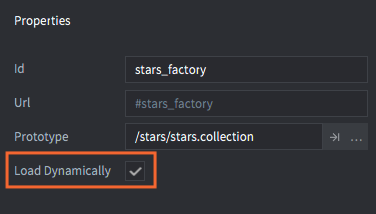

# Fabryka kolekcji (Collection factory)

Fabryki kolekcji to komponenty używane do tworzenia grup i hierarchi obiektów gry przechowywanych w pliku danej kolekcji w trakcie działania programu.

Kolekcje są potężnym narzędziem do tworzenia szablonów, które można utylizować wielokrotnie (podobnie jak prefaby). Więcej szczegółów na temat kolekcji znajdziesz w [dokumentacji podstawowych elementów Defold](/manuals/building-blocks#collections). Kolekcje mogą być umieszczane bezpośrednio w Edytorze lub tworzone dynamicznie.

Używając fabryki kolekcji możesz tworzyć w świecie gry zawartość pliku kolekcji. Jest to uproszczonie analogicznego procesu tworzenia wszystkich obiektów gry opisanych w danym pliku kolekcji i przypisywanie im relacji rodzic-dziecko również opisanych w takim pliku. Typowym przykładem jest tworzenie postaci wrogów składających się z wielu różnych obiektów (np. jedno z wariantów ciał + jedna z broni).

## Tworzenie kolekcji

Załóżmy, że chcesz, żeby obiekt reprezentujący Twojego bohatera miał również obiekt-dziecko reprezentujący tarczę. Zbudujemy taką hierarchię w pliku kolekcji i zapiszemy jako "bean.collection".

::: sidenote
Komponent typu pełnomocnik kolekcji (*collection proxy*) różni się od fabryki i jest używany do stworzenia nowego świata gry, a co za tym idzie również osobnego świata fizyki z obiektami bazującymi na hierarchi w pliku danej kolekcji. Nowy świat ma swoje nowe gniazdo (socket), więc i nową przestrzeń adresową. Wszystkie zasoby z danej kolekcji są wczytywane przez pełnomocnika, kiedy wyślesz do niego wiadomość o rozpoczęciu wczytywania. Jest więc to przydatne przykładowo przy tworzeniu nowych poziomów w grze. Nowy świat gry wiąże się jednak z zajęciem sporej ilości nowych zasobów w pamięci, więc lepiej nie używać ich do dynamicznego wczytywania. Więcej szczegółów znajdziesz w [dokumentacji pełnomocników kolekcji](/manuals/collection-proxy).
:::


Dodajemy następnie komponent typu *Collection factory* (Fabryka kolekcji) do obiektu gry, który będzie odpowiedzialny za stworzenie obiektów i hierarchi z pliku kolekcji "bean.collection" podanego jako właściwość *Prototype*:


Tworzenie bohatera i tarczy jest teraz tylko kwestią wywołania funckji `collectionfactory.create()`:

```lua
local bean_ids = collectionfactory.create("#bean_factory")
```

Funkcja przyjmuje 5 parameterów:

`url`
: Identyfikator fabryki kolekcji, która ma być użyta do tworzenia nowego zestawu obiektów.

`[position]`
: (opcjonalnie) Pozycja w świecie (bezwzględna) nowych obiektów. Typu `vector3`. Jeśli nie określisz pozycji, obiekty będą tworzone w miejscu komponentu fabryki kolekcji.

`[rotation]`
: (opcjonalnie) Orientacja w świecie (bezwzględna) nowych obiektów. Typu `quat`. Jeśli nie określisz orientacji, obiekty będą tworzone z orientacją komponentu fabryki kolekcji.

`[properties]`
: (opcjonalnie) Właściwości - tabela Lua o strukturze par `id`-`table` używana przy tworzeniu obiektów gry. Poniżej opisano jak skonstruować taką tabelę.

`[scale]`
: (opcjonalnie) Skala tworzonych obiektów, określona jako liczba (`number`) (większa od 0), która określa jednolitą skalę wzdłuż wszystkich osi. Możesz też podać wektor (`vector3`), gdzie każdy komponent będzie odpowiadał skali wzdłuż danej osi.

Funkcja `collectionfactory.create()` zwraca tabelę z identyfikatorami utworzonych obiektów gry. Klucze tabeli mapują hashe kolekcji do lokalnych identyfikatorów każdego z obiektów:

::: sidenote
Relacja rodzic-dziecko między "bean" a "shield" *NIE* jest odzwierciedlona w zwracanej tabeli. Ta relacja istnieje jedynie w grafie sceny w trakcie działania programu, co określa jak obiekty są ustawione w stosunku do siebie. Przypisywanie rodzica nigdy nie zmienia identyfikatora obiektu.
:::

```lua
local bean_ids = collectionfactory.create("#bean_factory")
go.set_scale(0.5, bean_ids[hash("/bean")])
pprint(bean_ids)
-- DEBUG:SCRIPT:
-- {
--   hash: [/shield] = hash: [/collection0/shield], -- <1>
--   hash: [/bean] = hash: [/collection0/bean],
-- }
```

1. Prefix `/collection[N]/`, gdzie `[N]` jest licznikiem dodanym do ID, żeby zidentyfikować obiekt w sposób unikalny dla każdej instancji:

## Właściwości

Podczas tworzenia kolekcji, możesz przekazać właściwości do każdego obiektu gry konstruując tabelę, gdzie klucze odpowiadają identyfikatorom obiektów, a wartości są tabelami z właściwościami (scrip properties) dla danych obiektów.

```lua
local props = {}
props[hash("/bean")] = { shield = false }
local ids = collectionfactory.create("#bean_factory", nil, nil, props)
```

Załóżmy, że obiekt "bean" w kolekcji "bean.collection" ma właściwość "shield". [Instrukcja do właściwości skryptów](/manuals/script-properties) zawiera więcej szczegółów na ten temat.

```lua
-- bean/controller.script
go.property("shield", true)

function init(self)
    if not self.shield then
        go.delete("shield")
    end     
end
```

## Wczytywanie dynamiczne zasobów

Zaznaczając właściwość *Load Dynamically* fabryki kolekcji, silnik odłoży wczytywanie zasobów danej kolekcji aż do momentu rozpoczęcia tworzenia.



Z odznaczoną opcją, silnik wczyta prototypy zasobów kolekcji w momencie wczytywania komponentu fabryki kolekcji, więc będzie można je utworzyć w świecie gry natychmiastowo.

Z zaznaczoną opcją, możesz użyć fabryki na dwa sposoby:

Wczytywanie synchroniczne:
: Wywołaj [`collectionfactory.create()`](/ref/collectionfactory/#collectionfactory.create:url-[position]-[rotation]-[properties]-[scale]) kiedy chcesz utworzyć obiekty kolekcji. Funkcja wczyta wszystkie zasoby potrzebe do utworzenia obiektów synchronicznie (co może spowodować zwieszenie programu w zależności od wielkości zasobów), a następnie utworzy obiekty z danymi zasobami.

  ```lua
  function init(self)
      -- Żadne zasoby fabryki nie są załadowane kiedy kolekcja rodzic
      -- zawierająca daną fabrykę kolekcji jest utworzona.
      -- Wywołanie create spowoduje wczytanie zasobów synchronicznie.
      self.go_ids = collecionfactory.create("#collectionfactory")
  end

  function final(self)  
      -- Usuwanie obiektów gry. Zwolni to zasoby.
      -- W tym przypadku obiekty są usuwane, ponieważ 
      -- fabryka kolekcji nie ma żadnych referencji.
      go.delete(self.go_ids)

      -- Wywołanie unload nie zrobi nic, ponieważ
      -- fabryka kolekcji nie ma żadnych referencji.
      collectionfactory.unload("#factory")
  end
  ```

Wczytywanie asynchroniczne:
: Wywołaj [`collectionfactory.load()`](/ref/collectionfactory/#collectionfactory.load:[url]-[complete_function]), żeby jawnie załadować zasoby asynchronicznie. Kiedy zasoby będą gotowe, skrypt, w którym wywołano load() otrzyma callback.

  ```lua
  --callback, który zostanie wywołany po wczytaniu zasobów:
  function load_complete(self, url, result)
      -- Wczytywanie zakończone, zasoby są gotowe do utworzenia
      self.go_ids = collectionfactory.create(url)
  end

  function init(self)
      -- Żadne zasoby nie są wczytywane przy utworzeniu kolekcji
      -- która jest rodzicem komponentu fabryki kolekcji.
      -- Zasoby są wczytywane po wywołaniu load():
      collectionfactory.load("#factory", load_complete)
  end

  function final(self)
      -- Usuwanie obiektu gry. Zasoby są zwalniane.
      -- W tym przypadku zasoby nie są usuwane, ponieważ
      -- fabryka kolekcji nadal posiada do nich referencję.
      go.delete(self.go_ids)

      -- Wywołanie unload zwolni zasoby utrzymywane przez farbykę i usunie je
      collectionfactory.unload("#factory")
  end
  ```
