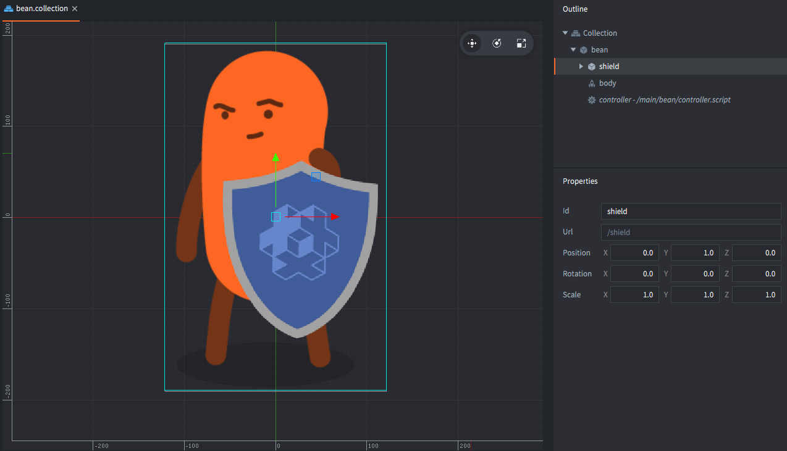
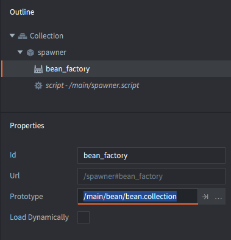
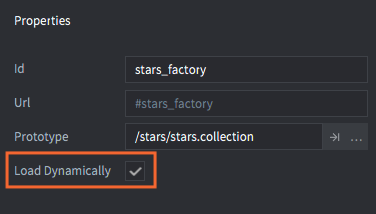

# Fabryki kolekcji (Collection factory)

Komponent Collection factory służy do tworzenia grup i hierarchii obiektów gry zapisanych w plikach kolekcji w działającej grze.

Kolekcje są w Defold wygodnym mechanizmem tworzenia szablonów wielokrotnego użytku, czyli odpowiednika prefabów. Przegląd kolekcji znajdziesz w [dokumentacji o blokach budujących](/manuals/building-blocks#collections). Kolekcje można umieszczać w edytorze albo dynamicznie wstawiać do gry.

Za pomocą komponentu Collection factory możesz tworzyć w świecie gry zawartość pliku kolekcji. To odpowiednik utworzenia przez Factory wszystkich obiektów gry zapisanych w kolekcji, a następnie odtworzenia relacji rodzic-dziecko pomiędzy nimi. Typowym zastosowaniem jest tworzenie przeciwników złożonych z wielu obiektów gry, na przykład wroga i jego broni.

## Tworzenie kolekcji

Załóżmy, że chcemy mieć obiekt gry postaci oraz osobny obiekt gry tarczy będący dzieckiem tej postaci. Budujemy taką hierarchię w pliku kolekcji i zapisujemy ją jako `bean.collection`.

::: sidenote
Komponent *collection proxy* służy do tworzenia nowego świata gry, w tym osobnego świata fizyki, na podstawie kolekcji. Nowy świat jest dostępny przez nowe gniazdo adresowe. Wszystkie zasoby zawarte w kolekcji są ładowane przez pełnomocnika po wysłaniu do niego wiadomości rozpoczynającej ładowanie. To bardzo przydatne na przykład przy zmianie poziomów w grze. Nowe światy gry mają jednak spory narzut, więc nie należy ich używać do dynamicznego ładowania małych elementów. Więcej informacji znajdziesz w [dokumentacji Collection proxy](/manuals/collection-proxy).
:::



Następnie dodajemy *Collection factory* do obiektu gry, który ma odpowiadać za tworzenie instancji, i ustawiamy `bean.collection` jako *Prototype* komponentu:



Utworzenie postaci i tarczy sprowadza się teraz do wywołania `collectionfactory.create()`:

```lua
local bean_ids = collectionfactory.create("#bean_factory")
```

Funkcja przyjmuje 5 parametrów:

`url`
: Id komponentu Collection factory, który ma utworzyć nowy zestaw obiektów gry.

`[position]`
: Opcjonalna pozycja tworzonych obiektów gry w przestrzeni świata. Powinna mieć typ `vector3`. Jeśli jej nie podasz, obiekty zostaną utworzone w pozycji komponentu Collection factory.

`[rotation]`
: Opcjonalny obrót tworzonych obiektów gry w przestrzeni świata. Powinien mieć typ `quat`.

`[properties]`
: Opcjonalna tabela Lua zawierająca pary `id`-`table`, używana do inicjalizowania tworzonych obiektów gry. Poniżej opisano, jak ją zbudować.

`[scale]`
: Opcjonalna skala tworzonych obiektów gry. Może być podana jako `number` większy od 0, co oznacza jednolite skalowanie we wszystkich osiach. Możesz też przekazać `vector3`, gdzie każdy komponent określa skalę na odpowiedniej osi.

`collectionfactory.create()` zwraca tabelę z identyfikatorami utworzonych obiektów gry. Klucze tabeli mapują hash lokalnego id obiektu w kolekcji na runtime id danego obiektu:

::: sidenote
Relacja rodzic-dziecko między `bean` i `shield` *nie* jest odzwierciedlona w zwracanej tabeli. Ta relacja istnieje tylko w runtime scene-graph, czyli w sposobie, w jaki obiekty są razem transformowane. Zmiana rodzica nigdy nie zmienia id obiektu.
:::

```lua
local bean_ids = collectionfactory.create("#bean_factory")
go.set_scale(0.5, bean_ids[hash("/bean")])
pprint(bean_ids)
-- DEBUG:SCRIPT:
-- {
--   hash: [/shield] = hash: [/collection0/shield], -- <1>
--   hash: [/bean] = hash: [/collection0/bean],
-- }
```
1. Do id dodawany jest prefiks `/collection[N]/`, gdzie `[N]` to licznik, aby każdą instancję jednoznacznie rozróżnić.

## Właściwości

Podczas tworzenia kolekcji możesz przekazać właściwości do poszczególnych obiektów gry, budując tabelę, w której kluczami są id obiektów, a wartościami tabele z właściwościami skryptu do ustawienia.

```lua
local props = {}
props[hash("/bean")] = { shield = false }
local ids = collectionfactory.create("#bean_factory", nil, nil, props)
```

Załóżmy, że obiekt gry `bean` w `bean.collection` definiuje właściwość `shield`. [Instrukcja o właściwościach skryptu](/manuals/script-properties) zawiera więcej informacji o takich właściwościach.

```lua
-- plik bean/controller.script
go.property("shield", true)

function init(self)
    if not self.shield then
        go.delete("shield")
    end
end
```

## Dynamiczne ładowanie zasobów fabryki

Po zaznaczeniu pola *Load Dynamically* we właściwościach Collection factory silnik opóźni ładowanie zasobów powiązanych z fabryką.



Gdy pole nie jest zaznaczone, silnik ładuje zasoby prototypu podczas ładowania komponentu Collection factory, dzięki czemu są one od razu gotowe do tworzenia instancji.

Gdy pole jest zaznaczone, masz dwa sposoby użycia:

Wczytywanie synchroniczne
: Wywołaj [`collectionfactory.create()`](/ref/collectionfactory/#collectionfactory.create:url-[position]-[rotation]-[properties]-[scale]) wtedy, gdy chcesz tworzyć obiekty. Spowoduje to synchroniczne załadowanie zasobów, co może wywołać chwilowe przycięcie, a następnie utworzenie nowych instancji.

  ```lua
  function init(self)
      -- Zasoby fabryki nie są ładowane, gdy ładowana jest kolekcja
      -- nadrzędna komponentu Collection factory. Wywołanie create
      -- bez wcześniejszego load wczyta zasoby synchronicznie.
      self.go_ids = collectionfactory.create("#collectionfactory")
  end

  function final(self)
      -- Usuń obiekty gry. To zmniejszy licznik referencji zasobów.
      -- W tym przypadku zasoby zostaną usunięte, ponieważ komponent
      -- Collection factory nie trzyma już do nich referencji.
      go.delete(self.go_ids)

      -- Wywołanie unload nic nie zrobi, ponieważ fabryka
      -- nie ma żadnych referencji.
      collectionfactory.unload("#factory")
  end
  ```

Wczytywanie asynchroniczne
: Wywołaj [`collectionfactory.load()`](/ref/collectionfactory/#collectionfactory.load:[url]-[complete_function]), aby jawnie załadować zasoby asynchronicznie. Gdy zasoby będą gotowe do tworzenia obiektów, otrzymasz callback.

  ```lua
  function load_complete(self, url, result)
      -- Ładowanie zakończone, zasoby są gotowe do tworzenia instancji.
      self.go_ids = collectionfactory.create(url)
  end

  function init(self)
      -- Zasoby fabryki nie są ładowane, gdy ładowana jest kolekcja
      -- nadrzędna komponentu Collection factory. Wywołanie load
      -- spowoduje ich załadowanie.
      collectionfactory.load("#factory", load_complete)
  end

  function final(self)
      -- Usuń obiekty gry. To zmniejszy licznik referencji zasobów.
      -- W tym przypadku zasoby nie zostaną usunięte, ponieważ komponent
      -- Collection factory nadal trzyma do nich referencję.
      go.delete(self.go_ids)

      -- Wywołanie unload zmniejszy licznik referencji zasobów
      -- trzymanych przez komponent fabryki, co doprowadzi do ich usunięcia.
      collectionfactory.unload("#factory")
  end
  ```

## Dynamiczny prototyp

Możesz zmienić to, jaki *Prototype* potrafi tworzyć Collection factory, zaznaczając pole *Dynamic Prototype* we właściwościach komponentu.


Gdy opcja *Dynamic Prototype* jest włączona, komponent Collection factory może zmieniać prototyp za pomocą `collectionfactory.set_prototype()`. Przykład:

```lua
collectionfactory.unload("#factory") -- zwolnij poprzednie zasoby
collectionfactory.set_prototype("#factory", "/main/levels/level1.collectionc")
local ids = collectionfactory.create("#factory")
```

::: important
Gdy opcja *Dynamic Prototype* jest włączona, liczba komponentów w kolekcji nie może zostać zoptymalizowana i kolekcja właściciela będzie używać domyślnych limitów komponentów z pliku *game.project*.
:::
