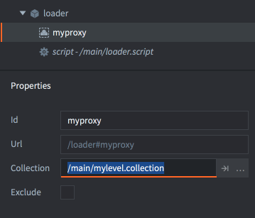
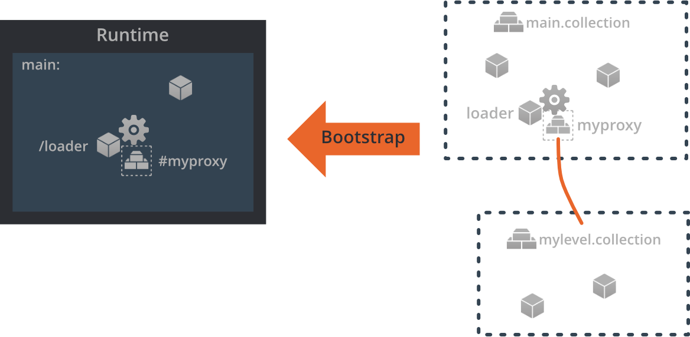
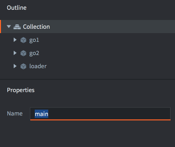
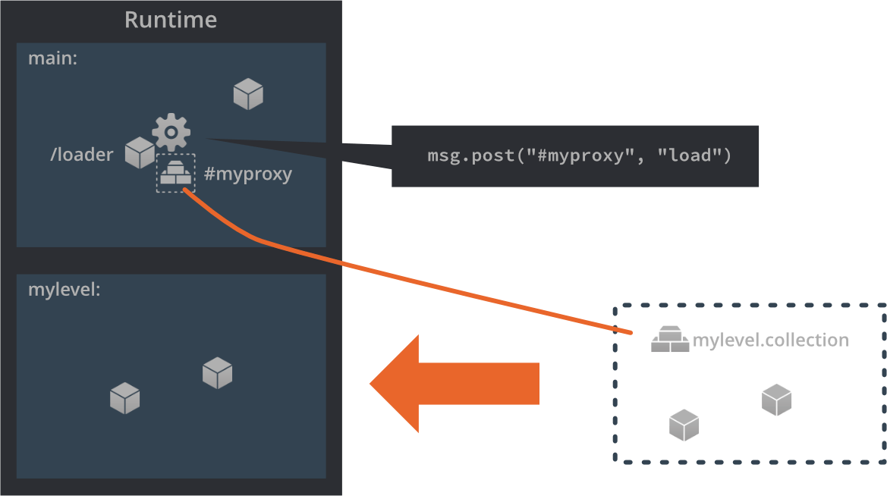
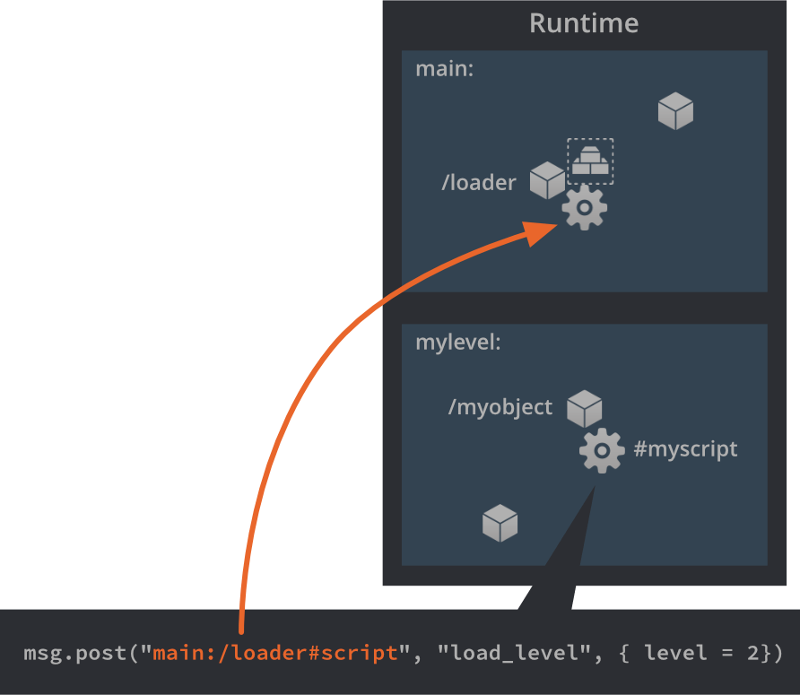

# Pełnomocnik kolekcji (Collection proxy)

Pełnomocnik kolekcji to komponent używany do wczytywania i zwalniania nowy "Światów" gry dynamicznie bazując na zawartości pliku kolekcji. Mogą być użyte do przełączania się między światami, poziomami w grze, ekranami menu, wczytywaniem i zwalnianiem fabularnych "scen", mini-gier i wiele więcej.

Defold organizuje wszystkie obiekty gry w kolekcje. Kolekcja może zawierać obiekty gry i inne kolekcje (podkolekcje). Pełnomocnik kolekcji pozwala na rozdzielenie zawartości Twojej gry w oddzielne kolekcje i wczytywanie dynamiczne zasobów w skryptach.

Pełnomocnicy kolekcji różnią się od [fabryk kolekcji](/manuals/collection-factory/). Fabryki kolekcji tworzy instancje obiektów zawartych w kolekcji do obecnego świata gry. Pełnomocnicy kolekcji tworzą natomiast nowe, osobne światy gry w trakcie działania programu, więc są używane w innych przypadkach.

## Towrzenie komponentów typu Pełnomocnik kolekcji

1. Dodaj komponent typu Pełnomocnik kolekcji (Collection proxy) do obiektu gry klikając <kbd>prawy przycisk myszki</kbd> na obiekcie gry i wybierając <kbd>Add Component ▸ Collection Proxy</kbd> z menu kontekstowego.

2. Ustaw właściwość *Collection* do pliku kolekcji, którą chcesz przez danego pełnomocnika dynamicznie wczytywać w trakcie działania programu. Referencja do tego pliku jest statyczna, więc upewnij się, że wszystkie potrzebne w kolekcji zasoby będą znajdować się w ostatcznej wersji Twojej gry.

{srcset="images/collection-proxy/create_proxy@2x.png 2x"}

(Możesz wyłączyć część zawartości Twojej gry ze zbudowanej aplikacji, a potem ściągnąć ją dynamicznie zaznaczając opcję *Exclude* i używając funkcjonalności [Live update](/manuals/live-update/).)

## Bootstrap (kolekcja startowa)

Podczas startu aplikacji silnik Defold wczytuje i tworzy instancje wszystkich obiektów gry z głównej kolekcji (*bootstrap collection*). Następnie inicjalizuje i aktywuje te obiekty i ich komponenty. Można określić, która z kolekcji jest kolekcją startową w [ustawieniach projektu](/manuals/project-settings/#main-collection). Domyślnie i zgodnie z konwencją kolekcja ta nazwana jest "main.collection" (z ang. główna.kolekcja).

{srcset="images/collection-proxy/bootstrap@2x.png 2x"}

Dla obiektów gry i ich komponentów silnik Defold alokuje pamięć potrzebną do stworzenia całego "świata gry", w którym instancje obiektów z głównej kolekcji są tworzone. Tworzony jest również osobny świat fizyki do obsługi kolizji i symulacji fizyki.

Ponieważ komponenty typu skrypt muszą być w stanie adresować każdy obiekt w grze, nawet z innej kolekcji, każdy otrzymuje unikalne imię - takie jakie określisz we właściwości *Name* w pliku kolekcji:

{srcset="images/collection-proxy/collection_id@2x.png 2x"}

Jeśli kolekcja, która jest załadowana posiada komponenty typu Pełnomocnik kolekcji, kolekcje do których te komponenty się odnoszą *NIE* są wtedy wczytywane automatycznie. Musisz jawnie kontrolować wczytywanie zasobów tych kolekcji w kodzie.

## Wczytywanie kolekcji

Dynamiczne wczytywanie kolekcji przez Pełnomocnika kolekcji jest osiągane przez wysłanie wiadomości `"load"` do komponentu pełnomocnika ze skryptu:

```lua
-- Tell the proxy "myproxy" to start loading.
msg.post("#myproxy", "load")
```

{srcset="images/collection-proxy/proxy_load@2x.png 2x"}

Pełnomocnik kolekcji nakaże silnikowi zaalokować pamięć na nowy świat gry, jak i również świat fizyki. Następnie światy mogą być utworzone, a w nich instancje wszystkich obiektów danej kolekcji "mylevel.collection".

Nowy świat gry dostaje swoje imię określone we właściwości *Name* pliku wczytanej kolekcji, w tym przykładzie to "mylevel". Nazwa ta musi być unikalna. Domyślna nazwa nowo utworzonej kolekcji to "default" - warto więc ją zmienić od razu. Jeśli właściwość *Name* podana w pliku kolekcji jest już aktualnie używana w dowolnym innym załadowanym świecie, silnik Defold zasygnalizuje kolizę nazw:

```txt
ERROR:GAMEOBJECT: The collection 'default' could not be created since there is already a socket with the same name.
WARNING:RESOURCE: Unable to create resource: build/default/mylevel.collectionc
ERROR:GAMESYS: The collection /mylevel.collectionc could not be loaded.
```

Kiedy silnik kończy wczytywanie kolekcji, pełnomocnik kolekcji wysyła wiadomość o treści `"proxy_loaded"` z powrotem do tego skryptu, który wysłał do niego polecenie wczytania kolekcji `"load"`. Skrypt może teraż zainicjalizować i aktywować kolekcję w odpowiedzi na tę wiadomość:

```lua
function on_message(self, message_id, message, sender)
    if message_id == hash("proxy_loaded") then
        -- New world is loaded. Init and enable it.
        msg.post(sender, "init")
        msg.post(sender, "enable")
        ...
    end
end
```

`"load"`
: Ta wiadomość zleca pełnomocnikowi kolekcji rozpoczęcie wczytywania zasobów kolekcji do nowego świata gry. Pełnomocnik po wczytaniu odeśle wiadomość `"proxy_loaded"`.

`"async_load"`
: Ta wiadomość zleca pełnomocnikowi kolekcji rozpoczęcie wczytywania zasobów kolekcji do nowego świata gry w tle, asynchronicznie. Pełnomocnik po wczytaniu odeśle wiadomość`"proxy_loaded"`.

`"init"`
: Ta wiadomość zleca pełnomocnikowi kolekcji inicjalizację wszystkich stworzonych instancji obiektów. Funkcje `init()` każdego skryptu zostają wywołane w tym momencie.

`"enable"`
: Ta wiadomość zleca pełnomocnikowi kolekcji aktywację wszystkich stworzonych instancji obiektów. Przykładowo, każdy komponent typu sprite jest rysowany na ekranie.

## Adresowanie nowego świata gry

Właściwość *Name* ustawiona w pliku kolekcji jest używana do adresowania każdego z obiektów gry i komponentów wczytanego świata gry. Jeśli przykładowo utworzysz obiekt zajmujący się wczytywaniem poziomów (ang. loader), będziesz mieć możliwość komunikowania się z nim z poziomu każdej wczytanej kolekcji:

```lua
-- tell the loader to load the next level:
msg.post("main:/loader#script", "load_level", { level_id = 2 })
```

{srcset="images/collection-proxy/message_passing@2x.png 2x"}

## Zwalnianie pamięci po świecie gry

Aby zwolnić pamięć po wczytanej kolekcji możesz wysłać pełnomocnikowi tej kolekcji wiadomości odpowiadające kolejnym krokom:

```lua
-- unload the level
msg.post("#myproxy", "disable")
msg.post("#myproxy", "final")
msg.post("#myproxy", "unload")
```

`"disable"`
: Ta wiadomość zleca pełnomocnikowi kolekcji dezaktywację wszystkich stworzonych instancji obiektów. Przykładowo komponenty typu sprite przestają już być renderowane.

`"final"`
: Ta wiadomość zleca pełnomocnikowi kolekcji finalizację wszystkich stworzonych instancji obiektów i komponentów. Funkcje `final()` każdego skryptu zostają wywołane w tym momencie.

`"unload"`
: Ta wiadomość zleca pełnomocnikowi kolekcji rozpoczęcie zwalniania pamięci przeznaczonej na zasoby kolekcji. Pełnomocnik po zwolnieniu pamięci odeśle wiadomość `"proxy_unloaded"`. Świat gry zostaje całkowicie usunięty z pamięci.

Jeśli nie zależy Ci na szczegółowej kontroli, możesz po prostu wysłać wiadomość `"unload"` bezpośrednio, bez uprzedniego dezaktywowania i finalizowania obiektów. Pełnomocnik kolekcji zajmie się wtedy automatycznie dezaktywacją i finalizowaniem zanim ostatecznie zwolni pamięć i usunie świat gry.

Pełnomocnik kolekcji po zwolnieniu zwróci wiadomość `"proxy_unloaded"` z powrotem do tego skryptu, który wysłał do niego polecenie zwolnienia kolekcji `"unload"`:

```lua
function on_message(self, message_id, message, sender)
    if message_id == hash("proxy_unloaded") then
        -- Ok, the world is unloaded...
        ...
    end
end
```


## Krok czasowy 

Częstotliwość aktualizacji kolekcji (updates) może być kontrolowana przez pełnomocnika poprzez zmianę kroku czasowego (_time step_). Oznacza to, że nawet jeśli gra działa w stałych 60 klatkach na sekundę, pełnomocnik może aktualizować swoją kolekcję z większym lub mniejszym tempie, co wpływa na działanie symulacji fizyki i zmienną `dt` przekazywaną do funkcji `update()`. Możesz również ustawić tryb aktualizacji (update mode), który pozwala na kontrolowanie czy skalowanie powinno być przeprowadzone dyskretnie (co ma sens tylko przy współczynniku mniejszym od 1.0) lub ciągle.

Możesz kontrolować współczynnik skalowania kroku czasowego (factor) i tryb skalowania (mode) poprzez wiadomość `set_time_step`:

```lua
-- update loaded world at one-fifth-speed.
msg.post("#myproxy", "set_time_step", {factor = 0.2, mode = 1}
```

Aby zobaczyć, czy krok czasowy faktycznie uległ zmianie, możemy stworzyć obiekt z poniższym skryptem, w którym będziemy wypisywać wartość zmiennej `dt`:

```lua
function update(self, dt)
    print("update() with timestep (dt) " .. dt)
end
```

Z krokiem czasowym 0.2, otrzymujemy we get the following result in the console:

```txt
INFO:DLIB: SSDP started (ssdp://192.168.0.102:54967, http://0.0.0.0:62162)
INFO:ENGINE: Defold Engine 1.2.37 (6b3ae27)
INFO:ENGINE: Loading data from: build/default
DEBUG:SCRIPT: update() with timestep (dt) 0
DEBUG:SCRIPT: update() with timestep (dt) 0
DEBUG:SCRIPT: update() with timestep (dt) 0
DEBUG:SCRIPT: update() with timestep (dt) 0
DEBUG:SCRIPT: update() with timestep (dt) 0.016666667535901
DEBUG:SCRIPT: update() with timestep (dt) 0
DEBUG:SCRIPT: update() with timestep (dt) 0
DEBUG:SCRIPT: update() with timestep (dt) 0
DEBUG:SCRIPT: update() with timestep (dt) 0
DEBUG:SCRIPT: update() with timestep (dt) 0.016666667535901
```

Jak widać funkcja `update()` jest nadal wywoływana 60 razy na sekundę, ale wartość `dt` zmienia się. Widzimy, że jedynie co piąte wywołanie, czyli 1/5 (0.2) wszystkich wywołań funkcji `update()` ma wartość `dt` odpowiadającą 1/60 (dla 60 FPS)--- w pozostałych przypadkach - 0. Symulacja fizyki również będzie odświeżana w zależności od danego `dt`, więc postępy będą widoczne tylko w co 5 klatce.

Więcej szczegółów znajdziesz tutaj: [`set_time_step`](/ref/collectionproxy#set_time_step).

## Uwagi i częste błędy

Fizyka
: Dzięki pełnomocnikom kolekcji możliwe jest załadowanie więcej niż jednego *świata gry*. Czyniąc to trzeba mieć na uwadze, że każdy taki świat wiąże się z osobnym światem fizyki. Interakcje fizyki (kolizje, przełączniki, promienie wykrywające) będą miały miejsce jedynie pomiędzy obiektami tej samej kolekcji (tego samego świata fizyki), a nie między obiektami z innych kolekcji. Więc nawet wizualne nakładanie się obiektów z kolizjami, ale z dwóch różnych światów, nie będzie miało skutku w symulacji fizyki.

Pamięć
: Każda załadowana kolekcja tworzy nowy świat gry, który od razu zajmuje relatywnie sporo pamięci. Jeśli załadujesz naraz zbyt dużo kolekcji możesz wyczerpać dostępne zasoby - warto więc przemyśleć design. Do tworzenia wielu instancji hierarchii obiektów gry (np. wrogów, pocisków, obiektów dekoracyjnych, itd.) warto używać [fabryk kolekcji](/manuals/collection-factory), które tworzą obiekty i przypisują im relacje, ale nie tworzą nowych światów.

Wejścia
: Jeśli obiekty w załadowanej kolekcji wymagają wejść z kontrolerów, musisz się upewnić, że obiekt, który posiada pełnomocnika danej kolekcji również przechwytuje wejścia. Kiedy obiekt gry otrzymuje wiadomości z wejściami kontrolerów przekazuje je do swoich komponentów - czyli może je przekazać do swojego komponentu typu pełnomocnik kolekcji. Pełnomocnik z kolei przekazuje przechwycone wejście do załadowanej kolekcji i jej obiektów.