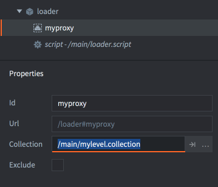
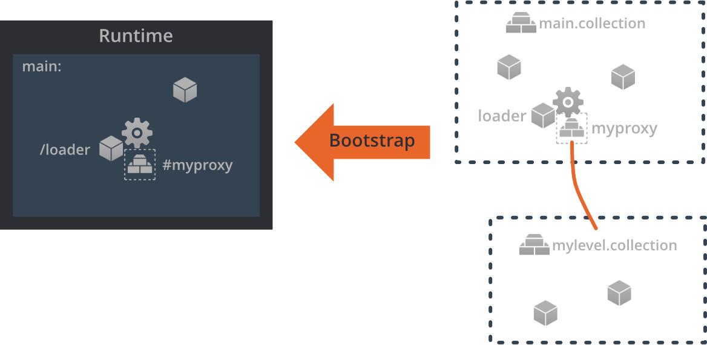
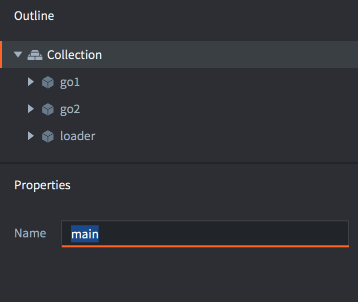
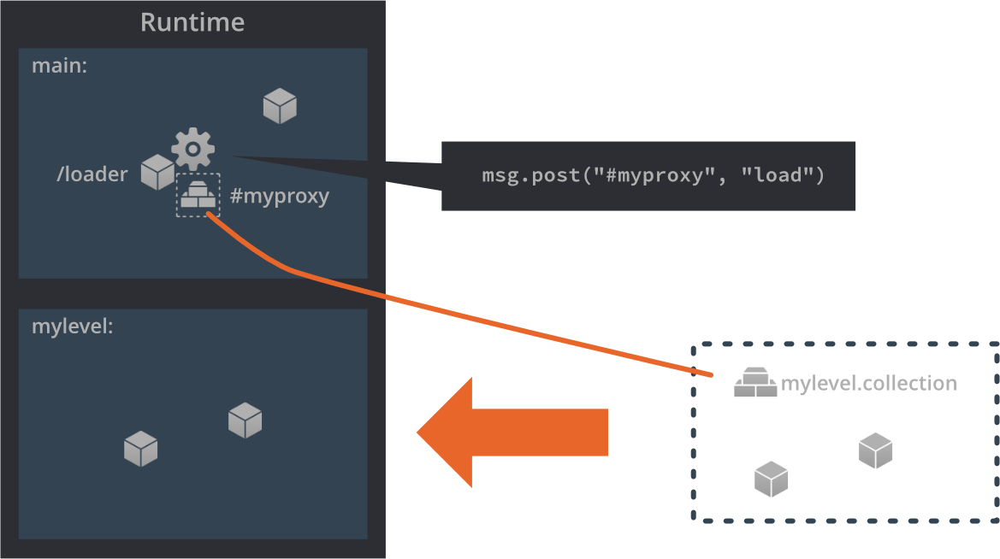
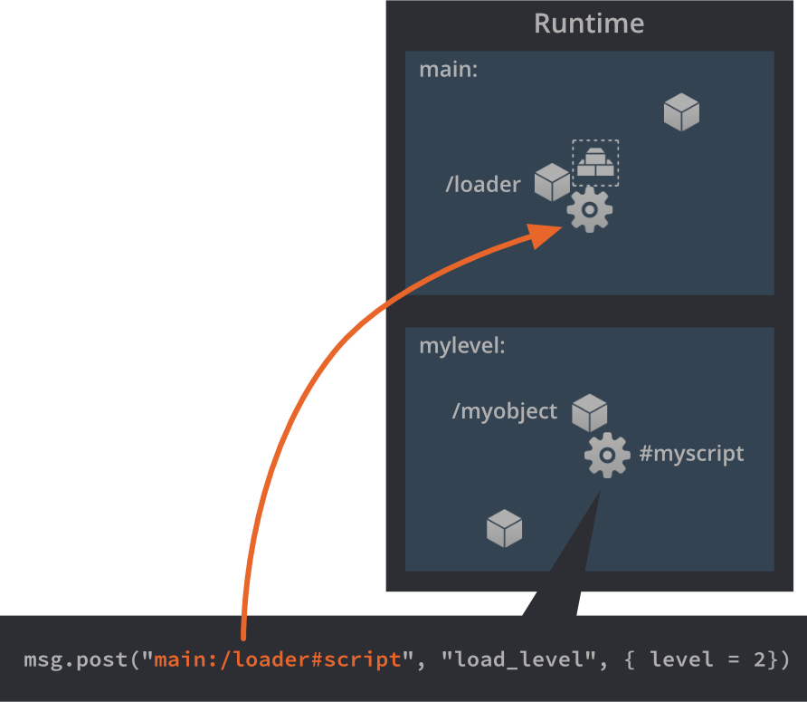

# Pełnomocnik kolekcji

Komponent Collection proxy służy do dynamicznego wczytywania i zwalniania nowych "światów" gry na podstawie zawartości pliku kolekcji. Można go użyć do przełączania między poziomami, ekranami GUI, wczytywania i zwalniania fabularnych "scen" w trakcie poziomu, wczytywania i zwalniania mini-gier i nie tylko.

Defold organizuje wszystkie obiekty gry w kolekcje. Kolekcja może zawierać obiekty gry i inne kolekcje, czyli podkolekcje. Pełnomocnik kolekcji pozwala rozdzielić zawartość gry na osobne kolekcje, a następnie dynamicznie zarządzać ich wczytywaniem i zwalnianiem ze skryptów.

Pełnomocniki kolekcji różnią się od [fabryk kolekcji](/manuals/collection-factory/). Fabryka kolekcji tworzy instancje zawartości kolekcji w bieżącym świecie gry. Pełnomocniki kolekcji tworzą natomiast nowy świat gry w trakcie działania programu, więc mają inne zastosowania.

## Tworzenie komponentu pełnomocnika kolekcji

1. Dodaj komponent Collection proxy do obiektu gry, klikając <kbd>prawym przyciskiem myszy</kbd> obiekt gry i wybierając <kbd>Add Component ▸ Collection Proxy</kbd> z menu kontekstowego.

2. Ustaw właściwość *Collection* tak, aby wskazywała kolekcję, którą chcesz później dynamicznie wczytać w trakcie działania programu. Referencja jest statyczna i zapewnia, że cała zawartość wskazanej kolekcji trafi do końcowej wersji gry.



(Możesz wyłączyć tę zawartość z kompilacji i pobrać ją później kodem, zaznaczając *Exclude* i używając funkcji [Live update](/manuals/live-update/).)

## Bootstrap

Gdy silnik Defold startuje, wczytuje i instancjonuje wszystkie obiekty gry z kolekcji startowej (*bootstrap collection*). Następnie inicjalizuje i aktywuje obiekty oraz ich komponenty. To, której kolekcji startowej ma użyć silnik, ustawia się w [ustawieniach projektu](/manuals/project-settings/#main-collection). Zgodnie z konwencją plik tej kolekcji zwykle nosi nazwę "main.collection".



Aby pomieścić obiekty gry i ich komponenty, silnik alokuje pamięć potrzebną dla całego "świata gry", do którego instancjonowana jest zawartość kolekcji startowej. Tworzony jest też oddzielny świat fizyki dla obiektów kolizji i symulacji fizyki.

Ponieważ komponenty skryptowe muszą mieć możliwość adresowania wszystkich obiektów w grze, także spoza świata startowego, każdej kolekcji nadaje się unikalną nazwę przez właściwość *Name* ustawianą w pliku kolekcji:



Jeśli wczytana kolekcja zawiera komponenty pełnomocnika kolekcji, kolekcje, do których one się odnoszą, *nie* są wczytywane automatycznie. Musisz sterować wczytywaniem tych zasobów w skryptach.

## Wczytywanie kolekcji

Dynamiczne wczytywanie kolekcji przez pełnomocnika odbywa się przez wysłanie ze skryptu wiadomości `"load"` do komponentu pełnomocnika:

```lua
-- Poleć pełnomocnikowi "myproxy" rozpocząć wczytywanie.
msg.post("#myproxy", "load")
```



Pełnomocnik kolekcji nakaże silnikowi zaalokować miejsce na nowy świat i utworzyć osobny świat fizyki. Następnie instancjonowane są wszystkie obiekty gry z kolekcji `mylevel.collection`.

Nowy świat otrzymuje nazwę z właściwości *Name* w pliku kolekcji. W tym przykładzie ustawiono ją na `mylevel`. Nazwa musi być unikalna. Jeśli wartość *Name* w pliku kolekcji jest już używana przez inny załadowany świat, silnik zgłosi błąd kolizji nazw:

```txt
ERROR:GAMEOBJECT: The collection 'default' could not be created since there is already a socket with the same name.
WARNING:RESOURCE: Unable to create resource: build/default/mylevel.collectionc
ERROR:GAMESYS: The collection /mylevel.collectionc could not be loaded.
```

Gdy silnik zakończy wczytywanie kolekcji, pełnomocnik wyśle wiadomość `"proxy_loaded"` z powrotem do skryptu, który wysłał wiadomość `"load"`. Skrypt może wtedy zainicjalizować i aktywować kolekcję w reakcji na tę wiadomość:

```lua
function on_message(self, message_id, message, sender)
    if message_id == hash("proxy_loaded") then
        -- Nowy świat został wczytany. Zainicjalizuj go i aktywuj.
        msg.post(sender, "init")
        msg.post(sender, "enable")
        ...
    end
end
```

`"load"`
: Ta wiadomość każe pełnomocnikowi kolekcji rozpocząć wczytywanie kolekcji do nowego świata. Gdy zakończy, odeśle wiadomość `"proxy_loaded"`.

`"async_load"`
: Ta wiadomość każe pełnomocnikowi kolekcji rozpocząć wczytywanie kolekcji do nowego świata w tle, asynchronicznie. Gdy zakończy, odeśle wiadomość `"proxy_loaded"`.

`"init"`
: Ta wiadomość każe pełnomocnikowi kolekcji zainicjalizować wszystkie utworzone instancje obiektów. Na tym etapie wywoływane są funkcje `init()` wszystkich skryptów.

`"enable"`
: Ta wiadomość każe pełnomocnikowi kolekcji aktywować wszystkie utworzone instancje obiektów. Na przykład komponenty sprite zaczynają wtedy być rysowane.

## Adresowanie w nowym świecie

Właściwość *Name* ustawiona w pliku kolekcji służy do adresowania obiektów gry i komponentów wczytanego świata. Jeśli na przykład utworzysz obiekt odpowiedzialny za wczytywanie poziomów, będziesz mógł komunikować się z nim z dowolnej wczytanej kolekcji:

```lua
-- poleć loaderowi wczytać następny poziom:
msg.post("main:/loader#script", "load_level", { level_id = 2 })
```



A jeśli chcesz komunikować się z obiektem gry w wczytanej kolekcji z poziomu loadera, możesz wysłać wiadomość, używając [pełnego URL-a obiektu](/manuals/addressing/#urls):

```lua
msg.post("mylevel:/myobject", "hello")
```

::: important
Nie można bezpośrednio odwoływać się do obiektów gry w wczytanej kolekcji spoza tej kolekcji:

```lua
local position = go.get_position("mylevel:/myobject")
-- loader.script:42: wywołana funkcja może uzyskiwać dostęp tylko do instancji w tej samej kolekcji.
```
:::


## Zwalnianie świata

Aby zwolnić wczytaną kolekcję, wysyła się do jej pełnomocnika wiadomości odpowiadające odwrotnej kolejności kroków wczytywania:

```lua
-- zwolnij poziom
msg.post("#myproxy", "disable")
msg.post("#myproxy", "final")
msg.post("#myproxy", "unload")
```

`"disable"`
: Ta wiadomość każe pełnomocnikowi kolekcji wyłączyć wszystkie obiekty gry i komponenty w tym świecie. Na tym etapie sprite'y przestają być renderowane.

`"final"`
: Ta wiadomość każe pełnomocnikowi kolekcji sfinalizować wszystkie obiekty gry i komponenty w tym świecie. Na tym etapie wywoływane są funkcje `final()` wszystkich skryptów.

`"unload"`
: Ta wiadomość każe pełnomocnikowi kolekcji całkowicie usunąć świat z pamięci.

Jeśli nie potrzebujesz bardziej szczegółowej kontroli, możesz wysłać wiadomość `"unload"` bezpośrednio, bez wcześniejszego wyłączania i finalizowania kolekcji. Pełnomocnik automatycznie wyłączy i sfinalizuje kolekcję przed jej zwolnieniem.

Gdy pełnomocnik kolekcji zakończy zwalnianie, odeśle wiadomość `"proxy_unloaded"` do skryptu, który wysłał wiadomość `"unload"`:

```lua
function on_message(self, message_id, message, sender)
    if message_id == hash("proxy_unloaded") then
        -- Ok, świat został zwolniony...
        ...
    end
end
```


## Krok czasowy

Aktualizacje kolekcji obsługiwane przez pełnomocnika można skalować przez zmianę kroku czasowego. Oznacza to, że nawet jeśli gra działa ze stałą częstotliwością 60 FPS, pełnomocnik może aktualizować swoją kolekcję szybciej albo wolniej, co wpływa między innymi na:

* prędkość symulacji fizyki
* wartość `dt` przekazywaną do `update()`
* [animacje właściwości obiektu gry i GUI](https://defold.com/manuals/animation/#property-animation-1)
* [animacje flipbook](https://defold.com/manuals/animation/#flip-book-animation)
* [symulacje Particle FX](https://defold.com/manuals/particlefx/)
* prędkość timerów

Możesz też ustawić tryb aktualizacji, który pozwala kontrolować, czy skalowanie ma być wykonywane dyskretnie, co ma sens tylko przy współczynniku poniżej 1.0, czy w sposób ciągły.

Współczynnik skalowania kroku czasowego i tryb skalowania kontroluje się przez wysłanie do pełnomocnika wiadomości `set_time_step`:

```lua
-- aktualizuj wczytany świat z jedną piątą prędkości.
msg.post("#myproxy", "set_time_step", {factor = 0.2, mode = 1}
```

Aby zobaczyć, co się dzieje przy zmianie kroku czasowego, możemy utworzyć obiekt z poniższym kodem w komponencie skryptowym i umieścić go w kolekcji, której krok czasowy zmieniamy:

```lua
function update(self, dt)
    print("update() with timestep (dt) " .. dt)
end
```

Przy kroku czasowym 0.2 otrzymujemy następujący wynik w konsoli:

```txt
INFO:DLIB: SSDP started (ssdp://192.168.0.102:54967, http://0.0.0.0:62162)
INFO:ENGINE: Defold Engine 1.2.37 (6b3ae27)
INFO:ENGINE: Loading data from: build/default
DEBUG:SCRIPT: update() with timestep (dt) 0
DEBUG:SCRIPT: update() with timestep (dt) 0
DEBUG:SCRIPT: update() with timestep (dt) 0
DEBUG:SCRIPT: update() with timestep (dt) 0
DEBUG:SCRIPT: update() with timestep (dt) 0.016666667535901
DEBUG:SCRIPT: update() with timestep (dt) 0
DEBUG:SCRIPT: update() with timestep (dt) 0
DEBUG:SCRIPT: update() with timestep (dt) 0
DEBUG:SCRIPT: update() with timestep (dt) 0
DEBUG:SCRIPT: update() with timestep (dt) 0.016666667535901
```

`update()` jest nadal wywoływane 60 razy na sekundę, ale wartość `dt` się zmienia. Widzimy, że tylko 1/5 wywołań `update()` będzie miało `dt` równy 1/60, czyli odpowiadający 60 FPS, a reszta będzie równa zero. Wszystkie symulacje fizyki również będą aktualizowane zgodnie z tym `dt` i będą postępować tylko w co piątej klatce.

::: sidenote
Możesz użyć funkcji kroku czasowego kolekcji, aby wstrzymać grę, na przykład podczas wyświetlania popupu albo gdy okno straci fokus. Użyj `msg.post("#myproxy", "set_time_step", {factor = 0, mode = 0})`, aby wstrzymać, oraz `msg.post("#myproxy", "set_time_step", {factor = 1, mode = 1})`, aby wznowić.
:::

Więcej szczegółów znajdziesz w [`set_time_step`](/ref/collectionproxy#set_time_step).

## Uwagi i częste problemy

Fizyka
: Za pomocą pełnomocników kolekcji można wczytać więcej niż jedną kolekcję najwyższego poziomu, czyli więcej niż jeden *świat gry*, do silnika. Trzeba pamiętać, że każda taka kolekcja najwyższego poziomu jest osobnym światem fizyki. Interakcje fizyczne, takie jak kolizje, wyzwalacze i ray-casty, zachodzą wyłącznie między obiektami należącymi do tego samego świata. Nawet jeśli obiekty kolizji z dwóch światów wizualnie leżą dokładnie jeden na drugim, nie będzie między nimi żadnej interakcji fizycznej.

Pamięć
: Każda wczytana kolekcja tworzy nowy świat gry, który wiąże się ze stosunkowo dużym zużyciem pamięci. Jeśli jednocześnie wczytasz przez pełnomocników wiele kolekcji, warto przemyśleć projekt. Do tworzenia wielu instancji hierarchii obiektów gry lepiej nadają się [fabryki kolekcji](/manuals/collection-factory), które tworzą obiekty, ale nie tworzą nowych światów.

Wejście
: Jeśli obiekty w wczytanej kolekcji wymagają akcji wejściowych, musisz upewnić się, że obiekt zawierający pełnomocnika kolekcji przechwytuje wejście. Gdy obiekt gry otrzymuje wiadomości wejściowe, są one propagowane do komponentów tego obiektu, czyli także do pełnomocników kolekcji. Akcje wejściowe są następnie przekazywane przez pełnomocnika do wczytanej kolekcji i jej obiektów.
