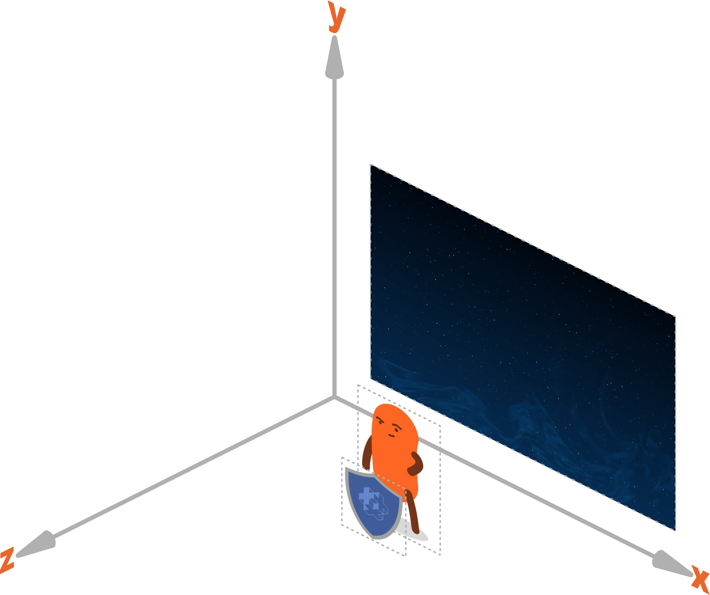

#  Komponenty

:[components](../shared/components.md)

## Typy komponentów

Defold wspiera następujące typy komponentów:

* [Collection factory](/manuals/collection-factory) - Fabryka kolekcji do tworzenia kolekcji
* [Collection proxy](/manuals/collection-proxy) - Pełnomocnik kolekcji do ładowania i zwalniania kolekcji
* [Collision object](/manuals/physics) - Obiekt kolizji do fizyki 2D i 3D
* [Camera](/manuals/camera) - Kamera zmieniająca rzutnię i projekcję świata gry
* [Factory](/manuals/factory) - Fabryka do tworzenia obiektów gry
* [GUI](/manuals/gui) - Graficzny interfejs użytkownika
* [Label](/manuals/label) - Etykieta tekstu
* [Mesh](/manuals/mesh) - Siatka 3D z możliwością tworzenia i modyfikowania w czasie działania gry
* [Model](/manuals/model) - Model 3D z opcjonalnymi animacjami
* [Particle FX](/manuals/particlefx) - Emitowanie cząsteczek
* [Script](/manuals/script) - Dodawanie logiki gry
* [Sound](/manuals/sound) - Odtwarzanie dźwięku lub muzyki
* [Sprite](/manuals/sprite) - Obraz 2D z opcjonalną animacją flipbook
* [Tilemap](/manuals/tilemap) - Wyświetlanie siatki kafelków

Dodatkowe komponenty można dodać przez rozszerzenia:

* [Rive model](/extension-rive) - Renderowanie animacji Rive
* [Spine model](/extension-spine) - Renderowanie animacji Spine


## Aktywowanie i dezaktywowanie komponentów

Komponenty obiektu gry są aktywne od chwili utworzenia tego obiektu. Jeśli chcesz wyłączyć komponent, wyślij do niego wiadomość [`disable`](/ref/go/#disable):

```lua
-- wyłączenie komponentu o identyfikatorze 'weapon' na tym samym obiekcie gry, co ten skrypt
msg.post("#weapon", "disable")

-- wyłączenie komponentu o identyfikatorze 'shield' na obiekcie gry 'enemy'
msg.post("enemy#shield", "disable")

-- wyłączenie wszystkich komponentów na bieżącym obiekcie gry
msg.post(".", "disable")

-- wyłączenie wszystkich komponentów na obiekcie gry 'enemy'
msg.post("enemy", "disable")
```

Aby ponownie włączyć komponent, wyślij do niego wiadomość [`enable`](/ref/go/#enable):

```lua
-- włączenie komponentu o identyfikatorze 'weapon'
msg.post("#weapon", "enable")
```

## Właściwości komponentów

Typy komponentów w Defoldzie mają różne właściwości. [Panel <kbd>Properties</kbd>](/manuals/editor/#the-editor-views) w edytorze pokazuje właściwości aktualnie zaznaczonego komponentu w [panelu <kbd>Outline</kbd>](/manuals/editor/#the-editor-views). Więcej informacji o dostępnych właściwościach znajdziesz w instrukcjach poszczególnych typów komponentów.

## Położenie, obrót i skala komponentów

Komponenty wizualne zwykle mają właściwość położenia i obrotu, a najczęściej także skalę. Właściwości te można zmieniać w edytorze, ale w niemal wszystkich przypadkach nie da się ich zmienić w czasie działania gry. Wyjątkiem jest skala komponentów sprite i label, którą można zmieniać także w trakcie działania.

Jeśli musisz zmienić położenie, obrót albo skalę komponentu w czasie działania gry, zmień zamiast tego położenie, obrót albo skalę obiektu gry, do którego ten komponent należy. Ma to jednak taki skutek uboczny, że wpłynie na wszystkie komponenty na tym obiekcie gry. Jeśli chcesz sterować tylko jednym komponentem spośród wielu przypisanych do obiektu gry, zaleca się przenieść ten komponent do osobnego obiektu gry i dodać go jako obiekt potomny do obiektu gry, do którego pierwotnie należał.

## Kolejność rysowania komponentów

Kolejność rysowania komponentów wizualnych zależy od dwóch rzeczy:

### Predykaty skryptu do renderowania
Każdemu komponentowi przypisany jest [material](/manuals/material/), a każdy material ma jeden lub więcej tagów. Z kolei skrypt do renderowania definiuje zestaw predykatów, a każdy z nich dopasowuje jeden lub więcej tagów materiału. [Predykaty są rysowane jeden po drugim](/manuals/render/#render-predicates) w funkcji *update()* skryptu do renderowania, a następnie rysowane są komponenty pasujące do tagów zdefiniowanych w każdym predykacie. Domyślny skrypt do renderowania najpierw rysuje sprite'y i tilemapy w jednym przebiegu, potem efekty cząsteczkowe w drugim przebiegu, oba w przestrzeni świata. Następnie przechodzi do rysowania komponentów GUI w osobnym przebiegu w przestrzeni ekranu.

### Wartość Z komponentu
Wszystkie obiekty gry i komponenty są umieszczone w przestrzeni 3D, a ich pozycje są wyrażane jako obiekty vector3. Gdy oglądasz grafikę swojej gry w 2D, wartości X i Y określają położenie obiektu na osiach szerokości i wysokości, a pozycja Z określa położenie na osi głębokości. Pozycja Z pozwala kontrolować widoczność nakładających się obiektów: sprite z wartością Z równą 1 pojawi się przed sprite'em na pozycji Z równej 0. Domyślnie Defold używa układu współrzędnych, w którym wartości Z mieszczą się w zakresie od -1 do 1:



Komponenty pasujące do [predykatu renderowania](/manuals/render/#render-predicates) są rysowane razem, a kolejność ich rysowania zależy od końcowej wartości Z komponentu. Końcowa wartość Z komponentu jest sumą wartości Z samego komponentu, obiektu gry, do którego należy, oraz wartości Z wszystkich nadrzędnych obiektów gry.

::: sidenote
Kolejność rysowania wielu komponentów GUI **nie** jest określana przez wartość Z tych komponentów. Kolejność rysowania komponentów GUI kontroluje funkcja [gui.set_render_order()](/ref/gui/#gui.set_render_order:order).
:::

Przykład: Dwa obiekty gry A i B. B jest obiektem potomnym A. B ma komponent sprite.

| Co       | Wartość Z |
|----------|---------|
| A        | 2       |
| B        | 1       |
| B#sprite | 0.5     |


W powyższej hierarchii końcowa wartość Z komponentu sprite na obiekcie B wynosi 2 + 1 + 0.5 = 3.5.

::: important
Jeśli dwa komponenty mają dokładnie taką samą wartość Z, kolejność jest nieokreślona i komponenty mogą migać, przełączając się między sobą, albo być renderowane w innej kolejności na różnych platformach.

Skrypt do renderowania definiuje bliską i daleką płaszczyznę dla wartości Z. Każdy komponent, którego wartość Z znajduje się poza tym zakresem, nie zostanie wyrenderowany. Domyślny zakres to od -1 do 1, ale [można go łatwo zmienić](/manuals/render/#default-view-projection). Precyzja numeryczna wartości Z przy granicach bliskiej i dalekiej płaszczyzny ustawionych na -1 i 1 jest bardzo wysoka. Pracując z zasobami 3D, możesz potrzebować zmienić te granice w niestandardowym skrypcie do renderowania. Więcej informacji znajdziesz w [instrukcji Render](/manuals/render/).
:::


:[Optymalizacje maksymalnej liczby komponentów](../shared/component-max-count-optimizations.md)
