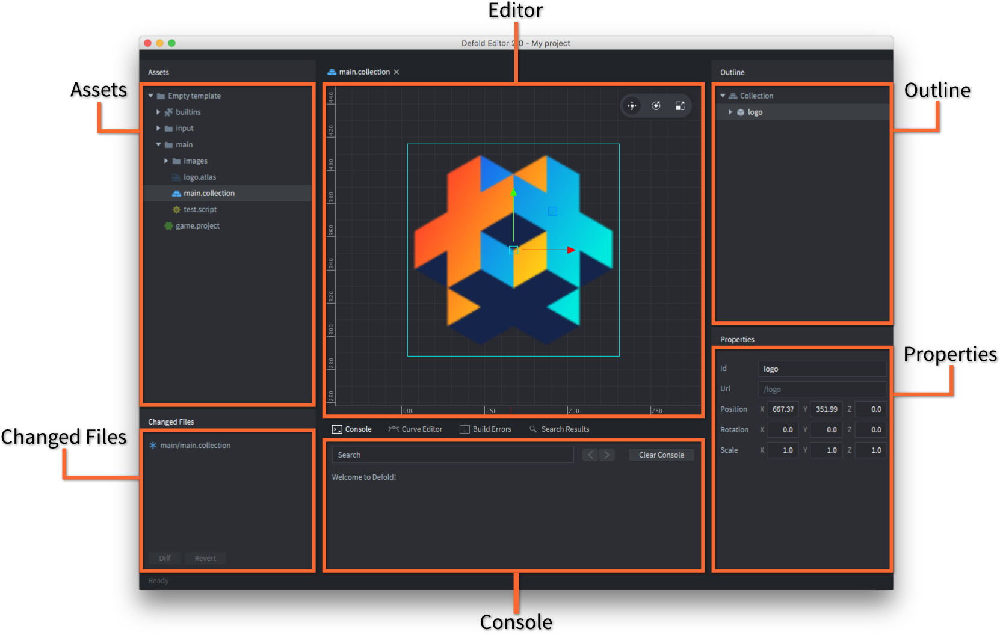
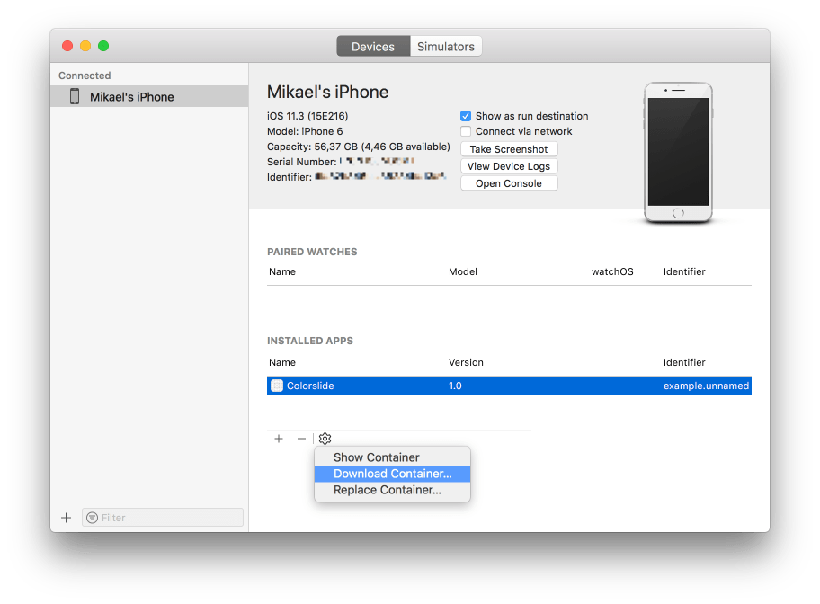

# Log gry i systemu

Log gry (ang. game log) pokazuje całe wyjście z silnika, rozszerzeń natywnych i logiki gry. Funkcji [print()](/ref/stable/base/#print:...) oraz [pprint()](/ref/stable/builtins/?q=pprint#pprint:v) można używać w skryptach i modułach Lua, aby wyświetlać informacje w logu gry. Możesz też używać funkcji z przestrzeni nazw [`dmLog`](/ref/stable/dmLog/), aby zapisywać do logu gry z poziomu rozszerzeń natywnych. Log gry można odczytywać w edytorze, w oknie terminala, przy użyciu narzędzi specyficznych dla platformy albo z pliku logu.

Logi systemowe są generowane przez system operacyjny i mogą dostarczać dodatkowych informacji pomagających ustalić źródło problemu. Logi systemowe mogą zawierać ślady stosu po awariach oraz ostrzeżenia o małej ilości pamięci.

::: important
Logowanie do konsoli/na ekranie pokazuje informacje tylko w buildach Debug. W buildach Release log konsoli jest pusty, ale możesz włączyć logowanie do pliku w Release, ustawiając opcję projektu "Write Log File" na "Always". Szczegóły poniżej.
:::

## Odczytywanie logu gry w edytorze

Gdy uruchamiasz grę lokalnie z edytora albo na urządzeniu połączonym z [development app](/manuals/dev-app), całe wyjście będzie widoczne w panelu konsoli (console pane) edytora:



## Odczytywanie logu gry z terminala

Gdy uruchamiasz grę Defold z terminala, log będzie wyświetlany bezpośrednio w samym oknie terminala. W systemach Windows i Linux wpisujesz w terminalu nazwę pliku wykonywalnego, aby uruchomić grę. W macOS musisz uruchomić silnik z wnętrza pliku `.app`:

```
$ > ./mygame.app/Contents/MacOS/mygame
```

## Odczytywanie logów gry i systemu przy użyciu narzędzi specyficznych dla platformy

### HTML5

Logi można odczytywać przy użyciu narzędzi deweloperskich dostępnych w większości przeglądarek.

* [Chrome](https://developers.google.com/web/tools/chrome-devtools/console) - Menu > More Tools > Developer Tools
* [Firefox](https://developer.mozilla.org/en-US/docs/Tools/Browser_Console) - Tools > Web Developer > Web Console
* [Edge](https://docs.microsoft.com/en-us/microsoft-edge/devtools-guide/console)
* [Safari](https://support.apple.com/guide/safari-developer/log-messages-with-the-console-dev4e7dedc90/mac) - Develop > Show JavaScript Console

### Android

Do wyświetlania logów gry i systemu możesz użyć narzędzia Android Debug Bridge (ADB).

:[Android ADB](../shared/android-adb.md)

Po zainstalowaniu i skonfigurowaniu podłącz urządzenie przez USB, otwórz terminal i uruchom:

```txt
$ cd <path_to_android_sdk>/platform-tools/
$ adb logcat
```

Urządzenie wypisze wtedy całe wyjście do bieżącego terminala, wraz z komunikatami wypisywanymi przez grę.

Jeśli chcesz widzieć tylko wyjście aplikacji Defold, użyj tego polecenia:

```txt
$ cd <path_to_android_sdk>/platform-tools/
$ adb logcat -s defold
--------- beginning of /dev/log/system
--------- beginning of /dev/log/main
I/defold  ( 6210): INFO:DLIB: SSDP started (ssdp://192.168.0.97:58089, http://0.0.0.0:38637)
I/defold  ( 6210): INFO:ENGINE: Defold Engine 1.2.50 (8d1b912)
I/defold  ( 6210): INFO:ENGINE: Loading data from:
I/defold  ( 6210): INFO:ENGINE: Initialized sound device 'default'
I/defold  ( 6210):
D/defold  ( 6210): DEBUG:SCRIPT: Hello there, log!
...
```

### iOS

Masz kilka możliwości odczytywania logów gry i systemu w iOS:

1. Możesz użyć narzędzia [Console](https://support.apple.com/guide/console/welcome/mac), aby odczytywać logi gry i systemu.
2. Możesz użyć debuggera LLDB, aby podłączyć się do gry uruchomionej na urządzeniu. Aby debugować grę, musi ona być podpisana profilem „Apple Developer Provisioning Profile”, który obejmuje urządzenie, na którym chcesz debugować. Spakuj grę z edytora i podaj provisioning profile w oknie dialogowym bundlowania (bundlowanie dla iOS jest dostępne tylko w macOS).

Aby uruchomić grę i podłączyć debugger, potrzebujesz narzędzia [ios-deploy](https://github.com/phonegap/ios-deploy). Zainstaluj je i uruchom debugowanie gry, wpisując w terminalu:

```txt
$ ios-deploy --debug --bundle <path_to_game.app> # UWAGA: to nie jest plik .ipa
```

To polecenie zainstaluje aplikację na urządzeniu, uruchomi ją i automatycznie podłączy do niej debugger LLDB. Jeśli dopiero zaczynasz z LLDB, przeczytaj [Getting Started with LLDB](https://developer.apple.com/library/content/documentation/IDEs/Conceptual/gdb_to_lldb_transition_guide/document/lldb-basics.html).


## Odczytywanie logu gry z pliku logu

Użyj ustawienia projektu "Write Log File" w pliku *game.project*, aby sterować logowaniem do pliku:

- "Never": nie zapisuj pliku logu.
- "Debug": zapisuj plik logu tylko dla buildów Debug.
- "Always": zapisuj plik logu zarówno dla buildów Debug, jak i Release.

Po włączeniu całe wyjście gry będzie zapisywane na dysku do pliku o nazwie "`log.txt`". Oto jak pobrać ten plik, jeśli uruchamiasz grę na urządzeniu:

iOS
: Podłącz urządzenie do komputera z zainstalowanymi macOS i Xcode.

  Otwórz Xcode i przejdź do <kbd>Window ▸ Devices and Simulators</kbd>.

  Wybierz urządzenie z listy, a następnie wybierz odpowiednią aplikację na liście *Installed Apps*.

  Kliknij ikonę koła zębatego pod listą i wybierz <kbd>Download Container...</kbd>.

  

  Po wyodrębnieniu kontenera zostanie on pokazany w *Finder*. Kliknij kontener prawym przyciskiem myszy i wybierz <kbd>Show Package Content</kbd>. Znajdź plik "`log.txt`", który powinien znajdować się w "`AppData/Documents/`".

Android(
: Możliwość wyodrębnienia pliku "`log.txt`" zależy od wersji systemu operacyjnego i producenta urządzenia. Oto krótki i prosty [poradnik krok po kroku](https://stackoverflow.com/a/48077004/]129360).
