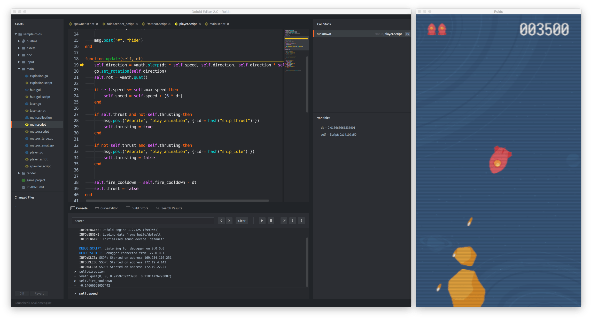
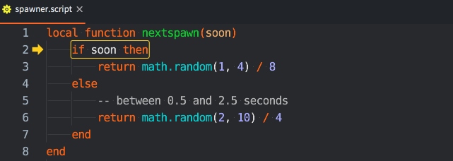
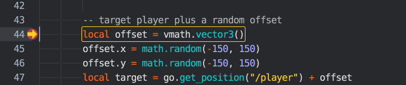
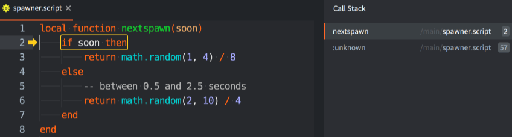
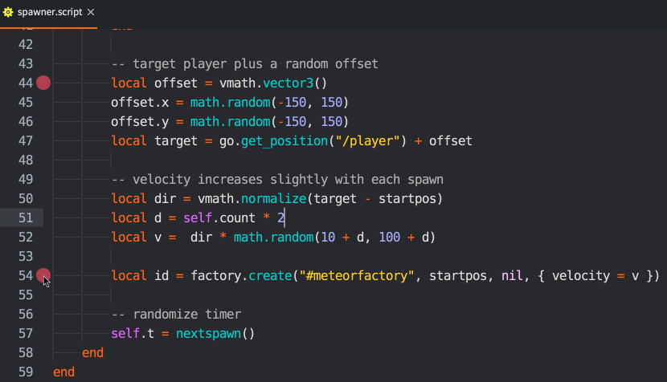
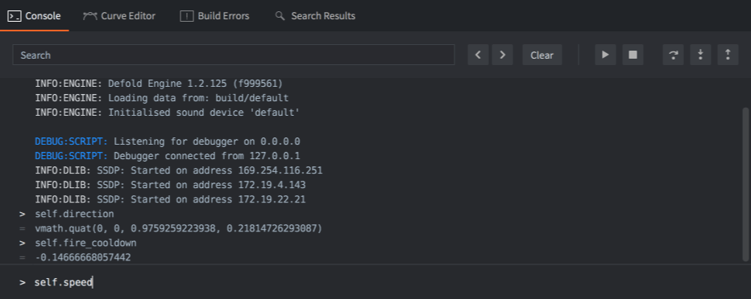
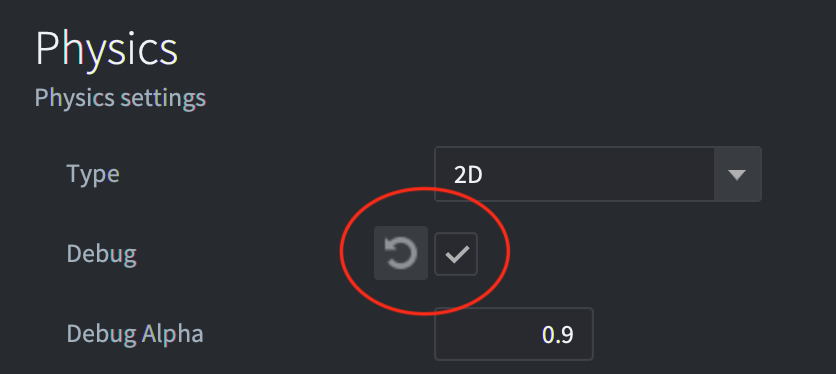

# Debugowanie logiki gry

Defold zawiera zintegrowany debugger Lua z narzędziem do inspekcji. Razem z wbudowanymi [narzędziami profilowania](/manuals/profiling) stanowi potężne narzędzie, które może pomóc w znalezieniu przyczyny błędów w logice gry lub analizie problemów wydajnościowych.

## Debugowanie za pomocą wydruków i wizualne

Najprostszym sposobem debugowania w Defold jest korzystanie z [debugowania za pomocą wydruków](http://en.wikipedia.org/wiki/Debugging#Techniques). Używaj funkcji `print()` lub [`pprint()`](/ref/builtins#pprint) do monitorowania zmiennych lub wskazywania przepływu wykonania. Jeśli obiekt gry bez skryptu działa dziwnie, możesz dołączyć do niego skrypt wyłącznie w celu debugowania. Korzystanie z dowolnej z funkcji drukowania spowoduje wydruk na panelu *Console* (konsola) w Edytorze oraz w [logach gry](/manuals/debugging-game-and-system-logs).

Oprócz drukowania/wyświetlania, silnik może również rysować teksty debugowania i proste linie na ekranie. To jest realizowane poprzez przesyłanie wiadomości do gniazda (socket) `@render`:


```lua
-- Draw value of "my_val" with debug text on the screen
msg.post("@render:", "draw_text", { text = "My value: " .. my_val, position = vmath.vector3(200, 200, 0) })

-- Draw colored text on the screen
local color_green = vmath.vector4(0, 1, 0, 1)
msg.post("@render:", "draw_debug_text", { text = "Custom color", position = vmath.vector3(200, 180, 0), color = color_green })

-- Draw debug line between player and enemy on the screen
local start_p = go.get_position("player")
local end_p = go.get_position("enemy")
local color_red = vmath.vector4(1, 0, 0, 1)
msg.post("@render:", "draw_line", { start_point = start_p, end_point = end_p, color = color_red })
```
Wizualne komunikaty debugowania dodają dane do potoku (pipeline) renderowania i są rysowane jako część standardowego potoku renderowania, czyli wyświetlane.

* `"draw_line"` dodaje dane, które są renderowane za pomocą funkcji `render.draw_debug3d()` w skrypcie renderowania (render script).
* `"draw_text"` jest renderowany z użyciem `"/builtins/fonts/system_font.font"`, który wykorzystuje materiał `"/builtins/fonts/system_font.material"`.
* `"draw_debug_text"` jest to to samo co `"draw_text"`, ale jest renderowany w kolorze niestandardowym.
Zauważ, że prawdopodobnie chcesz aktualizować te dane co klatkę, więc przesyłanie wiadomości do skryptu renderowania w funkcji `update()` jest dobrym pomysłem.

## Uruchamianie debuggera

Aby uruchomić wbudowany debugger wraz z grą klkinij menu <kbd>Debug ▸ Run with Debugger</kbd> lub wybierz <kbd>Debug ▸ Attach Debugger</kbd>, aby dołączyć debugger do aktualnie uruchomionej gry.



Gdy debugger jest podłączony, masz kontrolę nad wykonaniem gry za pomocą przycisków sterowania debugerem w konsoli lub za pomocą menu <kbd>Debug</kbd>:

Break
: {width=60px .left}
  Natychmiastowa przerwa wykonania gry. Gra zostanie zatrzymana w bieżącym punkcie. Teraz można sprawdzić stan gry, przejść do przodu krok po kroku lub kontynuować jej działanie do kolejnego punktu przerwania (breakpoint). Aktualny punkt wykonania jest oznaczony w edytorze kodu:

  

Continue
: {width=60px .left}
  Kontynuuj działanie gry. Kod gry będzie kontynuował działanie, aż naciśniesz pauzę lub wykonanie dojdzie do ustawionego punktu przerwania (breakpoint). Jeśli wykonanie zostanie przerwane na ustawionym punkcie przerwania, punkt wykonania jest oznaczony w edytorze kodu na szczycie znacznika punktu przerwania:

  

Stop
: {width=60px .left}
  Stop the debugger. Pressing this button will immediately stop the debugger, detach it from the game and terminate the running game.

Step Over
: {width=60px .left}
  Przesuń wykonanie programu o jeden krok. Jeśli wykonanie obejmuje uruchomienie innego skryptu Lua, wykonanie *nie* wejdzie do funkcji , ale będzie kontynuować działanie i zatrzyma się na kolejnej linii poniżej wywołania funkcji. W tym przykładzie, jeśli użytkownik naciśnie "Step Over", debugger wykonuje kod i zatrzymuje się na instrukcji `end` poniżej linii z wywołaniem funkcji `nextspawn()`:

  

::: sidenote
Jedna linia kodu Lua nie odpowiada jednemu wyrażeniu. Krok w debuggerze przesuwa się o jedno wyrażenie naraz, co oznacza, że obecnie możesz musieć nacisnąć przycisk kroku więcej niż raz, aby przejść do następnej linii.
:::

Step Into
: {width=60px .left}
  Przesuń wykonanie programu o jeden krok. Jeśli wykonanie obejmuje uruchomienie innej funkcji Lua, wykonanie wejdzie do funkcji. Wywołanie funkcji dodaje wpis na stosie wywołań. Możesz kliknąć każdy wpis na liście stosu wywołań, aby wyświetlić punkt wejścia i zawartość wszystkich zmiennych w tej zamknięciu. Tutaj użytkownik wszedł do funkcji `nextspawn()`:

  

Step Out
: {width=60px .left}
  Kontynuuj działanie do momentu zakończenia bieżącej funkcji. Jeśli wykonanie jest w funkcji, naciśnięcie przycisku "Step Out" spowoduje kontynuowanie działania do momentu zakończenia funkcji.


Ustawianie i usuwanie punktów przerwania (breakpoints)
: Możesz ustawić dowolną liczbę punktów przerwania w kodzie Lua. Gdy gra działa z podłączonym debugerem, zatrzyma się na następnym punkcie przerwania i poczeka na dalsze interakcje z tobą.

  

  Aby ustawić lub usunąć punkt przerwania, kliknij w kolumnie tuż po prawej stronie numerów wierszy w edytorze kodu. Możesz także wybrać opcję <kbd>Edit ▸ Toggle Breakpoint</kbd> z menu.

Ustawianie punktów przerwania warunkowych
: Możesz skonfigurować punkt przerwania tak, aby zawierał warunek, który musi być spełniony, aby punkt przerwania został uruchomiony. Warunek może uzyskiwać dostęp do zmiennych lokalnych dostępnych w danym momencie wykonania kodu.

  

  Aby edytować warunek punktu przerwania, kliknij prawym przyciskiem myszy w kolumnie tuż po prawej stronie numerów wierszy w edytorze kodu lub wybierz opcję <kbd>Edit ▸ Edit Breakpoint</kbd> z menu.

Wykonywanie wyrażeń Lua
: Z podłączonym debuggerem i zatrzymaną grą na punkcie przerwania dostępna jest przestrzeń wykonawcza Lua z bieżącym kontekstem. Wpisz wyrażenia Lua na dole konsoli i naciśnij <kbd>Enter</kbd>, aby je wykonać:

  

  Obecnie nie można modyfikować zmiennych za pomocą ewaluatora.

Odłączanie debuggera
: Wybierz <kbd>Debug ▸ Detach Debugger</kbd>, aby odłączyć debuggera od gry. Gra zostanie natychmiast wznowiona.

## Biblioteka debugowania Lua

Lua zawiera bibliotekę debugowania przydatną w niektórych sytuacjach, szczególnie jeśli potrzebujesz zbadać wewnętrzne aspekty swojego środowiska Lua. Więcej informacji na ten temat znajdziesz [tutaj](http://www.lua.org/pil/contents.html#23).

## Lista kontrolna debugowania

Jeśli napotkasz błąd lub gra nie działa zgodnie z oczekiwaniami, oto lista kontrolna debugowania:

1. Sprawdź wyświetlenia w konsoli (Console) i zweryfikuj, czy nie ma błędów czasu wykonania.

2. Dodaj instrukcje `print` do swojego kodu, aby sprawdzić, czy kod faktycznie się wykonuje.

3. Jeśli kod nie jest wykonywany, sprawdź, czy w edytorze została dokonana właściwa konfiguracja niezbędna do uruchomienia kodu. Czy skrypt został dodany do odpowiedniego obiektu gry? Czy skrypt uzyskał focus wejścia (acquired input focus), jeśli chcesz obsługiwać wejścia sterowania? Czy wejścia są zdefiniowane poprawnie? Czy kod shadera został dodany do materiału? I tak dalej.

4. Jeśli twój kod zależy od wartości zmiennych (na przykład w instrukcji warunkowej), użyj instrukcji `print` w miejscach, gdzie są używane lub sprawdzane, lub zbadaj je za pomocą debuggera.

Czasem znalezienie błędu może być trudnym i czasochłonnym procesem, który wymaga przeglądania kodu kawałek po kawałku, sprawdzania wszystkiego i zawężania błędnego kodu oraz eliminowania źródeł błędów. Najlepiej jest to robić za pomocą metody "dziel i rządź":

1. Znajdź połowę (lub mniej) kodu, który podejrzewasz, że może zawierać błąd.
2. Ponownie znajdź połowę, z tej połowy, która musi zawierać błąd.
3. Kontynuuj zawężanie kodu, który musi spowodować błąd, aż go znajdziesz.

Udanego polowania!

## Rozwiązywanie problemów z fizyką

Jeśli masz problemy z fizyką i kolizje nie działają zgodnie z oczekiwaniami, zaleca się włączenie debugowania fizyki. Zaznacz pole wyboru *"Debug"* w sekcji *"Physics"* pliku `"game.project"`:



Gdy to pole jest zaznaczone, Defold będzie rysował wszystkie kształty kolizji i punkty kontaktu kolizji:


