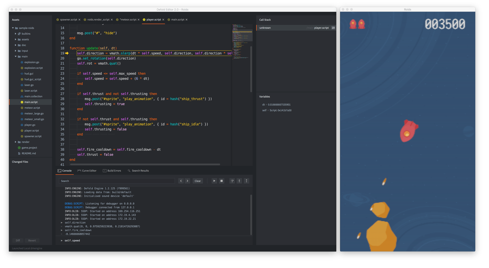
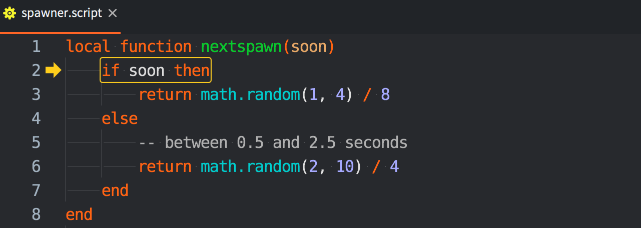
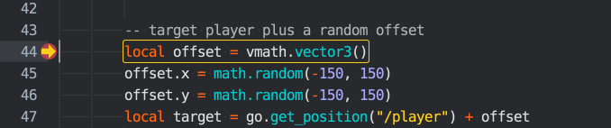
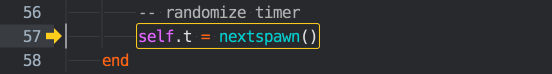
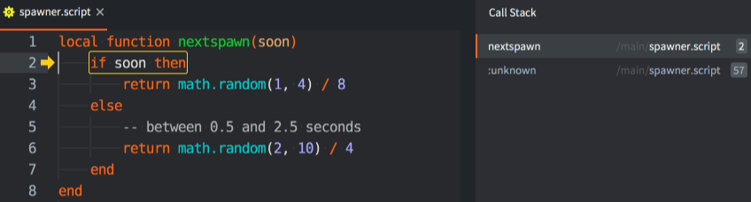
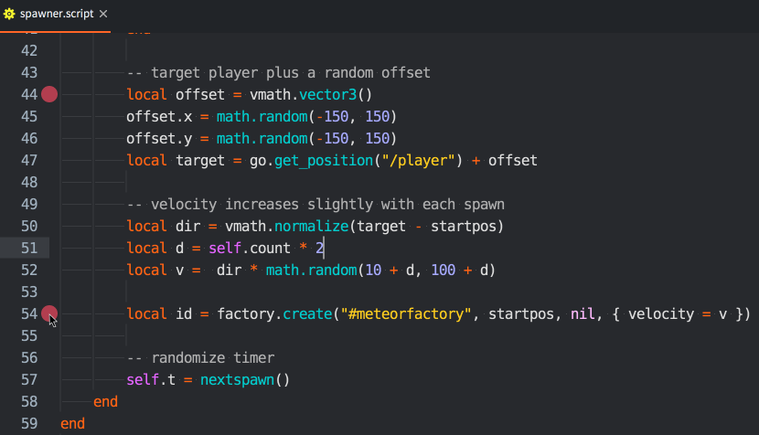
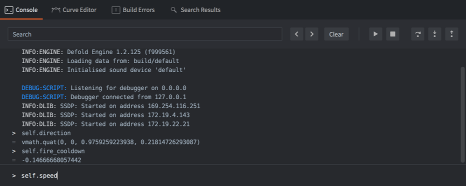
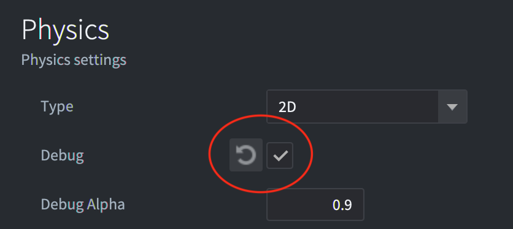
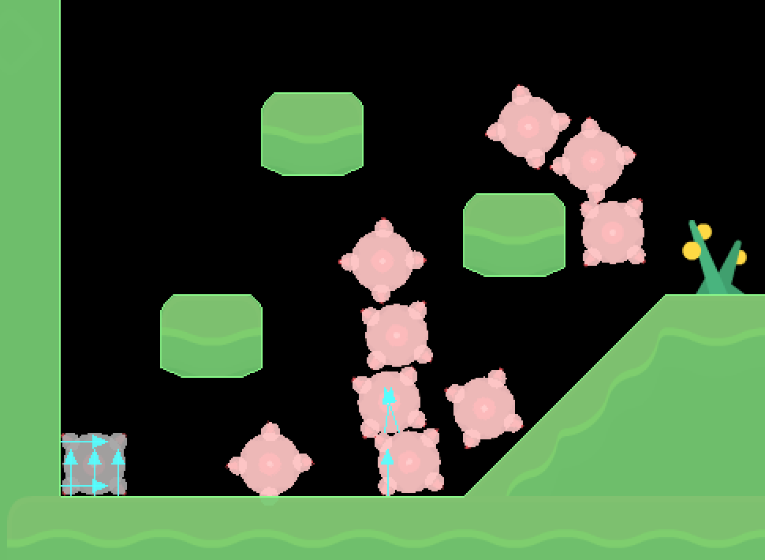

# Debugowanie logiki gry

Defold zawiera zintegrowany debugger Lua z możliwością inspekcji. W połączeniu z wbudowanymi [narzędziami profilowania](/manuals/profiling) jest to potężne narzędzie, które może pomóc znaleźć przyczynę błędów w logice gry albo przeanalizować problemy z wydajnością.

## Debugowanie za pomocą print i wizualne

Najprostszym sposobem debugowania gry w Defold jest [debugowanie za pomocą print](http://en.wikipedia.org/wiki/Debugging#Techniques). Używaj instrukcji `print()` lub [`pprint()`](/ref/builtins#pprint), aby obserwować zmienne lub wskazywać przepływ wykonania. Jeśli obiekt gry bez skryptu zachowuje się dziwnie, możesz po prostu dołączyć do niego skrypt wyłącznie do debugowania. Korzystanie z dowolnej z funkcji wypisywania spowoduje wyświetlenie wyniku w widoku *Console* w edytorze oraz w [logach gry](/manuals/debugging-game-and-system-logs).

Oprócz wypisywania, silnik może też rysować na ekranie tekst debugowania i proste linie. Robi się to przez wysyłanie wiadomości do socketu `@render`:

```lua
-- Narysuj na ekranie wartość "my_val" jako tekst debugowania
msg.post("@render:", "draw_text", { text = "My value: " .. my_val, position = vmath.vector3(200, 200, 0) })

-- Narysuj na ekranie kolorowy tekst
local color_green = vmath.vector4(0, 1, 0, 1)
msg.post("@render:", "draw_debug_text", { text = "Custom color", position = vmath.vector3(200, 180, 0), color = color_green })

-- Narysuj na ekranie linię debugowania między playerem a enemy
local start_p = go.get_position("player")
local end_p = go.get_position("enemy")
local color_red = vmath.vector4(1, 0, 0, 1)
msg.post("@render:", "draw_line", { start_point = start_p, end_point = end_p, color = color_red })
```

Wizualne wiadomości debugowania dodają dane do potoku renderowania i są rysowane jako część zwykłego potoku renderowania.

* `"draw_line"` dodaje dane renderowane przez funkcję `render.draw_debug3d()` w skrypcie do renderowania.
* `"draw_text"` jest renderowany przy użyciu `/builtins/fonts/debug/always_on_top.font`, który korzysta z materiału `/builtins/fonts/debug/always_on_top_font.material`.
* `"draw_debug_text"` jest tym samym co `"draw_text"`, ale jest renderowany w niestandardowym kolorze.

Pamiętaj, że prawdopodobnie chcesz aktualizować te dane co klatkę, więc wysyłanie tych wiadomości w funkcji `update()` jest dobrym pomysłem.

## Uruchamianie debugera

Aby uruchomić debuger, wybierz <kbd>Debug ▸ Start/Attach</kbd>, co uruchomi grę z dołączonym debugerem albo dołączy debuger do już uruchomionej gry.



Gdy tylko debuger zostanie dołączony, możesz sterować wykonaniem gry za pomocą przycisków sterowania debugerem w konsoli albo przez menu <kbd>Debug</kbd>:

Break
: {width=60px .left}
  Natychmiast wstrzymuje wykonanie gry. Gra zatrzyma się w bieżącym punkcie. Możesz teraz sprawdzić stan gry, wykonywać ją krok po kroku albo kontynuować działanie do następnego punktu przerwania. Bieżący punkt wykonania jest oznaczony w edytorze kodu:

  

Continue
: {width=60px .left}
  Kontynuuje wykonywanie gry. Kod gry będzie działał dalej, dopóki nie naciśniesz pauzy albo wykonanie nie trafi w ustawiony punkt przerwania. Jeśli wykonanie zostanie zatrzymane na punkcie przerwania, punkt wykonania jest oznaczony w edytorze kodu nad znacznikiem breakpointa:

  

Stop
: {width=60px .left}
  Zatrzymuje debuger. Naciśnięcie tego przycisku natychmiast zatrzyma debuger, odłączy go od gry i zakończy uruchomioną grę.

Step Over
: {width=60px .left}
  Przechodzi o jeden krok dalej. Jeśli wykonanie obejmuje uruchomienie innej funkcji Lua, debuger nie wejdzie do tej funkcji, tylko będzie kontynuował działanie i zatrzyma się na następnej linii poniżej wywołania funkcji. W tym przykładzie, jeśli użytkownik naciśnie "step over", debuger wykona kod i zatrzyma się na instrukcji `end` poniżej linii z wywołaniem funkcji `nextspawn()`:

  

::: sidenote
Jedna linia kodu Lua nie odpowiada jednemu wyrażeniu. Przechodzenie w debuggerze odbywa się po jednym wyrażeniu naraz, więc obecnie może być konieczne naciśnięcie przycisku kroku więcej niż raz, aby przejść do następnej linii.
:::

Step Into
: {width=60px .left}
  Przechodzi o jeden krok dalej. Jeśli wykonanie obejmuje uruchomienie innej funkcji Lua, debuger wejdzie do tej funkcji. Wywołanie funkcji dodaje wpis na stosie wywołań. Możesz kliknąć każdy wpis na liście stosu wywołań, aby zobaczyć punkt wejścia i zawartość wszystkich zmiennych w tym domknięciu. W tym przykładzie użytkownik wszedł do funkcji `nextspawn()`:

  

Step Out
: {width=60px .left}
  Kontynuuje wykonywanie do momentu powrotu z bieżącej funkcji. Jeśli wszedłeś do funkcji podczas debugowania, naciśnięcie przycisku "step out" będzie kontynuować wykonanie aż do momentu zwrócenia przez funkcję.

Setting and clearing breakpoints
: Możesz ustawić dowolną liczbę breakpointów w kodzie Lua. Gdy gra działa z dołączonym debugerem, zatrzyma się na następnym napotkanym breakpointcie i poczeka na dalszą interakcję z twojej strony.

  

  Aby ustawić lub usunąć breakpoint, kliknij w kolumnie bezpośrednio po prawej stronie numerów linii w edytorze kodu. Możesz też wybrać <kbd>Edit ▸ Toggle Breakpoint</kbd> z menu.

Disabling and enabling breakpoints
: Breakpointy można tymczasowo wyłączyć bez ich usuwania. Gdy są wyłączone, są ignorowane podczas wykonywania, ale można je włączyć ponownie w dowolnym momencie. Kliknij je prawym przyciskiem myszy w marginesie edytora kodu, a następnie przełącz pole wyboru Enabled. Wyłączone breakpointy są pokazane jako puste, aby zaznaczyć, że są nieaktywne.

  

Setting conditional breakpoints
: Możesz skonfigurować breakpoint tak, aby zawierał warunek, który musi zostać spełniony, żeby breakpoint został wyzwolony. Warunek może korzystać z lokalnych zmiennych dostępnych w danym wierszu podczas wykonywania kodu.

  

  Aby edytować warunek breakpointa, kliknij prawym przyciskiem myszy w kolumnie bezpośrednio po prawej stronie numerów linii w edytorze kodu albo wybierz <kbd>Edit ▸ Edit Breakpoint</kbd> z menu.

Evaluating Lua expressions
: Gdy debuger jest dołączony, a gra zatrzymana na breakpointcie, dostępne jest środowisko wykonawcze Lua z bieżącym kontekstem. Wpisz wyrażenia Lua na dole konsoli i naciśnij <kbd>Enter</kbd>, aby je ocenić:

  

  Obecnie nie można modyfikować zmiennych za pomocą ewaluatora.

Detaching the debugger
: Wybierz <kbd>Debug ▸ Detach Debugger</kbd>, aby odłączyć debuger od gry. Gra będzie natychmiast kontynuowana.

## Breakpoints Tab

  

  Podczas pracy z wieloma breakpointami w różnych skryptach karta Breakpoints zapewnia scentralizowany widok do zarządzania wszystkimi breakpointami w jednym miejscu.

##### Individual Breakpoint Controls

  Do pracy z pojedynczymi breakpointami:
  - Kliknij czerwoną ikonę kosza, aby usunąć breakpoint
  - Kliknij dwukrotnie wiersz poza obszarem warunku, aby przejść do tej linii w Code View
  - Kliknij dwukrotnie komórkę warunku albo kliknij ikonę pióra, aby edytować conditional breakpoints
  - Kliknij przycisk X clear, gdy najedziesz na komórkę warunku, aby wyczyścić warunek

##### Batch Operations

  Zaznacz wiele breakpointów za pomocą Ctrl/Cmd+klik lub Shift+klik, a następnie kliknij prawym przyciskiem myszy, aby wykonać operacje zbiorcze. Możesz jednocześnie edytować warunki kilku breakpointów, przełączać ich stan aktywności albo usuwać je całkowicie.

  Przyciski na pasku narzędzi pozwalają włączyć, wyłączyć lub przełączyć wszystkie breakpointy naraz, co jest przydatne, gdy chcesz uruchomić grę bez zatrzymywania, ale nie chcesz stracić ich położeń. Możesz też usunąć wszystkie, gdy skończysz sesję debugowania.

## Lua debug library

Lua zawiera bibliotekę debugowania, która bywa przydatna w niektórych sytuacjach, szczególnie gdy trzeba zajrzeć do wnętrza środowiska Lua. Więcej informacji znajdziesz w [rozdziale o Debug Library w podręczniku Lua](http://www.lua.org/pil/contents.html#23).

## Debugging checklist

Jeśli napotkasz błąd albo gra nie zachowuje się zgodnie z oczekiwaniami, skorzystaj z poniższej listy kontrolnej debugowania:

1. Sprawdź zawartość konsoli i upewnij się, że nie ma błędów wykonania.

2. Dodaj do kodu instrukcje print, aby potwierdzić, że kod rzeczywiście się wykonuje.

3. Jeśli kod się nie wykonuje, sprawdź, czy w edytorze wykonano wszystkie wymagane czynności konfiguracyjne. Czy skrypt został dodany do właściwego obiektu gry? Czy skrypt przechwycił input focus? Czy input triggers są poprawne? Czy kod shadera został dodany do materiału? I tak dalej.

4. Jeśli kod zależy od wartości zmiennych, na przykład w instrukcji `if`, wypisz te wartości tam, gdzie są używane lub sprawdzane, albo zbadaj je za pomocą debugera.

Czasami znalezienie błędu jest trudnym i czasochłonnym procesem, który wymaga przechodzenia przez kod krok po kroku, sprawdzania wszystkiego, zawężania obszaru błędu i eliminowania źródeł problemu. Najlepiej zrobić to metodą „dziel i rządź”:

1. Ustal, która połowa kodu, albo mniejsza część, musi zawierać błąd.
2. Ponownie ustal, która połowa z tej połowy musi zawierać błąd.
3. Kontynuuj zawężanie kodu, który musi powodować błąd, aż go znajdziesz.

Powodzenia w poszukiwaniach!

## Debugging problems with physics

Jeśli masz problemy z fizyką i kolizje nie działają zgodnie z oczekiwaniami, zaleca się włączenie debugowania fizyki. Zaznacz pole wyboru *Debug* w sekcji *Physics* pliku *game.project*:



Gdy to pole wyboru jest zaznaczone, Defold będzie rysować wszystkie kształty kolizji i punkty kontaktu kolizji:


