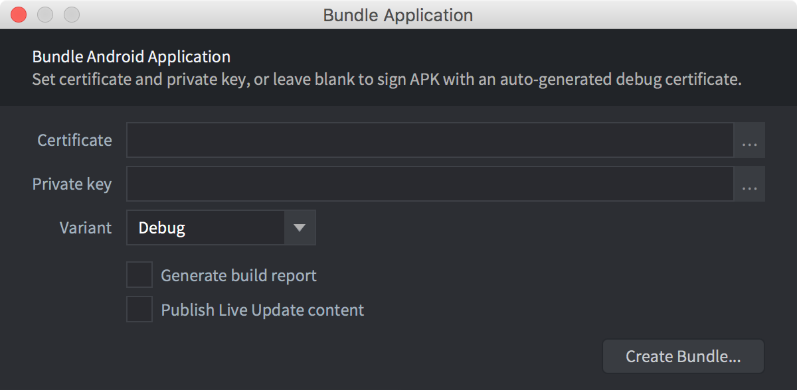
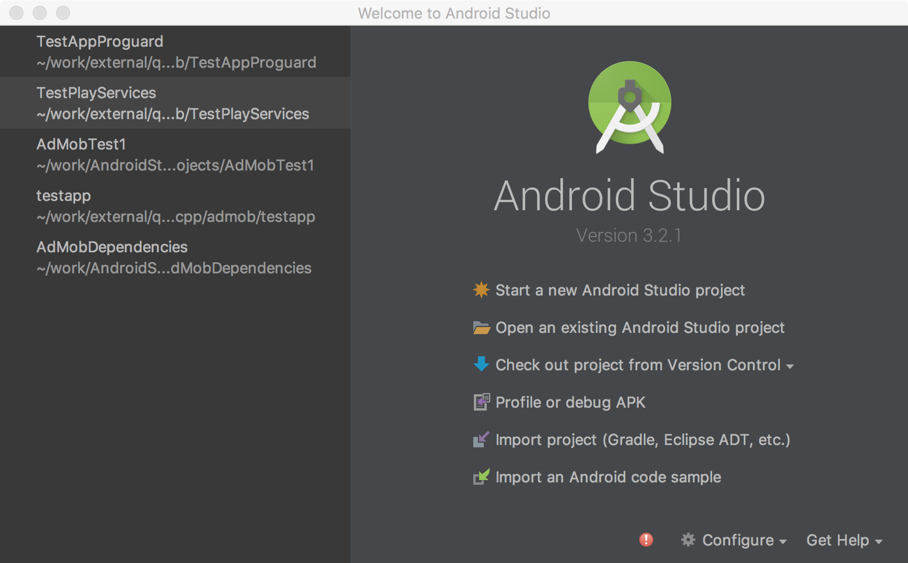
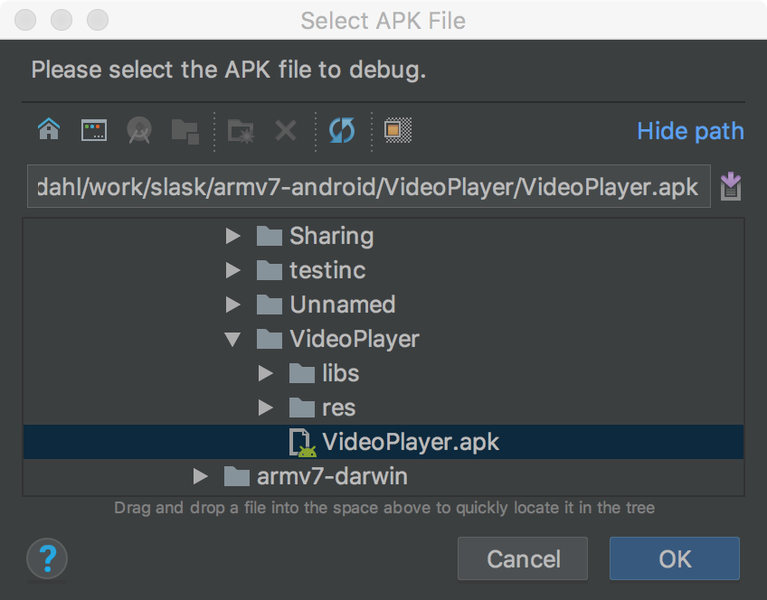
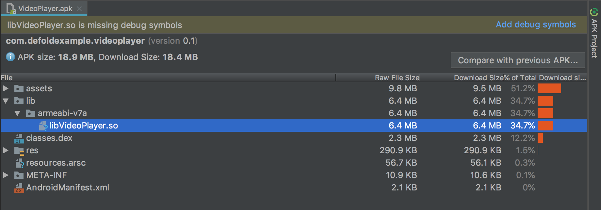
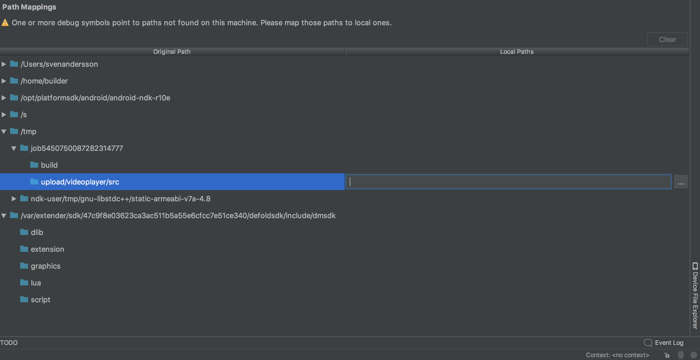
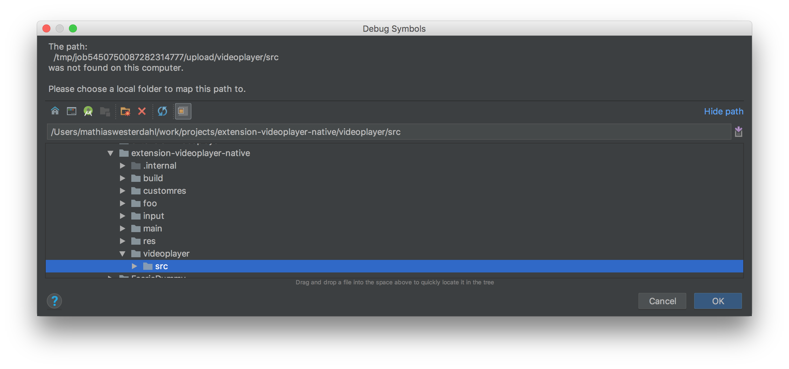
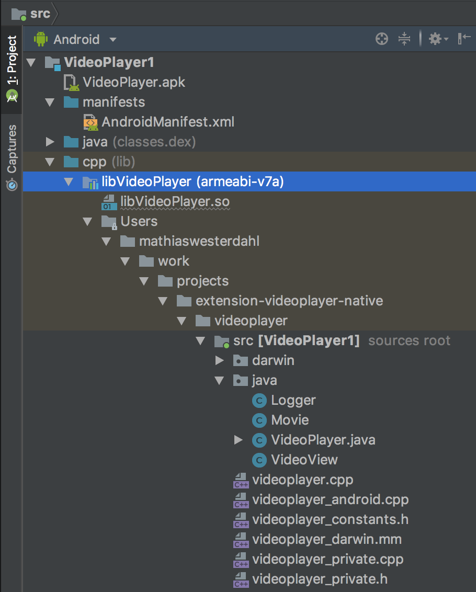
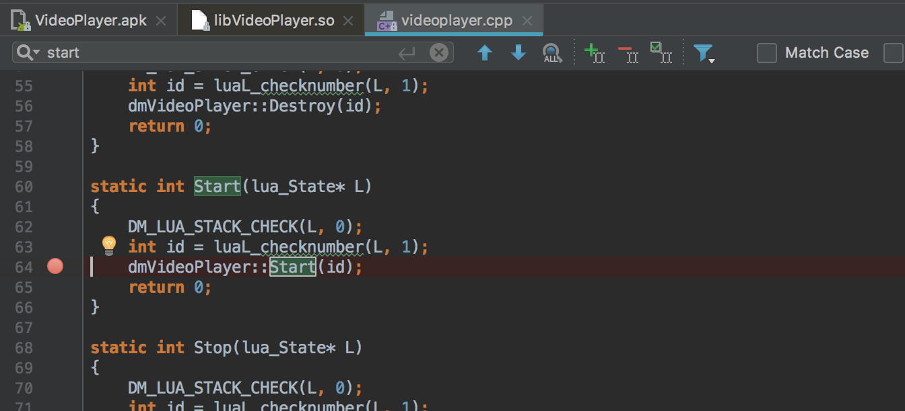
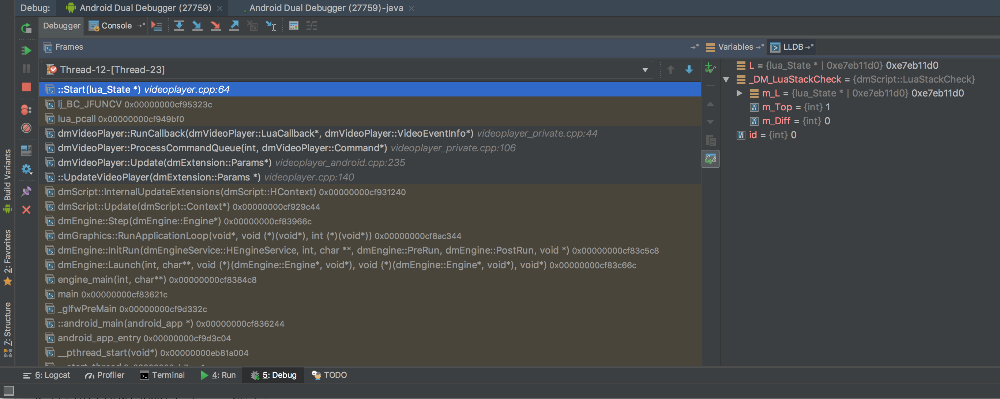

# Debugowanie na Androidzie

Tutaj opisujemy, jak debugować zbudowaną aplikację za pomocą [Android Studio](https://developer.android.com/studio/), oficjalnego IDE dla systemu operacyjnego Android firmy Google.


## Android Studio

* Przygotuj pakiet, ustawiając opcję `android.debuggable` w pliku *game.project*

	

* Zbuduj pakiet aplikacji w trybie debug i zapisz go w wybranym folderze.

	

* Uruchom [Android Studio](https://developer.android.com/studio/)

* Wybierz <kbd>Profile or debug APK</kbd>

	

* Wybierz utworzony przed chwilą pakiet APK

	

* Wybierz główny plik `.so` i upewnij się, że zawiera symbole debugowania

	

* Jeśli ich nie ma, wczytaj nieokrojony plik `.so` (`unstripped`). (rozmiar to około 20 MB)

* Mapowania ścieżek (ang. path mappings) pozwalają powiązać poszczególne ścieżki zapisane podczas budowania pliku wykonywalnego (w chmurze) z rzeczywistymi folderami na dysku lokalnym.

* Wybierz plik `.so`, a następnie dodaj mapowanie do folderu na swoim dysku lokalnym

	

	

* Jeśli masz dostęp do kodu źródłowego silnika, dodaj mapowanie ścieżki również do niego.

* Upewnij się, że lokalne źródła są przełączone na dokładnie tę wersję, którą obecnie debugujesz

	defold$ git checkout 1.2.148

* Naciśnij <kbd>Apply changes</kbd>

* Powinieneś teraz widzieć zmapowany kod źródłowy w projekcie

	

* Dodaj punkt przerwania

	

* Naciśnij <kbd>Run</kbd> -> <kbd>Debug "Appname"</kbd> i wywołaj kod, w którym chcesz przerwać wykonywanie

	

* Możesz teraz przechodzić po stosie wywołań i sprawdzać wartości zmiennych


## Uwagi

### Folder zadania rozszerzenia natywnego (Native Extension)

Obecnie ta procedura jest nieco uciążliwa podczas prac rozwojowych. Wynika to z tego, że nazwa folderu zadania
jest losowa przy każdym budowaniu, przez co mapowanie ścieżek staje się za każdym razem nieprawidłowe.

Mimo to działa poprawnie w ramach pojedynczej sesji debugowania.

Mapowania ścieżek są przechowywane w pliku projektu `.iml` w projekcie Android Studio.

Nazwę folderu zadania można odczytać z pliku wykonywalnego

```sh
$ arm-linux-androideabi-readelf --string-dump=.debug_str build/armv7-android/libdmengine.so | grep /job
```

Folder zadania ma nazwę w rodzaju `job1298751322870374150`, za każdym razem z losowym numerem.
