# Debugowanie na iOS/macOS

Tutaj opisujemy, jak debugować kompilację za pomocą [Xcode](https://developer.apple.com/xcode/), preferowanego przez Apple środowiska IDE do tworzenia aplikacji na macOS i iOS.

## Xcode

* Zbuduj pakiet aplikacji za pomocą bob, używając opcji `--with-symbols` ([więcej informacji](/manuals/debugging-native-code/#symbolicate-a-callstack)):

```sh
$ cd myproject
$ wget http://d.defold.com/archive/<sha1>/bob/bob.jar
$ java -jar bob.jar --platform armv7-darwin build --with-symbols --variant debug --archive bundle -bo build/ios -mp <app>.mobileprovision --identity "iPhone Developer: Your Name (ID)"
```

* Zainstaluj aplikację za pomocą `Xcode`, `iTunes` albo [ios-deploy](https://github.com/ios-control/ios-deploy)

```sh
$ ios-deploy -b <AppName>.ipa
```

* Pobierz folder `.dSYM` (czyli symbole debugowania)

	* Jeśli projekt nie używa rozszerzeń natywnych (Native Extensions), możesz pobrać plik `.dSYM` z [d.defold.com](http://d.defold.com)

	* Jeśli używasz rozszerzenia natywnego, folder `.dSYM` jest generowany podczas budowania za pomocą [bob.jar](https://www.defold.com/manuals/bob/). Wystarczy samo zbudowanie projektu, bez archiwizacji ani bundlowania:

```sh
$ cd myproject
$ unzip .internal/cache/arm64-ios/build.zip
$ mv dmengine.dSYM <AppName>.dSYM
$ mv <AppName>.dSYM/Contents/Resources/DWARF/dmengine <AppName>.dSYM/Contents/Resources/DWARF/<AppName>
```

### Tworzenie projektu

Aby poprawnie debugować, potrzebujemy projektu oraz zmapowanego kodu źródłowego.
Nie używamy tego projektu do budowania, a jedynie do debugowania.

* Utwórz nowy projekt Xcode i wybierz szablon <kbd>Game</kbd>

    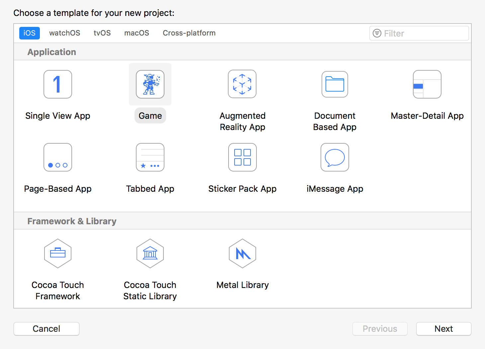

* Wybierz nazwę (np. `debug`) i ustawienia domyślne

* Wybierz folder, w którym chcesz zapisać projekt

* Dodaj swój kod do aplikacji

    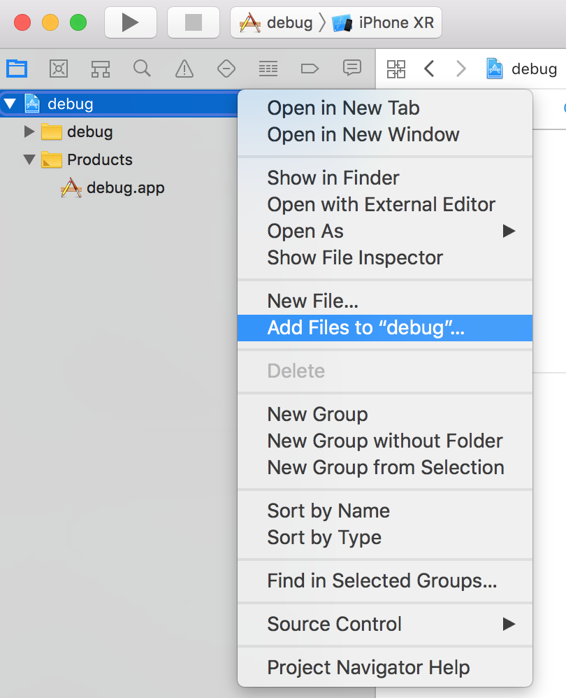

* Upewnij się, że opcja <kbd>Copy items if needed</kbd> jest odznaczona.

    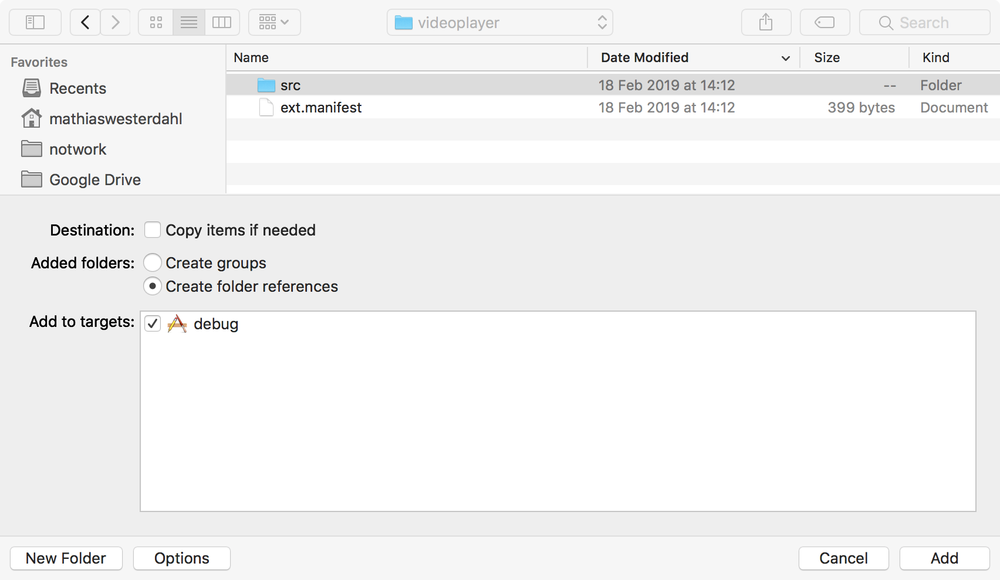

* Oto efekt końcowy

    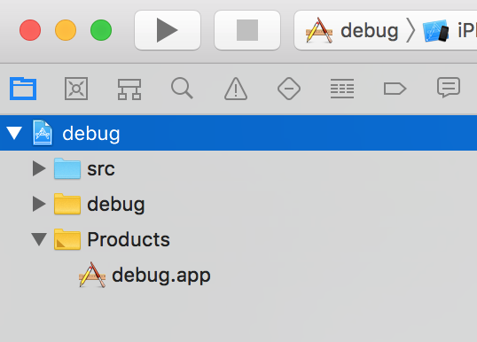


* Wyłącz krok <kbd>Build</kbd>

    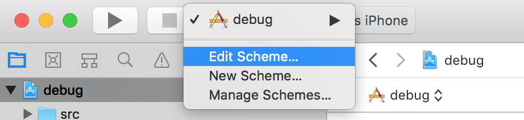

    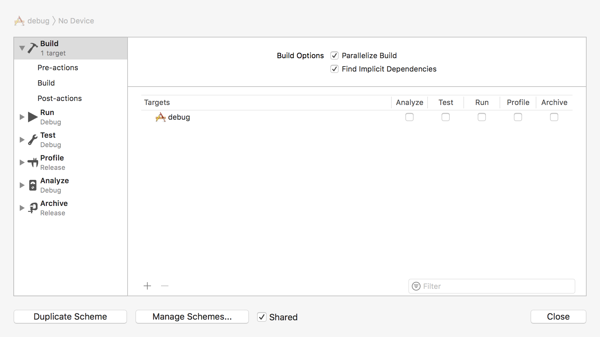

* Ustaw wersję <kbd>Deployment target</kbd> tak, aby była większa niż wersja iOS na Twoim urządzeniu

    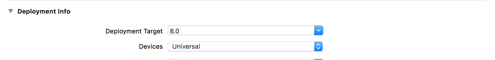

* Wybierz urządzenie docelowe

    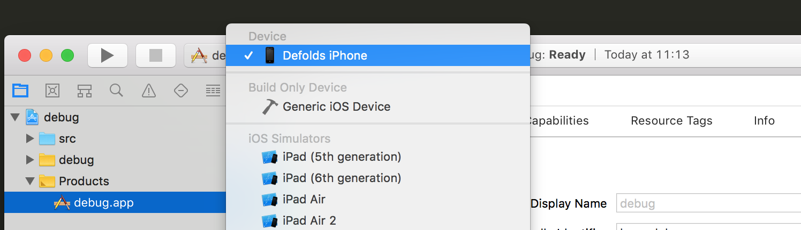


### Uruchamianie debuggera

Masz kilka opcji debugowania aplikacji:

1. Wybierz <kbd>Debug</kbd> -> <kbd>Attach to process...</kbd> i wybierz z listy aplikację

2. Albo wybierz <kbd>Attach to process by PID or Process name</kbd>

    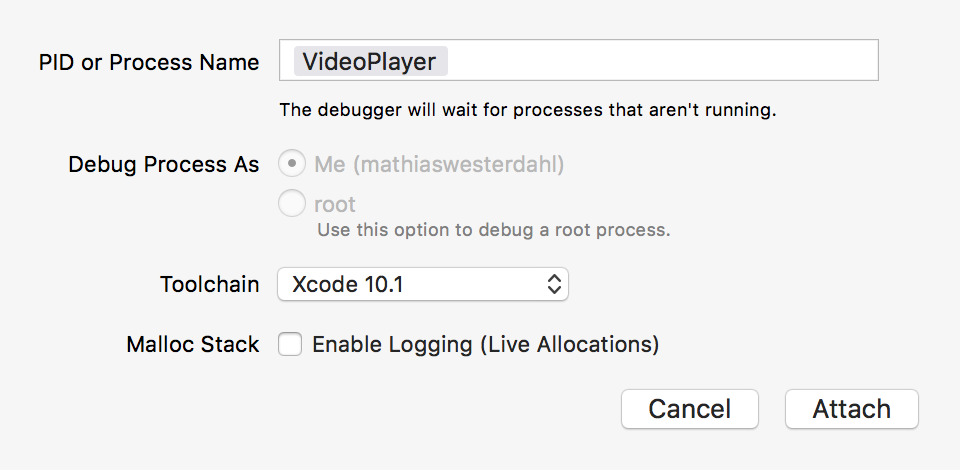

3. Uruchom aplikację na urządzeniu

4. W <kbd>Edit Scheme</kbd> dodaj folder <AppName>.app jako plik wykonywalny

### Symbole debugowania

**Aby użyć lldb, wykonanie musi być wstrzymane**

* Dodaj ścieżkę `.dSYM` do lldb

```
(lldb) add-dsym <PathTo.dSYM>
```

    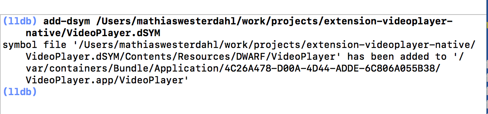

* Sprawdź, czy `lldb` poprawnie wczytał symbole

```
(lldb) image list <AppName>
```

### Mapowania ścieżek

* Dodaj kod źródłowy silnika (zmień odpowiednio do własnych potrzeb)

```
(lldb) settings set target.source-map /Users/builder/ci/builds/engine-ios-64-master/build /Users/mathiaswesterdahl/work/defold
(lldb) settings append target.source-map /private/var/folders/m5/bcw7ykhd6vq9lwjzq1mkp8j00000gn/T/job4836347589046353012/upload/videoplayer/src /Users/mathiaswesterdahl/work/projects/extension-videoplayer-native/videoplayer/src
```

* Folder zadania można ustalić na podstawie pliku wykonywalnego. Ten folder ma nazwę `job1298751322870374150` i za każdym razem zawiera losowy numer.

```sh
$ dsymutil -dump-debug-map <executable> 2>&1 >/dev/null | grep /job

```

* Sprawdź mapowania źródeł

```
(lldb) settings show target.source-map
```

Możesz sprawdzić, z którego pliku źródłowego pochodzi symbol, używając:

```
(lldb) image lookup -va <SymbolName>
```

### Punkty przerwania

* Otwórz plik w widoku projektu i ustaw punkt przerwania

    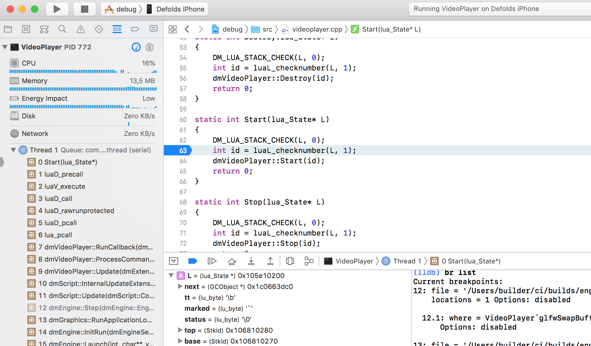

## Uwagi

### Sprawdzenie UUID pliku binarnego

Aby debugger zaakceptował folder `.dSYM`, UUID musi odpowiadać UUID debugowanego pliku wykonywalnego. Możesz sprawdzić UUID w ten sposób:

```sh
$ dwarfdump -u <PathToBinary>
```
