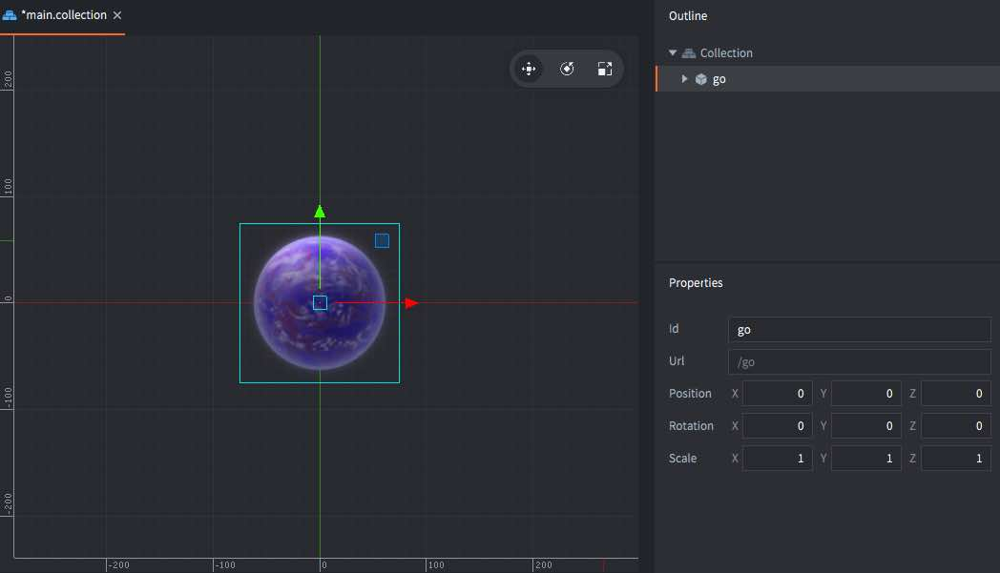
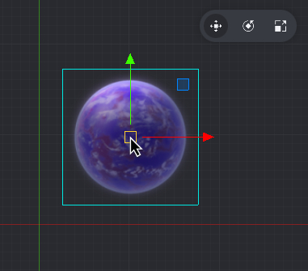
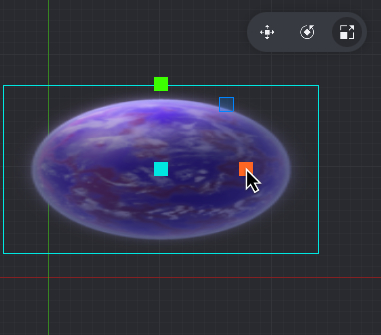

# Edytor Defold

Edytor Defold pozwala przeglądać i zarządzać plikami w Twoim projekcie w wydajny sposób. Edytowanie różnych plików otwiera odpowiednie widoki ukazujące wszystkie niezbędne informacje.

## Uruchamianie edytora

Kiedy uruchamiasz edytor Defold zostaje najpierw otwarte okno wyboru i tworzenia projektu. Wybierz spośród:

Home (Strona domowa)
: Kliknij, żeby zobaczyć swoje ostatnio otwierane projekty. To jest domyślny widok.

New Project (Nowy Projekt)
: Kliknij, jeśli chcesz stworzyć nowy projekt. Następnie wybierz bazę swojego projektu spośród dostępnych szablonów (z zakładki *From Template*), tutoriali (*From Tutorial*) lub wypróbować jecen z przykładowych projektów (*From Sample*).

  {srcset="images/editor/new_project@2x.png 2x"}

  Kiedy utworzysz nowy projekt będzie on zapisany na Twoim lokalnym dysku, tak jak wszystkie zmiany, które w nim zrobisz.

Szczegóły dotyczące różnych zakładek znajdziesz w [instrukcji do rozpoczynania projektu](https://www.defold.com/manuals/project-setup/).

## Widoki w edytorze

Edytor Defold jest podzielony na oddzielne widoki/sekcje, które zawierają specyficzne informacje.

Widok *Assets* (Zasoby)
: Zawiera listę wszystkich plików projektu, reprezentowaną podobnie do systemowego eksploratora plików, zgodnie z hierarchią katalogów. Możesz klikać, przewijać i rozwijać elementy:

   - <kbd>Kliknij dwukrotnie lewym przyciskem myszki</kbd> nazwę pliku, żeby otworzyć go w edytorze.
   - <kbd>Przeciągaj i upuszczaj</kbd> pliki, aby zmieniać ich lokalizację w strukturze projektu lub dodawać nowe pliki z dysku.
   - <kbd>Kliknij prawy przycisk myszki</kbd>, żeby otworzyć _menu kontekstowe_, z którego możesz utworzyć nowe pliki i foldery, zmienić nazwę, usunąć czy śledzić zależności i wiele więcej.

Widok *Editor* (Edytor)

: Centralna sekcja wyświetla aktualnie otwarty plik w edytorze odpowiedniem dla danego typu pliku. Wszystkie rodzaje takich edytorów, które są wizualne pozwalają na manipulację widokiem kamery:

- Przesuwanie: <kbd>Alt + Lewy przycisk myszki</kbd>.
- Oddalanie/przybliżanie: <kbd>Alt + Prawy przycisk myszki</kbd> (myszki trójprzyciskowe) lub <kbd>Ctrl + Lewy przycisk myszki</kbd> (jeden przycisk). Jeśli myszka ma kółko, może ono być również używane do przybliżania i oddalania.
- Obracaj w 3D: <kbd>Ctrl + Lewy przycisk myszki</kbd>.

W prawym górnym rogu edytora aktualnie otwartego pliku (sceny) znajduje się zestaw narzędzi obsługi widoku kamery: *Move* (Przesuwanie), *Rotate* (Obracanie) and *Scale* (Skalowanie).

{srcset="images/editor/toolbar@2x.png 2x"}

Widok *Outline* (Zawartość pliku)
: Widok ten pokazuje zawartość aktualnie otwartego pliku, w strukturze drzewa. Odzwierciedla widok edytora i pozwala na wykonywanie operacji na zawartości:

   - <kbd>Kliknij lewym przyciskem myszki</kbd> aby wybrać wskazany element. Przytrzymaj klawisz <kbd>Shift</kbd> lub <kbd>Option</kbd>, żeby zaznaczyć wiele elementów.
   - <kbd>Przeciągaj i upuszczaj</kbd> elementy, żeby zmieniać ich położenie w strukturze. Upuść obiekty gry (game object) na innym obiekcie w kolekcji, żeby stworzyć relację rodzic-dziecko.
   - <kbd>Kliknij prawy przycisk myszki</kbd>, żeby otworzyć _menu kontekstowe_, z którego możesz utworzyć nowe komponenty, usunąć wybrane i wiele więcej.

Widok *Properties* (Właściwości))
: Widok ten pokazuje właściwości aktualnie wybranego komponentu, takie jak Pozycja, Rotacja, Animacja, Id, etc.

Widok *Tools* (Narzędzia)
: Dolny widok pokazuje w zależności od wybranej zakładki: konsolę (ang. *Console*) wyświetlającą logi działającego programu, edytor krzywych (ang. *Curve Editor*) umożliwiający edytowanie wykresu krzywej, używany np. przy tworzeniu efektów cząsteczkowych (particle fx), błędy budowania (ang. *Build Errors*) i wyniki wyszukiwania (ang. *Search Results*). Konsola jest również używana podczas używania zintegrowanego debuggera.

Widok *Changed Files* (Zmienione pliki):
: Widok pokazuje wszystkie pliki, które zostały zmienione, dodane lub usunięte z Twojego projektu od ostatniej zapisanej w systemie kontroli wersji zmiany (commit). This view lists any files that has been changed, added or deleted in your project. By synchronizing the project regularly you can bring your local copy in sync with what is stored in the project Git repository, that way you can collaborate within a team, and you won’t lose your work if unfortune strikes. Some file oriented operations can be performed in this view:

   - <kbd>Double click</kbd> a file to open a diff view of the file. Editor 2 opens the file in a suitable editor, just like in the assets view.
   - <kbd>Right click</kbd> a file to open a pop up menu from where you can open a diff view, revert all changes done to the file, find the file on the filesystem and more (editor 2).

## Edytowanie równolegle (Side-by-side)

Jeśli masz otwartych kilka plików jednocześnie, dla każdego z nich pokazywana jest osobna zakładka na górnym pasku edytora Defold. Możliwe jest również otworzenie dwóch edytorów/.paneli naraz, jeden obok drugiego. Wybierz plik, <kbd>klikająć prawym przyciskiem myszy</kbd> na danej zakładce w górnym pasku i wybierz <kbd>Move to Other Tab Pane</kbd> z menu kontekstowego.

{srcset="images/editor/2-panes@2x.png 2x"}

Następnie, możesz również z tego samego menu kontekstowego wybrać opcje <kbd>Swap With Other Tab Pane</kbd>, żeby zamienić panele miejscami lub <kbd>Join Tab Panes</kbd>, żeby z powrotem połączyć panele w jeden.

## Edytor sceny

Kliknij dwukrotnie lewym przyciskiem myszki na kolekcji lub obiekcie gry, żeby otworzyć *Edytor Sceny*:

Wybieranie obiektów:
: Kliknij na obiekt w głównym oknie, żeby go wybrać. Prostokąt wokół wybranego obiektu zostanie podświetlony na zielono. Wybrany obiekty zostanie również podświetlony w widoku *Outline* po prawej stronie.

  Obiekty możesz wybierać również:

  - <kbd>Klikając i przeciągając</kbd>, żeby wybrać wszystkie obiekty w zaznaczonym, prostokątnym obszarze.
  - <kbd>Klikając</kbd> na obiekt w widoku Outline po prawej stronie.

  Naciśnij i przytrzymaj <kbd>Shift</kbd> lub <kbd>⌘</kbd> (Mac) / <kbd>Ctrl</kbd> (Win/Linux) podczas wybierania obiektów, aby wybrać więcej na raz.

Narzędzie przesuwania (Move)
: {.left}
  Do przesuwania obiektów można użyć narzędzia przesuwania *Move*. Znajdziesz je w pasku narzędzi w prawym górnym rogu edytora sceny lub klikając klawisz <kbd>W</kbd>.

  

  Nad wybranym obiektem wyświetla się zestaw wizualnych manipulatorów (kwadraty i strzałki). Klikaj i przeciągaj środkowym kwadratem, aby dowolnie przesuwać obiektem po ekranie lub klikaj i przeciągaj pojedyncze strzałki, aby przesuwać obiekt tylko wzdłuż wybranej osi. Są tutaj również kwadratowe wskaźniki umożliwiające poruszanie się po płaszczyznach XY oraz X-Z i Y-Z (widoczne po obróceniu kamery).

Narzędzie obracania (Rotate)
: {.left}
  Do obracania obiektów, można użyć narzędzia obracania *Rotate* wybierając je z górnego paska narzędzi lub naciskając klawisz <kbd>E</kbd>.

  

  Nad wybranym obiektem wyświetla się zestaw wizualnych, okrągłych manipulatorów. Pomarańczowy manipulator obraca obiektem w płaszczyźnie ekranu, a pozostałe wokół osi X, Y i Z. Pamiętaj, że domyślny widok jest prostopadły do osi X i Y, więc okręgi służące do obrotu wokół tych osi są widoczne wtedy po prostu jako linie.

Narzędzie skalowania (Scale)
: {.left}
  Do skalowania obiektów, można użyć narzędzia skalowania *Scale* wybierając je z górnego paska narzędzi lub naciskając klawisz <kbd>R</kbd>.

  

  Nad wybranym obiektem wyświetla się zestaw wizualnych, kwadratowych manipulatorów. Środkowy kwadrat skaluje obiekt jednakowo wzdłuż każdej z osi (włącznie z osią Z), a pozostałe odpowiednio wokół osi X, Y i Z. Oprócz tego pokazane są wtedy również kwadraty pozwalające na skalowanie wzdłuż dwóch osi jednocześnie, parami: X-Y, X-Z i Y-Z.

## Tworzenie nowego pliku

Żeby utworzyć nowy plik kliknij z górnego menu <kbd>File ▸ New...</kbd> i wybierz typ pliku z menu lub użyj menu kontekstowego:

<kbd>Kliknij prawy przycisk myszki</kbd> na docelowej lokalizacji w panelu *Assets* po lewej stronie i wybierz <kbd>New... ▸ [file type]</kbd>:

{srcset="images/editor/create_file@2x.png 2x"}

Podaj odpowiednią nazwę dla pliku. Pełna nazwa pliku uwzględniająca końcówkę znajduję się w polu *Path* (ścieżka) w oknie dialogowym:

{srcset="images/editor/create_file_name@2x.png 2x"}

## Importowanie plików do projektu

Aby dodać pliki (obrazki, dźwięki, modele, itp.) do Twojego projektu, po prostu przeciągnij i upuść je w odpowiednim miejscu w panelu *Assets* po lewej stronie. Utworzysz w ten sposób _kopię_ danego pliku w docelowej lokalizacji projektu. Przeczytaj więcej na temat [importowania plików w tej instrukcji](/manuals/importing-assets/).

{srcset="images/editor/import@2x.png 2x"}

## Skróty klawiszowe

| Command | Windows | macOS | Linux |
|---------|---------|-------|-------|
| Add (Dodaj) | <kbd>A</kbd> | <kbd>A</kbd> | <kbd>A</kbd> |
| Add secondary (Dodaj następny) | <kbd>Shift</kbd>+<kbd>A</kbd> | <kbd>Shift</kbd>+<kbd>A</kbd> | <kbd>Shift</kbd>+<kbd>A</kbd> |
| Backwards tab trigger (Powracanie o odstęp) | <kbd>Shift</kbd>+<kbd>Tab</kbd> | <kbd>Shift</kbd>+<kbd>Tab</kbd> | <kbd>Shift</kbd>+<kbd>Tab</kbd> |
| Beginning of file (Skocz do początku pliku) | <kbd>Ctrl</kbd>+<kbd>Home</kbd> | <kbd>Cmd</kbd>+<kbd>Up</kbd> | <kbd>Ctrl</kbd>+<kbd>Home</kbd> |
| Beginning of line (Skocz do początku linii) |  | <kbd>Ctrl</kbd>+<kbd>A</kbd> |  |
| Beginning of line text (Skocz do początku tekstu) | <kbd>Home</kbd> | <kbd>Home</kbd> | <kbd>Home</kbd> |
| Build (Zbuduj) | <kbd>Ctrl</kbd>+<kbd>B</kbd> | <kbd>Cmd</kbd>+<kbd>B</kbd> | <kbd>Ctrl</kbd>+<kbd>B</kbd> |
| Close (Zamknij) | <kbd>Ctrl</kbd>+<kbd>W</kbd> | <kbd>Cmd</kbd>+<kbd>W</kbd> | <kbd>Ctrl</kbd>+<kbd>W</kbd> |
| Close all (Zamknij wszystko) | <kbd>Shift</kbd>+<kbd>Ctrl</kbd>+<kbd>W</kbd> | <kbd>Shift</kbd>+<kbd>Cmd</kbd>+<kbd>W</kbd> | <kbd>Shift</kbd>+<kbd>Ctrl</kbd>+<kbd>W</kbd> |
| Continue (Kontynuuj) | <kbd>F5</kbd> | <kbd>F5</kbd> | <kbd>F5</kbd> |
| Copy (Kopiuj) | <kbd>Ctrl</kbd>+<kbd>C</kbd> | <kbd>Cmd</kbd>+<kbd>C</kbd> | <kbd>Ctrl</kbd>+<kbd>C</kbd> |
| Cut (Wytnij) | <kbd>Ctrl</kbd>+<kbd>X</kbd> | <kbd>Cmd</kbd>+<kbd>X</kbd> | <kbd>Ctrl</kbd>+<kbd>X</kbd> |
| Delete (Usuń) | <kbd>Delete</kbd> | <kbd>Delete</kbd> | <kbd>Delete</kbd> |
| Delete backward (Wymaż) | <kbd>Backspace</kbd> | <kbd>Backspace</kbd> | <kbd>Backspace</kbd> |
| Delete line (Usuń linię) |  | <kbd>Ctrl</kbd>+<kbd>D</kbd> |  |
| Delete next word (Usuń następne słowo) | <kbd>Ctrl</kbd>+<kbd>Delete</kbd> | <kbd>Alt</kbd>+<kbd>Delete</kbd> | <kbd>Ctrl</kbd>+<kbd>Delete</kbd> |
| Delete prev word (Usuń kolejne słowo) | <kbd>Ctrl</kbd>+<kbd>Backspace</kbd> | <kbd>Alt</kbd>+<kbd>Backspace</kbd> | <kbd>Ctrl</kbd>+<kbd>Backspace</kbd> |
| Delete to end of line (Usuń do końca linii) | <kbd>Shift</kbd>+<kbd>Ctrl</kbd>+<kbd>Delete</kbd> | <kbd>Cmd</kbd>+<kbd>Delete</kbd> | <kbd>Shift</kbd>+<kbd>Ctrl</kbd>+<kbd>Delete</kbd> |
| Documentation (Dokumentacja) | <kbd>F1</kbd> | <kbd>F1</kbd> | <kbd>F1</kbd> |
| Down (W dół) | <kbd>Down</kbd> | <kbd>Down</kbd> | <kbd>Down</kbd> |
| End of file (Skocz do końca pliku) | <kbd>Ctrl</kbd>+<kbd>End</kbd> | <kbd>Cmd</kbd>+<kbd>Down</kbd> | <kbd>Ctrl</kbd>+<kbd>End</kbd> |
| End of line (Skocz do końca linii) | <kbd>End</kbd> | <kbd>Ctrl</kbd>+<kbd>E</kbd> | <kbd>End</kbd> |
| Enter (Wybierz/Wprowadź) | <kbd>Enter</kbd> | <kbd>Enter</kbd> | <kbd>Enter</kbd> |
| Erase tool (Narzędzie usuwania) | <kbd>Shift</kbd>+<kbd>E</kbd> | <kbd>Shift</kbd>+<kbd>E</kbd> | <kbd>Shift</kbd>+<kbd>E</kbd> |
| Escape (Wróć) | <kbd>Esc</kbd> | <kbd>Esc</kbd> | <kbd>Esc</kbd> |
| Find next (Znajdź następne) | <kbd>Ctrl</kbd>+<kbd>G</kbd> | <kbd>Cmd</kbd>+<kbd>G</kbd> | <kbd>Ctrl</kbd>+<kbd>G</kbd> |
| Find prev (Znajdź poprzednie) | <kbd>Shift</kbd>+<kbd>Ctrl</kbd>+<kbd>G</kbd> | <kbd>Shift</kbd>+<kbd>Cmd</kbd>+<kbd>G</kbd> | <kbd>Shift</kbd>+<kbd>Ctrl</kbd>+<kbd>G</kbd> |
| Find text (Znajdź tekst) | <kbd>Ctrl</kbd>+<kbd>F</kbd> | <kbd>Cmd</kbd>+<kbd>F</kbd> | <kbd>Ctrl</kbd>+<kbd>F</kbd> |
| Frame selection (Przystosuj widok) | <kbd>F</kbd> | <kbd>F</kbd> | <kbd>F</kbd> |
| Goto line (Idź do linii) | <kbd>Ctrl</kbd>+<kbd>L</kbd> | <kbd>Cmd</kbd>+<kbd>L</kbd> | <kbd>Ctrl</kbd>+<kbd>L</kbd> |
| Hide selected (Ukryj wybrane) | <kbd>Ctrl</kbd>+<kbd>E</kbd> | <kbd>Cmd</kbd>+<kbd>E</kbd> | <kbd>Ctrl</kbd>+<kbd>E</kbd> |
| Hot reload (Przeładuj) | <kbd>Ctrl</kbd>+<kbd>R</kbd> | <kbd>Cmd</kbd>+<kbd>R</kbd> | <kbd>Ctrl</kbd>+<kbd>R</kbd> |
| Left (W lewo) | <kbd>Left</kbd> | <kbd>Left</kbd> | <kbd>Left</kbd> |
| Move down (Przesuń w dół) | <kbd>Alt</kbd>+<kbd>Down</kbd> | <kbd>Alt</kbd>+<kbd>Down</kbd> | <kbd>Alt</kbd>+<kbd>Down</kbd> |
| Move tool (Narzędzie przesuwania) | <kbd>W</kbd> | <kbd>W</kbd> | <kbd>W</kbd> |
| Move up (Przesuń w górę) | <kbd>Alt</kbd>+<kbd>Up</kbd> | <kbd>Alt</kbd>+<kbd>Up</kbd> | <kbd>Alt</kbd>+<kbd>Up</kbd> |
| New file (Nowy plik) | <kbd>Ctrl</kbd>+<kbd>N</kbd> | <kbd>Cmd</kbd>+<kbd>N</kbd> | <kbd>Ctrl</kbd>+<kbd>N</kbd> |
| Next word (Następne słowo) | <kbd>Ctrl</kbd>+<kbd>Right</kbd> | <kbd>Alt</kbd>+<kbd>Right</kbd> | <kbd>Ctrl</kbd>+<kbd>Right</kbd> |
| Open (Otwórz) | <kbd>Ctrl</kbd>+<kbd>O</kbd> | <kbd>Cmd</kbd>+<kbd>O</kbd> | <kbd>Ctrl</kbd>+<kbd>O</kbd> |
| Open asset (Otwórz zasób) | <kbd>Shift</kbd>+<kbd>Ctrl</kbd>+<kbd>R</kbd> | <kbd>Cmd</kbd>+<kbd>P</kbd> | <kbd>Shift</kbd>+<kbd>Ctrl</kbd>+<kbd>R</kbd> |
| Page down (Strona w dół) | <kbd>Page Down</kbd> | <kbd>Page Down</kbd> | <kbd>Page Down</kbd> |
| Page up (Strona w górę) | <kbd>Page Up</kbd> | <kbd>Page Up</kbd> | <kbd>Page Up</kbd> |
| Paste (Wklej) | <kbd>Ctrl</kbd>+<kbd>V</kbd> | <kbd>Cmd</kbd>+<kbd>V</kbd> | <kbd>Ctrl</kbd>+<kbd>V</kbd> |
| Preferences (Preferencje) | <kbd>Ctrl</kbd>+<kbd>Comma</kbd> | <kbd>Cmd</kbd>+<kbd>Comma</kbd> | <kbd>Ctrl</kbd>+<kbd>Comma</kbd> |
| Prev word (Poprzednie słowo) | <kbd>Ctrl</kbd>+<kbd>Left</kbd> | <kbd>Alt</kbd>+<kbd>Left</kbd> | <kbd>Ctrl</kbd>+<kbd>Left</kbd> |
| Proposals (Propozycje/podpowiedzi) | <kbd>Ctrl</kbd>+<kbd>Space</kbd> | <kbd>Ctrl</kbd>+<kbd>Space</kbd> | <kbd>Ctrl</kbd>+<kbd>Space</kbd> |
| Quit (Wyjdź) | <kbd>Ctrl</kbd>+<kbd>Q</kbd> | <kbd>Cmd</kbd>+<kbd>Q</kbd> | <kbd>Ctrl</kbd>+<kbd>Q</kbd> |
| Realign camera (Przywróć kamerę) | <kbd>Period</kbd> | <kbd>Period</kbd> | <kbd>Period</kbd> |
| Rebuild (Przebuduj) | <kbd>Shift</kbd>+<kbd>Ctrl</kbd>+<kbd>B</kbd> | <kbd>Shift</kbd>+<kbd>Cmd</kbd>+<kbd>B</kbd> | <kbd>Shift</kbd>+<kbd>Ctrl</kbd>+<kbd>B</kbd> |
| Rebundle (Przepakuj) | <kbd>Ctrl</kbd>+<kbd>U</kbd> | <kbd>Cmd</kbd>+<kbd>U</kbd> | <kbd>Ctrl</kbd>+<kbd>U</kbd> |
| Redo (Powtórz) | <kbd>Shift</kbd>+<kbd>Ctrl</kbd>+<kbd>Z</kbd> | <kbd>Shift</kbd>+<kbd>Cmd</kbd>+<kbd>Z</kbd> | <kbd>Shift</kbd>+<kbd>Ctrl</kbd>+<kbd>Z</kbd> |
| Reindent (Powtórz wcięcie) | <kbd>Ctrl</kbd>+<kbd>I</kbd> | <kbd>Ctrl</kbd>+<kbd>I</kbd> | <kbd>Ctrl</kbd>+<kbd>I</kbd> |
| Reload stylesheet (Przeładuj style) |  | <kbd>Ctrl</kbd>+<kbd>R</kbd> |  |
| Rename (Zmień nazwę) | <kbd>F2</kbd> | <kbd>F2</kbd> | <kbd>F2</kbd> |
| Replace next (Zamień następny) | <kbd>Shift</kbd>+<kbd>Ctrl</kbd>+<kbd>H</kbd> | <kbd>Alt</kbd>+<kbd>Cmd</kbd>+<kbd>G</kbd> | <kbd>Shift</kbd>+<kbd>Ctrl</kbd>+<kbd>H</kbd> |
| Replace text (Zamień tekst) |  | <kbd>Alt</kbd>+<kbd>Cmd</kbd>+<kbd>F</kbd> |  |
| Right (W prawo) | <kbd>Right</kbd> | <kbd>Right</kbd> | <kbd>Right</kbd> |
| Rotate tool (Narzędzie obracania) | <kbd>E</kbd> | <kbd>E</kbd> | <kbd>E</kbd> |
| Save all (Zapisz wszystko) | <kbd>Ctrl</kbd>+<kbd>S</kbd> | <kbd>Cmd</kbd>+<kbd>S</kbd> | <kbd>Ctrl</kbd>+<kbd>S</kbd> |
| Scale tool (Narzędzie skalowania) | <kbd>R</kbd> | <kbd>R</kbd> | <kbd>R</kbd> |
| Scene stop (Zatrzymaj/uruchom scenę) | <kbd>Ctrl</kbd>+<kbd>T</kbd> | <kbd>Cmd</kbd>+<kbd>T</kbd> | <kbd>Ctrl</kbd>+<kbd>T</kbd> |
| Search in files (Szukaj w plikach) | <kbd>Shift</kbd>+<kbd>Ctrl</kbd>+<kbd>F</kbd> | <kbd>Shift</kbd>+<kbd>Cmd</kbd>+<kbd>F</kbd> | <kbd>Shift</kbd>+<kbd>Ctrl</kbd>+<kbd>F</kbd> |
| Select all (Wybierz wszystko) | <kbd>Ctrl</kbd>+<kbd>A</kbd> | <kbd>Cmd</kbd>+<kbd>A</kbd> | <kbd>Ctrl</kbd>+<kbd>A</kbd> |
| Select beginning of file (Wybierz początek pliku) | <kbd>Shift</kbd>+<kbd>Ctrl</kbd>+<kbd>Home</kbd> | <kbd>Shift</kbd>+<kbd>Cmd</kbd>+<kbd>Up</kbd> | <kbd>Shift</kbd>+<kbd>Ctrl</kbd>+<kbd>Home</kbd> |
| Select beginning of line (Wybierz początek linii) |  | <kbd>Shift</kbd>+<kbd>Ctrl</kbd>+<kbd>A</kbd> |  |
| Select beginning of line text  (Wybierz początek tekstu) | <kbd>Shift</kbd>+<kbd>Home</kbd> | <kbd>Shift</kbd>+<kbd>Home</kbd> | <kbd>Shift</kbd>+<kbd>Home</kbd> |
| Select down (Wybierz w dół) | <kbd>Shift</kbd>+<kbd>Down</kbd> | <kbd>Shift</kbd>+<kbd>Down</kbd> | <kbd>Shift</kbd>+<kbd>Down</kbd> |
| Select end of file  (Wybierz koniec pliku) | <kbd>Shift</kbd>+<kbd>Ctrl</kbd>+<kbd>End</kbd> | <kbd>Shift</kbd>+<kbd>Cmd</kbd>+<kbd>Down</kbd> | <kbd>Shift</kbd>+<kbd>Ctrl</kbd>+<kbd>End</kbd> |
| Select end of line (Wybierz koniec linii) | <kbd>Shift</kbd>+<kbd>End</kbd> | <kbd>Shift</kbd>+<kbd>Alt</kbd>+<kbd>Down</kbd> | <kbd>Shift</kbd>+<kbd>End</kbd> |
| Select left (Wybierz w lewo) | <kbd>Shift</kbd>+<kbd>Left</kbd> | <kbd>Shift</kbd>+<kbd>Left</kbd> | <kbd>Shift</kbd>+<kbd>Left</kbd> |
| Select next occurrence (Wybierz następne wystąpienie) | <kbd>Ctrl</kbd>+<kbd>D</kbd> | <kbd>Cmd</kbd>+<kbd>D</kbd> | <kbd>Ctrl</kbd>+<kbd>D</kbd> |
| Select next word (Wybierz następne słowo) | <kbd>Shift</kbd>+<kbd>Ctrl</kbd>+<kbd>Right</kbd> | <kbd>Shift</kbd>+<kbd>Alt</kbd>+<kbd>Right</kbd> | <kbd>Shift</kbd>+<kbd>Ctrl</kbd>+<kbd>Right</kbd> |
| Select page down (Wybierz do strony w dół) | <kbd>Shift</kbd>+<kbd>Page Down</kbd> | <kbd>Shift</kbd>+<kbd>Page Down</kbd> | <kbd>Shift</kbd>+<kbd>Page Down</kbd> |
| Select page up (Wybierz do strony w górę) | <kbd>Shift</kbd>+<kbd>Page Up</kbd> | <kbd>Shift</kbd>+<kbd>Page Up</kbd> | <kbd>Shift</kbd>+<kbd>Page Up</kbd> |
| Select prev word (Wybierz poprzednie słowo) | <kbd>Shift</kbd>+<kbd>Ctrl</kbd>+<kbd>Left</kbd> | <kbd>Shift</kbd>+<kbd>Ctrl</kbd>+<kbd>Left</kbd> | <kbd>Shift</kbd>+<kbd>Ctrl</kbd>+<kbd>Left</kbd> |
| Select right (Wybierz w prawo) | <kbd>Shift</kbd>+<kbd>Right</kbd> | <kbd>Shift</kbd>+<kbd>Right</kbd> | <kbd>Shift</kbd>+<kbd>Right</kbd> |
| Show last hidden (Pokaż ostatni ukryty) | <kbd>Shift</kbd>+<kbd>Ctrl</kbd>+<kbd>E</kbd> | <kbd>Shift</kbd>+<kbd>Cmd</kbd>+<kbd>E</kbd> | <kbd>Shift</kbd>+<kbd>Ctrl</kbd>+<kbd>E</kbd> |
| Show palette (Pokaż paletę) | <kbd>Space</kbd> | <kbd>Space</kbd> | <kbd>Space</kbd> |
| Split selection into lines (Podziel wybrane na linie) | <kbd>Shift</kbd>+<kbd>Ctrl</kbd>+<kbd>L</kbd> | <kbd>Shift</kbd>+<kbd>Cmd</kbd>+<kbd>L</kbd> | <kbd>Shift</kbd>+<kbd>Ctrl</kbd>+<kbd>L</kbd> |
| Step into (Wejdź do) | <kbd>F11</kbd> | <kbd>F11</kbd> | <kbd>F11</kbd> |
| Step out (Wyjdź z) | <kbd>Shift</kbd>+<kbd>F11</kbd> | <kbd>Shift</kbd>+<kbd>F11</kbd> | <kbd>Shift</kbd>+<kbd>F11</kbd> |
| Step over (Przejdź ponad) | <kbd>F10</kbd> | <kbd>F10</kbd> | <kbd>F10</kbd> |
| Stop debugger (Zatrzymaj debugger) | <kbd>Shift</kbd>+<kbd>F5</kbd> |  | <kbd>Shift</kbd>+<kbd>F5</kbd> |
| Tab | <kbd>Tab</kbd> | <kbd>Tab</kbd> | <kbd>Tab</kbd> |
| Toggle breakpoint (Przełącz punkt przerywający) | <kbd>F9</kbd> | <kbd>F9</kbd> | <kbd>F9</kbd> |
| Toggle comment (Przełącz komentarz) | <kbd>Ctrl</kbd>+<kbd>Slash</kbd> | <kbd>Cmd</kbd>+<kbd>Slash</kbd> | <kbd>Ctrl</kbd>+<kbd>Slash</kbd> |
| Toggle component guides (Przełącz zaznaczenia komponentów) | <kbd>Ctrl</kbd>+<kbd>H</kbd> | <kbd>Ctrl</kbd>+<kbd>Cmd</kbd>+<kbd>H</kbd> | <kbd>Ctrl</kbd>+<kbd>H</kbd> |
| Toggle pane bottom (Przełącz dolny panel) | <kbd>F7</kbd> | <kbd>F7</kbd> | <kbd>F7</kbd> |
| Toggle pane left (Przełącz lewy panel) | <kbd>F6</kbd> | <kbd>F6</kbd> | <kbd>F6</kbd> |
| Toggle pane right (Przełącz prawy panel) | <kbd>F8</kbd> | <kbd>F8</kbd> | <kbd>F8</kbd> |
| Toggle visibility filters (Przełącz filtry widoczności) | <kbd>Shift</kbd>+<kbd>Ctrl</kbd>+<kbd>I</kbd> | <kbd>Shift</kbd>+<kbd>Cmd</kbd>+<kbd>I</kbd> | <kbd>Shift</kbd>+<kbd>Ctrl</kbd>+<kbd>I</kbd> |
| Undo (Cofnij) | <kbd>Ctrl</kbd>+<kbd>Z</kbd> | <kbd>Cmd</kbd>+<kbd>Z</kbd> | <kbd>Ctrl</kbd>+<kbd>Z</kbd> |
| Up (W górę) | <kbd>Up</kbd> | <kbd>Up</kbd> | <kbd>Up</kbd> |
| Up major | <kbd>Shift</kbd>+<kbd>Up</kbd> | <kbd>Shift</kbd>+<kbd>Up</kbd> | <kbd>Shift</kbd>+<kbd>Up</kbd> |
| Zoom in (Przybliż) | <kbd>Ctrl</kbd>+<kbd>'</kbd>+<kbd>'</kbd> | <kbd>Cmd</kbd>+<kbd>'</kbd>+<kbd>'</kbd> | <kbd>Ctrl</kbd>+<kbd>'</kbd>+<kbd>'</kbd> |
| Zoom out (Oddal) | <kbd>Ctrl</kbd>+<kbd>'-'</kbd> | <kbd>Cmd</kbd>+<kbd>'-'</kbd> | <kbd>Ctrl</kbd>+<kbd>'-'</kbd> |
