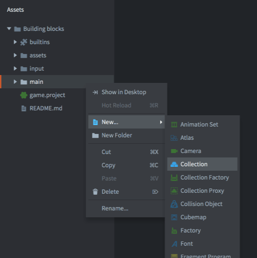

# Przegląd edytora

Edytor pozwala sprawnie przeglądać i modyfikować wszystkie pliki oraz foldery w projekcie gry. Po otwarciu pliku edytor wybiera odpowiedni widok dla jego typu i pokazuje powiązane informacje w osobnych panelach.

## Uruchamianie Edytora

Po uruchomieniu edytora Defold zobaczysz ekran wyboru i tworzenia projektu. Kliknij to, co chcesz zrobić:

MY PROJECTS
: Tutaj znajdziesz ostatnio otwierane projekty, dzięki czemu możesz szybko do nich wrócić. To domyślny widok ekranu startowego.

  Jeśli wcześniej nie otwierałeś żadnych projektów albo usunąłeś je z listy, zobaczysz dwa przyciski. `Open From Disk…` pozwala znaleźć i otworzyć projekt przez systemową przeglądarkę plików, a `Create New Project` przełącza do zakładki `TEMPLATES`.

  

  Jeśli wcześniej otwierałeś już projekty, zobaczysz ich listę, jak na ilustracji poniżej:

  

TEMPLATES
: Zawiera puste lub prawie puste projekty startowe, przygotowane do szybkiego rozpoczęcia nowego projektu Defold dla wybranych platform albo z użyciem określonych rozszerzeń.

TUTORIALS
: Zawiera projekty z samouczkami, które można uruchamiać, analizować i modyfikować, jeśli chcesz uczyć się krok po kroku.

SAMPLES
: Zawiera projekty przygotowane do prezentowania określonych zastosowań.

  

Gdy utworzysz nowy projekt, zostanie on zapisany na lokalnym dysku, a wszystkie kolejne zmiany również będą zapisywane lokalnie.

Więcej o dostępnych opcjach przeczytasz w [instrukcji o konfiguracji projektu](https://www.defold.com/manuals/project-setup/).

## Język edytora

W lewym dolnym rogu ekranu startowego znajduje się wybór języka. Możesz wybrać jedną z aktualnie dostępnych lokalizacji językowych od wersji Defold 1.11.2. Ta sama opcja jest dostępna także w edytorze w `File ▸ Preferences ▸ General ▸ Editor Language`.


## Panele edytora

Edytor Defold jest podzielony na zestaw paneli, czyli widoków pokazujących określone informacje.


### 1. Panel Assets

Pokazuje wszystkie pliki i foldery należące do projektu w strukturze drzewa odpowiadającej układowi na dysku. Możesz klikać i przewijać, aby poruszać się po liście. W tym widoku wykonuje się wszystkie operacje związane z plikami:

   - <kbd>Left Mouse Click</kbd>, aby wybrać plik lub folder. Przytrzymując <kbd>⇧ Shift</kbd>, rozszerzysz zaznaczenie, a przytrzymując <kbd>Ctrl</kbd>/<kbd>⌘ Cmd</kbd>, zaznaczysz lub odznaczysz kliknięty element.
   - <kbd>Double Mouse Click</kbd> na pliku, aby otworzyć go w edytorze właściwym dla tego typu pliku.
   - <kbd>Drag and Drop</kbd>, aby dodać pliki z innych miejsc na dysku do projektu albo przenosić pliki i foldery w obrębie projektu.
   - <kbd>Right Mouse Click</kbd>, aby otworzyć _Context Menu_, z którego możesz tworzyć nowe pliki i foldery, zmieniać nazwy, usuwać elementy, śledzić zależności plików i wykonywać inne operacje.

### 2. Panel edytora

Środkowy widok pokazuje aktualnie otwarty plik w edytorze odpowiednim dla jego typu. Na przykład pliki skryptów otwierają się we wbudowanym Code Editor, a komponenty wizualne w trójwymiarowym Visual Editor. Wszystkie Visual Editors pozwalają zmieniać widok kamery:

- Przesuwanie: <kbd>Alt</kbd>/<kbd>⌥ Option</kbd> + <kbd>Left Mouse Button</kbd> lub <kbd>Right Mouse Button</kbd>
- Przybliżanie i oddalanie: <kbd>Scroll Mouse Wheel</kbd> albo <kbd>Alt</kbd>/<kbd>⌥ Option</kbd> + <kbd>Right Mouse Button</kbd>
- Obracanie w 3D wokół zaznaczenia: <kbd>Ctrl</kbd>/<kbd>^ Control</kbd> + <kbd>Left Mouse Button</kbd>

#### Pasek narzędzi

W prawym górnym rogu widoku sceny znajduje się pasek narzędzi z narzędziami do manipulacji obiektami. Od lewej są to:

*Move* (<kbd>W</kbd>), *Rotate* (<kbd>E</kbd>), *Scale* (<kbd>R</kbd>), *Grid Settings* `▦`, *Align Camera 2D/3D* `2D`, przełącznik *Camera Perspective/Orthographic* oraz *Visibility Filters* `👁`.


### 3. Panel Outline

Ten widok pokazuje zawartość aktualnie edytowanego pliku w strukturze hierarchicznego drzewa. Outline odzwierciedla widok edytora i pozwala wykonywać operacje na elementach:

   - <kbd>Left Mouse Click</kbd>, aby zaznaczyć element. Przytrzymując <kbd>⇧ Shift</kbd>, rozszerzysz zaznaczenie, a przytrzymując <kbd>Ctrl</kbd>/<kbd>⌘ Cmd</kbd>, zaznaczysz lub odznaczysz kliknięty element.
   - <kbd>Drag and Drop</kbd>, aby przenosić elementy. Upuszczenie obiektu gry na inny obiekt gry w kolekcji tworzy relację rodzic-dziecko.
   - <kbd>Right Mouse Click</kbd>, aby otworzyć _Context Menu_, z którego możesz dodawać elementy, usuwać zaznaczone obiekty i wykonywać inne operacje.

Widoczność obiektów gry i komponentów wizualnych można przełączać, klikając małą ikonę oka `👁` po prawej stronie elementu na liście. Funkcja jest dostępna od Defold 1.9.8.


### 4. Panel Properties

Ten widok pokazuje właściwości powiązane z aktualnie zaznaczonym elementem, na przykład Id, URL, Position, Rotation, Scale, właściwości specyficzne dla komponentu oraz własne właściwości skryptów.

Możesz też <kbd>Drag</kbd> ikonę strzałki `↕` i poruszać myszą, aby zmieniać wartość danej właściwości liczbowej. Ta funkcja jest dostępna od wersji 1.10.2.


### 5. Panel Tools

Ten widok zawiera kilka kart:

*Console*
: pokazuje błędy, ostrzeżenia, informacje wypisywane przez silnik oraz komunikaty, które sam wypisujesz, gdy gra jest uruchomiona.

*Build Errors*
: pokazuje błędy z procesu budowania.

*Search Results*
: pokazuje wyniki wyszukiwania w całym projekcie po użyciu <kbd>Ctrl</kbd>/<kbd>⌘ Cmd</kbd> + <kbd>Shift</kbd> + <kbd>F</kbd>, jeśli klikniesz `Keep Results`.

*Curve Editor*
: jest używany podczas edytowania krzywych w [Particle Editor](/manuals/particlefx/).

Panel Tools służy również do pracy ze zintegrowanym debuggerem. Więcej informacji znajdziesz w [instrukcji debugowania](/manuals/debugging/).

### 6. Panel Changed Files

Jeśli projekt używa rozproszonego systemu kontroli wersji Git, ten widok pokazuje wszystkie pliki zmienione, dodane lub usunięte w projekcie. Regularna synchronizacja projektu pozwala utrzymywać lokalną kopię zgodną z tym, co znajduje się w repozytorium Git projektu. Dzięki temu łatwiej pracować zespołowo i uniknąć utraty efektów pracy. Więcej o Git znajdziesz w [instrukcji kontroli wersji](/manuals/version-control/). W tym widoku można wykonywać część operacji na plikach:

   - <kbd>Left Mouse Click</kbd>, aby wybrać plik. Przytrzymując <kbd>⇧ Shift</kbd>, rozszerzysz zaznaczenie, a przytrzymując <kbd>Ctrl</kbd>/<kbd>⌘ Cmd</kbd>, zaznaczysz lub odznaczysz kliknięty element. Jeśli zaznaczony jest jeden zmieniony plik, możesz kliknąć `Diff`, aby zobaczyć różnice. Kliknięcie `Revert` cofa zmiany we wszystkich zaznaczonych plikach.
   - <kbd>Double Left Mouse Click</kbd> na pliku, aby otworzyć jego widok. Edytor otworzy plik w odpowiednim edytorze, tak jak w panelu `Assets`.
   - <kbd>Right Mouse Click</kbd> na pliku, aby otworzyć menu podręczne, z którego możesz wyświetlić `diff`, cofnąć wszystkie zmiany w pliku, znaleźć go w systemie plików i wykonać inne operacje.

### Pasek menu

Na górze widoku edytora, a na Macu w systemowym pasku menu, znajduje się pasek z sześcioma menu: `File`, `Edit`, `View`, `Project`, `Debug` i `Help`. Ich funkcje opisano w odpowiednich instrukcjach.

### Pasek stanu

Na dolnym pasku edytora znajduje się wąski obszar, w którym wyświetlany jest status, na przykład:

- gdy dostępna jest nowa wersja, zobaczysz klikalny przycisk `Update Available`; patrz sekcja o aktualizowaniu edytora poniżej
- podczas budowania lub bundlowania będzie tam widoczny postęp operacji

## Rozmiar i widoczność paneli

Rozmiar paneli można zmieniać w edytorze przez <kbd>Dragging</kbd> granic pomiędzy opisanymi wyżej sześcioma panelami.

Widoczność paneli można przełączać z menu `View` albo skrótami:

- `Toggle Assets Pane` (<kbd>F6</kbd>) przełącza widoczność paneli `Assets` i `Changed Files`
- `Toggle Changed Files` przełącza widoczność samego panelu `Changed Files`
- `Toggle Tools Pane` (<kbd>F7</kbd>) przełącza widoczność panelu `Tools`
- `Toggle Properties Pane` (<kbd>F8</kbd>) przełącza widoczność paneli `Outline` i `Properties`


W menu `View` możesz też przełączać lub zmieniać inne ustawienia widoczności, takie jak siatka, prowadnice czy kamera. Możesz też dopasować widok do zaznaczenia za pomocą `Frame Selection` lub klawisza <kbd>F</kbd>, a także przełączać się między domyślnym widokiem 2D i 3D za pomocą `Realign Camera` lub klawisza <kbd>.</kbd>. Wiele z tych funkcji jest również dostępnych z paska narzędzi albo przez skróty.

## Zakładki

Jeśli masz otwartych kilka plików, u góry widoku edytora pojawi się osobna zakładka dla każdego pliku. Zakładki w obrębie jednego panelu można przestawiać przez <kbd>Drag and Drop</kbd>, aby zamieniać ich kolejność. Możesz też:

- <kbd>Right Mouse Click</kbd> na zakładce, aby otworzyć _Context Menu_
- kliknąć `Close` (<kbd>Ctrl</kbd>/<kbd>⌘ Cmd</kbd> + <kbd>W</kbd>), aby zamknąć jedną zakładkę
- kliknąć `Close Others`, aby zamknąć wszystkie zakładki poza wybraną
- kliknąć `Close All` (<kbd>Ctrl</kbd>/<kbd>⌘ Cmd</kbd> + <kbd>Shift</kbd> + <kbd>W</kbd>), aby zamknąć wszystkie zakładki w aktywnym panelu
- wybrać `➝| Open As`, aby użyć innego niż domyślny edytora albo zewnętrznego narzędzia ustawionego w `File ▸ Preferences ▸ Code ▸ Custom Editor`; więcej informacji znajdziesz w [instrukcji Preferences](/manuals/editor-preferences)


## Edycja obok siebie

Możliwe jest otwarcie dwóch widoków edytora obok siebie.

- <kbd>Right Mouse Click</kbd> na zakładce edytora, który chcesz przenieść, a następnie wybierz `Move to Other Tab Pane`


Z tego samego menu zakładki możesz też użyć `Swap with Other Tab Pane`, aby przenieść wybraną zakładkę między panelami, albo `Join Tab Panes`, aby z powrotem połączyć oba panele w jeden.

## Edytor sceny

Dwukrotne kliknięcie kolekcji, obiektu gry albo pliku komponentu wizualnego otwiera *Scene Editor*. Domyślnie wszystkie sceny wizualne otwierają się w ortograficznym widoku 2D:


Jeśli pracujesz nad projektem 3D, warto zajrzeć do paska narzędzi i dostosować *Grid Settings* `▦`, na przykład przełączyć wyrównanie kamery między 2D i 3D przez `2D` lub klawisz <kbd>.</kbd>, ustawić wyświetlanie siatki na płaszczyźnie `Y` albo innej, która będzie dla Ciebie bardziej intuicyjna, i przełączyć kamerę na perspektywiczną za pomocą przełącznika na pasku narzędzi albo `View` ▸ `Perspective Camera`:


### Manipulowanie obiektami

<kbd>Left Mouse Click</kbd> na obiekcie w głównym oknie zaznacza go. Prostokąt lub prostopadłościan otaczający obiekt w widoku edytora zostanie podświetlony na kolor cyjan, aby wskazać zaznaczony element. Zaznaczony obiekt zostanie też podświetlony w widoku `Outline`, jak na ilustracji powyżej.

Możesz też zaznaczać obiekty w następujący sposób:

  - <kbd>Left Mouse Click</kbd> i <kbd>Drag</kbd>, aby zaznaczyć wszystkie obiekty mieszczące się w obszarze zaznaczenia
  - <kbd>Left Mouse Click</kbd> na obiektach w `Outline`; przytrzymując <kbd>⇧ Shift</kbd>, rozszerzysz zaznaczenie, a przytrzymując <kbd>Ctrl</kbd>/<kbd>⌘ Cmd</kbd>, zaznaczysz lub odznaczysz kliknięty element

#### Narzędzie Move

{.left}

Aby przesuwać obiekty, użyj *Move Tool*. Narzędzie znajduje się na pasku narzędzi w prawym górnym rogu edytora sceny albo możesz włączyć je klawiszem <kbd>W</kbd>.

{.inline}{.inline}

Gizmo zmienia się i pokazuje zestaw manipulatorów, czyli kwadratów i strzałek. Zaznaczony manipulator zmienia kolor na pomarańczowy. Możesz je <kbd>Drag</kbd>, aby przesuwać obiekty:

- środkowy cyjanowy kwadrat przesuwa obiekt tylko w przestrzeni ekranu
- trzy czerwone, zielone i niebieskie strzałki przesuwają obiekt tylko wzdłuż odpowiednio osi X, Y i Z
- trzy czerwone, zielone i niebieskie kwadratowe uchwyty przesuwają obiekt tylko po wybranej płaszczyźnie, na przykład X-Y (niebieska), a po obróceniu kamery w 3D także X-Z (zielona) i Y-Z (czerwona)

#### Narzędzie Rotate

{.left}

Aby obracać obiekty, użyj *Rotate Tool*, wybierając je na pasku narzędzi albo naciskając <kbd>E</kbd>.

{.inline}{.inline}

To narzędzie składa się z czterech okrągłych manipulatorów, które możesz <kbd>Drag</kbd>, aby obracać obiekt. Zaznaczony manipulator zmienia kolor na pomarańczowy:

- zewnętrzny, największy, cyjanowy manipulator obraca obiekt w płaszczyźnie ekranu
- trzy mniejsze czerwone, zielone i niebieskie manipulatory pozwalają obracać osobno wokół osi X, Y i Z; w widoku ortograficznym 2D dwa z nich są prostopadłe do osi X i Y, więc są widoczne tylko jako linie przecinające obiekt

#### Narzędzie Scale

{.left}

Aby skalować obiekty, użyj *Scale Tool*, wybierając je na pasku narzędzi albo naciskając <kbd>R</kbd>.

{.inline}{.inline}

To narzędzie składa się z zestawu kwadratowych i sześciennych manipulatorów, które możesz <kbd>Drag</kbd>, aby skalować obiekty. Zaznaczony manipulator zmienia kolor na pomarańczowy:

- środkowy cyjanowy sześcian skaluje obiekt równomiernie we wszystkich osiach, także w osi Z
- trzy czerwone, niebieskie i zielone manipulatory składające się z sześcianów skalują obiekt osobno wzdłuż osi X, Y i Z
- trzy czerwone, niebieskie i zielone manipulatory składające się z sześcianów skalują obiekt osobno w płaszczyznach X-Y, X-Z i Y-Z

### Filtry widoczności

Kliknij ikonę oka `👁` na pasku narzędzi, aby przełączać widoczność różnych typów komponentów oraz obwiedni i linii pomocniczych. `Component Guides` ma też skrót <kbd>Ctrl</kbd> + <kbd>H</kbd> w Windows/Linux lub <kbd>^ Ctrl</kbd> + <kbd>⌘ Cmd</kbd> + <kbd>H</kbd> na Macu.


## Tworzenie nowych plików projektu

Aby utworzyć nowy plik zasobu, wybierz `File ▸ New…`, a następnie typ pliku z menu albo użyj menu kontekstowego:

<kbd>Right Mouse Click</kbd> w docelowym miejscu w przeglądarce `Assets`, a następnie wybierz `New… ▸ [file type]`:



Wpisz odpowiednią *Name* dla nowego pliku, a w razie potrzeby zmień *Location*. Pełna nazwa pliku wraz z rozszerzeniem jest pokazywana w polu *Preview* w oknie dialogowym:


## Szablony

Możesz zdefiniować własne szablony dla każdego projektu. W tym celu utwórz w katalogu głównym projektu folder `templates` i dodaj do niego pliki `default.*` z odpowiednimi rozszerzeniami, na przykład `/templates/default.gui` albo `/templates/default.script`. Dodatkowo, jeśli w tych plikach użyjesz znacznika `{{NAME}}`, zostanie on zastąpiony nazwą pliku podaną w oknie tworzenia pliku.

Jeśli dla danego typu pliku istnieje szablon, każdy nowo tworzony plik tego typu zostanie zainicjalizowany zawartością odpowiedniego pliku z katalogu `templates`.


## Importowanie plików do projektu

Aby dodać do projektu pliki zasobów, takie jak obrazy, dźwięki czy modele, po prostu przeciągnij je i upuść we właściwe miejsce w przeglądarce *Assets*. Spowoduje to utworzenie _kopii_ plików w wybranej lokalizacji w strukturze projektu. Więcej informacji znajdziesz w [instrukcji importowania zasobów](/manuals/importing-assets/).


## Aktualizowanie edytora

Edytor automatycznie sprawdza aktualizacje, gdy ma połączenie z internetem. Gdy wykryje nową wersję, w lewym dolnym rogu ekranu wyboru projektu albo w prawym dolnym rogu okna edytora pojawi się niebieski klikalny odnośnik `Update Available`.


Kliknij odnośnik `Update Available`, aby pobrać i zainstalować aktualizację. Pojawi się okno potwierdzenia z dodatkowymi informacjami. Kliknij `Download Update`, aby kontynuować.


Postęp pobierania będzie widoczny na dolnym pasku stanu:


Po pobraniu aktualizacji niebieski odnośnik zmieni się na `Restart to Update`. Kliknij go, aby ponownie uruchomić i otworzyć zaktualizowany edytor.


## Preferencje

Ustawienia edytora możesz zmieniać w oknie `Preferences`. Aby je otworzyć, kliknij `File ▸ Preferences…` albo użyj skrótu <kbd>Ctrl</kbd>/<kbd>⌘ Cmd</kbd> + <kbd>,</kbd>.

Więcej szczegółów znajdziesz w [instrukcji Preferencje](/manuals/editor-preferences).


## Logi edytora

Jeśli napotkasz problem z edytorem i chcesz zgłosić błąd przez `Help ▸ Report Issue`, warto dołączyć pliki logów samego edytora. Aby otworzyć ich lokalizację w systemowej przeglądarce plików, kliknij `Help ▸ Show Logs`.

Więcej informacji znajdziesz w [instrukcji uzyskiwania pomocy](/manuals/getting-help/#getting-help).


Pliki logów edytora można znaleźć tutaj:

  * Windows: `C:\Users\ **Your Username** \AppData\Local\Defold`
  * macOS: `/Users/ **Your Username** /Library/Application Support/` albo `~/Library/Application Support/Defold`
  * Linux: `$XDG_STATE_HOME/Defold` albo `~/.local/state/Defold`

Możesz też uzyskać dostęp do logów edytora, gdy uruchomisz go z terminala lub wiersza poleceń. Aby uruchomić edytor, użyj polecenia:

```shell
# Linux:
$ ./path/to/Defold/Defold

# macOS:
$ ./path/to/Defold.app/Contents/MacOS/Defold
```

## Serwer edytora

Gdy edytor otwiera projekt, uruchamia serwer WWW na losowym porcie. Serwer może służyć do komunikacji z edytorem z poziomu innych aplikacji. Od wersji 1.11.0 numer portu jest zapisywany w pliku `.internal/editor.port`.

Dodatkowo od wersji 1.11.0 plik wykonywalny edytora obsługuje opcję wiersza poleceń `--port` lub `-p`, która pozwala wskazać port przy uruchamianiu. Na przykład:

```shell
# Windows
.\path\to\Defold\Defold.exe --port 8181

# Linux:
./path/to/Defold/Defold --port 8181

# macOS:
./path/to/Defold/Defold.app/Contents/MacOS/Defold --port 8181
```

## Stylizacja edytora

Wygląd edytora można zmieniać za pomocą własnej stylizacji. Więcej informacji znajdziesz w [instrukcji stylizacji edytora](/manuals/editor-styling.md).

## FAQ
:[Editor FAQ](../shared/editor-faq.md)
