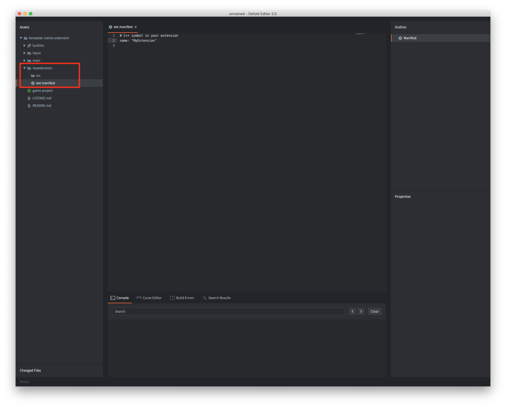
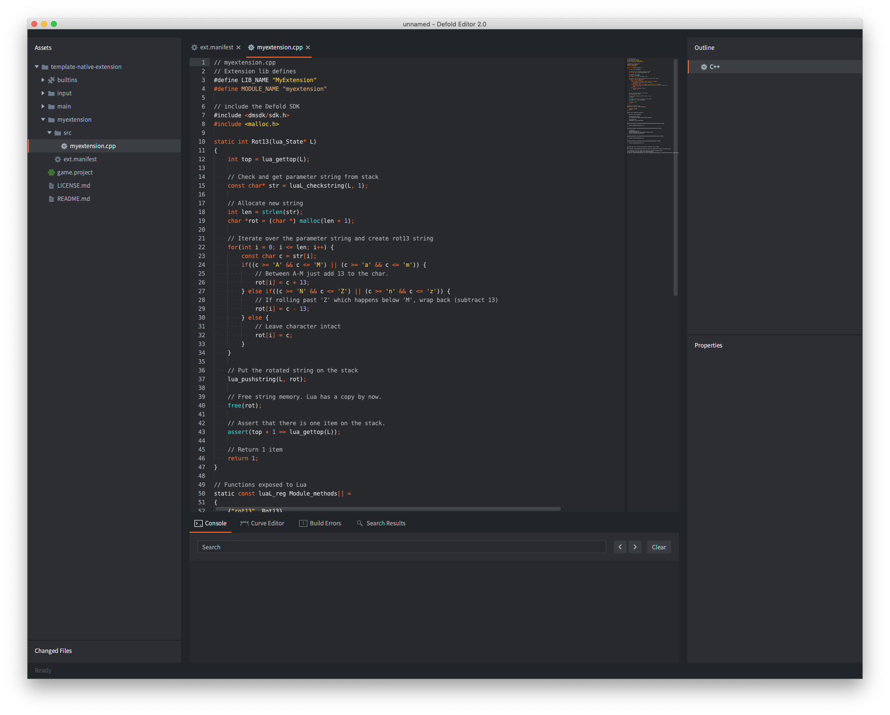

# Rozszerzenia natywne

Jeśli potrzebujesz niestandardowej integracji z zewnętrznym oprogramowaniem lub sprzętem na niskim poziomie, gdzie Lua nie wystarcza, Defold SDK pozwala pisać rozszerzenia do silnika w C, C++, Objective-C, Java lub JavaScript, zależnie od platformy docelowej. Typowe zastosowania natywnych rozszerzeń to:

- Integracja z konkretnym sprzętem, na przykład z kamerą w telefonach komórkowych.
- Integracja z zewnętrznymi niskopoziomowymi API, na przykład z API sieci reklamowych, które nie pozwalają na komunikację przez sieć w sposób, w jaki można by użyć Luasocket.
- Obliczenia o wysokiej wydajności i przetwarzanie danych.

## Serwer buildów

Defold udostępnia możliwość korzystania z natywnych rozszerzeń bez konfiguracji dzięki chmurowemu systemowi budowania. Każde natywne rozszerzenie, które zostanie dodane do projektu gry, bezpośrednio lub przez [projekt biblioteki](/manuals/libraries/), staje się częścią zwykłej zawartości projektu. Nie ma potrzeby budowania specjalnych wersji silnika i rozsyłania ich do członków zespołu. Robi się to automatycznie - każdy członek zespołu, który zbuduje i uruchomi projekt, otrzyma specyficzny dla projektu plik wykonywalny silnika ze wszystkimi natywnymi rozszerzeniami wbudowanymi na stałe.


Defold udostępnia serwer buildów w chmurze bezpłatnie i bez żadnych ograniczeń użycia. Serwer jest hostowany w Europie, a URL, pod który wysyłany jest kod natywny, konfiguruje się w oknie [Editor Preferences](/manuals/editor-preferences/#extensions) albo przez opcję wiersza poleceń `--build-server` narzędzia [bob](/manuals/bob/#usage). Jeśli chcesz uruchomić własny serwer, [postępuj zgodnie z tymi instrukcjami](/manuals/extender-local-setup).

## Układ projektu

Aby utworzyć nowe rozszerzenie, dodaj folder w katalogu głównym projektu. Ten folder będzie zawierał wszystkie ustawienia, kod źródłowy, biblioteki i zasoby związane z rozszerzeniem. Serwer buildów rozpoznaje strukturę folderów i zbiera wszystkie pliki źródłowe oraz biblioteki.

```
 myextension/
 │
 ├── ext.manifest
 │
 ├── src/
 │
 ├── include/
 │
 ├── lib/
 │   └──[platforms]
 │
 ├── manifests/
 │   └──[platforms]
 │
 └── res/
     └──[platforms]

```
*ext.manifest*
: Folder rozszerzenia _musi_ zawierać plik *ext.manifest*. Jest to plik konfiguracyjny z flagami i definicjami używanymi podczas budowania pojedynczego rozszerzenia. Definicję formatu pliku znajdziesz w [instrukcji o manifestach rozszerzenia](https://defold.com/manuals/extensions-ext-manifests/).

*src*
: Ten folder powinien zawierać wszystkie pliki z kodem źródłowym.

*include*
: Ten opcjonalny folder zawiera pliki include.

*lib*
: Ten opcjonalny folder zawiera wszystkie skompilowane biblioteki, od których zależy rozszerzenie. Pliki biblioteki należy umieszczać w podfolderach nazwanych według `platform` albo `architecture-platform`, zależnie od tego, jakie architektury są obsługiwane przez twoje biblioteki.

  :[platforms](../shared/platforms.md)

*manifests*
: Ten opcjonalny folder zawiera dodatkowe pliki używane podczas procesu budowania lub pakowania. Szczegóły znajdziesz poniżej.

*res*
: Ten opcjonalny folder zawiera dodatkowe zasoby, od których zależy rozszerzenie. Pliki zasobów należy umieszczać w podfolderach nazwanych według `platform` albo `architecture-platform`, tak samo jak podfoldery w `lib`. Dozwolony jest też podfolder `common`, zawierający pliki zasobów wspólne dla wszystkich platform.

### Pliki manifestu

Opcjonalny folder *manifests* rozszerzenia zawiera dodatkowe pliki używane podczas procesu budowania i pakowania. Pliki należy umieszczać w podfolderach nazwanych według `platform`:

* `android` - Ten folder przyjmuje plik-szablon manifestu, który zostanie scalony z główną aplikacją ([jak opisano tutaj](/manuals/extensions-manifest-merge-tool)).
  * Folder może też zawierać plik `build.gradle` z zależnościami, które mają być rozwiązywane przez Gradle.
  * Na koniec folder może też zawierać zero lub więcej plików ProGuard (eksperymentalnych).
* `ios` - Ten folder przyjmuje plik-szablon manifestu, który zostanie scalony z główną aplikacją ([jak opisano tutaj](/manuals/extensions-manifest-merge-tool)).
  * Folder może też zawierać plik `Podfile` z zależnościami, które mają być rozwiązywane przez CocoaPods.
* `osx` - Ten folder przyjmuje plik-szablon manifestu, który zostanie scalony z główną aplikacją ([jak opisano tutaj](/manuals/extensions-manifest-merge-tool)).
* `web` - Ten folder przyjmuje plik-szablon manifestu, który zostanie scalony z główną aplikacją ([jak opisano tutaj](/manuals/extensions-manifest-merge-tool)).


## Udostępnianie rozszerzenia

Rozszerzenia są traktowane tak samo jak inne zasoby w projekcie i można je udostępniać w ten sam sposób. Jeśli folder natywnego rozszerzenia zostanie dodany jako folder biblioteki, można go udostępniać i używać jako zależności projektu. Więcej informacji znajdziesz w [instrukcji o bibliotekach](/manuals/libraries/).


## Prosty przykład rozszerzenia

Zbudujmy bardzo proste rozszerzenie. Najpierw tworzymy nowy folder główny *`myextension`* i dodajemy plik *`ext.manifest`* zawierający nazwę rozszerzenia `MyExtension`. Zwróć uwagę, że ta nazwa jest symbolem C++ i musi odpowiadać pierwszemu argumentowi `DM_DECLARE_EXTENSION` (patrz niżej).



```yaml
# C++ symbol in your extension
name: "MyExtension"
```

Rozszerzenie składa się z jednego pliku C++, *`myextension.cpp`*, który tworzymy w folderze `src`.



Plik źródłowy rozszerzenia zawiera następujący kod:

```cpp
// myextension.cpp
// Extension lib defines
#define LIB_NAME "MyExtension"
#define MODULE_NAME "myextension"

// include the Defold SDK
#include <dmsdk/sdk.h>

static int Reverse(lua_State* L)
{
    // The number of expected items to be on the Lua stack
    // once this struct goes out of scope
    DM_LUA_STACK_CHECK(L, 1);

    // Check and get parameter string from stack
    char* str = (char*)luaL_checkstring(L, 1);

    // Reverse the string
    int len = strlen(str);
    for(int i = 0; i < len / 2; i++) {
        const char a = str[i];
        const char b = str[len - i - 1];
        str[i] = b;
        str[len - i - 1] = a;
    }

    // Put the reverse string on the stack
    lua_pushstring(L, str);

    // Return 1 item
    return 1;
}

// Functions exposed to Lua
static const luaL_reg Module_methods[] =
{
    {"reverse", Reverse},
    {0, 0}
};

static void LuaInit(lua_State* L)
{
    int top = lua_gettop(L);

    // Register lua names
    luaL_register(L, MODULE_NAME, Module_methods);

    lua_pop(L, 1);
    assert(top == lua_gettop(L));
}

dmExtension::Result AppInitializeMyExtension(dmExtension::AppParams* params)
{
    return dmExtension::RESULT_OK;
}

dmExtension::Result InitializeMyExtension(dmExtension::Params* params)
{
    // Init Lua
    LuaInit(params->m_L);
    printf("Registered %s Extension\n", MODULE_NAME);
    return dmExtension::RESULT_OK;
}

dmExtension::Result AppFinalizeMyExtension(dmExtension::AppParams* params)
{
    return dmExtension::RESULT_OK;
}

dmExtension::Result FinalizeMyExtension(dmExtension::Params* params)
{
    return dmExtension::RESULT_OK;
}


// Defold SDK uses a macro for setting up extension entry points:
//
// DM_DECLARE_EXTENSION(symbol, name, app_init, app_final, init, update, on_event, final)

// MyExtension is the C++ symbol that holds all relevant extension data.
// It must match the name field in the `ext.manifest`
DM_DECLARE_EXTENSION(MyExtension, LIB_NAME, AppInitializeMyExtension, AppFinalizeMyExtension, InitializeMyExtension, 0, 0, FinalizeMyExtension)
```

Zwróć uwagę na makro `DM_DECLARE_EXTENSION`, które służy do deklarowania różnych punktów wejścia do kodu rozszerzenia. Pierwszy argument `symbol` musi odpowiadać nazwie podanej w *ext.manifest*. W tym prostym przykładzie nie ma potrzeby definiować żadnych punktów wejścia `update` ani `on_event`, więc w tych miejscach do makra przekazano `0`.

Teraz wystarczy zbudować projekt (<kbd>Project ▸ Build</kbd>). Spowoduje to wysłanie rozszerzenia do serwera buildów, który wygeneruje własny silnik z nowym rozszerzeniem wbudowanym na stałe. Jeśli serwer buildów napotka jakiekolwiek błędy, pojawi się okno dialogowe z błędami budowania.

Aby przetestować rozszerzenie, utwórz obiekt gry i dodaj do niego komponent skryptu z krótkim kodem testowym:

```lua
local s = "abcdefghijklmnopqrstuvwxyzABCDEFGHIJKLMNOPQRSTUVWXYZ"
local reverse_s = myextension.reverse(s)
print(reverse_s) --> ZYXWVUTSRQPONMLKJIHGFEDCBAzyxwvutsrqponmlkjihgfedcba
```

I to wszystko! Utworzyliśmy w pełni działające natywne rozszerzenie.


## Cykl życia rozszerzenia

Jak widzieliśmy wyżej, makro `DM_DECLARE_EXTENSION` służy do deklarowania różnych punktów wejścia do kodu rozszerzenia:

`DM_DECLARE_EXTENSION(symbol, name, app_init, app_final, init, update, on_event, final)`

Punkty wejścia pozwalają uruchamiać kod w różnych momentach cyklu życia rozszerzenia:

* Uruchamianie silnika
  * Uruchamiają się systemy silnika
  * Rozszerzenie `app_init`
  * Rozszerzenie `init` - wszystkie API Defold są już zainicjalizowane. To zalecany moment w cyklu życia rozszerzenia na utworzenie wiązań Lua do kodu rozszerzenia.
  * Inicjalizacja skryptów - wywoływana jest funkcja `init()` plików skryptów.
* Pętla silnika
  * Aktualizacja silnika
    * Rozszerzenie `update`
    * Aktualizacja skryptów - wywoływana jest funkcja `update()` plików skryptów.
  * Zdarzenia silnika (minimalizacja/maksymalizacja okna itp.)
    * Rozszerzenie `on_event`
* Zamykanie silnika (lub ponowne uruchomienie)
  * Finalizacja skryptów - wywoływana jest funkcja `final()` plików skryptów.
  * Rozszerzenie `final`
  * Rozszerzenie `app_final`

## Zdefiniowane identyfikatory platform

Następujące identyfikatory są definiowane przez serwer buildów dla każdej odpowiedniej platformy:

* `DM_PLATFORM_WINDOWS`
* `DM_PLATFORM_OSX`
* `DM_PLATFORM_IOS`
* `DM_PLATFORM_ANDROID`
* `DM_PLATFORM_LINUX`
* `DM_PLATFORM_HTML5`

## Dzienniki serwera buildów

Dzienniki serwera buildów są dostępne, gdy projekt korzysta z natywnych rozszerzeń. Dziennik serwera buildów (`log.txt`) jest pobierany razem z własnym silnikiem podczas budowania projektu, przechowywany w pliku `.internal/%platform%/build.zip` i rozpakowywany także do folderu budowania projektu.

## Przykłady rozszerzeń

* [Przykład podstawowego rozszerzenia](https://github.com/defold/template-native-extension) (rozszerzenie z tej instrukcji)
* [Przykład rozszerzenia Android](https://github.com/defold/extension-android)
* [Przykład rozszerzenia HTML5](https://github.com/defold/extension-html5)
* [Rozszerzenie odtwarzacza wideo dla macOS, iOS i Android](https://github.com/defold/extension-videoplayer)
* [Rozszerzenie kamery dla macOS i iOS](https://github.com/defold/extension-camera)
* [Rozszerzenie In-app Purchase dla iOS i Android](https://github.com/defold/extension-iap)
* [Rozszerzenie Firebase Analytics dla iOS i Android](https://github.com/defold/extension-firebase-analytics)

[Portal zasobów Defold](https://www.defold.com/assets/) także zawiera kilka natywnych rozszerzeń.
