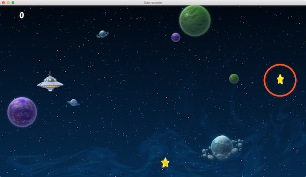
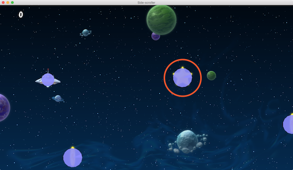

# Fabryka

Komponenty fabryki w Defoldzie służą do dynamicznego generowania obiektów gry z puli obiektów podczas działania gry.

Gdy dodajesz komponent fabryki do obiektu gry, w właściwości *Prototype* określasz, jaki plik obiektu gry fabryka powinna używać jako prototyp (nazywany również "prefabem", "szablonem" czy "blueprintem" w innych silnikach) dla wszystkich nowych obiektów gry, które tworzy.


Aby wywołać utworzenie obiektu gry, należy wywołać funkcję `factory.create()`:

```lua
-- factory.script
local p = go.get_position()
p.y = vmath.lerp(math.random(), min_y, max_y)
local component = "#star_factory"
factory.create(component, p)
```



`factory.create()` przyjmuje 5 parameterów:

`url`
: Identyfikator komponentu fabryki, który ma utworzyć nowy obiekt gry.

`[position]`
: (opcjonalne) pozycja w przestrzeni świata (world position) nowego obiektu gry. Powinien to być `vector3`. Jeśli nie określisz pozycji, obiekt gry zostanie utworzony w pozycji komponentu fabryki.

`[rotation]`
: (opcjonalne) obrót w przestrzeni świata (world rotation) nowego obiektu gry. Powinien to być kwaternion - `quat`.

`[properties]`
: (opcjonalne) tabela Lua z wartościami właściwości skryptu do zainicjowania obiektu gry. Zobacz szczegóły w [instrukcji o właściwościach skryptu](/manuals/script-properties).

`[scale]`
: (opcjonalne) skala utworzonego obiektu gry. Skalę można wyrazić jako liczbę - `number` (większą niż 0), która określa jednolitą skalę we wszystkich osiach. Możesz też podać `vector3`, gdzie każdy komponent określa skalę w odpowiedniej osi.

Na przykład:

```lua
-- factory.script
local p = go.get_position()
p.y = vmath.lerp(math.random(), min_y, max_y)
local component = "#star_factory"
-- Utwórz obiekt z obrotem 0, ale podwójną skalą.
-- Ustaw wartość punktową "score" na 10.
factory.create(component, p, nil, { score = 10 }, 2.0) -- <1>
```

1. Ustala wartość punktową obiektu gry gwiazdy.

```lua
-- star.script
go.property("score", 1) -- <1>

local speed = -240

function update(self, dt)
    local p = go.get_position()
    p.x = p.x + speed * dt
    if p.x < -32 then
        go.delete()
    end
    go.set_position(p)
end

function on_message(self, message_id, message, sender)
    if message_id == hash("collision_response") then
        msg.post("main#gui", "add_score", {amount = self.score}) -- <2>
        go.delete()
    end
end
```

1. Właściwość skryptu "score" jest zdefiniowana z wartością domyślną.
2. Odwołuje się do właściwości skryptu "score" jako przechowywanej wartości w "self".



::: sidenote
Defold obecnie nie obsługuje nieliniowego skalowania kształtów kolizji. Jeśli podasz wartość nieliniowego skalowania, na przykład `vmath.vector3(1.0, 2.0, 1.0)` to sprite zostanie odpowiednio przeskalowany, ale kształty kolizji nie.
:::


## Adresowanie obiektów utworzonych z fabryki

Mechanizm adresowania Defolda umożliwia dostęp do każdego obiektu i komponentu w trakcie działania gry. [Instrukcja adresowania](/manuals/addressing/) zawiera szczegółowe informacje na temat działania tego systemu. Ten mechanizm można również wykorzystać do dostępu do utworzonych obiektów gry i ich komponentów. Najczęściej wystarcza użycie identyfikatora utworzonego obiektu, na przykład w celu wysłania wiadomości:

```lua
local function create_hunter(target_id)
    local id = factory.create("#hunterfactory")
    msg.post(id, "hunt", { target = target_id })
    return id
end
```

::: sidenote
Przesłanie wiadomości bezpośrednio do obiektu gry, a nie do określonego komponentu, w rzeczywistości wysyła wiadomość do wszystkich komponentów tego obiektu. Zazwyczaj nie stanowi to problemu, ale warto pamiętać, jeśli obiekt ma wiele komponentów.
:::

Ale co, jeśli musisz uzyskać dostęp do konkretnego komponentu na utworzonym obiekcie gry, na przykład, aby wyłączyć obiekt kolizji lub zmienić obraz sprite'a? Rozwiązaniem jest skonstruowanie adresu URL na podstawie identyfikatora obiektu gry i identyfikatora komponentu:

```lua
local function create_guard(unarmed)
    local id = factory.create("#guardfactory")
    if unarmed then
        local weapon_sprite_url = msg.url(nil, id, "weapon")
        msg.post(weapon_sprite_url, "disable")

        local body_sprite_url = msg.url(nil, id, "body")
        sprite.play_flipbook(body_sprite_url, hash("red_guard"))
    end
end
```

## Śledzenie utworzonych obiektów i rodziców

Wywołując `factory.create()` otrzymujesz identyfikator nowego obiektu gry, co pozwala na przechowywanie go do użycia później. Jednym z powszechnych zastosowań jest generowanie obiektów i dodawanie ich identyfikatorów do tabeli, dzięki czemu można je usunąć w późniejszym momencie, na przykład podczas resetowania układu poziomu:

```lua
-- spawner.script
self.spawned_coins = {}

...

-- Spawn a coin and store it in the "coins" table.
local id = factory.create("#coinfactory", coin_position)
table.insert(self.spawned_coins, id)
```

I później:

```lua
-- spawner.script
-- Usuń utworzone monety
for _, coin_id in ipairs(self.spawned_coins) do
    go.delete(coin_id)
end

-- lub alternatywnie:
go.delete(self.spawned_coins)
```

Warto też wiedzieć jakie obiekty się utworzyło w świecie gry. Przykładem może być obiekt, którego instancję chcemy mieć tylko jedną w jednym czasie. Utworzony obiekt musi wtedy poinformować swojego twórcę (spawner) kiedy jest usunięty lub nieaktywny, dzięki czemu spawner będzie mógł utworzyć następną instancję:

```lua
-- spawner.script
-- Utwórz drona i ustaw jego rodzica na url tego skryptu
self.spawned_drone = factory.create("#dronefactory", drone_position, nil, { parent = msg.url() })

...

function on_message(self, message_id, message, sender)
    if message_id == hash("drone_dead") then
        self.spawed_drone = nil
    end
end
```

A to logika utworzonego obiektu:
```lua
-- drone.script
go.property("parent", msg.url())

...

function final(self)
    -- I'm dead.
    msg.post(self.parent, "drone_dead")
end
```

## Dynamiczne ładowanie zasobów fabryki

Zaznaczając opcję *Load Dynamically* (Ładuj dynamicznie) we właściwościach fabryki, silnik Defold odkłada w czasie ładowanie zasobów związanych z fabryką.


Gdy opcja jest niezaznaczona, silnik ładuje zasoby prototypu, gdy komponent fabryki jest ładowany, więc są one od razu gotowe do generowania.

Z opcją zaznaczoną, masz dwie możliwości użycia fabryki:

Synchroniczne wczytywanie
: Wywołaj [`factory.create()`](/ref/factory/#factory.create), gdy chcesz generować obiekty. Spowoduje to synchroniczne ładowanie zasobów, co może powodować przycięcia w zależności od wielkości zasobu, a następnie tworzenie nowych instancji.

  ```lua
  function init(self)
      -- Gdy komponent fabryki jest ładowany, nie są jeszcze dostępne zasoby fabryki.
      -- Wywołanie create bez wcześniejszego wywołania load spowoduje synchroniczne
      -- ładowanie zasobów.
      self.go_id = factory.create("#factory")
  end

  function final(self)
      -- Usuwa obiekty gry. Zasoby zostaną zwolnione.
      -- W tym przypadku zasoby zostaną usunięte, ponieważ komponent fabryki
      -- nie trzyma referencji.
      go.delete(self.go_id)

      -- Wywołanie unload nie spowoduje żadnych działań,
      -- ponieważ komponent fabryki nie trzyma referencji.
      factory.unload("#factory")
  end
  ```

Asynchroniczne wczytywanie
: Wywołaj [`factory.load()`](/ref/factory/#factory.load), aby jawnie załadować zasoby asynchronicznie. Po zakończeniu ładowania zasobów, są one gotowe do generowania - wywołane wtedy zostanie wywołanie zwrotne (callback).

  ```lua
  function load_complete(self, url, result)
      -- Ładowanie jest zakończone, zasoby są gotowe do generowania.
      self.go_id = factory.create(url)
  end

  function init(self)
      -- Gdy komponent fabryki jest ładowany, nie są jeszcze dostępne zasoby fabryki.
      -- Wywołanie load spowoduje ładowanie zasobów.
      factory.load("#factory", load_complete)
  end

  function final(self)
      -- Usuwa obiekt gry. Zasoby nie zostaną zwolnione,
      -- ponieważ komponent fabryki nadal trzyma referencję.
      go.delete(self.go_id)

      -- Wywołanie unload spowoduje zwolnienie zasobów trzymanych przez komponent fabryki,
      -- co spowoduje zniszczenie zasobów.
      factory.unload("#factory")
  end
  ```

## Dynamiczny prototyp

Możliwa jest zmiana prototypu *Prototype*, który ma utworzyć fabryka, zaznaczając opcję *Dynamic Prototype* we właściwościach fabryki.


Gdy opcja *Dynamic Prototype* jest zaznaczona, komponent fabryki może zmieniać prototyp, używając funkcji `factory.set_prototype()`. Przykład:

```lua
factory.unload("#factory") -- zwolnij poprzednie zasoby
factory.set_prototype("#factory", "/main/levels/enemyA.goc")
local enemy_id = factory.create("#factory")
```

::: important
Gdy opcja *Dynamic Prototype* jest ustawiona, ilość komponentów w kolekcji nie może być optymalizowana, a zawierająca kolekcja będzie korzystać z domyślnych liczby komponentów z pliku *game.project*.
:::


## Limit instancji

Ustawienie *max_instances* w ustawieniach związanych z kolekcją (*Collection related settings*) ogranicza łączną liczbę instancji obiektów gry, które mogą istnieć w świecie (główna kolekcja "main.collection" wczytana podczas uruchamiania lub dowolny świat wczytany za pośrednictwem pełnomocnika kolekcji). Wszystkie obiekty gry, które istnieją w świecie, są wliczane do tego limitu, niezależnie od tego, czy są umieszczone ręcznie w edytorze, czy generowane dynamicznie za pomocą skryptu.


Jeśli ustawisz *max_instances* na 1024 i masz 24 ręcznie umieszczone obiekty gry w swojej głównej kolekcji, możesz utworzyć dodatkowe 1000 obiektów gry. Gdy tylko usuniesz obiekt gry, będziesz mógł utworzyć nową instancję.

## Pula obiektów gry

Może się wydawać, że dobrym pomysłem jest zapisywanie utworzonych obiektów gry w puli i ponowne ich użycie. Jednak silnik Defold wykonuje już pulowanie obiektów pod spodem, więc dodatkowe obciążenie spowolni działanie. Szybsze i bardziej przejrzyste jest usuwanie obiektów gry i tworzenie nowych.
