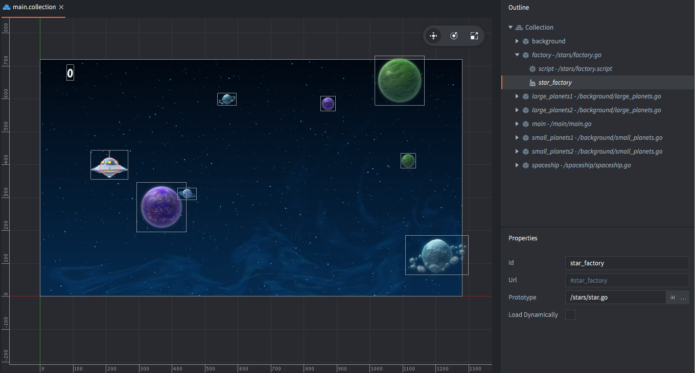
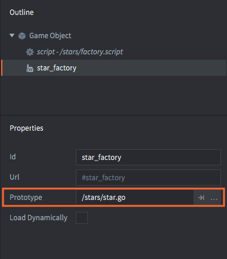
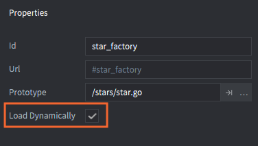

# Komponenty Factory

Komponenty Factory służą do dynamicznego tworzenia obiektów gry z puli obiektów w działającej grze.

Gdy dodajesz komponent Factory do obiektu gry, we właściwości *Prototype* określasz, którego pliku obiektu gry fabryka ma używać jako prototypu. W innych silnikach taki prototyp bywa nazywany również prefabem albo blueprintem. Na tej podstawie tworzone są wszystkie nowe obiekty gry.





Aby utworzyć obiekt gry, wywołaj `factory.create()`:

```lua
-- plik factory.script
local p = go.get_position()
p.y = vmath.lerp(math.random(), min_y, max_y)
local component = "#star_factory"
factory.create(component, p)
```


`factory.create()` przyjmuje 5 parametrów:

`url`
: Id komponentu Factory, który ma utworzyć nowy obiekt gry.

`[position]`
: (opcjonalnie) Pozycja nowego obiektu gry w przestrzeni świata. Powinien to być `vector3`. Jeśli nie podasz pozycji, obiekt zostanie utworzony w pozycji komponentu Factory.

`[rotation]`
: (opcjonalnie) Obrót nowego obiektu gry w przestrzeni świata. Powinien to być `quat`.

`[properties]`
: (opcjonalnie) Tabela Lua z wartościami właściwości skryptu, którymi ma zostać zainicjowany obiekt gry. Informacje o właściwościach skryptu znajdziesz w [instrukcji Script property](/manuals/script-properties).

`[scale]`
: (opcjonalnie) Skala utworzonego obiektu gry. Skalę można podać jako `number` większy od 0, co oznacza jednakowe skalowanie we wszystkich osiach. Możesz też przekazać `vector3`, gdzie każdy składnik określa skalowanie w odpowiadającej osi.

Na przykład:

```lua
-- plik factory.script
local p = go.get_position()
p.y = vmath.lerp(math.random(), min_y, max_y)
local component = "#star_factory"
-- Utwórz bez obrotu, ale z podwójną skalą.
-- Ustaw wartość właściwości score gwiazdy na 10.
factory.create(component, p, nil, { score = 10 }, 2.0) -- <1>
```
1. Ustawia właściwość `"score"` obiektu gry gwiazdy.

```lua
-- plik star.script
go.property("score", 1) -- <1>

local speed = -240

function update(self, dt)
    local p = go.get_position()
    p.x = p.x + speed * dt
    if p.x < -32 then
        go.delete()
    end
    go.set_position(p)
end

function on_message(self, message_id, message, sender)
    if message_id == hash("collision_response") then
        msg.post("main#gui", "add_score", {amount = self.score}) -- <2>
        go.delete()
    end
end
```
1. Właściwość skryptu `"score"` jest zdefiniowana z wartością domyślną.
2. Odwołuje się do właściwości skryptu `"score"` jako do wartości przechowywanej w `self`.


::: sidenote
Defold nie obsługuje obecnie niejednorodnego skalowania kształtów kolizji. Jeśli podasz wartość niejednorodnego skalowania, na przykład `vmath.vector3(1.0, 2.0, 1.0)`, sprite zostanie przeskalowany poprawnie, ale kształty kolizji już nie.
:::

## Adresowanie obiektów utworzonych przez Factory

Mechanizm adresowania Defold pozwala uzyskać dostęp do każdego obiektu i komponentu w działającej grze. [Instrukcja Addressing](/manuals/addressing/) szczegółowo wyjaśnia, jak ten system działa. Tego samego mechanizmu można używać również dla utworzonych obiektów gry i ich komponentów. Często wystarczy użycie id utworzonego obiektu, na przykład przy wysyłaniu wiadomości:

```lua
local function create_hunter(target_id)
    local id = factory.create("#hunterfactory")
    msg.post(id, "hunt", { target = target_id })
    return id
end
```

::: sidenote
Wysłanie wiadomości do samego obiektu gry zamiast do konkretnego komponentu w praktyce rozsyła ją do wszystkich komponentów tego obiektu. Zwykle nie stanowi to problemu, ale warto o tym pamiętać, jeśli obiekt ma dużo komponentów.
:::

Co jednak zrobić, gdy chcesz uzyskać dostęp do konkretnego komponentu utworzonego obiektu gry, na przykład aby wyłączyć obiekt kolizji albo zmienić obraz sprite'a? Rozwiązaniem jest zbudowanie adresu URL z id obiektu gry i id komponentu.

```lua
local function create_guard(unarmed)
    local id = factory.create("#guardfactory")
    if unarmed then
        local weapon_sprite_url = msg.url(nil, id, "weapon")
        msg.post(weapon_sprite_url, "disable")

        local body_sprite_url = msg.url(nil, id, "body")
        sprite.play_flipbook(body_sprite_url, hash("red_guard"))
    end
end
```

## Śledzenie utworzonych obiektów i obiektów nadrzędnych

Gdy wywołasz `factory.create()`, otrzymasz z powrotem id nowego obiektu gry, dzięki czemu możesz zachować je do późniejszego użycia. Często wykorzystuje się to do tworzenia obiektów i dodawania ich id do tabeli, aby później usunąć je wszystkie, na przykład przy resetowaniu układu poziomu:

```lua
-- plik spawner.script
self.spawned_coins = {}

...

-- Utwórz monetę i zapisz ją w tabeli "coins".
local id = factory.create("#coinfactory", coin_position)
table.insert(self.spawned_coins, id)
```

A później:

```lua
-- plik spawner.script
-- Usuń wszystkie utworzone monety.
for _, coin_id in ipairs(self.spawned_coins) do
    go.delete(coin_id)
end

-- albo alternatywnie
go.delete(self.spawned_coins)
```

Często chcesz też, aby utworzony obiekt wiedział, który obiekt gry go utworzył. Jednym z przykładów jest autonomiczny obiekt, który może istnieć tylko w jednej instancji naraz. Taki obiekt musi poinformować spawner, że został usunięty lub zdezaktywowany, aby można było utworzyć kolejny:

```lua
-- plik spawner.script
-- Utwórz drona i ustaw jego rodzica na URL tego komponentu skryptu
self.spawned_drone = factory.create("#dronefactory", drone_position, nil, { parent = msg.url() })

...

function on_message(self, message_id, message, sender)
    if message_id == hash("drone_dead") then
        self.spawned_drone = nil
    end
end
```

A logika utworzonego obiektu wygląda tak:

```lua
-- plik drone.script
go.property("parent", msg.url())

...

function final(self)
    -- Koniec działania obiektu.
    msg.post(self.parent, "drone_dead")
end
```

## Dynamiczne ładowanie zasobów Factory

Po zaznaczeniu pola *Load Dynamically* we właściwościach Factory silnik odracza ładowanie zasobów powiązanych z fabryką.



Gdy pole nie jest zaznaczone, silnik ładuje zasoby prototypu podczas ładowania komponentu Factory, więc są one od razu gotowe do użycia.

Gdy pole jest zaznaczone, masz dwa sposoby użycia:

Ładowanie synchroniczne
: Wywołaj [`factory.create()`](/ref/factory/#factory.create), gdy chcesz utworzyć obiekty. Spowoduje to synchroniczne załadowanie zasobów, co może wywołać przycięcie, a następnie utworzenie nowych instancji.

  ```lua
  function init(self)
      -- Gdy zostanie wczytana kolekcja nadrzędna fabryki,
      -- zasoby fabryki nie są jeszcze załadowane. Wywołanie create
      -- bez wcześniejszego load utworzy zasoby synchronicznie.
      self.go_id = factory.create("#factory")
  end

  function final(self)
      -- Usuń obiekty gry. Zmniejszy to licznik referencji zasobów.
      -- W tym przypadku zasoby zostaną usunięte, ponieważ komponent
      -- fabryki nie trzyma już do nich referencji.
      go.delete(self.go_id)

      -- Wywołanie unload nic nie zrobi, bo fabryka nie ma referencji.
      factory.unload("#factory")
  end
  ```

Ładowanie asynchroniczne
: Wywołaj [`factory.load()`](/ref/factory/#factory.load), aby jawnie załadować zasoby asynchronicznie. Gdy zasoby będą gotowe do tworzenia obiektów, otrzymasz callback.

  ```lua
  function load_complete(self, url, result)
      -- Ładowanie zakończone, zasoby są gotowe do tworzenia instancji.
      self.go_id = factory.create(url)
  end

  function init(self)
      -- Gdy zostanie wczytana kolekcja nadrzędna fabryki,
      -- zasoby fabryki nie są jeszcze załadowane. Wywołanie load
      -- spowoduje ich wczytanie.
      factory.load("#factory", load_complete)
  end

  function final(self)
      -- Usuń obiekt gry. Zmniejszy to licznik referencji zasobów.
      -- W tym przypadku zasoby nie zostaną usunięte, ponieważ komponent
      -- fabryki nadal trzyma do nich referencję.
      go.delete(self.go_id)

      -- Wywołanie unload zmniejszy licznik referencji zasobów
      -- trzymanych przez komponent fabryki, co doprowadzi do ich usunięcia.
      factory.unload("#factory")
  end
  ```

## Dynamiczny prototyp

Można zmienić prototyp tworzony przez Factory przez zaznaczenie pola *Dynamic Prototype* we właściwościach komponentu.


Gdy opcja *Dynamic Prototype* jest włączona, komponent Factory może zmieniać prototyp przy użyciu funkcji `factory.set_prototype()`. Przykład:

```lua
factory.unload("#factory") -- zwolnij poprzednie zasoby
factory.set_prototype("#factory", "/main/levels/enemy.go")
local id = factory.create("#factory")
```

::: important
Gdy opcja *Dynamic Prototype* jest włączona, liczba komponentów w kolekcji nie może zostać zoptymalizowana, a kolekcja właściciela będzie używać domyślnych limitów komponentów z pliku *game.project*.
:::

## Limity instancji

Ustawienie projektu *max_instances* w sekcji *Collection related settings* ogranicza łączną liczbę instancji obiektów gry, które mogą istnieć w jednym świecie. Dotyczy to zarówno `main.collection` wczytywanej przy starcie, jak i dowolnego świata załadowanego przez Collection proxy. Do tego limitu wliczają się wszystkie obiekty gry istniejące w świecie, niezależnie od tego, czy zostały ręcznie umieszczone w edytorze, czy utworzone w czasie działania przez skrypt.


Jeśli ustawisz *max_instances* na `1024` i masz 24 obiekty gry ręcznie umieszczone w głównej kolekcji, możesz dodatkowo utworzyć 1000 obiektów gry. Gdy tylko usuniesz jakiś obiekt gry, możesz utworzyć kolejną instancję.

## Pula obiektów gry

Może się wydawać, że dobrym pomysłem jest przechowywanie utworzonych obiektów gry w puli i ponowne ich wykorzystywanie. Silnik i tak stosuje jednak pooling obiektów wewnętrznie, więc dodatkowa warstwa narzutu tylko spowolni działanie. Szybciej i czyściej jest usuwać obiekty gry i tworzyć nowe.
