# Defold dla użytkowników Flasha

Ta instrukcja przedstawia Defold jako alternatywę dla deweloperów znających Flasha. Opisuje kluczowe koncepty Flasha i odpowiadające im narzędzia w Defoldzie.

## Wprowadzenie

Jednymi z kluczowych zalet Flasha były jego przystępność i niski próg wejściowy. Nowi użytkownicy mogli nauczyć się szybko programu i tworzyć proste gry przy niewielkim nakładzie czasowym. Defold ma podobne zalety, dzięki udostępnieniu deweloperom narzędzi dedykowanych do tworzenia gier, jak i również oferując bardziej zaawansowanym użytkownikom spełnianie trudniejszych wymagań (przykładowo poprzez udostępnienie deweloperom możliwości edycji skryptu renderowania).

Gry Flashowe były tworzone w języku ActionScript (ostatnia wersja - 3.0), a gry w Defold są tworzone z wykorzystaniem języka Lua. Nie skupiamy się tutaj jednak na szczegółowym porównaniu ActionScript z Lua. [Instrukcja o Lua w Defoldzie](/manuals/lua) jest dobrym wprowadzeniem do programowania w Lua w Defoldzie i sama odwołuje się do niezwykle przydatnej, oficjalnej [instrukcji programowania w Lua](https://www.lua.org/pil/) (pierwsza edycja), która jest dostępna za darmo w internecie.

Artykuł Jesse'ego Warden'a pokazuje [porównanie Lua i ActionScript](http://jessewarden.com/2011/01/lua-for-actionscript-developers.html), które może być dobrym punktem startowym. Pamiętaj jendak, że istnieją głębsze różnice między tym jak Defold i Flash są skonstruowane niż tylko to, co jest widoczne pod względem języka. ActionScript i Flash są zorientowane obiektowo (object oriented) w sensie klas  dziedziczeniem. Defold nie ma klas, ani dziedziczenia. Zawiera on jednak koncept *obiektu gry* (*game object*) który posiada reprezentację audiowizualną, logikę i dane. Operacje na obiektach gry są wykonywane przez *funkcje* udostępnione w API Defolda. Ponadto, Defold zaleca reaktywne podejście z użyciem *wiadomości* (*messages*) do komunikacji pomiędzy obiektami. Wiadomości te są konstruktem wyższej abstrakcji niż wywołanie funkcji i nie są przeznaczone do używania ich jakby były takimi wywołaniami. Te różnice są ważne i wymagają nieco przyzwyczajenia, ale nie będą też dogłębniej pokryte w tej tylko instrukcji.

Zamiast tego, ten poradnik pozwala przejrzeć kluczowe aspekty tworzenia gier we Flashu o pokazać najbliższe im odpowiedniki w Defoldzie. Omówione są podobieństwa i różnice, a także często spotykane pułapki, aby umożliwić szybkie przejście z Flasha do Defolda.

## Klipy filmowe i obiekty gry

Klipy filmowe (Movie clips) są kluczowym komponentem tworzenia gier we Flashu. Są to symbole z unikalnymi osiami czasowymi (timeline). Najbliższym odpowiednikiem w Defoldzie jest obiekt gry (game object).


Jednak w przeciwieństwie do klipów, Defoldowe obiekty gry nie mają osi czasu. Składają się zamiast tego z wielu różnych komponentów, takich jak między innymi sprite'y, dźwięki i skryptu (więcej szczegółów na temat komponentów znajdziesz w [dokumentacji o podstwowych elementach](/manuals/building-blocks) i powiązanych). Obiekty gry na obrazku poniżej zawierają komponenty: sprite i skrypt. Skrypt jest wykorzystywany do kontrolowania zachowania i wyglądu obiektu w trakcie jego istnienia:

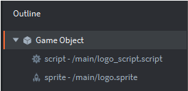

Gdy klipy filmowe mogą zawierać inne klipy, obiekty gry nie mogą *zawierać* innych obiektów. Aczkolwiek, obiekty gry mogą być *dziećmi* innych obiektów, tworząc hierarchię, dzięki której można je przemieszczać, skalować czy obracać jednocześnie.

## Flash — ręczne tworzenie klipów

We Flashu, instancje klipów filmowych mogą być dodawane do sceny ręcznie przez przeciąganie ich z biblioteki na oś czasu. Pokazane to jest na obrazku poniżej, gdzie każde logo Flasha jest instancją klipu "logo":

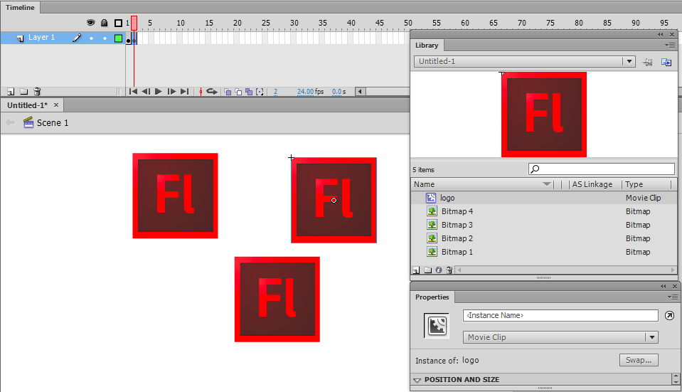

## Defold — ręczne tworzenie obiektów gry

Jak wspomniano, Defold nie posiada konceptu osi czasu. Zamiast tego obiekty są zorganizowane w kolekcji (collections). Kolekcje są kontenerami (czy prefabami), które mają w sobie obiekty gry i/lub inne kolekcje. Ogólnie, gra może składać się z jednej kolekcji (pierwsza, podstawowa kolekcja nazywana jest bootstrap). Częściej jednak, gry wykorzystują ich więcej, czy to poprzez ręczne dodanie ich do głównej, bootstrapowej kolekcji “main”, czy to przez dynamiczne załadowanie kolekcji przez [pełnomocnika kolekcji](/manuals/collection-proxy). Idea dynamicznego załadowywania kolekcji (np. jako poziomów, okien menu czy scen) nie ma odpowiednika we Flashu.

W poniższym przykładzie, główna kolekcja "main" zawiera trzy instancje (pokazane po prawej, w panelu *Outline*) z obiektami gry "logo" (które można zobaczyć po lewej, w panelu *Assets*):


## Flash — odwoływanie się do ręcznie stworzonych klipów

Odwoływanie się do ręcznie stworzonych klipów we Flashu wymaga używania ręcznie zdefiniowanych nazw instancji:


## Defold - ID obiektu gry

W Defoldzie, każdy obiekt gry i komponent mają swój unikalny ID i można się do nich odwoływać poprzez adresy. W większości przypadków prosta nazwa lub skrót są wystarczające, na przykład:

- `"."` adres obecnego obiektu gry
- `"#"` adres obecnego komponentu (skryptu).
- `"logo"` adres obiektu gry o ID: "logo".
- `"#script"` adres komponentu o ID: "script" w obecnym obiekcie gry.
- `"logo#script"` adres komponentu o ID: "script" w obiekcie gry o ID: "logo".

Adres ręcznie umieszczonych obiektów gry jest zdeterminowany przez nadane *Id* (zobacz prawy, dolny róg obrazka). ID musi być unikalne dla danego pliku kolekcji. Edytor automatycznie ustawia id za Ciebie, ale możesz je zmienić dla każdej instancji obiektu, któ©y tworzysz.

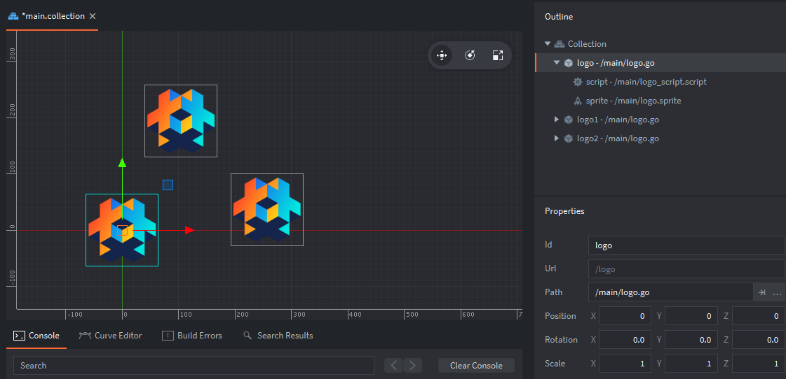

::: sidenote
Możesz znaleźć id obiektu używając następującego kodu `print(go.get_id())` w skrypcie, będącym komponentem danego obiektu. Spowoduje to wyświetlenie id obecnego obiektu w konsoli.
:::

Model adresowania i przesyłania wiadomości to kluczowe koncepty w tworzeniu gier w Defoldzie. Ta [instrukcja adresowania](/manuals/addressing) i ta [instrukcja przesyłania wiadomości](/manuals/message-passing) wyjaśniają je w szczegółach.

## Flash — dynamiczne tworzenie klipów

Aby dynamicznie utworzyć klipy filmowe we Flashu, najpierw należy stworzyć połaczenie w ActionScripcie (Linkage):

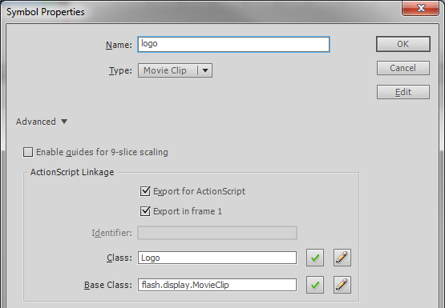

Tworzy to klasę (Logo w tym przypadu), która później pozwala na tworzenie nowych instancji tej klasy. Dodawanie instancji klasy Logo do sceny wygląda następująco:

```as
var logo:Logo = new Logo();
addChild(logo);
```

## Defold — tworzenie obiektów gry wykorzystując fabryki

W Defoldzie, dynamiczne tworzenie obiektów gry jest możliwe poprzez wykorzystanie *fabryk* (*factories*). Fabryki są komponentami służącymi do tworzenia instancji specyficznych obiektów gry. W tym przykładzie, fabryka została utworzona z obiektem gry "logo" jako prototypem:


Ważne jest, że fabryki, jak każdy inny komponent, muszą być dodane do obiektu gry zanim zostaną użyte. W tym przykładzie, stworzyliśmy obiekt gry nazwany "factories", aby zawrzeć w nim komponenty - fabryki:


Do wywołania tworzenia instancji obiektu gry logo używamy funkcji:

```lua
local logo_id = factory.create("factories#logo_factory")
```

Adres URL jest wymaganym parametrem funkcji `factory.create()`. Ponadto, można dodać opcjonalne parametry do zdefiniowania pozycji, rotacji, właściwości i skali. Więcej szczegółów na temat fabryk znajdziesz w [instrukcji do fabryk](/manuals/factory). Warto zaznaczyć, że wywołanie `factory.create()` zwraca id utworzonego obiektu. To id może być zapisane (np. w tabeli) i utrzymywane, aby później móc się do niego odnieść.

## Flash - Scena

We Flashu, wykorzystuje się Oś czasu (na górze obrazka poniżej) i Scenę (poniżej osi):


Jak wspomniano wyżej, scena jest najważniejszym pojemnikiem gry Flashowej i jest tworzona przy każdym eksporcie projektu. Scena ma domyślnie jedno dziecko, główną oś *MainTimeline*. Każdy klip genrowany w projekcie ma swoją własną oś i może być jednocześnie kontenerem na inne elementy, w tym inne klipy.

## Defold — Kolekcja

Defoldowym odpowiednikiem Flashowej sceny jest kolekcja (collection). Wraz ze startem silnika Defold tworzy on nowy świat gry na podstawie pliku głównej kolekcji bootstrapowej. Domyślnie, plik ten nazywany jest "main.collection", ale możesz zmienić tę nazwę jak i kolekcję, która jest najpierw wczytywane poprzez odpowiednie pole w pliku *game.project*:

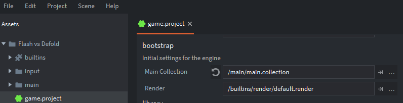

Kolekcje są również pojemnikami/kontenerami używanymi do organizowania obiektów gry i innych kolekcji. Zawartość kolekcji może również zostać utworzona dynamicznie przez skrypt wykorzystujący komponent fabryki kolekcji ([collection factory](/manuals/collection-factory/#spawning-a-collection)), co działa identycznie jak dla fabryk pojedynczych obiektów. Jest to przydatne przy tworzeniu instancji grup elementów jak np. przeciwników w grze czy zbioru monet do zebrania na poziomie. Na poniższym obrazku ręcznie umieszczono dwie instancje  kolekcji "logos" w głównej kolekcji "main".

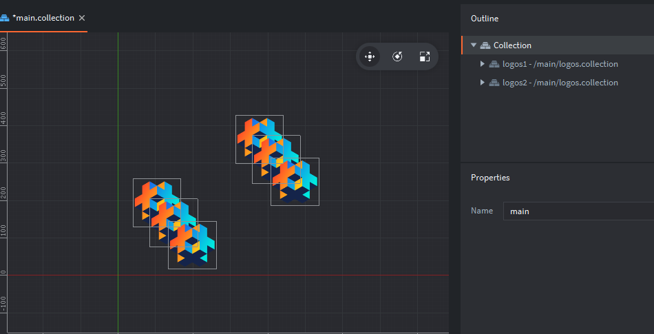

W niektórych przypadkach, możesz chcieć załadować kompletnie nowy świat gry. Pełnomocnik kolekcji ([collection proxy](/manuals/collection-proxy/)) pozwala na stworzenie takiego nowego świata gry bazując na zawartości pliku kolekcji. Może to być przydatne do wczytywania nowych poiomów w grze, mini gier lub cutscenek.

## Flash — oś czasu

Oś czasu we Flashu jest używana głównie do tworzenia animacji poprzez zmiany klatek lub kształtu i ruchu. Ogólne ustawienie klatek na sekundę, czyli FPS (frames per second) definiuje długość z jaką wyświetlana jest klatka. Zaawansowani użytkownicy mogą modyfikować ogólną liczbę klatek na sekundę bądź indywidualnie klipy filmowe.

Zmiany kształtu pozwalają na interpolację grafiki wektorowej między dwoma stanami. Jest to najczęściej wykorzystywane do prostych zmian kształtu lub transformowania jednego kształtu w inny, jak np. poniższa demonstracja zmiany kwadradtu w trójkąt:

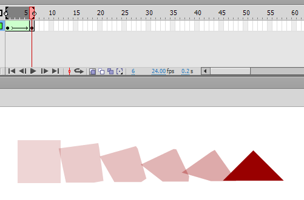

Zmiany ruchu pozwalają na animowanie różnych właściwości obiektu, nie tylko pozycji, ale także rotacji czy rozmiaru. W poniższym przykładzie, wszystkie wymienione właściowści są modyfikowane:


## Defold — animowanie właściwości

Defold operuje natomiast na grafice rastrowej, stąd nie ma bezpośredniego odpowiednika animowania ruchu jak we Flashu. Jednak, zamiast tego oferuje potężne [animowanie właściwości](/ref/go/#go.animate). Jest to wywoływane przez skrypt poprzez funkcję `go.animate()`. Funkcja ta animuje wybraną właściwość (property) (takie jak kolor, skala, rotacja czy pozycja) od wartości początkowej do docelowej, używając jednej z wielu funkcji złagodnienia (easing functions), włączając w to przygotowane przez użytkownika funkcje. Podczas gdy Flash wymagał od użytkowników pracy przy tworzeniu bardziej zaawansowanych funkcji łagodzenia, Defold zawiera już zdefiniowane [wiele takich funkcji](/manuals/animation/#easing) wbudowanych w silnik.

Podczas gdy Flash wykorzystuje ramki kluczowe (keyframes) grafiki na osi casu animacji, jednym z głównych sposobów na animację grafiki w Defoldzie jest animacja poklatkowa (flipbook animation) zaimportowanych sekwencji. Animacje są zorganiozwane w komponencie galerii obrazów zwanym Atlas. Poniżej przedstawiony jest atlas dla postaci z animacją nazwaną "run". Sekwencja ta składa się z ramek:

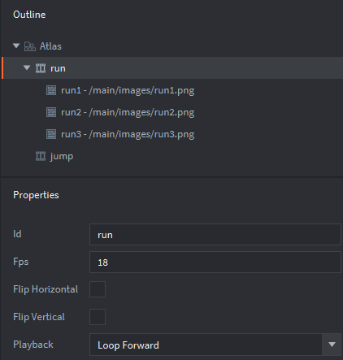

## Flash — indeks głębii

We Flashu lista wyświetlania (display list) determinuje co jest pokazywane w jakiej kolejności. Kolejność obiektów w kontenerze (jak np. Scena/Stage) jest ustalana na podstawie indeksu głębii. Obiektu dodane do kontenera używając funkcji `addChild()` będą automatycznie zajmowały pozycję na szczycie listy, czyli indeksy rozpoczynające się od 0 i zwiększające z każdym dodanym elementem. Na obrazku poniżej widzimy wygenerowane 3 instancje klipów filmowych "logo":

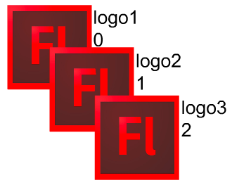

Pozycja w liście wyświetlania jest wskazywana przez liczbę obok każdej z instancji. Pomijając ustawianie klipów w osi x/y, poniższy kod pokazuje jak można generować klipy "logo":

```as
var logo1:Logo = new Logo();
var logo2:Logo = new Logo();
var logo3:Logo = new Logo();

addChild(logo1);
addChild(logo2);
addChild(logo3);
```

To, czy obiekt jest wyświetlany nad czy pod innym jest zdeterminowane przez ich relatywną pozycję (indeks) w liście wyświetlania. Dobrze obrazuje to zamiana indeksów dwóch obiektów, np:

```as
swapChildren(logo2,logo3);
```

Wynik wygląda następująco (ze zaktualizowanymi indeksami):

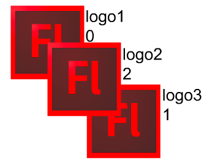

## Defold — pozycja w osi Z

Pozycja obiektów gry w Defoldzie jest reprezentowana przez wektor składający się z trzech składowych: x, y, z. Pozycja w osi Z determinuje pozycję głębii, tak jak indeks we Flashu. W domyślnym, wbudowanym [skrypcie renderowania](/manuals/render), pozycje na osi Z są ograniczone między -1 a 1.

::: sidenote
Wtedy obiekty gry z pozycją poza zakresem -1 do 1 nie będę wyświetlane. Jest to częsta pułapka, w którą mogą wpaść nowi użytkownicy Defolda, więc warto pamiętać o tym, jeśli dany obiekt nie jest widoczny, kiedy spodziewasz się, że powinien być.
:::

W przeciwieństwie do Flasha, gdzie tylko edytor ustawia indeks (i umożliwia ich modyfikację poprzez operacje *Bring Forward* czy *Send Backward*), Defold umożliwia bezpośrednie ustawienie pozycji na osi Z w edytorze oraz w kodzie. Na poniższym obrazku, widać obiekt "logo3" wyświetlony na samej górze i posiadający pozycję na osi Z: 0.2. Pozostałe obiekty mają wartości z odpowiednio 0.0 i 0.1.

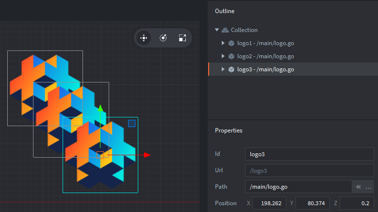

Zapamiętaj, że pozycja na osi Z obiektu gry zagnieżdżonego w kolekcji/ach jes determinowana przez jego własną pozycję Z razem z pozycją rodziców. Przykładowo, wyobraź sobie, że powyższe obiekty zostały umieszczone w kolekcji "logos", która z kolei została umieszczona w kolekcji głównej "main" (zobacz obrazek poniżej). Jeśli kolekcja "logos" ma pozycję Z 0.9, pozycje na osi Z obiektów gry będą dodane do pozycji ich kolekcji i będą wynosić kolejno 0.9, 1.0 oraz 1.1. Dlatego w domyślnym renderowaniu obiekt "logo3"  nie będzie wyświetlany, ponieważ jego absolutna pozycja na osi Z jest większa niż 1.


Pozycja na osi Z obiektów gry może być zmieniona używając skryptu. Przykładowo jak w poniższym kodzie, który jest umieszczony w skrypcie obiektu gry:

```lua
local pos = go.get_position()
pos.z  = 0.5
go.set_position(pos)
```

## Flash — detekcja kolizji za pomocą hitTestObject oraz hitTestPoint

Podstawowa detekcja kolizji we Flashu jest uzyskiwana dzięki funkcji `hitTestObject()`. W poniższym przykładzie, mamy dwa klipy filmowe: "bullet" i "bullseye". Są one przedstawione poniżej. Niebieski prostokąt jest widoczny, kiedy wybrany jest symbol w edytorze Flash i to właśnie ten prostokąt jest brany pod uwagę podczas wywołania funkcji `hitTestObject()`.


Wykrywanie kolizji używając funkcji `hitTestObject()` można wykonać w ten sposób:

```as
bullet.hitTestObject(bullseye);
```

Wykorzystując jednak te prostokąty (boundary boxes) nie otrzymalibyśmy odpowiedniego wyniku w takim przypadku:

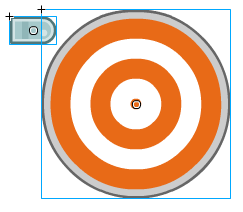

Alternatywą dla `hitTestObject()` jest funkcja `hitTestPoint()`. Zawiera ona parametr `shapeFlag`, który pozwala na sprawdzanie kolizji w stosunku do faktycznych pikseli obrazka, a nie do prostokątu obejmującego cały obrazek. Wykrywanie kolizji używając funckji `hitTestPoint()` można wykonać w ten sposób:

```as
bullseye.hitTestPoint(bullet.x, bullet.y, true);
```

Powyższa linijka sprawdzi pozycje x i y obiektu pocisku (, który jest w lewym górnym rogu) w stosunku do aktualnego kształtu obiektu. Ponieważ funkcja `hitTestPoint()` sprawdza punkt, wybór odpowiedniego punktu/ów jest główną sprawa do wzięcia pod uwagę.

## Defold — obiekty kolizji

Defold posiada wbudowany silnik fizyki, który może wykrywać kolizje i pozwala skryptom również na nie reagować. Detekcja kolizji w Defoldzie rozpoczyna się z przypisaniem komponentu zwanego obiektem kolizji (collision object) do obiektu gry. Na poniższym obrazku, mamy obiekt kolizji "bullet_collision_object" przypisany do obiektu gry "bullet". Kształt kolizji jest wskazywany przez czerwony prostokąt (widoczny tylko w edytorze, nie w grze):


Defold zawiera zmodyfikowaną wersję silnika fizyki Box2D, który umożliwia również realistyczną, automatyczną symulację kolizji i fizyki odbić. Ten poradnik zakłada wykorzystywanie obiektów kolizji kinematycznych, ponieważ najbliższe są one wykrywaniu kolizji we Flashu. Więcej szczegółów na temat komponentów kolizji dynamicznych znajdziesz w [instrukcji silnika fizyki](/manuals/physics).

Obiekt kolizji (collision object) zawiera następujące właściwości:

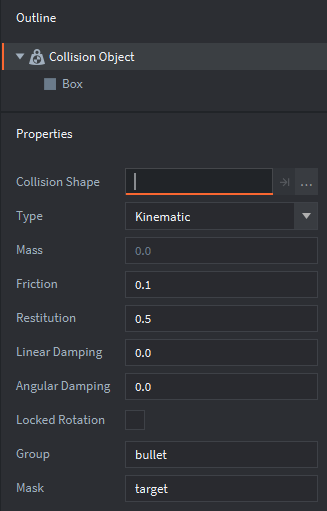

Kształt prostokąta został użyty, ponieważ najbardziej przypominał kształt pocisku. Inny kształt - sfera, została użyta do do obiektu celu ("bullseye"). Ustawienie typu kolizji na kinematyczną (Kinematic) oznacza, że rozwiązywanie efektu kolizji jest wykonywane przez skrypt, a nie wbudowany silnik symulacji fizyki (tak jak powyżej, więcej szczegółów w [instrukcji silnika fizyki](/manuals/physics)). Właściwości grupa (Group) i maska (Mask) determinują odpowiednio do jakiej grupy należy dany obiekt oraz z jakimi innymi grupami będzie on kolidował. Powyższe ustawienie oznacza, że obiekt pocisku będący w grupie "bullet" może kolidować z obiektami z grupy "target". Jednak, gdyby maska posiadała również inną grupę, jak poniżej:

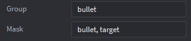

pociski mogłyby kolidować z obiektami z grup "target" oraz "bullet", czyli również z innymi pociskami. Dla obiektu celu "bullseye", odpowiednie właściwości ustawiamy jak poniżej:

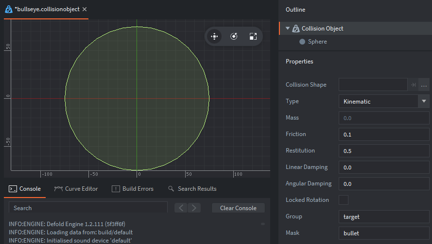

Zwróć uwagę, że teraz właściwość *Group* jest ustawiona jako "target", a właściwość *Mask* jest ustawiona jako "bullet".

We Flashu, detekcja kolizji jest sprawdzana tylko, kiedy jawnie wywołamy ją ze skryptu. W Defoldzie natomiast detekcja kolizji jest sprawdzana ciągle, w tle, jeśli tylko obiekty kolizji są włączone. W momencie, kiedy nastąpi jakakolwiek kolizja, odpowiednie wiadomości są wysyłane do każdego z komponentów obiektów, które brały udział w kolizji (przy czym najważniejsze tutaj są komponenty skrypty). Wiadomości te, czyli [collision_response i contact_point_response](/manuals/physics-messages) zawierają wszystkie informacje wymagane do rozwiązania kolizji.

Wykrywanie kolizji przez silnik Defold jest więc dużo bardziej zaawansowane niż we Flashu z możliwością wykrywania kolizji między dosyć skomplikowanymi kształtami przy niewielkim nakładzie pracy przy ich ustawianiu. Detekcja kolizji jest automatyczna, co oznacza sprawdzanie wielu obiektów pomiędzy wieloma grupami, więc bezpośrednie sprawdzanie kolizji nie jest wymagane. Największym brakiem jest więc tutaj brak odpowiednika flagi shapeFlag. Jednak, dla większości przypadków kombinacje podstawowych kształtów takich jak prostokąt i sfera są wystarczające. Dla najbardziej zaawansowanych pod tym względem przypadków dowolne kształty [są możliwe](//forum.defold.com/t/does-defold-support-only-three-shapes-for-collision-solved/1985).

## Flash — zarządzanie zdarzeniami

Obiekty zdarzeń (event objects) i przypisani do nich reagujący (listeners) są wykorzystywane do wykrywania różnych zdarzeń (np. kliknięć myszką, naciśnięć klawiszy) i wykonywania określonych akcji w odpowiedzi na nie. Jest wiele różnych zdarzeń, z którymi można pracować.

## Defold — funkcje call-back i przesyłanie wiadomości

Odpowiednikiem zarządzania zdarzeniami w Defoldzie składa się z kilku aspektów. Po pierwsze, każdy komponent skrypt posiada odpowiednie, specjalne funkcji callback-i odpowiadające na odpowiednie wydarzenia. Są to:

init
:   Wywoływana przez skrypt w momencie utworzenia i inicjalizacji komponentu. Odpowiednik funkcji konstruującej (constructor function) we Flashu.

final
:   Wywoływana przez skrypt w momencie zniszczenia i usunięcia komponentu.

update
:   Wywoływana w każdej ramce (frame). Odpowiednik funckji `enterFrame` we Flashu.

fixed_update
:   Wywoływana co stałą wartość czasu (zależną od FPS).

on_message
:   Wywoływana w momencie otrzymania przez skrypt wiadomości.

on_input
:   Wywoływana w momencie wykonania przez użytkownika akcji wejścia (np. na myszce lub na klawiaturze) wysyłanej do obiektu z włączonym odbieraniem takich akcji ([input focus](/ref/go/#acquire_input_focus)), gdzie skryp może na daną akcję zareagować.

on_reload
:   Wywoływana w momencie przeładowania skryptu (hot reload).

Funckje callbacki powyżej są opcjonalne i mogą zostać usunięte ze skryptu, jeśli nie są wywoływane. Jeśli chodzi o ustawienie akcji wejść, proszę sprawdzić to w [instrukcji do obsługi wejść (input)](/manuals/input). Warto wiedzieć, że powszechna pułapka może pojawić się przy korzystaniu z pełnomocników kolekcji - sprawdź [tę sekcję](/manuals/input/#input-dispatch-and-on_input) instrukcji do obsługi wejść.

Jak to omówiono przy kolizjach, są one obsługiwane przez wysłanie wiadomości do biorących udział w kolizji komponentów. Skrypty otrzymują te wiadomości i są one obsługwane w funkcji on_message.

## Flash — symbole przycisków

Flash wykorzystuje dedykowane symbole dla przycisków (button symbols). Przyciski używają specyficznych metod obsługi zdarzeń (np. `click` albo `buttonDown`) do wykonywania danych operacji w reakcji na akcję użytkownika. Graficzny kształt przycisku w sekcji "Hit" symbolu przycisku określa obszar wykrywania wciśnięcia przycisku.


## Defold — sceny i skryptu graficznego interfejsu (GUI)

Defold nie posiada natywnego komponentu przycisku, ani kształt nie może być łatwo określony dla obiektów gry w sposób w jaki przyciski są obsługiwane we Flashu. Zamiast tego, Defold używa komponenty graficznych interfejsów użytkownika ([GUI](/manuals/gui)), gdzie przykładowo pozycja elementów komponentów GUI nie jest zmieniona w zależności od zmian widoku kamery (jeśli ten jest zmieniany). API dla GUI w Defoldzie posiada również możliwość detekcji akcji wejść użytkownika, takich jak kliknięcia na obszarze wykrywania akcji elementów GUI.

## Debugowanie

We Flashu, funkcja `trace()` pomaga przy debugowaniu. Defold posiada odpowiadającą funkcję `print()` wykorzystywaną w ten sam sposób:

```lua
print("Hello world!"")
```

Można wyświetlić więcej zmiennych używając jednego wywołania funckji `print()`:

```lua
print(score, health, ammo)
```

Istnieje też funkcja `pprint()` (pretty print), która wyświetla również zawartość całych tabeli, również zagnieżdżonych, jak na przykład w poniższym skrypcie:

```lua
factions = {"red", "green", "blue"}
world = {name = "Terra", teams = factions}
pprint(world)
```

Tabela (`factions`) jest zagnieżdżona w tabeli (`world`). Używając funkcji `print(world)` zobaczymy tylko unikalne id tabeli, a nie jej zawartość:

```
DEBUG:SCRIPT: table: 0x7ff95de63ce0
```

Używając funkcji `pprint()` jak powyżej, otrzymamy ciekawszy wynik:

```
DEBUG:SCRIPT:
{
  name = Terra,
  teams = {
    1 = red,
    2 = green,
    3 = blue,
  }
}
```

Jeśli Twoja gra wykorzystuje detekcję kolizji, możesz również włączyć debugowanie fizyki poprzez wysłanie poniższej wiadomości do systemu:

```lua
msg.post("@system:", "toggle_physics_debug")
```

Debugowanie fizyki może być również włączone/wyłączone w ustawieniach projektu w pliku *game.project*. Przed włączeniem debugowania fizyki:

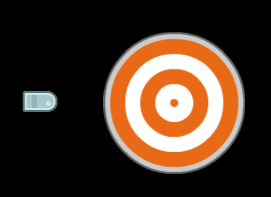

Włączenie debugowania fizyki wyświetla dodatkowo kształty obiektów kolizji dodanych do obiektów gry:


A kiedy dojdzie do kolizji, dane obiekty są podświetlone i wyświetlony jest wektor kolizji:

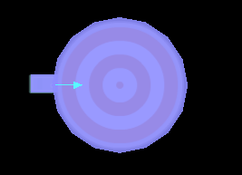

Dodatkowo, jest jeszcze zaawansowany profiler, a więcej informacji o nim znajdziesz w [dokumentacji profilera](/ref/profiler/), np. monitorowanie wykorzystania CPU czy pamięci. Więcej technik debugowania znajdziesz w sekcji [debugowanie](/manuals/debugging).

## Gdzie dalej?

- [Przykłady Defold](/examples)
- [Tutoriale](/tutorials)
- [Instrukcje](/manuals)
- [API](/ref/go)
- [FAQ](/faq/faq)

Jeśli masz pytania lub utknąłeś [forum Defold](//forum.defold.com) jest najlepszym miejscem do znalezienia pomocy.
