# Defold dla użytkowników Flasha

Ta instrukcja przedstawia Defold jako alternatywę dla twórców gier we Flashu. Omawia kluczowe pojęcia używane w tworzeniu gier we Flashu i pokazuje odpowiadające im narzędzia oraz metody w Defoldzie.

## Wprowadzenie

Jedną z głównych zalet Flasha była jego dostępność i niski próg wejścia. Nowi użytkownicy mogli szybko opanować program i w krótkim czasie tworzyć proste gry. Defold oferuje podobną korzyść, bo dostarcza zestaw narzędzi przeznaczonych do projektowania gier, a jednocześnie daje zaawansowanym twórcom możliwość budowania bardziej złożonych rozwiązań, na przykład przez edycję domyślnego skryptu renderowania.

Gry we Flashu są programowane w ActionScript (wersja 3.0 była najnowszą), a w Defoldzie skrypty pisze się w Lua. Ta instrukcja nie porównuje szczegółowo Lua i ActionScript 3.0. [Instrukcja Defold o Lua](/manuals/lua) dobrze wprowadza w programowanie w Lua w Defoldzie i odsyła do niezwykle przydatnej, darmowej [Programming in Lua](https://www.lua.org/pil/) (pierwsze wydanie), dostępnej online.

Artykuł Jesse'ego Warden'a zawiera [podstawowe porównanie ActionScript i Lua](http://jessewarden.com/2011/01/lua-for-actionscript-developers.html), które może być dobrym punktem wyjścia. Warto jednak pamiętać, że Defold i Flash różnią się głębiej niż tylko na poziomie języka. ActionScript i Flash są obiektowe w klasycznym sensie, z klasami i dziedziczeniem. Defold nie ma klas ani dziedziczenia. Zamiast tego wprowadza pojęcie obiektu gry (ang. *game object*), który może zawierać reprezentację audiowizualną, zachowanie i dane. Operacje na obiektach gry wykonuje się za pomocą *funkcji* dostępnych w API Defold. Defold zachęca też do używania *wiadomości* do komunikacji między obiektami. Wiadomości są konstruktem wyższego poziomu niż wywołania metod i nie służą do używania ich w taki sposób. Te różnice są istotne i wymagają chwili, by się do nich przyzwyczaić, ale nie będą tu omawiane szczegółowo.

Zamiast tego ta instrukcja pokazuje najważniejsze pojęcia znane z tworzenia gier we Flashu i wskazuje ich najbliższe odpowiedniki w Defoldzie. Omawia podobieństwa i różnice oraz typowe pułapki, aby ułatwić przejście z Flasha do Defolda.

## Klipy filmowe i obiekty gry

Klipy filmowe są kluczowym elementem tworzenia gier we Flashu. Są to symbole, z których każdy ma własną oś czasu. Najbliższym odpowiednikiem w Defoldzie jest obiekt gry.


W przeciwieństwie do klipów filmowych we Flashu obiekty gry w Defoldzie nie mają osi czasu. Zamiast tego składają się z wielu komponentów. Do komponentów należą między innymi sprites, dźwięki i skrypty (więcej informacji o dostępnych komponentach znajdziesz w [dokumentacji o building blocks](/manuals/building-blocks) i powiązanych materiałach). Obiekt gry na zrzucie poniżej składa się ze sprite'a i skryptu. Komponent skryptu służy do sterowania zachowaniem i wyglądem obiektów gry w trakcie ich cyklu życia:

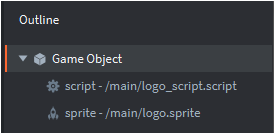

Klipy filmowe mogą zawierać inne klipy filmowe, natomiast obiekty gry nie mogą *zawierać* innych obiektów gry. Mogą jednak być *podpięte* jako dzieci innych obiektów gry, tworząc hierarchie, które można wspólnie przesuwać, skalować lub obracać.

## Flash — ręczne tworzenie klipów filmowych

We Flashu instancje klipów filmowych można dodawać do sceny ręcznie, przeciągając je z biblioteki na oś czasu. Pokazuje to zrzut poniżej, gdzie każde logo Flasha jest instancją klipu filmowego "logo":


## Defold — ręczne tworzenie obiektów gry

Jak wspomniano wcześniej, Defold nie ma pojęcia osi czasu. Zamiast tego obiekty gry są organizowane w kolekcjach. Kolekcje są kontenerami, czyli prefabami, które przechowują obiekty gry i inne kolekcje. W najprostszym przypadku gra może składać się tylko z jednej kolekcji. Częściej Defold korzysta z wielu kolekcji, dodanych ręcznie do bootstrapowej kolekcji "main" albo wczytywanych dynamicznie przez [collection proxy](/manuals/collection-proxy). Pojęcie wczytywania "poziomów" lub "ekranów" nie ma bezpośredniego odpowiednika we Flashu.

W przykładzie poniżej kolekcja "main" zawiera trzy instancje klipu filmowego "logo" (na liście po prawej, w oknie *Outline*), widoczne jako obiekty gry "logo" po lewej, w oknie *Assets*:

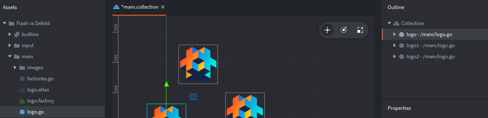

## Flash — odwoływanie się do ręcznie utworzonych klipów filmowych

Odwoływanie się do ręcznie utworzonych klipów filmowych we Flashu wymaga użycia ręcznie zdefiniowanej nazwy instancji:

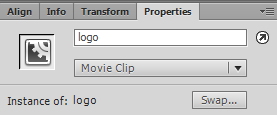

## Defold — identyfikator obiektu gry

W Defoldzie wszystkie obiekty gry i komponenty są adresowane przez adres. W większości przypadków wystarcza prosta nazwa albo skrót. Na przykład:

- `"."` adresuje bieżący obiekt gry.
- `"#"` adresuje bieżący komponent, czyli skrypt.
- `"logo"` adresuje obiekt gry o id `"logo"`.
- `"#script"` adresuje komponent o id `"script"` w bieżącym obiekcie gry.
- `"logo#script"` adresuje komponent o id `"script"` w obiekcie gry o id `"logo"`.

Adres ręcznie umieszczonych obiektów gry jest określany przez właściwość *Id* przypisaną do instancji (zobacz prawy dolny róg zrzutu). Id musi być unikalne w obrębie bieżącego pliku kolekcji. Edytor ustawia id automatycznie, ale można je zmienić dla każdej tworzonej instancji obiektu gry.


::: sidenote
Id obiektu gry można odczytać, uruchamiając w jego komponencie skryptu taki kod: `print(go.get_id())`. Wypisze on id bieżącego obiektu gry w konsoli.
:::

Model adresowania i przesyłanie wiadomości to kluczowe pojęcia w tworzeniu gier w Defoldzie. [Instrukcja adresowania](/manuals/addressing) i [instrukcja przesyłania wiadomości](/manuals/message-passing) omawiają je szczegółowo.

## Flash — dynamiczne tworzenie klipów filmowych

Aby dynamicznie tworzyć klipy filmowe we Flashu, najpierw trzeba skonfigurować ActionScript Linkage:

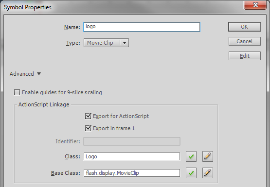

Tworzy to klasę (w tym przypadku Logo), która umożliwia tworzenie nowych instancji tej klasy. Dodanie instancji klasy Logo do Stage może wyglądać tak:

```as
var logo:Logo = new Logo();
addChild(logo);
```

## Defold — tworzenie obiektów gry za pomocą fabryk

W Defoldzie dynamiczne tworzenie obiektów gry odbywa się za pomocą *fabryk*. Fabryki to komponenty służące do tworzenia kopii konkretnego obiektu gry. W tym przykładzie fabrykę utworzono na podstawie obiektu gry "logo" użytego jako prototyp:

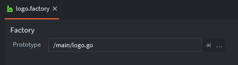

Warto pamiętać, że fabryki, podobnie jak wszystkie komponenty, trzeba dodać do obiektu gry, zanim będzie można ich użyć. W tym przykładzie utworzono obiekt gry "factories", aby przechowywał komponent fabryki:

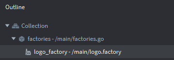

Funkcja tworząca instancję obiektu gry logo wygląda tak:

```lua
local logo_id = factory.create("factories#logo_factory")
```

Adres jest wymaganym parametrem `factory.create()`. Dodatkowo można podać parametry opcjonalne ustawiające pozycję, rotację, właściwości i skalę. Więcej informacji o komponencie fabryki znajdziesz w [instrukcji fabryki](/manuals/factory). Warto też zauważyć, że `factory.create()` zwraca id utworzonego obiektu gry. Id można później zapisać w tabeli, czyli odpowiedniku tablicy w Lua, i odwoływać się do niego później.

## Flash — Stage

We Flashu znamy Timeline, widoczną w górnej części zrzutu poniżej, oraz Stage, widoczną pod Timeline:

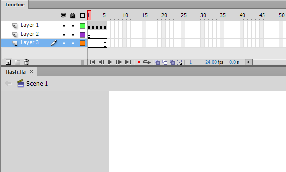

Jak wspomniano wcześniej w części o klipach filmowych, Stage jest zasadniczo najwyższym kontenerem gry we Flashu i powstaje przy każdym eksporcie projektu. Stage ma domyślnie jedno dziecko, *`MainTimeline`*. Każdy klip filmowy wygenerowany w projekcie ma własną oś czasu i może służyć jako kontener dla innych symboli, w tym klipów filmowych.

## Defold — kolekcje

Odpowiednikiem Stage we Flashu w Defoldzie jest kolekcja. Gdy silnik się uruchamia, tworzy nowy świat gry na podstawie zawartości pliku kolekcji. Domyślnie ten plik nazywa się main.collection, ale można zmienić kolekcję wczytywaną przy starcie, edytując plik ustawień *game.project* w katalogu głównym każdego projektu Defold:

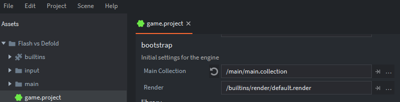

Kolekcje są kontenerami używanymi w edytorze do organizowania obiektów gry i innych kolekcji. Zawartość kolekcji można też tworzyć w czasie działania gry za pomocą [collection factory](/manuals/collection-factory/#spawning-a-collection), która działa tak samo jak zwykła fabryka obiektów gry. Jest to przydatne na przykład do tworzenia grup przeciwników albo wzorców zbieralnych monet. Na zrzucie poniżej ręcznie umieszczono dwie instancje kolekcji "logos" w kolekcji "main".

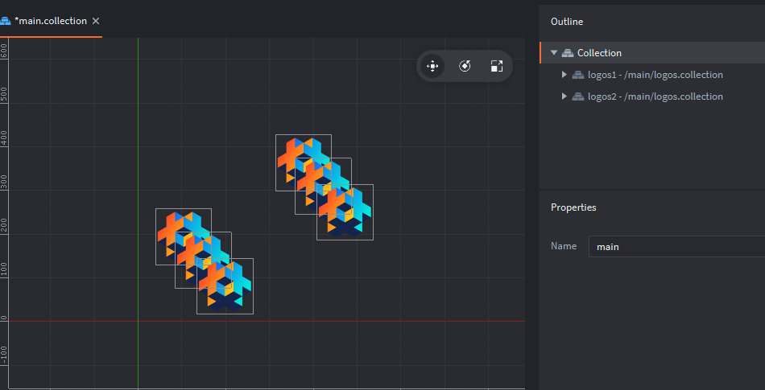

W niektórych sytuacjach chcesz wczytać całkowicie nowy świat gry. Komponent [collection proxy](/manuals/collection-proxy/) pozwala utworzyć nowy świat gry na podstawie zawartości pliku kolekcji. Przydaje się to przy wczytywaniu nowych poziomów, minigier lub cutscenek.

## Flash — oś czasu

Oś czasu we Flashu służy przede wszystkim do animacji, z użyciem różnych technik klatka po klatce albo tweenów kształtu i ruchu. Ogólne ustawienie FPS projektu określa czas wyświetlania jednej klatki. Zaawansowani użytkownicy mogą zmieniać ogólny FPS gry, a nawet FPS pojedynczych klipów filmowych.

Tweeny kształtu pozwalają interpolować grafikę wektorową między dwoma stanami. Jest to zwykle przydatne tylko dla prostych kształtów i zastosowań, co pokazuje przykład przekształcania kwadratu w trójkąt:


Tweeny ruchu pozwalają animować różne właściwości obiektu, w tym rozmiar, pozycję i rotację. W przykładzie poniżej zmodyfikowano wszystkie wymienione właściwości.


## Defold — animacja właściwości

Defold pracuje na obrazach rastrowych, a nie grafice wektorowej, więc nie ma odpowiednika tweeningu kształtu. Ma jednak bardzo mocny odpowiednik tweeningu ruchu w postaci [animacji właściwości](/ref/go/#go.animate). Wykonuje się ją ze skryptu za pomocą funkcji `go.animate()`. Funkcja go.animate() animuje właściwość, taką jak kolor, skala, rotacja albo pozycja, od wartości początkowej do docelowej, korzystając z jednej z wielu dostępnych funkcji easing, w tym także własnych. Tam, gdzie Flash wymagał własnej implementacji bardziej zaawansowanych funkcji easing, Defold ma w silniku [wiele funkcji easing](/manuals/animation/#easing).

Tam, gdzie Flash wykorzystuje klatki kluczowe grafiki na osi czasu, jedną z głównych metod animacji grafiki w Defoldzie jest animacja flipbook importowanych sekwencji obrazów. Animacje są organizowane w komponencie obiektu gry zwanym atlasem. W tym przykładzie atlas zawiera postać z sekwencją animacji o nazwie "run". Składa się ona z serii plików png:


## Flash — indeks głębi

We Flashu display list określa, co jest wyświetlane i w jakiej kolejności. Kolejność obiektów w kontenerze, takim jak Stage, jest obsługiwana przez indeks. Obiekty dodane do kontenera metodą `addChild()` automatycznie zajmują najwyższą pozycję w indeksie, zaczynając od 0 i zwiększając ją przy każdym kolejnym obiekcie. Na zrzucie poniżej wygenerowano trzy instancje klipu filmowego "logo":

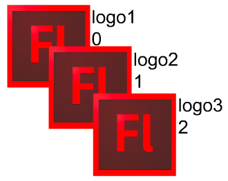

Pozycje na display list są oznaczone numerami obok każdej instancji logo. Pomijając kod odpowiedzialny za pozycję x/y klipów filmowych, powyższy wynik można było uzyskać tak:

```as
var logo1:Logo = new Logo();
var logo2:Logo = new Logo();
var logo3:Logo = new Logo();

addChild(logo1);
addChild(logo2);
addChild(logo3);
```

To, czy obiekt jest wyświetlany nad innym, czy pod nim, zależy od ich względnej pozycji w indeksie display list. Dobrze pokazuje to zamiana pozycji dwóch obiektów, na przykład:

```as
swapChildren(logo2,logo3);
```

Wynik wyglądałby tak, jak poniżej, z zaktualizowaną pozycją indeksu:


## Defold — pozycja Z

Pozycje obiektów gry w Defoldzie są reprezentowane przez wektory złożone z trzech składowych: x, y i z. Pozycja Z określa głębię obiektu gry. W domyślnym [skrypcie renderowania](/manuals/render) zakres dostępnych wartości Z wynosi od -1 do 1.

::: sidenote
Obiekty gry z pozycją Z poza zakresem -1 do 1 nie będą renderowane, a więc nie będą widoczne. To częsta pułapka dla osób zaczynających pracę z Defoldem i warto o niej pamiętać, jeśli obiekt nie jest widoczny, mimo że powinien być.
:::

W przeciwieństwie do Flasha, gdzie edytor tylko pośrednio sugeruje indeks głębi i pozwala zmieniać go poleceniami takimi jak *Bring Forward* i *Send Backward*, Defold pozwala ustawić pozycję Z obiektów bezpośrednio w edytorze. Na zrzucie poniżej widać, że "logo3" jest wyświetlony najwyżej i ma pozycję Z 0.2. Pozostałe obiekty gry mają pozycje Z 0.0 i 0.1.

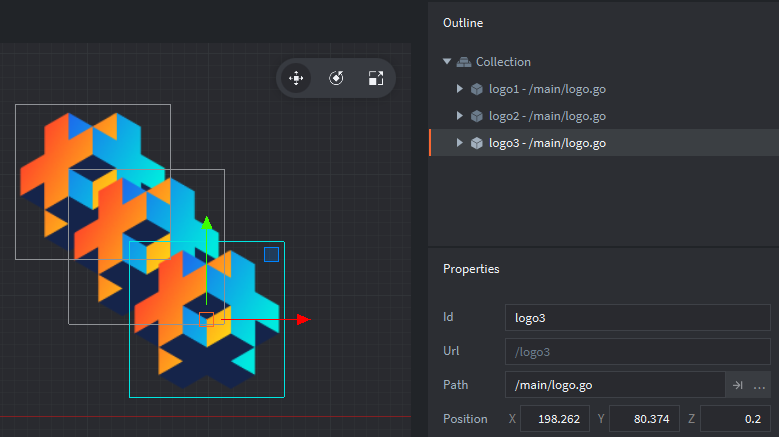

Warto zauważyć, że pozycja Z obiektu gry zagnieżdżonego w jednej lub wielu kolekcjach zależy od jego własnej pozycji Z oraz pozycji wszystkich rodziców. Wyobraź sobie na przykład, że powyższe obiekty logo znajdują się w kolekcji "logos", a ta kolekcja jest umieszczona w "main" (zobacz zrzut poniżej). Gdyby kolekcja "logos" miała pozycję Z 0.9, pozycje Z obiektów wewnątrz wyniosłyby 0.9, 1.0 i 1.1. W efekcie "logo3" nie zostałby wyrenderowany, ponieważ jego pozycja Z byłaby większa niż 1.


Pozycję Z obiektu gry można oczywiście zmieniać w skrypcie. Załóżmy, że poniższy kod znajduje się w komponencie skryptu obiektu gry:

```lua
local pos = go.get_position()
pos.z  = 0.5
go.set_position(pos)
```

## Flash `hitTestObject` i `hitTestPoint` - wykrywanie kolizji

Podstawowe wykrywanie kolizji we Flashu realizuje się metodą `hitTestObject()`. W tym przykładzie są dwa klipy filmowe: "bullet" i "bullseye". Widać je na zrzucie poniżej. Niebieska ramka jest widoczna po zaznaczeniu symboli w edytorze Flasha i to właśnie ona decyduje o wyniku `hitTestObject()`.

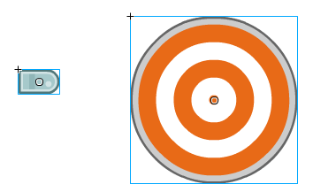

Wykrywanie kolizji metodą `hitTestObject()` wygląda tak:

```as
bullet.hitTestObject(bullseye);
```

W tym przypadku użycie ramek ograniczających nie byłoby właściwe, bo trafienie zostałoby zarejestrowane w scenariuszu poniżej:


Alternatywą dla `hitTestObject()` jest `hitTestPoint()`. Metoda ta ma parametr `shapeFlag`, który pozwala sprawdzać trafienia względem rzeczywistych pikseli obiektu, a nie względem ramki ograniczającej. Wykrywanie kolizji za pomocą `hitTestPoint()` mogłoby wyglądać tak:

```as
bullseye.hitTestPoint(bullet.x, bullet.y, true);
```

Ta linia sprawdza pozycję x i y pocisku w stosunku do kształtu celu. Ponieważ `hitTestPoint()` sprawdza punkt względem kształtu, wybór właściwego punktu lub punktów do sprawdzenia jest kluczowy.

## Defold — obiekty kolizji

Defold zawiera silnik fizyki, który potrafi wykrywać kolizje i pozwala skryptowi reagować na nie. Wykrywanie kolizji w Defoldzie zaczyna się od przypisania komponentów obiektu kolizji do obiektów gry. Na zrzucie poniżej dodano obiekt kolizji do obiektu gry "bullet". Obiekt kolizji jest oznaczony czerwonym półprzezroczystym prostokątem, widocznym tylko w edytorze:


Defold zawiera zmodyfikowaną wersję silnika fizyki Box2D, który może automatycznie symulować realistyczne kolizje. Ta instrukcja zakłada użycie kinematycznych obiektów kolizji, ponieważ najbardziej przypominają one wykrywanie kolizji we Flashu. Więcej o dynamicznych obiektach kolizji można przeczytać w [instrukcji fizyki](/manuals/physics).

Komponent obiektu kolizji ma następujące właściwości:


Użyto kształtu box, bo najlepiej pasował do grafiki pocisku. Inny kształt używany przy kolizjach 2D, sphere, zostanie użyty dla celu. Ustawienie typu na Kinematic oznacza, że rozstrzyganie kolizji wykonuje skrypt, a nie wbudowany silnik fizyki. Więcej informacji o pozostałych typach znajdziesz w [instrukcji fizyki](/manuals/physics). Właściwości group i mask określają odpowiednio, do jakiej grupy należy obiekt i z jakimi grupami ma być sprawdzany. Bieżąca konfiguracja oznacza, że "bullet" może kolidować tylko z "target". Wyobraź sobie, że konfigurację zmieniono tak jak poniżej:


Teraz pociski mogą kolidować z celami i innymi pociskami. Dla porównania obiekt kolizji dla celu wygląda tak:

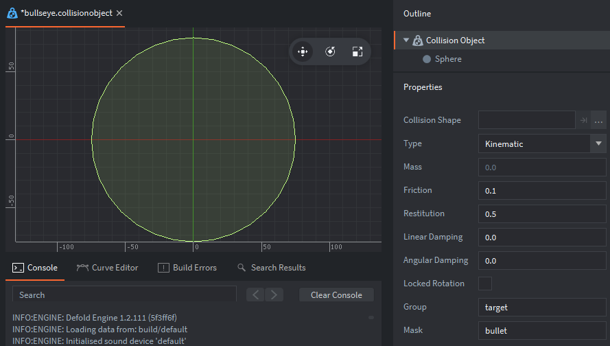

Zwróć uwagę, że właściwość *Group* jest ustawiona na "target", a *Mask* na "bullet".

We Flashu wykrywanie kolizji odbywa się tylko wtedy, gdy zostanie jawnie wywołane ze skryptu. W Defoldzie wykrywanie kolizji działa cały czas w tle, dopóki obiekt kolizji jest włączony. Gdy dojdzie do kolizji, odpowiednie wiadomości są wysyłane do wszystkich komponentów obiektu gry, a przede wszystkim do komponentów skryptu. Są to wiadomości [collision_response i contact_point_response](/manuals/physics-messages), które zawierają wszystkie informacje potrzebne do rozwiązania kolizji w pożądany sposób.

Zaletą wykrywania kolizji w Defoldzie jest to, że jest bardziej zaawansowane niż we Flashu i pozwala wykrywać kolizje między względnie złożonymi kształtami przy niewielkim nakładzie pracy konfiguracyjnej. Wykrywanie kolizji jest automatyczne, więc nie trzeba iterować po różnych obiektach w poszczególnych grupach kolizji i ręcznie wykonywać testów trafień. Główną wadą jest brak odpowiednika `shapeFlag` z Flasha. Jednak w większości zastosowań wystarczają kombinacje podstawowych kształtów box i sphere. W bardziej złożonych przypadkach [można](//forum.defold.com/t/does-defold-support-only-three-shapes-for-collision-solved/1985) użyć własnych kształtów.

## Flash — obsługa zdarzeń

Obiekty zdarzeń i powiązani z nimi listenerzy służą do wykrywania różnych zdarzeń, na przykład kliknięć myszą, naciśnięć przycisków czy wczytywania klipów, oraz do wyzwalania odpowiednich akcji. Do dyspozycji jest wiele różnych typów zdarzeń.

## Defold — funkcje callback i wiadomości

Odpowiednik systemu obsługi zdarzeń z Flasha w Defoldzie składa się z kilku elementów. Po pierwsze, każdy komponent skryptu ma zestaw funkcji callback wykrywających konkretne zdarzenia. Są to:

init
:   Wywoływana, gdy komponent skryptu jest inicjalizowany. Odpowiada funkcji konstruktora we Flashu.

final
:   Wywoływana, gdy komponent skryptu jest niszczony, na przykład gdy usunięto obiekt gry utworzony w czasie działania.

update
:   Wywoływana w każdej klatce. Odpowiednik `enterFrame` we Flashu.

fixed_update
:   Wywoływana ze stałą częstotliwością, zależną od FPS.

on_message
:   Wywoływana, gdy komponent skryptu otrzyma wiadomość.

on_input
:   Wywoływana, gdy dane wejściowe użytkownika, na przykład z myszy lub klawiatury, zostaną wysłane do obiektu gry z [input focus](/ref/go/#acquire_input_focus), co oznacza, że obiekt otrzymuje całe wejście i może na nie reagować.

on_reload
:   Wywoływana, gdy komponent skryptu zostanie przeładowany.

Wszystkie wymienione wyżej funkcje callback są opcjonalne i można je usunąć, jeśli nie są używane. Informacje o konfiguracji wejścia znajdziesz w [instrukcji o wejściu](/manuals/input). Częstą pułapką jest praca z collection proxy - więcej informacji znajdziesz w [tej sekcji](/manuals/input/#input-dispatch-and-on_input) instrukcji o wejściu.

Jak opisano w sekcji o wykrywaniu kolizji, zdarzenia kolizji są obsługiwane przez wysyłanie wiadomości do obiektów gry, których dotyczą. Ich odpowiednie komponenty skryptu otrzymują wiadomość w funkcji callback on_message.

## Flash — symbole przycisków

Flash używa osobnego typu symboli dla przycisków. Przyciski korzystają ze specyficznych metod obsługi zdarzeń, na przykład `click` i `buttonDown`, aby wykonywać akcje po wykryciu interakcji użytkownika. Graficzny kształt przycisku w sekcji <kbd>Hit</kbd> symbolu przycisku określa obszar trafienia przycisku.


## Defold — sceny GUI i skrypty

Defold nie ma natywnego komponentu przycisku, ani nie da się łatwo wykrywać kliknięć względem kształtu konkretnego obiektu gry tak, jak obsługiwane są przyciski we Flashu. Najczęstszym rozwiązaniem jest użycie komponentu [GUI](/manuals/gui), częściowo dlatego, że pozycje elementów GUI w Defoldzie nie są zależne od kamery w grze, jeśli jest używana. API GUI zawiera też funkcje do sprawdzania, czy dane wejściowe, takie jak kliknięcia i dotyk, mieszczą się w granicach elementu GUI.

## Debugowanie

We Flashu podczas debugowania przydatna jest komenda `trace()`. Odpowiednikiem w Defoldzie jest `print()`, używana tak samo jak `trace()`:

```lua
print("Hello world!"")
```

Jednym wywołaniem `print()` można wypisać wiele zmiennych:

```lua
print(score, health, ammo)
```

Istnieje też funkcja `pprint()` (pretty print), przydatna przy pracy z tabelami. Wypisuje ona zawartość tabel, również zagnieżdżonych. Rozważ poniższy skrypt:

```lua
factions = {"red", "green", "blue"}
world = {name = "Terra", teams = factions}
pprint(world)
```

To zawiera tabelę (`factions`) zagnieżdżoną w tabeli (`world`). Zwykłe `print()` wypisałoby tylko unikalne id tabeli, a nie jej zawartość:

```
DEBUG:SCRIPT: table: 0x7ff95de63ce0
```

`pprint()` daje bardziej czytelny wynik:

```
DEBUG:SCRIPT:
{
  name = Terra,
  teams = {
    1 = red,
    2 = green,
    3 = blue,
  }
}
```

Jeśli gra korzysta z wykrywania kolizji, debugowanie fizyki można włączyć, wysyłając poniższą wiadomość:

```lua
msg.post("@system:", "toggle_physics_debug")
```

Debugowanie fizyki można też włączyć w ustawieniach projektu. Przed przełączeniem debugowania fizyki projekt wyglądałby tak:

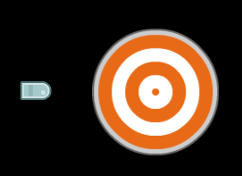

Po włączeniu debugowania fizyki widać obiekty kolizji dodane do obiektów gry:

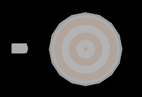

Gdy dojdzie do kolizji, odpowiednie obiekty kolizji zostają podświetlone. Dodatkowo wyświetlany jest wektor kolizji:


Na koniec zajrzyj do [dokumentacji profilera](/ref/profiler/), aby dowiedzieć się, jak monitorować użycie CPU i pamięci. Więcej informacji o zaawansowanych technikach debugowania znajdziesz w [sekcji debugowania](/manuals/debugging) w instrukcji Defold.

## Co dalej

- [Przykłady Defold](/examples)
- [Tutoriale](/tutorials)
- [Instrukcje](/manuals)
- [Reference](/ref/go)
- [FAQ](/faq/faq)

Jeśli masz pytania albo utkniesz, [forum Defold](//forum.defold.com) to dobre miejsce, by poprosić o pomoc.
