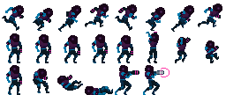
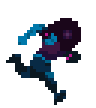

# Animacja flip-book

Animacja flip-book składa się z serii nieruchomych obrazów wyświetlanych jeden po drugim. Technika ta jest bardzo podobna do tradycyjnej animacji poklatkowej (zobacz http://en.wikipedia.org/wiki/Traditional_animation). Daje niemal nieograniczone możliwości, ponieważ każdą klatkę można modyfikować osobno. Z drugiej strony koszt pamięci może być wysoki, bo każda klatka jest przechowywana jako osobny obraz. Płynność animacji zależy również od liczby obrazów wyświetlanych w każdej sekundzie, a zwiększenie tej liczby zwykle oznacza też więcej pracy dla silnika. Animacje flip-book w Defold są przechowywane albo jako osobne obrazy dodane do [Atlas](/manuals/atlas), albo jako [Tile Source](/manuals/tilesource) z wszystkimi klatkami ułożonymi w poziomy ciąg.

  {.inline}
  {.inline}

## Odtwarzanie animacji flip-book

Sprite'y i węzły GUI box mogą odtwarzać animacje flip-book, a w czasie działania programu masz nad nimi dużą kontrolę.

Sprite'y
: Aby odtworzyć animację w czasie działania programu, użyj funkcji [`sprite.play_flipbook()`](/ref/sprite/?q=play_flipbook#sprite.play_flipbook:url-id-[complete_function]-[play_properties]). Zobacz przykład poniżej.

Węzły GUI box
: Aby odtworzyć animację w czasie działania programu, użyj funkcji [`gui.play_flipbook()`](/ref/gui/?q=play_flipbook#gui.play_flipbook:node-animation-[complete_function]-[play_properties]). Zobacz przykład poniżej.

::: sidenote
Tryb odtwarzania once ping-pong odtwarza animację do ostatniej klatki, a następnie odtwarza ją w odwrotnej kolejności aż do **drugiej** klatki animacji, a nie z powrotem do pierwszej. Dzięki temu łatwiej łączyć animacje w łańcuch.
:::

### Przykład ze sprite'em

Załóżmy, że w grze istnieje funkcja "dodge", dzięki której gracz może nacisnąć określony przycisk, aby wykonać unik. Przygotowano cztery animacje wspierające tę funkcję i zapewniające informację zwrotną:

"idle"
: Zapętlona animacja postaci pozostającej bez ruchu.

"dodge_idle"
: Zapętlona animacja postaci pozostającej w pozycji uniku.

"start_dodge"
: Animacja odtwarzana raz, przechodząca postać z pozycji stojącej do pozycji uniku.

"stop_dodge"
: Animacja odtwarzana raz, przechodząca postać z pozycji uniku z powrotem do pozycji stojącej.

Poniższy skrypt zawiera logikę:

```lua

local function play_idle_animation(self)
    if self.dodge then
        sprite.play_flipbook("#sprite", hash("dodge_idle"))
    else
        sprite.play_flipbook("#sprite", hash("idle"))
    end
end

function on_input(self, action_id, action)
    -- "dodge" to nasza akcja wejściowa
    if action_id == hash("dodge") then
        if action.pressed then
            sprite.play_flipbook("#sprite", hash("start_dodge"), play_idle_animation)
            -- zapamiętaj, że wykonujemy unik
            self.dodge = true
        elseif action.released then
            sprite.play_flipbook("#sprite", hash("stop_dodge"), play_idle_animation)
            -- nie wykonujemy już uniku
            self.dodge = false
        end
    end
end
```

### Przykład z węzłem GUI box

Wybierając animację albo obraz dla węzła, w praktyce przypisujesz jednocześnie źródło obrazu (atlas albo Tile Source) oraz domyślną animację. Źródło obrazu jest ustawione statycznie w węźle, ale bieżącą animację można zmieniać w czasie działania programu. Nieruchome obrazy są traktowane jak animacje jednoklatkowe, więc zmiana obrazu w czasie działania programu jest równoważna odtworzeniu dla węzła innej animacji flip-book:

```lua
function init(self)
    local character_node = gui.get_node("character")
    -- To wymaga, aby węzeł miał domyślną animację w tym samym atlasie lub Tile Source
    -- co nowa animacja/obraz, który odtwarzamy.
    gui.play_flipbook(character_node, "jump_left")
end
```


## Callbacki po zakończeniu

Funkcje `sprite.play_flipbook()` i `gui.play_flipbook()` obsługują opcjonalną funkcję callback jako ostatni argument Lua. Zostanie ona wywołana, gdy animacja dotrze do końca. Nie jest wywoływana dla animacji zapętlonych. Callback można wykorzystać do uruchamiania zdarzeń po zakończeniu animacji albo do łączenia wielu animacji w łańcuch. Przykłady:

```lua
local function flipbook_done(self)
    msg.post("#", "jump_completed")
end

function init(self)
    sprite.play_flipbook("#character", "jump_left", flipbook_done)
end
```

```lua
local function flipbook_done(self)
    msg.post("#", "jump_completed")
end

function init(self)
    gui.play_flipbook(gui.get_node("character"), "jump_left", flipbook_done)
end
```
