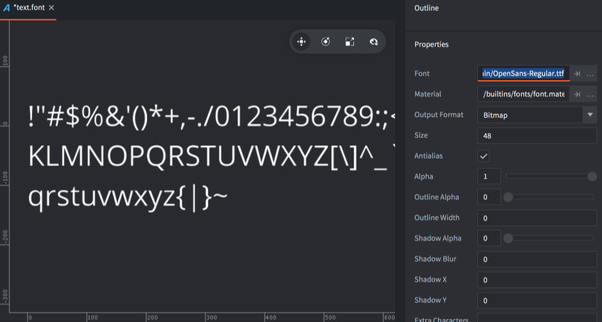
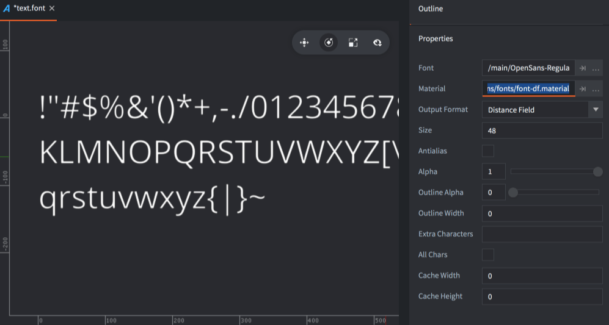
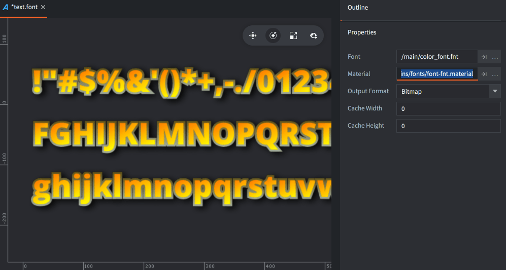
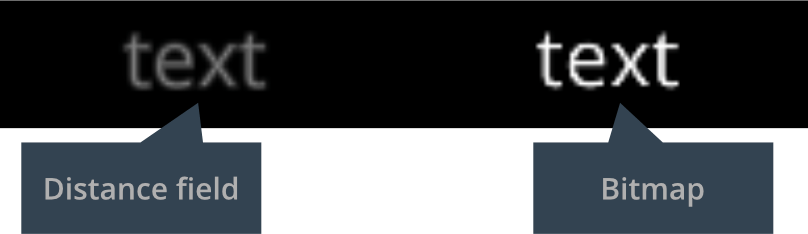

# Pliki fontów

Fonty (w odróżnieniu od czcionki będącej jedynie określeniem materiału zecerskiego) są używane do wyświetlania tekstu w kompoentach typu Label (etykieta) i węzłów tekstowych GUI. Defold wspiera poniższe formaty plików określających fonty:

- TrueType
- OpenType
- BMFont

Fonty dodane do projektu są automatycznie konwertowane na format tekstury, który może być renderowany przez Defolda. Dostępne są dwie techniki renderowania czcionek, z własnymi korzyściami i wadami:

- Bitmap
- Distance field (Pole odległości)

## Tworzenie fontów

Aby stworzyć czcionkę do użycia w Defold, utwórz nowy plik fontu, wybierając opcję <kbd>File ▸ New...</kbd> z menu, a następnie wybierz <kbd>Font</kbd>. Możesz również kliknąć <kbd>prawy przycisk myszy</kbd> w lokalizacji w panelu *Assets* i wybrać <kbd>New... ▸ Font</kbd>.

{srcset="images/font/new_font_name@2x.png 2x"}

Nadaj nowemu plikowi fontu nazwę i kliknij <kbd>OK</kbd>. Nowy plik fontu otworzy się teraz w edytorze.

{srcset="images/font/new_font@2x.png 2x"}

Przeciągnij font, który chcesz użyć do panelu *Assets* i upuść ją we właściwym miejscu.

Ustaw właściwość *Font* na plik fontu i dostosuj właściwości czcionki, jak to konieczne.

## Właściwości (Properties)

*Font*
: Plik TTF, OTF lub *.fnt*, który ma zostać użyty do generowania danych czcionki.

*Material*
: Materiał, który ma zostać użyty podczas renderowania fontu. Upewnij się, że zmieniasz to dla czcionek Distance Field i BMFonts (patrz poniżej, aby uzyskać szczegóły).

*Output Format*
: Rodzaj danych czcionki, który jest generowany.

  - `TYPE_BITMAP` konwertuje importowany plik OTF lub TTF na teksturę arkusza fontu, gdzie dane bitmapy są używane do renderowania tekstu. Kanały koloru służą do kodowania kształtu twarzy (face shape), obrysu (outline) i cienia (shadow). Dla plików *.fnt* używana jest oryginalna bitmapa źródłowa.
  - `TYPE_DISTANCE_FIELD` importowany font jest konwertowana na teksturę arkusza fontu, gdzie dane pikseli reprezentują nie piksele ekranu, ale odległości do krawędzi czcionki. Patrz poniżej po szczegóły.

*Render Mode*
: Tryb renderowania dla glifów.

  - `MODE_SINGLE_LAYER` generuje pojedynczy kwadrat (quad) dla każdego znaku.
  - `MODE_MULTI_LAYER` generuje osobne kwadraty (quady) dla kształtu glifu, obrysu i cieni, odpowiednio. Warstwy są renderowane od tyłu do przodu, co zapobiega zasłanianiu wcześniej renderowanych znaków, jeśli obrys jest szerszy niż odległość między glifami. Ten tryb renderowania umożliwia również prawidłowe przesunięcie cienia, zgodnie z właściwościami cienia X/Y w zasobie fontu.

*Size*
: Docelowy rozmiar glifów w pikselach.

*Antialias*
: Określa, czy czcionka ma być wygładzana (antyaliasing), gdy jest wypalana na docelowej bitmapie. Ustaw na 0, jeśli chcesz uzyskać dokładne renderowanie czcionki piksel po pikselu.

*Alpha*
: Przezroczystość glifu. Od 0,0 do 1,0, gdzie 0,0 oznacza przezroczystość, a 1,0 nieprzezroczystość.

*Outline Alpha*
: Przezroczystość generowanego obrysu. Od 0,0 do 1,0.

*Outline Width*
: Szerokość generowanego obrysu w pikselach. Ustaw na 0, jeśli nie chcesz obrysu.

*Shadow Alpha*
: Przezroczystość generowanego cienia. Od 0,0 do 1,0.

::: sidenote
Wsparcie dla cieni jest aktywowane przez wbudowane shadery materiałów czcionek i obsługuje zarówno tryb renderowania warstwowego, jak i jednowarstwowego. Jeśli nie potrzebujesz warstwowego renderowania czcionek ani obsługi cieni, lepiej jest użyć prostszego shadera, takiego jak wbudowany shader `builtins/font-singlelayer.fp`.
:::

*Shadow Blur*
: Dla czcionek bitmapowych to ustawienie określa liczbę razy, jaka ma być zastosowane małe jądro rozmazywania do każdego glifu czcionki. Dla czcionek pola odległości (distance field) to ustawienie odpowiada rzeczywistej szerokości w pikselach rozmycia.

*Shadow X/Y*
: Poziome i pionowe przesunięcie w pikselach generowanego cienia. To ustawienie wpłynie tylko na cień glifu, gdy tryb renderowania jest ustawiony na `MODE_MULTI_LAYER`.

*Extra Characters*
: Domyślnie font będzie zawierać drukowalne znaki ASCII (kody znaków 32-126). Aby ręcznie dodać dodatkowe znaki, wymień je w polu właściwości.

::: sidenote
Znaki ASCII do druku:
space ! " # $ % & ' ( ) * + , - . / 0 1 2 3 4 5 6 7 8 9 : ; < = > ? @ A B C D E F G H I J K L M N O P Q R S T U V W X Y Z [ \ ] ^ _ \` a b c d e f g h i j k l m n o p q r s t u v w x y z { | } ~
:::

*All Chars*
: Jeśli zaznaczysz tę właściwość, wszystkie glify dostępne w pliku źródłowym zostaną uwzględnione w wyniku.

*Cache Width/Height*
: Ogranicza rozmiar mapy bitowej pamięci podręcznej glifów. Kiedy silnik renderuje tekst, przeszukuje mapę bitową, aby znaleźć glif z pamięci podręcznej. Jeśli glifu tam nie ma, zostanie on dodany do pamięci podręcznej przed renderowaniem. Jeśli mapa bitowa pamięci podręcznej jest zbyt mała, aby pomieścić wszystkie glify, które silnik ma zrenderować, zostanie wygenerowany błąd (`ERROR:RENDER: Out of available cache cells! Consider increasing cache_width or cache_height for the font.`), czyli "Brak dostępnych komórek w pamięci podręcznej! Rozważ zwiększenie `cache_width` lub `cache_height` dla fontu".

  Jeśli ustawisz to na 0, rozmiar pamięci podręcznej będzie ustawiany automatycznie.

## Fonty pola odległości (Distance field)

Fonty pola odległości przechowują odległość od krawędzi glifu w teksturze zamiast danych w postaci mapy bitowej. Gdy silnik renderuje font, wymagany jest specjalny shader do interpretowania danych odległości i ich wykorzystania do rysowania glifu. Fonty pola odległości są bardziej wymagające pod względem zasobów niż fonty bitmapowe, ale pozwalają na większą elastyczność skalowania.

{srcset="images/font/df_font@2x.png 2x"}

Upewnij się, że zmieniasz właściwość *Material* czcionki na *builtins/fonts/font-df.material* (lub inny materiał, który może obsługiwać dane pola odległości) podczas tworzenia fontu, w przeciwnym razie czcionka nie będzie używać odpowiedniego shadera podczas renderowania na ekranie.

## Fonty bitmapowe BMFonts

Oprócz generowanych map bitowych, Defold obsługuje fonty w formacie bitmapowym "BMFont". Te fonty składają się z arkusza fontu PNG z glifami. Ponadto plik *.fnt* zawiera informacje o tym, gdzie na arkuszu znajduje się każdy glif, a także informacje o rozmiarze i kerningu. (Należy pamiętać, że Defold nie obsługuje wersji XML pliku *.fnt*, która jest używana przez Phaser i niektóre inne narzędzia).

Te rodzaje fontów nie przynoszą żadnej poprawy wydajności w porównaniu do fontów bitmapowych generowanych z plików czcionek TrueType lub OpenType, ale pozwalają na dowolne grafiki, kolorowanie i cienie bezpośrednio w obrazie.

Dodaj wygenerowane pliki *.fnt* i *.png* do swojego projektu Defold. Te pliki powinny znajdować się w tym samym folderze. Utwórz nowy plik fontu i ustaw właściwość *font* na plik *.fnt*. Upewnij się, że *output_format* jest ustawiony na `TYPE_BITMAP`. Defold nie wygeneruje mapy bitowej, ale użyje tej dostarczonej w formacie PNG.

::: sidenote
Aby stworzyć font BMFont, musisz użyć narzędzia, które może generować odpowiednie pliki. Istnieje kilka opcji:

* [Bitmap Font Generator](http://www.angelcode.com/products/bmfont/), narzędzie dostępne tylko na platformę Windows, dostarczone przez AngelCode.
* [Shoebox](http://renderhjs.net/shoebox/), darmowa aplikacja oparta na Adobe Air dla platformy Windows i macOS.
* [Hiero](https://github.com/libgdx/libgdx/wiki/Hiero), narzędzie typu open source oparte na Java.
* [Glyph Designer](https://71squared.com/glyphdesigner), komercyjne narzędzie dla platformy macOS od 71 Squared.
* [bmGlyph](https://www.bmglyph.com), komercyjne narzędzie dla platformy macOS od Sovapps.
:::

{srcset="images/font/bm_font@2x.png 2x"}

Aby font renderował się poprawnie, nie zapomnij ustawić właściwości materiału na *builtins/fonts/font-fnt.material* podczas tworzenia czcionki.

## Artefakty i najlepsze praktyki

Ogólnie rzecz biorąc, fonty bitmapowe są najlepsze, gdy font jest renderowany bez skalowania. Są szybsze do renderowania na ekranie niż fonty pola odległości (Distance Field).

Fonty pola odległości bardzo dobrze reagują na skalowanie w górę. Z kolei fonty bitmapowe, będąc jedynie pikselowymi obrazami, zwiększają swoją wielkość wraz ze skalowaniem czcionki, co prowadzi do efektów blokowych artefaktów. Oto przykład fontu o rozmiarze 48 pikseli, powiększonej 4-krotnie.

{srcset="images/font/scale_up@2x.png 2x"}

Podczas zmniejszania rozmiaru, tekstury fontów bitmapowych mogą być ładnie i efektywnie zmniejszone i wygładzone przez GPU. Font bitmapowy lepiej utrzymuje swoją kolorystykę niż font pola odległości. Oto przybliżenie tej samej próbki fontu o rozmiarze 48 pikseli, zmniejszonego do 1/5 rozmiaru:

{srcset="images/font/scale_down@2x.png 2x"}

Fonty pola odległości muszą być renderowane w celu uzyskania docelowego rozmiaru, który jest wystarczająco duży, aby pomieścić informacje o odległości, które mogą wyrazić krzywizny glifów fontu. To ta sama czcionka, co powyżej, ale o rozmiarze 18 pikseli i powiększona 10-krotnie. Wyraźnie widać, że jest to zbyt małe, aby zakodować kształty tego fontu:

{srcset="images/font/df_artifacts@2x.png 2x"}

Jeśli nie potrzebujesz obsługi cieni lub konturów, ustaw ich odpowiednie wartości alfa na zero. W przeciwnym razie dane cienia i konturu nadal zostaną generowane, zajmując zbędną pamięć.

## Pamięć podręczna fontu

Zasób fontu w Defoldzie składa się z dwóch elementów w czasie rzeczywistym: tekstury i danych fontu.
* Dane fontu składają się z listy wpisów glifów, z których każdy zawiera podstawowe informacje o kerningu oraz dane mapy bitowej glifu.
* Tekstura jest wewnętrznie nazywana "teksturą pamięci podręcznej glifów" i jest używana podczas renderowania tekstu dla konkretnego fontu.

Podczas renderowania tekstu w czasie rzeczywistym, silnik najpierw przeszukuje glify do renderowania, aby sprawdzić, które glify są dostępne w pamięci podręcznej (cache) tekstury. Każdy glif, którego brakuje w pamięci podręcznej tekstury glifów, spowoduje przekazanie tekstury z bitmapowymi danymi zapisanymi w danych fontu.

Każdy glif jest umieszczany wewnętrznie w pamięci podręcznej zgodnie z bazą fontu, co pozwala na obliczanie lokalnych współrzędnych tekstury glifu w odpowiedniej komórce pamięci podręcznej w shaderze. Oznacza to, że można osiągnąć pewne efekty tekstowe, takie jak gradienty lub nakładki tekstury dynamicznie. Silnik udostępnia metryki dotyczące pamięci podręcznej tekstury dla shadera za pośrednictwem specjalnej stałej shadera o nazwie `texture_size_recip`, która zawiera następujące informacje w komponentach wektora:

* `texture_size_recip.x` to odwrotność szerokości pamięci podręcznej
* `texture_size_recip.y` to odwrotność wysokości pamięci podręcznej
* `texture_size_recip.z` to stosunek szerokości komórki pamięci podręcznej do szerokości pamięci podręcznej
* `texture_size_recip.w` to stosunek wysokości komórki pamięci podręcznej do wysokości pamięci podręcznej

Na przykład, aby wygenerować gradient w fragmencie shadera, wystarczy napisać:

`float horizontal_gradient = fract(var_texcoord0.y / texture_size_recip.w);`

Aby uzyskać więcej informacji na temat jednolitych shaderów, zobacz [instrukcje do shaderów](/manuals/shader).
