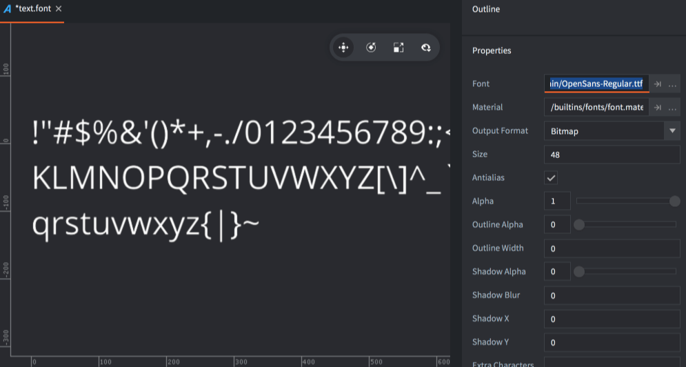
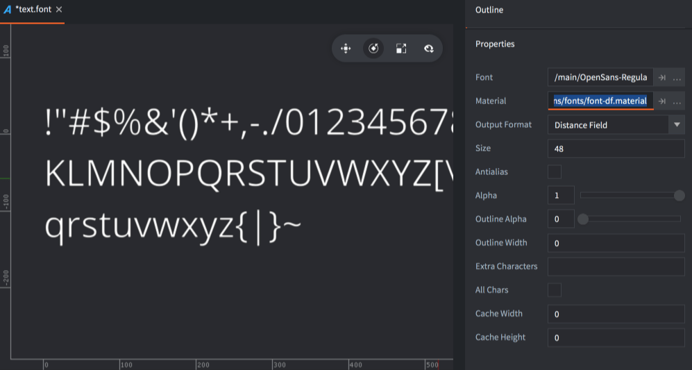

# Pliki fontów

Fonty służą do renderowania tekstu w komponentach Label oraz węzłach tekstowych GUI. Defold obsługuje kilka formatów plików fontów:

- TrueType
- OpenType
- BMFont

Fonty dodane do projektu są automatycznie konwertowane do formatu tekstury, który Defold potrafi renderować. Dostępne są dwie techniki renderowania fontów, a każda ma własne zalety i wady:

- Bitmap
- Distance field

## Fonty offline i runtime fonts

Domyślnie konwersja do zrasteryzowanych obrazów glifów odbywa się podczas budowania projektu, czyli offline. Ma to tę wadę, że każdy font musi wyrasteryzować wszystkie możliwe glify już na etapie budowania, co może prowadzić do bardzo dużych tekstur zajmujących pamięć i zwiększających rozmiar bundla.

Przy użyciu runtime fonts pliki .ttf są dołączane do bundla bez zmian, a rasteryzacja odbywa się na żądanie w czasie działania programu. Dzięki temu zmniejsza się zarówno zużycie pamięci w runtime, jak i rozmiar bundla.

## Obsługa układu tekstu, np. right-to-left

Runtime fonts mają też tę zaletę, że obsługują pełny układ tekstu, np. right-to-left.
Obecnie używamy bibliotek [HarfBuzz](https://github.com/harfbuzz/harfbuzz), [SheenBidi](https://github.com/Tehreer/SheenBidi), [libunibreak](https://github.com/adah1972/libunibreak) oraz [SkriBidi](https://github.com/memononen/Skribidi).

Zobacz [Włączanie runtime fonts](/manuals/font#enabling-runtime-fonts)

## Kolekcja fontów

Format pliku `.fontc` jest też znany jako font collection, czyli kolekcja fontów. W trybie offline jest z nim powiązany tylko jeden font.
W przypadku runtime fonts możesz powiązać z kolekcją fontów więcej niż jeden plik fontu .ttf.

Dzięki temu można używać kolekcji fontów podczas renderowania wielu tekstów w różnych językach, a jednocześnie utrzymać niski ślad pamięciowy.
Na przykład można załadować kolekcję z japońskim fontem, skojarzyć ten font z bieżącym głównym fontem, a następnie zwolnić japońską kolekcję fontów.

## Tworzenie fontu

Aby utworzyć font do użycia w Defold, wybierz z menu <kbd>File ▸ New...</kbd>, a następnie <kbd>Font</kbd>. Możesz też <kbd>right click</kbd> w wybranym miejscu panelu *Assets* i wybrać <kbd>New... ▸ Font</kbd>.


Nadaj nowemu plikowi nazwę i kliknij <kbd>Ok</kbd>. Nowy plik otworzy się teraz w edytorze.



Przeciągnij font, którego chcesz użyć, do panelu *Assets* i upuść go w odpowiednim miejscu.

Ustaw właściwość *Font* na plik fontu i skonfiguruj pozostałe właściwości według potrzeb.

## Właściwości

*Font*
: Plik TTF, OTF albo *`.fnt`* używany do wygenerowania danych fontu.

*Material*
: Materiał używany do renderowania tego fontu. Pamiętaj, aby zmienić go dla Distance field i BMFonts. Szczegóły znajdziesz poniżej.

*Output Format*
: Typ generowanych danych fontu.

  - `TYPE_BITMAP` konwertuje zaimportowany plik OTF albo TTF do tekstury arkusza fontu, w której dane bitmapowe służą do renderowania tekstu. Kanały kolorów służą do zakodowania kształtu znaku, obrysu i cienia. W przypadku plików *`.fnt`* źródłowa tekstura bitmapowa jest używana bez zmian.
  - `TYPE_DISTANCE_FIELD` konwertuje zaimportowany font do tekstury arkusza fontu, w której dane pikseli nie reprezentują pikseli ekranu, lecz odległości do krawędzi fontu. Szczegóły znajdziesz poniżej.

*Render Mode*
: Tryb renderowania używany do renderowania glifów.

  - `MODE_SINGLE_LAYER` tworzy pojedynczy quad dla każdego znaku.
  - `MODE_MULTI_LAYER` tworzy oddzielne quady odpowiednio dla kształtu glifu, obrysu i cieni. Warstwy są renderowane od tyłu do przodu, co zapobiega zasłanianiu wcześniej wyrenderowanych znaków, jeśli obrys jest szerszy niż odstęp między glifami. Ten tryb renderowania umożliwia też poprawne przesuwanie cienia, zgodnie z właściwościami Shadow X/Y w zasobie fontu.

*Size*
: Docelowy rozmiar glifów w pikselach.

*Antialias*
: Określa, czy font ma być wygładzany podczas wypalania do docelowej bitmapy. Ustaw 0, jeśli chcesz uzyskać pikselowo idealne renderowanie fontu.

*Alpha*
: Przezroczystość glifu. Zakres 0.0-1.0, gdzie 0.0 oznacza pełną przezroczystość, a 1.0 pełną nieprzezroczystość.

*Outline Alpha*
: Przezroczystość wygenerowanego obrysu. Zakres 0.0-1.0.

*Outline Width*
: Szerokość wygenerowanego obrysu w pikselach. Ustaw 0, jeśli obrys nie jest potrzebny.

*Shadow Alpha*
: Przezroczystość wygenerowanego cienia. Zakres 0.0-1.0.

::: sidenote
Obsługę cienia zapewniają wbudowane shadery materiałów fontów i działa ona zarówno w trybie renderowania jedno-, jak i wielowarstwowego. Jeśli nie potrzebujesz warstwowego renderowania fontów ani obsługi cienia, najlepiej użyć prostszego shadera, takiego jak *`builtins/font-singlelayer.fp`*.
:::

*Shadow Blur*
: W przypadku fontów bitmapowych to ustawienie określa, ile razy ma zostać zastosowane małe jądro rozmycia do każdego glifu fontu. W przypadku fontów typu distance field odpowiada ono rzeczywistej szerokości rozmycia w pikselach.

*Shadow X/Y*
: Poziome i pionowe przesunięcie wygenerowanego cienia w pikselach. To ustawienie wpływa na cień glifu tylko wtedy, gdy Render Mode ma wartość `MODE_MULTI_LAYER`.

*Characters*
: Określa, które znaki mają zostać uwzględnione w foncie. Domyślnie pole to zawiera drukowalne znaki ASCII o kodach 32-126. Możesz dodawać lub usuwać znaki, aby uwzględnić ich więcej albo mniej.

  W przypadku runtime fonts ten tekst działa też jako wstępne podgrzewanie cache odpowiednimi glifami. Dzieje się to podczas ładowania. Zobacz `font.prewarm_text()`.

::: sidenote
Drukowalne znaki ASCII to:
space ! " # $ % & ' ( ) * + , - . / 0 1 2 3 4 5 6 7 8 9 : ; < = > ? @ A B C D E F G H I J K L M N O P Q R S T U V W X Y Z [ \ ] ^ _ \` a b c d e f g h i j k l m n o p q r s t u v w x y z { | } ~
:::

*All Chars*
: Jeśli zaznaczysz tę właściwość, wszystkie glify dostępne w pliku źródłowym zostaną uwzględnione w wyniku.

*Cache Width/Height*
: Ogranicza rozmiar bitmapy cache glifów. Gdy silnik renderuje tekst, wyszukuje glif w bitmapie cache. Jeśli go tam nie ma, zostanie on dodany do cache przed renderowaniem. Jeśli bitmapa cache jest zbyt mała, aby pomieścić wszystkie glify, które silnik ma wyrenderować, zostanie zgłoszony błąd (`ERROR:RENDER: Out of available cache cells! Consider increasing cache_width or cache_height for the font.`).

  Jeśli ustawisz tę właściwość na 0, rozmiar cache zostanie dobrany automatycznie i może wzrosnąć maksymalnie do 2048x4096.

## Fonty typu Distance field

Fonty typu Distance field przechowują w teksturze odległość do krawędzi glifu zamiast danych bitmapowych. Gdy silnik renderuje taki font, potrzebny jest specjalny shader interpretujący dane odległości i używający ich do rysowania glifu. Fonty typu Distance field są bardziej zasobożerne niż fonty bitmapowe, ale zapewniają większą elastyczność skalowania.



Pamiętaj, aby podczas tworzenia fontu zmienić właściwość *Material* na *`builtins/fonts/font-df.material`* albo inny materiał obsługujący dane distance field, bo w przeciwnym razie font nie będzie używał właściwego shadera podczas renderowania na ekranie.

## Bitmap BMFonts

Oprócz generowanych bitmap Defold obsługuje także wstępnie przygotowane fonty bitmapowe w formacie BMFont. Taki font składa się z arkusza fontu PNG zawierającego wszystkie glify. Dodatkowo plik *`.fnt`* zawiera informacje o położeniu każdego glifu na arkuszu, a także o jego rozmiarze i kerningu. Pamiętaj, że Defold nie obsługuje wersji XML formatu *`.fnt`*, używanej przez Phaser i niektóre inne narzędzia.

Tego typu fonty nie dają poprawy wydajności względem fontów bitmapowych generowanych z plików TrueType albo OpenType, ale mogą zawierać dowolną grafikę, kolorowanie i cienie bezpośrednio w obrazie.

Dodaj wygenerowane pliki *`.fnt`* i *`.png`* do projektu Defold. Pliki te powinny znajdować się w tym samym folderze. Utwórz nowy plik fontu i ustaw właściwość *Font* na plik *`.fnt`*. Upewnij się, że *Output Format* ma wartość `TYPE_BITMAP`. Defold nie wygeneruje wtedy bitmapy, tylko użyje tej dostarczonej w pliku PNG.

::: sidenote
Aby utworzyć BMFont, potrzebujesz narzędzia, które potrafi wygenerować odpowiednie pliki. Dostępnych jest kilka opcji:

* [Bitmap Font Generator](http://www.angelcode.com/products/bmfont/), narzędzie tylko dla Windows od AngelCode.
* [Shoebox](http://renderhjs.net/shoebox/), darmowa aplikacja oparta na Adobe Air dla Windows i macOS.
* [Hiero](https://libgdx.com/wiki/tools/hiero), narzędzie open source oparte na Javie.
* [Glyph Designer](https://71squared.com/glyphdesigner), komercyjne narzędzie dla macOS od 71 Squared.
* [bmGlyph](https://www.bmglyph.com), komercyjne narzędzie dla macOS od Sovapps.
:::


Aby font renderował się poprawnie, nie zapomnij ustawić właściwości materiału na *`builtins/fonts/font-fnt.material`* podczas tworzenia fontu.

## Artefakty i dobre praktyki

Zasadniczo fonty bitmapowe sprawdzają się najlepiej wtedy, gdy font nie jest skalowany. Są też szybsze w renderowaniu na ekranie niż fonty typu distance field.

Fonty typu Distance field bardzo dobrze znoszą powiększanie. Fonty bitmapowe natomiast są po prostu obrazami pikselowymi, więc przy skalowaniu ich piksele rosną razem z fontem, co powoduje blokowe artefakty. Poniżej znajduje się przykład fontu o rozmiarze 48 pikseli, powiększonego 4 razy.


Podczas zmniejszania tekstury bitmapowe można ładnie i wydajnie skalować w dół oraz wygładzać przez GPU. Font bitmapowy lepiej zachowuje też kolor niż font typu distance field. Oto zbliżenie tego samego przykładowego fontu o rozmiarze 48 pikseli, zmniejszonego do 1/5 oryginalnego rozmiaru:


Fonty typu Distance field muszą być renderowane do docelowego rozmiaru wystarczająco dużego, aby pomieścić informacje o odległości opisujące krzywizny glifów. Poniżej pokazano ten sam font co wyżej, ale w rozmiarze 18 pikseli i powiększony 10 razy. Widać wyraźnie, że to za mały rozmiar, aby poprawnie zakodować kształty tego kroju pisma:


Jeśli nie chcesz obsługi cienia ani obrysu, ustaw ich odpowiednie wartości alfa na zero. W przeciwnym razie dane cienia i obrysu nadal będą generowane i zajmą niepotrzebnie pamięć.

## Pamięć podręczna fontu

Zasób fontu w Defold daje w runtime dwie rzeczy: teksturę i dane fontu.

* Dane fontu składają się z listy wpisów glifów, z których każdy zawiera podstawowe informacje o kerningu oraz dane bitmapowe tego glifu.
* Tekstura jest wewnętrznie nazywana "glyph cache texture" i jest używana podczas renderowania tekstu dla konkretnego fontu.

Podczas renderowania tekstu w runtime silnik najpierw przechodzi po glifach, które mają zostać wyrenderowane, i sprawdza, które z nich są dostępne w pamięci podręcznej tekstury. Każdy brakujący glif powoduje przesłanie do tekstury danych bitmapowych przechowywanych w danych fontu.

Każdy glif jest wewnętrznie umieszczany w cache zgodnie z linią bazową fontu, co umożliwia obliczanie lokalnych współrzędnych tekstury glifu wewnątrz odpowiadającej mu komórki cache bezpośrednio w shaderze. Dzięki temu można dynamicznie uzyskiwać pewne efekty tekstowe, takie jak gradienty albo nakładki tekstur. Silnik udostępnia metryki cache shaderowi przez specjalną stałą shadera `texture_size_recip`, która zawiera następujące informacje w komponentach wektora:

* `texture_size_recip.x` to odwrotność szerokości cache
* `texture_size_recip.y` to odwrotność wysokości cache
* `texture_size_recip.z` to stosunek szerokości komórki cache do szerokości całego cache
* `texture_size_recip.w` to stosunek wysokości komórki cache do wysokości całego cache

Na przykład, aby wygenerować gradient w shaderze fragmentu, wystarczy napisać:

`float horizontal_gradient = fract(var_texcoord0.y / texture_size_recip.w);`

Więcej informacji o uniformach shaderów znajdziesz w [Shader manual](/manuals/shader).

## Włączanie runtime fonts

Można używać generowania w czasie działania dla fontów typu SDF, gdy korzystasz z fontów TrueType (.ttf).
Takie podejście może znacznie zmniejszyć rozmiar pobieranych danych i zużycie pamięci w runtime gry Defold.
Niewielką wadą jest asynchroniczny charakter generowania każdego glifu.

* Włącz tę funkcję, ustawiając `font.runtime_generation` w `game.project`.

* Dodaj [App Manifest](/manuals/app-manifest) i włącz opcję `Use full text layout system`.
  Spowoduje to zbudowanie niestandardowego silnika z włączoną obsługą tej funkcji.

::: sidenote
Ta funkcja jest obecnie eksperymentalna, ale docelowo ma stać się domyślnym sposobem pracy.
:::

::: important
Ustawienie `font.runtime_generation` wpływa na wszystkie fonty .ttf w projekcie.
:::


### Skryptowanie fontów

#### Wstępne podgrzewanie cache glifów

Aby ułatwić korzystanie z runtime fonts, obsługują one wstępne podgrzewanie cache glifów.
Oznacza to, że font wygeneruje glify wypisane w polu *Characters*.

::: sidenote
Jeśli zaznaczono `All Chars`, wstępne podgrzewanie nie zostanie wykonane, ponieważ przeczyłoby to idei niewymuszania generowania wszystkich glifów naraz.
:::

Jeśli pole `Characters` w pliku `.fontc` jest ustawione, jest ono używane jako tekst do ustalenia, które glify trzeba zaktualizować w cache glifów.

Można też ręcznie zaktualizować cache glifów, wywołując `font.prewarm_text(font_collection, text, callback)`. Funkcja przyjmuje callback, który informuje, kiedy wszystkie brakujące glify zostały dodane do cache i można bezpiecznie wyświetlić tekst na ekranie.

### Dodawanie i usuwanie fontów z kolekcji fontów

W przypadku runtime fonts można dodawać lub usuwać fonty (.ttf) z font collection.
Jest to przydatne, gdy duży font został podzielony na kilka plików dla różnych zestawów znaków, np. CJK.

::: important
Dodanie fontu do font collection nie powoduje automatycznego załadowania ani wyrenderowania wszystkich glifów.
:::

```lua
-- pobierz główny font
local font_collection = go.get("#label", "font")
font.add_font(font_collection, self.language_ttf_hash)

-- pobierz font wybranego języka
local font_collection_language = go.get("localization_japanese#label", "font")
local font_info = font.get_info(font_collection_language)
self.language_ttf_hash = font_info.fonts[1].path_hash -- pobierz pierwszy font (ten wskazany w edytorze)
font.add_font(self.font_collection, self.language_ttf_hash) -- zwiększa licznik referencji do fontu
```

```lua
-- usuń referencję do fontu
font.add_font(self.font_collection, self.language_ttf_hash)
```

### Wstępne podgrzewanie glifów

Aby poprawnie wyświetlić tekst przy użyciu runtime font, glify muszą zostać rozwiązane. `font.prewarm_text()` robi to za ciebie.
Jest to operacja asynchroniczna. Gdy się zakończy i otrzymasz callback, możesz bezpiecznie przejść do wyświetlenia dowolnej wiadomości zawierającej te glify.

::: important
Jeśli cache glifów się zapełni, najstarszy glif zostanie z niego usunięty.
:::

```lua
font.prewarm_text(self.font_collection, info.text, function (self, request_id, result, err)
    if result then
      print("PREWARMING OK!")
      label.set_text(self.label, info.text)
    else
      print("Error prewarming text:", err)
    end
  end)
```
