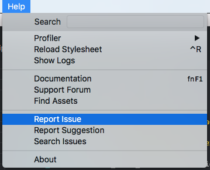

# Jak uzyskać pomoc

Jeśli napotkasz problem podczas korzystania z silnika Defold, chcemy o tym wiedzieć, żeby móc go naprawić lub pomóc Ci znaleźć obejście. Istnieje kilka sposobów, aby omówić lub zgłosić problem. Wybierz ten, który najbardziej Ci odpowiada:

## Zgłoś problem na forum

Dobrym sposobem na omówienie problemu i uzyskanie pomocy jest zadanie pytania na naszym [forum](https://forum.defold.com). Zamieść post w [Questions](https://forum.defold.com/c/questions) albo w [Bugs](https://forum.defold.com/c/bugs), w zależności od rodzaju problemu. Pamiętaj, żeby [wyszukać](https://forum.defold.com/search) swoje pytanie/zgłoszenie zanim zapytasz – być może ktoś już znalazł rozwiązanie.

Jeśli masz kilka pytań, utwórz oddzielne posty. Nie zadawaj niezwiązanych pytań w tym samym wątku.

### Wymagane informacje
Nie będziemy mogli udzielić pomocy, jeśli nie przekażesz potrzebnych informacji:

**Tytuł**
Użyj krótkiego i konkretnie opisującego problem tytułu. Dobry tytuł to np. „How do I move a game object in the direction it is rotated?” albo „How do I fade out a sprite?”. Zły tytuł to „I need some help using Defold!” albo „My game is not working!”.

**Opisz błąd (WYMAGANE)**
Jasny i zwięzły opis tego, co jest nie tak.

**Odtworzenie problemu (WYMAGANE)**
Kroki prowadzące do odtworzenia zachowania (raportuj najlepiej w języku angielskim):
1. Go to '...'
2. Click '....'
3. Scroll down to '....'
4. See error

**Oczekiwane zachowanie (WYMAGANE)**
Jasny opis tego, co powinno się wydarzyć.

**Wersja Defold (WYMAGANE):**
  - Version [e.g. 1.2.155]

**Sprzęt i system operacyjny (WYMAGANE):**
 - Platforms: [e.g. iOS, Android, Windows, macOS, Linux, HTML5]
 - OS: [e.g. iOS8.1, Windows 10, High Sierra]
 - Device: [e.g. iPhone6]

**Minimal reproduction case project (OPCJONALNIE):**
Dołącz minimalny projekt, który odtwarza błąd. Ułatwia to diagnozę i naprawę.

**Logi (OPCJONALNIE):**
Dodaj istotne logi z silnika, edytora lub serwera budowania. Dowiedz się, gdzie się znajdują, [tutaj](#log-files).

**Workaround (OPCJONALNIE):**
Jeśli znasz tymczasowe obejście, opisz je w poście.

**Screenshots (OPCJONALNIE):**
Jeśli obrazy pomagają wyjaśnić problem, dołącz je.

**Additional context (OPCJONALNIE):**
Dodaj dowolny inny kontekst dotyczący problemu.

### Udostępnianie kodu
Kiedy dzielisz się kodem, lepiej zamieścić go jako tekst zamiast zrzutu ekranu. Dzięki temu można go przeszukać, łatwiej wskazać błędy i zaproponować poprawki. Umieść kod wewnątrz potrójnych backticków (```) albo wcięciu o 4 spacje.

Przykład:

print("Hello code!")
```

Efekt:

```
print("Hello code!")
```

## Zgłoś problem z poziomu Edytora

Edytor umożliwia wygodne zgłoszenie problemu. Wybierz <kbd>Help->Report Issue</kbd> z poziomu edytora, aby zgłosić błąd.



Wybranie tej opcji przeniesie Cię do strony zgłoszeń na GitHubie. Dołącz [pliki z logami](#log-files), informacje o systemie operacyjnym, kroki odtwarzające problem, możliwe obejście itd.

::: sidenote
Musisz mieć konto na GitHubie, żeby zgłosić problem w ten sposób.
:::


## Przedyskutuj problem na Discord

Jeśli napotkasz problem podczas korzystania z silnika Defold, możesz spróbować zadać pytanie na [Discord](https://www.defold.com/discord/). Zalecamy jednak, żeby złożone pytania i głębsze dyskusje prowadzić na forum. Nie przyjmujemy zgłoszeń błędów przesyłanych przez Discord.


# Log files

Silnik, edytor i serwer budowania generują logi, które bardzo pomagają przy zgłaszaniu i rozwiązywaniu problemów. Zawsze dołącz pliki z logami, gdy zgłaszasz problem:

* [Engine logs](/manuals/debugging-game-and-system-logs)
* [Editor logs](/manuals/editor#editor-logs)
* [Build server logs](/manuals/extensions#build-server-logs)
