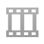
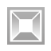
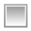
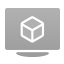
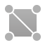

# Słowniczek Defold

Słowniczek ten zawiera krótkie opisy i wyjaśnienia wszystkich terminów jakie spotkasz w środowisku Defold. W większości przypadków znajdziesz też linki do bardziej szczegółowych opisów. (Pozostawiam nazwy pojęć w oryginale, natomiast w nawiasie przedstawiam polskie tłumaczenie - przyp. tłum.)

## Animation set (Zestaw do animowania)

{.left} Zestaw do animowania zawiera listę plików .dae lub innych .animationset, z których odczytywać można animacje. Dodawnia jednego pliku .animationset do drugiego jest wygodne przy udostępnianiu części animacji wielu modelom. Więcej szczegółów znajdziesz w [instrukcji do grafiki 3D](/manuals/graphics/).

## Atlas (Galeria obrazów)

{.left} Atlas (Galeria) jest zestawem zawierającym oddzielne obrazy/sprite'y, które są skomponowane w jeden większy arkusz z powodów wydajności i zarządzania pamięcią. Mogą zawierać statyczne obrazki lub klatki animacji poklatkowej (typu flip-book). Zestawy te są używane zarówno w systemie GUI, do komponentów typu sprite, spine model czy particleFX. Więcej szczegółów znajdziesz w [dokumentacji do Atlasów](/manuals/atlas).

## Builtins (Wbudowane elementy)

{.left} Folder builtins Twojego projektu zawiera użyteczne, domyślne zasoby, możliwe tylko do odczytu. Znajdziesz tutaj domyślny renderer i skrypt do renderowania (tworzenia i wyświetlania grafiki), materiały i wiele więcej. Jeśli chcesz przeprowadzić modyfikacje takich zasobów, po prostu skopiuj je do swojej lokalizacji i edytuj wedle uznania.

## Camera (Kamera)

{.left} Komponent typu kamera pomaga decydować, które fragmenty świata gry zostaną wyświetlone i w jaki sposób. Jednym z częstszych zastosowań kamery jest przyeczepienie jej to obiektu gracza, lub osobnego obiektu podążającego za obiektem gracza, aby podążąć widokiem za jego ruchem, np. z dodatkowym algorytmem wygładzającym ruch. Więcej szczegółów znajdziesz w [dokumentacji do Kamery](/manuals/camera).

## Collision object (Obiekty kolizji)

{.left} Obiekty kolizji są komponentami umożliwiającymi zdefiniowanie właściwości fizycznych obiektów (takich jak kształt kolizji, wagę, współczynnik tarcia czy tłumienia). Właściwości te określają jak obiekty kolizji powinny reagować na zderzenie z innymi obiektami. Najpopularniejszym typem kolizji są kolizje obiektów kineamtycznych, dynamicznych or triggery (przełączniki/aktywatory). Obiekt kinematyczny daje szczegółowe informacje Tobie w wiadomości zwrotnej po kolizji i możesz je wykorzystać w dowolny sposób. Natomiast obiekt dynamiczny automatycznie jest rozwiązywany przez silnik fizyczny w zgodzie z prawami Newtonowskiej fizyki klasycznej. Triggery (przełączniki) są prostymi obiektami, które informują Cię jedynie czy w danej chwili weszły w kolizję z innymi obiektami, bądź z takiej kolizji wyszły. Więcej szczegółów znajdziesz w [dokumentacji do Fizyki](/manuals/physics).

## Component (Komponent)

Komponenty pozwalają nadać obiektowi gry specyficzne właściwości lub funkcjonalności, jak na przykład reprezentację graficzną, tekstową, dźwiękową czy skrypt definiujący zachowanie obiektu. Muszą być częścią innego obiektu, nie mogą zostać utworzone w grze same, za to mogą być w ramach danego obiektu aktywowane i dezaktywowane. W silniku Defold jest wiele różnych typów komponentów - ich listę i opisy znajdziesz w [instrukcji do Komponentów](/manuals/building-blocks).

## Collection (Kolekcja)

{.left} Kolekcje są mechanizmem w Defoldzie na tworzenie szablonów ("blueprintów" czy też "prefabów", jak w innych silnikach), w ramach których można wykorzystywać daną hierarchię obiektów gry. Kolekcję są plikami ze strukturą drzewa przetrzymującą w sobie obiekty gry i inne kolekcje. Są umieszczane w grzze statycznie, na poziomie edytora lub dynamicznie przez fabrykę kolekcji. Więcej szczegółów znajdziesz w [instrukcji do Komponentów](/manuals/building-blocks).

## Collection factory (Fabryka kolekcji)

{.left} Fabryka kolekcji jest używana do utworzenia dynamicznie instancji obiektów gry zgodnie z opisaną w kolekcji hierarchią. Więcej szczegółów znajdziesz w [instrukcji do Fabryki kolekcji](/manuals/collection-factory).

## Collection proxy (Pełnomocnik kolekcji)

{.left} Pełnomocnik kolekcji jest używany do wczytywania i aktywowania kolekcji dynamicznie w zależności od potrzeby w czasie działania programu. Przykładem najczęstszego wykorzystania jest użycie pełnomocników do wczytywania poziomów gry. Więcej szczegółów znajdziesz w [dokumentacji do Pełnomocnika kolekcji](/manuals/collection-proxy).

## Cubemap (Tekstura sześcienna)

{.left} Tekstura sześcienna (cubemap) jest specjalną teksturą składającą się z 6 różnych tekstur, które po "złożeniu" mogą utworzyć sześcian (siatka sześcianu). Jest używana do tworzenia tzw. skybox'ów, czyli nieba w grach 3D lub w różnych mapowaniach odbić i odblasków.

## Debugging (Debugowanie)

Kiedy Twoja gra w pewnym momencie zachowuje się w nieoczekiwany sposób, musisz zrozumieć co się dokładnie dzieje i co jest tego przyczyną. Nauczenie się jak debugować jest sztuką, a Defold ułatwia debugowanie dostarczając zestaw gotowych narzędzi - wbudowany debugger. Więcej szczegółów znajdziesz w [instrukcji do Debugowania](/manuals/debugging).

## Display profiles (Profile wyświetlania)

{.left} Profile wyświetlania określają zależności orientacji, współczynnika proporcji czy modelu i ułożenia elementów systemu interfejsu graficznego użytkownika (GUI). Pomaga to zaadaptować Twój interfejs do każdego urządzenia. Więcej szczegółów znajdziesz w [instrukcji do Layout'ów](/manuals/gui-layouts).

## Factory (Fabryka)

{.left} W pewnych przypadkach nie chcesz umieszczać wszystkich elementów w grze statycznie, tylko chcesz stworzyć je w trakcie działania proramu, dynamicznie. Na przykład, gracz może strzelać pociskami, z których każdy powinien być dynamicznie stworzony w momencie wystrzelenia. Do utworzenia obiektu gry dynamicznie (z pre-alokowanej puli obiektów) możesz użyć właśnie Fabryki. Więcej szczegółów znajdziesz w [instrukcji do Fabryki](/manuals/factory).

## Font (Czcionka)

{.left} Plik Font jest budowany na podstawie plików TrueType lub OpenType i służy do określania wyświetlania w programie czcionki oraz dodatkowych efektów (obrysowanie, cienie) do celów renderowania tekstu. Fonty są używane przez komponenty typu GUI i Label (Etykieta). Więcej szczegółów znajdziesz w [instrukcji do Fontów](/manuals/font/).

## Fragment shader (Shader fragmentu)

{.left} Shader to specjalny program, który jest uruchamiany na karcie graficznej dla każdego rysowanego piksela (fragmentu) w wielokącie (polygon) w momencie rysowania go na ekranie. The purpose of the fragment shader is to decide the color of each resulting fragment. This is done by calculation, texture lookups (one or several) or a combination of lookups and computations. Więcej szczegółów znajdziesz w [instrukcji do Shader'ów](/manuals/shader).

## Gamepads (Kontroler)

{.left} Plik Gamepads określa w jaki sposób wejścia określonych kontrolerów są mapowane na wejścia na daną platformę. Więcej szczegółów znajdziesz w [instrukcji do Wejść](/manuals/input).

## Game object (Obiekt gry)

{.left} Obiekt gry to najprostszy i podstawowy obiekt w Defoldzie, który ma osobny czas życia w trakcie wykonywanego programu i określone właściwości co do pozycji, orientacji i skali. Obiekt gry jest kontenerem mogącym posiadać innego komponenty (wizualne czy dźwiękowe) lub logikę (skrypt). Możesz tworzyć obiektu gry w edytorze, umieszczając ich instancje bezpośrednio w kolekcjach lub tworzyć je dynamicznie w trakcie działania programu pporzez fabryki. Więcej szczegółów znajdziesz w [instrukcji do Podstawowych elementów](/manuals/building-blocks).

## GUI (Interfejs graficzny użytkownika)

{.left} Interfejs graficzny użytkownika (ang. Graphical User Interface) jest komponentem używanym do skonstruowania elementów interfejsu w grze lub aplikacji: tekstu, przycisków, pasków, indykatorów i innych oteksturwanych bloków. Mogą one być zorganiozwane w hierarchii, oskryptowane i animowane. Komponenty GUI są typowo wykorzystywane do tworzenia HUD (ang. Head-up display), menu i innych informacji wyświetlanych na ekranie (np. paski życia, minimapy, opisy celów, itd.). Są kontrolowane przez specjalne skrypty GUI, które definiują ich zachowanie i odpowiadają na interakcję użytkownika z nimi. Więcej szczegółów znajdziesz w [dokumentacji do GUI](/manuals/gui).

## GUI script (skrypt GUI)

{.left} Skrypty interfejsu graficznego użytkownika są używane do kontrolowania zachowania komponentów GUI. Mogą przykładowo kontrolować animację tekstur na danych węzłach/elementach lub sposób w jaki użytkownik dokonuje interakcji z elementami. Więcej szczegółów znajdziesz w [instrukcji do skryptów w Defoldzie pisanych w języku Lua](/manuals/lua).

## Hot reload (Szybkie przeładowanie)

Edytor Defold pozwala na szybkie zaktualizowanie już uruchomionej gry na pulpicie komputera lub ekranie smartfona bez przebudowywania całości. Taka opcja znacząco ułatwia proces tworzenia gier i aplikacji. Więcej szczegółów znajdziesz w [instrukcji do Hot reload](/manuals/hot-reload).

## Input binding (Wiązania wejść)

{.left} Pliki z wiązaniami wejść określają w jaki sposób gra powinna interpretować wejścia sprzętowe (myszki, klawiatury, wejścia z ekranów dotykowych czy gamepadów). Plik ten wiąże wejścia sprzętowe z wysokopoziomowymi _akcjami_ takimi jak np. "skok" and "ruch_naprzód". W skryptach, które nasłuchują wejść można takie wydarzenia obsłużyć i wykonać wtedy dane akcje. Więcej szczegółów znajdziesz w [dokumentacji do Wejść](/manuals/input).

## Label (Etykieta)

{.left} Komponent typu Etykieta umożliwia przypisanie tekstowego elementu do danego obiektu gry. Wyświetla on tekst w określonym foncie (czcionce) w przestrzeni gry (nie GUI). Więcej szczegółów znajdziesz w [instrukcji do Etykiet](/manuals/label).

## Library (Biblioteka)

{.left} Defold pozwala w łatwy sposób udostępnić zasoby i dane pomiędzy projektami poprzez mechanizm bibliotek. Możesz go używać do uzyskania dostępu do współdzielonych pomiędzy różnymi projektami bibliotek dla siebie lub członków Twojego zespołu. Więcej szczegółów znajdziesz w [dokumentacji do Bibliotek](/manuals/libraries).

## Lua language (język Lua)

Lua jest językiem programowania wykorzystywanym przez Defold do tworzenia logiki gry. To potężny, wydajny i bardzo lekki język skryptowy. Wspiera programowanie proceduralne, funkcyjne, zorientowane obiektowo i na danych (data-driven) oraz opis danych. Więcej szczegółów  na temat Lua znajdziesz na oficjalnej stronie języka: https://www.lua.org/ oraz w [instrukcji do skryptów w Defoldzie pisanych w języku Lua](/manuals/lua).

## Lua module (Moduł Lua)

{.left} Moduły Lua pozwalają na stworzenie bibliotek, których można używać wielokrotnie i tym samym zdefiniowanie przejrzystej struktury projektu.  Więcej szczegółów znajdziesz w [instrukcji do modułów Lua](/manuals/modules/)

## Material (Materiał)

{.left} Materiały definiują jak obiekt ma być renderowany i wyświetlany poprzez wykorzystanie właściwości i odpowiednich programów wykonywanych na karcie graficznej - shaderów. . Więcej szczegółów znajdziesz w [instrukcji do Materiałów](/manuals/material).

## Message (Wiadomość)

Komponenty komunikują się ze sobą poprzez wbudowany w Defolda system wiadomości. Komponenty mogą również automatycznie odpowiadać na pewne specjalne wiadomości, które mogą je aktywować/dezaktywować grafikę albo kolizje, uruchomić/zatrzymać animację, efekt cząsteczkowy czy dźwięk i wiele innych rzeczy. Silnik wykorzystuje wiadomości również do informowania komponentów o wydarzeniach (np. kolizacj silnika fizyki). System wiadomości musi znać odbiorcę danej wiadomości, aby ją do niego przesłać. Dlatego wszystko w czasie działania programu ma swój unikalny adres. Aby umożliwić komunikację między obiektami, Defold poszerza Lua o przesyłanie wiadomości i oddaje w ręce użytkowników zestaw potrzebnych funkcji.

Na przykład, kod do ukrycia reprezentacji graficznej broni gracza (sprite "weapon") wygląda w Lua tak:

```lua
msg.post("#weapon", "disable")
```

Gdzie, `"#weapon"` jest adresem komponentu obecnego obiektu (z którego wysłana jest ta wiadomość). `"disable"` jest właśnie treścią specjalnej wiadomości silnika, na którą odpowie sprite. Więcej szczegółów znajdziesz w [dokumentacji do przesyłania wiadomości](/manuals/message-passing).

## Model

{.left} Model jest rozwiązaniem do stworzenia obiektu 3D w Defoldzie z siatką Collada, szkieletem, teksturami i animacją. Więcej szczegółów znajdziesz w [instrukcji do Modeli](/manuals/model/).

## ParticleFX (Efekt cząsteczkowy)

{.left} Efekty cząsteczkowe są szczególnymi efektami wizualnymi, które wykorzystują wiele elementów (cząsteczek) do stworzenia określonych efektów (np. dym, kurz, mgła, błyski, iskry, deszcz, plusk, ogień, spadające liście, gwiazdy, itd.). Defold zawiera potężny edytor efektów cząsteczkowych, który pozwala zbudować przeróżne efekty i dopasować je nawet podczas działania programu. Więcej szczegółów znajdziesz w [dokumentacji do ParticleFX](/manuals/particlefx).

## Profiling (Profilowanie)

Wysoka wydajność jest kluczowa w grach, więc dla deweloperów jest niezwykle ważne, żeby móc monitorować wydajność i pamięć Twojej gry i zidentyfikować wąskie gardła i problemy z pamięcią, które wymagają naprawy. Defold oddaje więc w ręce twórców zestaw narzędzi do profilowania. Więcej szczegółów znajdziesz w [instrukcji do Profilowania](/manuals/profiling).

## Render

{.left} Pliki typu Render zawierają ustawienia używane podczas renderowania i wyświetlania grafiki w Twojej grze. Definiują one, który skrypt do renderowania i jakie materiały będą wykorzystywane. Więcej szczegółów znajdziesz w [instrukcji do Renderowania](/manuals/render/).

## Render script (skrypt do renderowania)

{.left} Skrypt do renderowania jest specjalnym skryptem w języku Lua kontrolującym jak gra lub aplikacja jest renderowana i wyświetlana na ekranie urządzenia. Domyślnie projekt używa domyślnego skryptu renderowania, ale nic nie stoi na przeszkodzie, żeby używać innego lub własnego skryptu, wspierającego przykładowo oświetlenie czy inne efekty wizualne. Więcej szczegółów znajdziesz w [instrukcji do Renderowania](/manuals/render/) oraz w [instrukcji do skryptów w Defoldzie pisanych w języku Lua](/manuals/lua) for details on how Lua scripts are used in Defold.

## Script (Skrypt)

{.left}  Skrypt jest komponentem zawierającym w sobie program (kod w języku Lua), który definiuje zachowanie obiektu. Dzięki skryptom można określić zasady gry, sztucznej inteligencji, odpowiedzieć na interakcję użytkownika lub z innymi obiektami albo zaktualizować stan świata gry. Żeby sprawnie pracować z silnikiem Defold, Ty lub ktokolwiek z Twojego zespołu musi zaznajomić się z programowaniem w Lua. Więcej szczegółów znajdziesz w [instrukcji do skryptów w Defoldzie pisanych w języku Lua](/manuals/lua).

## Sound (Dźwięk)

{.left} Komponent dźwiękowy jest odpowiedzialny za odtwarzanie określonego pliku dźwiękowego. Obecnie Defold wspiera formaty WAV i OGG Vorbis. Więcej szczegółów znajdziesz w [instrukcji do Dźwięków](/manuals/sound).

## Spine model (Model szkieletowy)

{.left} Model szkieletowy wykorzystuje animację szkieletową Spine do tworzenia animacji w Defoldzie. Więcej szczegółów znajdziesz w [instrukcji do modeli Spine](/manuals/spinemodel).

## Spine scene (Scena Spine)

{.left} Scena Spine to specjalnyu zasób, który wiąże format Spine JSON i Defoldowy plik Atlas (galerię obrazów), aby zapełnić kości szkieletu animacji odpowiednimi grafikami. Więcej szczegółów znajdziesz w [instrukcji do animacji szkieletowej Spine](/manuals/spine).

## Sprite (Obraz)

{.left} Sprite nadaje obiektowi gry reprezentację wizualną z wykorzystaniem pojedynczej (animowanej) grafiki. Wyświetla obraz albo z pliku Tile source albo z pliku Atlas. Sprite'y mają wbudowane wsparcie dla animacji poklatkowych (flip-book) i szkieletowych. Są najczęściej używane do przedstawienia postaci i obiektów w grach 2D.

## Texture profiles (Profile teksturowania)

{.left} Profile teksturowania używane są podczas procesu pakowania (bundling), aby automatycznie dostosować i skompresować obrazy (w Atlasach, źródłach kafelków (Tile sources), siatkach sześcianowych (Cubemaps) i pojedynczych teksturach używanych do modeli czy GUI, etc). Więcej szczegółów znajdziesz w [instrukcji do Profili teksturowania](/manuals/texture-profiles).

## Tile map (Mapa kafelków)

{.left} Mapa kafelków wyświetla obrazy z określonego źródła kafelków (tile source) na jednej lub więcej siatkach. Są najczęściej używane do tworzenia środowisk w grach: poziomów, ścian, budynków, przeszkód, jaskiń, etc. Tile map może wyświetlać kilka warstw, jedna nad drugą, w określony sposób (blend mode). Jest to przydatne, żeby np. umieścić liście czy trawę nad kafelkami w tle. Jest również możliwa dynamiczna podmiana obrazka każdego kafelka osobno, co umożliwia, przykładowo, zniszczenie mostu, zastępując odpowiednie kafelki mostu ich zniszczonymi wersjami oraz podmienienie kształtu fizycznych kolizji (stworzenie przerwy w moście). Więcej szczegółów znajdziesz w [dokumentacji do Tile map](/manuals/tilemap).

## Tile source (Galeria kafelków)

{.left} Źródło/galeria kafelków podobnie jak Atlas opisuje teksturę stworzoną z wielu mniejszych obrazów o tych samych wymiarach, tzw. kafelków (ang. tiles). Można zdefiniować tutaj animacje poklatkowe (flip-book) z sekwencji występujących po sobie kolejno obrazków/kafelków. Galerie kafelków pomagają również automatycznie tworzyć kształty kolizji na podstawie danego obrazka, co znacznie ułatwia tworzenie poziomów w grach i od razu stworzenie kształtu kolizji całego poziomu. Galerie kafelków są używane w Mapach kafelków (Tile Map), ale również mogą być użyte jako tekstura do Sprite'ów i efektów cząsteczkowych (ParticleFX). Więcej szczegółów znajdziesz w [dokumentacji do Tile map](/manuals/tilemap).

## Vertex shader (Shader wierzchołków)

{.left} Shader wierzchołków to specjlany program wykonywany na karcie graficznej, którego zadaniem jest przetwarzanie trójwymiarowej geometrii elementarnych kształtów - wielokątów (ang. polygon) na ekran urządzenia. Dla każego elementu wizualnego (sprite, model Spine czy 3D) kształt jest reprezentowant przez zestaw wielokątów z określonymi pozycjami wierzchołków w przestrzeni. Shader wierzchołków przetwarza każdy z wierzchołków w przestrzeni i oblicza wynikowe współrzędne na ekranie. Więcej szczegółów znajdziesz w [instrukcji do Shader'ów](/manuals/shader).
