# Słowniczek Defold

Ten słowniczek udziela krótkich wyjaśnień dla terminów, które napotkasz podczas pracy z silnikiem Defold. W większości przypadków zamieszczamy też odnośniki do obszerniejszych opisów.

## Animation set (Zestaw do animowania)

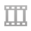{.left} Zestaw do animowania zawiera listę plików `.dae` lub innych plików `.animationset`, z których odczytywane są animacje. Dodawanie jednego pliku `.animationset` do drugiego jest przydatne, gdy chcesz udostępnić fragmenty animacji kilku modelom. Szczegóły znajdziesz w [instrukcji do animacji modeli 3D](/manuals/model-animation/).

## Atlas (Galeria obrazów)

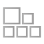{.left} Atlas to zbiór osobnych obrazów skompilowanych w większy arkusz, co poprawia wydajność i oszczędza pamięć. Atlasy mogą zawierać statyczne grafiki lub zestawy klatek animacji poklatkowej. Różne komponenty korzystają z atlasów, aby współdzielić zasoby graficzne. Więcej w [dokumentacji do Atlasów](/manuals/atlas).

## Builtins (Wbudowane elementy)

{.left} Folder `builtins` w projekcie zawiera domyślne, tylko do odczytu zasoby. Znajdziesz tam domyślny renderer, skrypt renderujący, materiały i inne elementy. Jeśli potrzebujesz zmodyfikować któryś z tych zasobów, skopiuj go do projektu i edytuj według potrzeb.

## Camera (Kamera)

{.left} Komponent kamery decyduje, która część świata gry ma być widoczna i jak ma być rzutowana. Powszechną praktyką jest przypinać kamerę do obiektu gracza albo tworzyć osobny obiekt, który podąża za graczem z dodatkowym wygładzaniem. Więcej w [dokumentacji do Kamery](/manuals/camera).

## Collision object (Obiekt kolizji)

{.left} Obiekty kolizji rozszerzają obiekty gry o właściwości fizyczne, takie jak kształt przestrzenny, masa, tarcie i tłumienie. To one decydują, jak dany obiekt reaguje na kontakt z innymi. Najczęściej spotykane typy to obiekty kinematyczne, dynamiczne i wyzwalacze. Kinematyczny obiekt dostarcza szczegółowe informacje o kolizji, które możesz obsłużyć ręcznie, dynamiczny obiekt jest symulowany przez silnik fizyki zgodnie z prawami Newtona, a wyzwalacze wykrywają tylko wejście lub wyjście innych kształtów. Szczegóły w [dokumentacji do Fizyki](/manuals/physics).

## Component (Komponent)

Komponenty nadają obiektom gry konkretną ekspresję lub funkcjonalność, na przykład grafikę, animację, zachowanie zdefiniowane skryptem czy dźwięk. Nie żyją osobno — muszą należeć do obiektów gry. W silniku Defold dostępnych jest wiele rodzajów komponentów, opisanych w [instrukcji o blokach budujących](/manuals/building-blocks).

## Collection (Kolekcja)

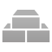{.left} Kolekcje to mechanizm pozwalający tworzyć szablony (prefaby) zawierające hierarchie obiektów gry. Są strukturami drzewa przechowującymi obiekty gry i inne kolekcje. Kolekcje przechowywane są jako pliki i wprowadza się je do gry statycznie przez edytor lub dynamicznie przez generowanie. Więcej w [instrukcji o blokach budujących](/manuals/building-blocks).

## Collection factory (Fabryka kolekcji)

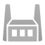{.left} Fabryka kolekcji pozwala dynamicznie tworzyć hierarchie obiektów gry zgodne z opisem w kolekcji. Szczegóły w [instrukcji do Fabryki kolekcji](/manuals/collection-factory).

## Collection proxy (Pełnomocnik kolekcji)

{.left} Pełnomocnik kolekcji służy do ładowania i aktywowania kolekcji w trakcie działania aplikacji. Najczęściej używa się go do wczytywania kolejnych poziomów. Zobacz [dokumentację do Pełnomocników kolekcji](/manuals/collection-proxy).

## Cubemap (Tekstura sześcienna)

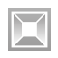{.left} Tekstura sześcienna (cubemap) to specjalny typ tekstury złożony z sześciu osobnych obrazów mapowanych na ściany sześcianu. Przydatna do renderowania skyboxów oraz map odbić i oświetlenia.

## Debugging (Debugowanie)

Kiedy gra zaczyna zachowywać się nieoczekiwanie, musisz odnaleźć przyczynę. Nauka debugowania jest sztuką, a Defold oferuje wbudowany debugger, który ułatwia to zadanie. Więcej w [instrukcji do Debugowania](/manuals/debugging).

## Display profiles (Profile wyświetlania)

{.left} Plik profilu wyświetlania pozwala określić układy GUI zależne od orientacji, proporcji obrazu lub modelu urządzenia. Dzięki temu można dostosować interfejs do różnorodnych ekranów. Więcej w [instrukcji do Układów](/manuals/gui-layouts).

## Factory (Fabryka)

{.left} Czasem nie chcesz tworzyć wszystkich obiektów gry ręcznie w kolekcji — potrzebujesz ich w czasie działania gry. Fabryka umożliwia dynamiczne tworzenie takich obiektów z wcześniej przygotowanej puli. Zobacz [instrukcję do Fabryki](/manuals/factory).

## Font (Czcionka)

{.left} Zasób typu Font powstaje na podstawie pliku TrueType lub OpenType i określa rozmiar oraz dekoracje (np. obrys, cień) renderowanej czcionki. Fonty wykorzystują komponenty GUI i Label. Więcej w [instrukcji do Fontów](/manuals/font/).

## Fragment shader (Shader fragmentu)

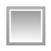{.left} Shader fragmentu to program uruchamiany na procesorze graficznym dla każdego piksela (fragmentu) rysowanego wielokąta. Określa kolor wynikowego fragmentu, wykonując obliczenia, odczyty tekstur lub ich kombinacje. Szczegóły w [instrukcji do Shaderów](/manuals/shader).

## Gamepads (Kontrolery)

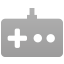{.left} Plik Gamepads definiuje sposób mapowania wejść ze konkretnych kontrolerów na wyzwalacze wejścia dostępne dla danej platformy. Więcej w [instrukcji do Wejść](/manuals/input).

## Game object (Obiekt gry)

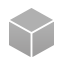{.left} Obiekty gry to kontenery ze swoim cyklem życia podczas działania gry. Zazwyczaj zawierają komponenty wizualne albo dźwiękowe oraz mogą mieć zachowanie opisane skryptem. Tworzy się je w edytorze, umieszczając w kolekcjach, albo dynamicznie przez fabryki. Szczegóły w [instrukcji o blokach budujących](/manuals/building-blocks).

## GUI (Interfejs graficzny użytkownika)

{.left} Komponent GUI zawiera elementy interfejsu: tekst, kolorowe lub teksturowane bloki. Elementy można organizować hierarchicznie, skryptować i animować. GUI służy do HUD, menu i powiadomień. Steruje nim skrypt GUI, który opisuje zachowanie i interakcje użytkownika. Więcej w [dokumentacji do GUI](/manuals/gui).

## GUI script (Skrypt GUI)

{.left} Skrypty GUI kontrolują zachowanie komponentów GUI — animacje, reakcje na wejścia i inne interakcje. Zobacz [instrukcję o Lua w silniku Defold](/manuals/lua), aby dowiedzieć się, jak są wykorzystywane.

## Hot reload (Szybkie przeładowanie)

Edytor Defold pozwala aktualizować zawartość w uruchomionym programie na desktopie i urządzeniach mobilnych. Ta funkcja przyspiesza pracę przy rozwoju gry. Więcej w [instrukcji do Hot reload](/manuals/hot-reload).

## Input binding (Wiązania wejść)

{.left} Pliki wiązań wejść określają, jak interpretować sygnały z myszy, klawiatury, ekranu dotykowego czy gamepada. Wiążą sprzętowe wejścia z wysokopoziomowymi akcjami, takimi jak `jump` czy `move_forward`. Skrypty nasłuchujące wejść reagują na te akcje w sposób określony przez twórcę. Więcej w [instrukcji do Wejść](/manuals/input).

## Label (Etykieta)

{.left} Komponent Label umożliwia przypisanie tekstu do obiektu gry. Renderuje go przy użyciu wybranego fontu, w przestrzeni gry (nie GUI). Więcej w [instrukcji do Etykiet](/manuals/label).

## Library (Biblioteka)

{.left} Defold pozwala współdzielić dane między projektami za pomocą bibliotek. Możesz z nich korzystać w wielu projektach, dla siebie lub zespołu. Szczegóły w [dokumentacji do Bibliotek](/manuals/libraries).

## Lua language (Język Lua)

Lua to język skryptowy wykorzystywany do tworzenia logiki gry w silniku Defold. Jest mały, wydajny i wspiera programowanie proceduralne, obiektowe, funkcyjne oraz data-driven. Więcej na oficjalnej stronie https://www.lua.org/ oraz w [instrukcji do Lua](/manuals/lua).

## Lua module (Moduł Lua)

{.left} Moduły Lua pozwalają tworzyć struktury wielokrotnego użytku i czytelnie organizować kod. Więcej w [instrukcji do modułów Lua](/manuals/modules/).

## Material (Materiał)

{.left} Materiały opisują sposób renderowania obiektów przez przypisanie shaderów i ich właściwości. Więcej w [instrukcji do Materiałów](/manuals/material).

## Message (Wiadomość)

Komponenty komunikują się poprzez przesyłanie wiadomości silnika Defold. Mogą też automatycznie reagować na określone wiadomości, np. włączać/wyłączać grafikę, kolizje, animacje, efekty cząsteczkowe lub dźwięk. Silnik używa wiadomości do informowania o zdarzeniach, jak kolizje. System wiadomości potrzebuje odbiorcy, więc wszystko w grze ma unikalny adres. Aby ułatwić komunikację, Defold rozszerza Lua o mechanizm przechwytywania i wysyłania wiadomości oraz dostarcza przydatne funkcje.

Przykładowo, aby ukryć sprite `weapon`, wystarczy:

```lua
msg.post("#weapon", "disable")
```

`"#weapon"` to adres komponentu, z którego wysyłana jest wiadomość, a `"disable"` to nazwa wiadomości, na którą reaguje sprite. Więcej w [dokumentacji do przesyłania wiadomości](/manuals/message-passing).

## Model (Model)

{.left} Komponent Model umożliwia import siatek, szkielety i animacje z formatu glTF do gry. Więcej w [instrukcji do Modeli](/manuals/model/).

## ParticleFX (Efekt cząsteczkowy)

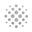{.left} Efekty cząsteczkowe pomagają tworzyć wizualne efekty, takie jak mgła, ogień, deszcz czy spadające liście. Defold wyposażono w edytor ParticleFX, który pozwala budować i dopasowywać efekty w czasie rzeczywistym. Więcej w [dokumentacji do ParticleFX](/manuals/particlefx).

## Profiling (Profilowanie)

Dobra wydajność jest kluczowa, dlatego warto mierzyć wydajność i pamięć gry, aby wykryć wąskie gardła. Defold udostępnia narzędzia do profilowania. Szczegóły w [instrukcji do Profilowania](/manuals/profiling).

## Render (Render)

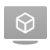{.left} Pliki Render zawierają ustawienia używane podczas renderowania gry — określają, który render script i materiały mają być użyte. Więcej w [instrukcji do Renderowania](/manuals/render/).

## Render script (Skrypt do renderowania)

{.left} Skrypt do renderowania to skrypt Lua sterujący tym, jak gra jest renderowana na ekranie. Domyślny skrypt pokrywa większość scenariuszy, ale możesz napisać własny, jeśli potrzebujesz niestandardowych efektów lub oświetlenia. Więcej w [instrukcji do Renderowania](/manuals/render/) oraz w [instrukcji do Lua](/manuals/lua).

## Script (Skrypt)

{.left} Skrypt to komponent zawierający kod, który definiuje zachowanie obiektu gry. Dzięki skryptom ustalasz reguły gry, reagujesz na interakcje i aktualizujesz stan świata. Wszystkie skrypty pisze się w Lua — aby pracować z silnikiem Defold, ty lub ktoś z zespołu musi poznać ten język. Więcej w [instrukcji do Lua](/manuals/lua).

## Sound (Dźwięk)

{.left} Komponent dźwiękowy odtwarza określony plik audio. Defold wspiera formaty WAV i Ogg Vorbis. Więcej w [instrukcji do Dźwięków](/manuals/sound).

## Sprite (Obraz)

{.left} Sprite to komponent graficzny, który wyświetla obraz z Tile source lub Atlasu. Obsługuje animacje poklatkowe i oparte na kościach. Sprite’y najczęściej reprezentują postacie i przedmioty w grach 2D.

## Texture profiles (Profile teksturowania)

{.left} Profile teksturowania używane są podczas bundlingu, aby automatycznie przetwarzać i kompresować dane obrazowe (w atlasach, Tile sources, cubemapach i osobnych teksturach używanych w modelach czy GUI). Więcej w [instrukcji do Profili teksturowania](/manuals/texture-profiles).

## Tile map (Mapa kafelków)

{.left} Mapa kafelków wyświetla obrazy z Tile source na jednej lub kilku warstwach siatki. Można używać jej do tworzenia poziomów, ścian, budynków, przeszkód czy jaskiń. Obsługuje wiele warstw w różnych trybach mieszania i pozwala na dynamiczną podmianę pojedynczych kafelków (np. żeby zniszczyć most i zmienić kolizje). Więcej w [dokumentacji do Tile map](/manuals/tilemap).

## Tile source (Galeria kafelków)

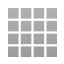{.left} Tile source to tekstura składająca się z wielu mniejszych obrazów tej samej wielkości, czyli kafelków. Można z niej tworzyć animacje poklatkowe, a także automatycznie generować kształty kolizji. Tile source używa się w Tile mapach, ale też jako teksturę do sprite’ów i efektów cząsteczkowych. Więcej w [dokumentacji do Tile map](/manuals/tilemap).

## Vertex shader (Shader wierzchołków)

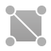{.left} Shader wierzchołków to program uruchamiany na GPU, który przetwarza geometrię siatek (wielokąty) i oblicza końcowe pozycje wierzchołków na ekranie. Więcej w [instrukcji do Shaderów](/manuals/shader).
