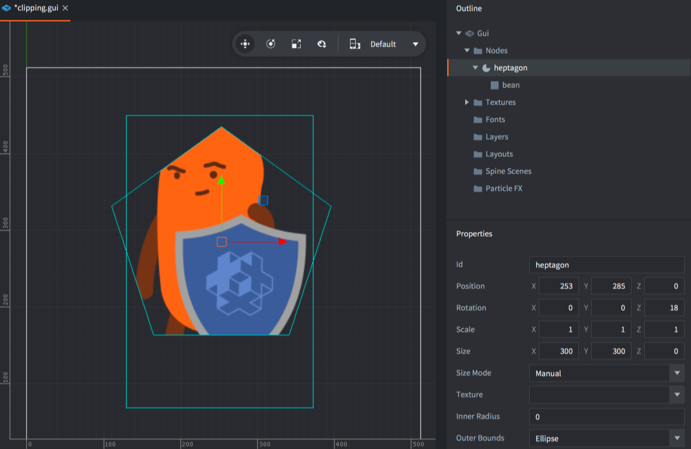
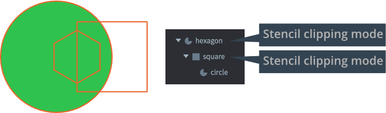
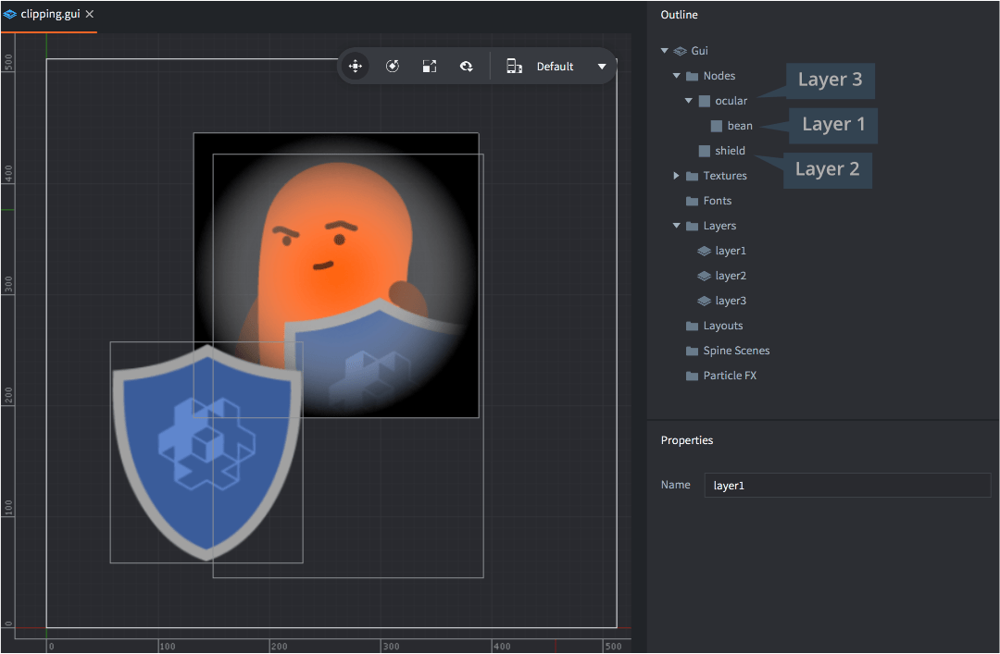

# Wycinanie GUI

Węzły GUI można wykorzystać jako węzły wycinające (*clipping* nodes) - maski kontrolujące, jak renderowane są inne węzły. Ta instrukcja wyjaśnia, jak działa ta funkcjonalność.

## Tworzenie węzła wycinającego

Węzły typu Box, Text i Pie można wykorzystać jako węzły wycinające. Aby utworzyć węzeł wycinający, dodaj węzeł do swojego GUI, a następnie ustaw jego właściwości odpowiednio:

Clipping Mode
: Tryb używany do wycinania.

  - `None` renderuje węzeł bez jakiegokolwiek wycinania.
  - `Stencil` - maska - sprawia, że węzeł zapisuje bieżącą maskę wycięcia.

Clipping Visible
: Zaznacz, aby renderować zawartość węzła.

Clipping Inverted
: Zaznacz, aby zapisać odwrócenie kształtu węzła w masce.

Następnie dodaj węzeł lub węzły, które chcesz wyciąć jako dzieci węzła wycinającego.

{srcset="images/gui-clipping/create@2x.png 2x"}

## Maska wycinająca

Wycinanie działa poprzez zapisywanie węzłów do bufora wycinania (*stencil buffer*). Ten bufor zawiera maski wycinania: informacje, które mówią karcie graficznej, czy dany piksel powinien być renderowany, czy nie.

- Węzeł bez rodzica wycinającego, ale z ustawionym trybem wycinania `Stencil`, zapisuje swój kształt (lub odwrotny kształt) do nowej maski wycinania przechowywanej w buforze wycinania.
- Jeśli węzeł wycinający ma rodzica wycinającego, zamiast tego przycinany jest kształt maski wycinania rodzica. Węzeł dziecka wycinającego nie może _rozszerzać_ bieżącej maski wycinania, tylko ją dalej przycina.
- Węzły, które nie są węzłami wycinającymi i są dziećmi węzłów wycinających, zostaną wyrenderowane z maską wycinania stworzoną przez hierarchię rodzica.

{srcset="images/gui-clipping/setup@2x.png 2x"}

W tym przykładzie utworzono trzy węzły w hierarchii:

- Kształty szesciokąta i kwadratu to węzły przycinające stencil.
- Sześciokąt tworzy nową maskę wycinania, a kwadrat ją dodatkowo przycina.
- Węzeł koła to zwykły węzeł typu pie, więc zostanie wyrenderowany z maską wycinania utworzoną przez węzły nadrzędne.

Dla tej hierarchii możliwe są cztery kombinacje normalnych i odwróconych wycinaczy. Obszar zielony oznacza część koła, która jest renderowana. Reszta jest przycinana:

{srcset="images/gui-clipping/modes@2x.png 2x"}

## Ograniczenia maski wycinania

- Całkowita liczba wycinaczy maski nie może przekroczyć 256.
- Maksymalna głębokość zagnieżdżenia węzłów dzieci o typie _stencil_ wynosi 8 poziomów (tylko węzły z wycinaniem typu stencil się w to wliczają).
- Maksymalna liczba rodzeństwa węzłów maski wynosi 127. Dla każdego poziomu w dół hierarchii maski wycinania maksymalne ograniczenie jest dzielone na pół.
- Węzły odwrócone są droższe. Istnieje limit 8 węzłów wycinania z odwróceniem, a każdy z nich zmniejszy maksymalną liczbę węzłów wycinania bez odwracania na pół.
- Wycinacze renderują maskę wycinania z _geometrii_ węzła (nie tekstury). Możliwe jest odwrócenie maski, ustawiając właściwość *Inverted clipper*.

## Warstwy

Warstwy można wykorzystać do kontrolowania kolejności renderowania (i grupowania) węzłów. Podczas korzystania z warstw i węzłów wycinających standardowa kolejność warstw jest nadpisywana. Kolejność warstw zawsze ma pierwszeństwo przed kolejnością wycinania - jeśli przypisanie warstw jest łączone z węzłami wycinającymi, wycinanie może odbywać się poza kolejnością, jeśli węzeł nadrzędny z wycinaniem jest przypisany do wyższej warstwy niż jego dzieci. Dzieci bez przypisanej warstwy nadal będą przestrzegać hierarchii i zostaną narysowane i przycięte po rodzicu.

::: sidenote
Węzeł wycinania i jego hierarchia zostaną narysowane jako pierwsze, jeśli mają przypisaną warstwę, a w zwykłej kolejności, jeśli nie mają przypisanej warstwy.
:::

{srcset="images/gui-clipping/layers@2x.png 2x"}

W tym przykładzie zarówno węzły wycinające "Donut BG" i "BG" korzystają z tej samej warstwy 1. Kolejność renderowania między nimi będzie zgodna z kolejnością w hierarchii, gdzie "Donut BG" zostanie narysowane przed "BG". Jednak węzeł dziecka "Donut Shadow" jest przypisany do warstwy 2, która ma wyższy porządek warstw i zostanie narysowany po obu węzłach wycinających. W tym przypadku kolejność renderowania będzie następująca:

- Donut BG
- BG
- BG Frame
- Donut Shadow

Widzisz, że obiekt "Donut Shadow" zostanie przycięty przez oba węzły wycinające ze względu na warstwę, chociaż jest tylko dzieckiem jednego z nich.
