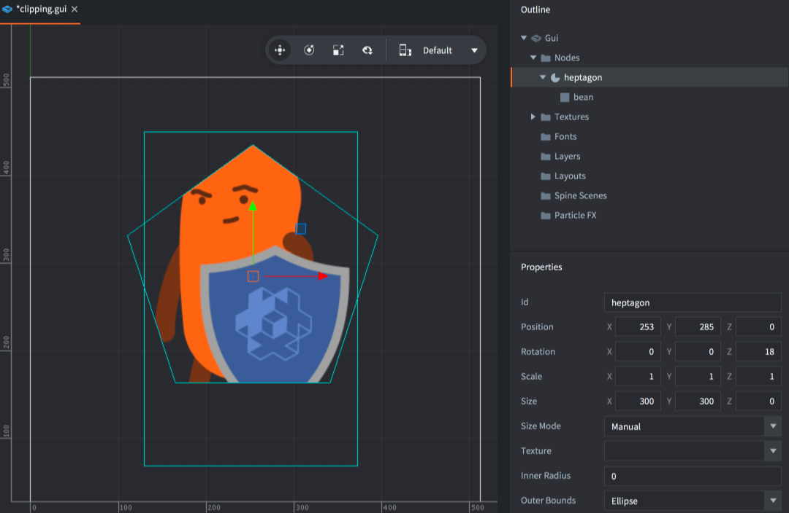
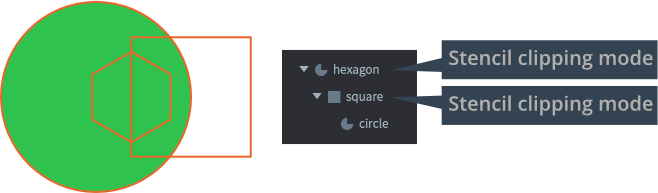
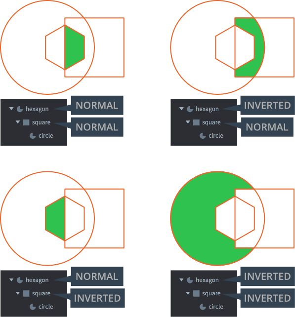
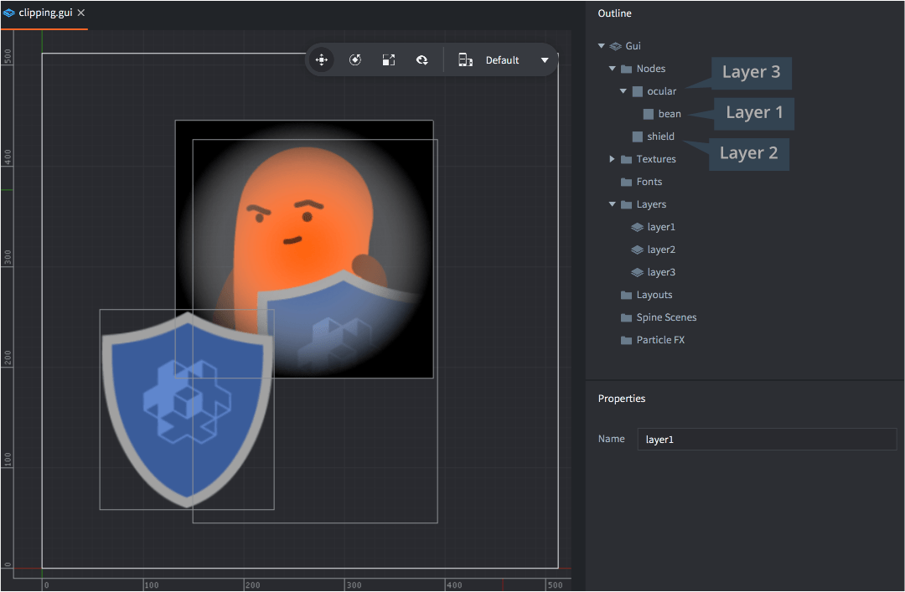

# Wycinanie

Węzły GUI można wykorzystać jako węzły *clipping* - maski kontrolujące sposób renderowania innych węzłów. Ta instrukcja wyjaśnia, jak działa ta funkcjonalność.

## Tworzenie węzła wycinającego

Węzły Box, Text i Pie można wykorzystać do wycinania. Aby utworzyć węzeł wycinający, dodaj węzeł w GUI, a następnie ustaw jego właściwości:

Clipping Mode
: Tryb używany do wycinania.

  - `None` renderuje węzeł bez wycinania.
  - `Stencil` sprawia, że węzeł zapisuje do bieżącej maski stencil.

Clipping Visible
: Zaznacz, aby renderować zawartość węzła.

Clipping Inverted
: Zaznacz, aby zapisać odwróconą wersję kształtu węzła w masce.

Następnie dodaj węzeł lub węzły, które chcesz wycinać, jako dzieci węzła wycinającego.

## Maska stencil

Wycinanie działa przez zapisywanie przez węzły do *stencil buffer*. Ten bufor zawiera maski wycinania, czyli informacje mówiące karcie graficznej, czy dany piksel ma zostać wyrenderowany.

- Węzeł bez rodzica wycinającego, ale z ustawionym trybem wycinania `Stencil`, zapisuje swój kształt (lub jego odwróconą wersję) do nowej maski wycinania przechowywanej w buforze stencil.
- Jeśli węzeł wycinający ma rodzica wycinającego, zamiast tego przycinana jest maska wycinania rodzica. Węzeł podrzędny wycinający nie może _rozszerzyć_ bieżącej maski wycinania, może ją tylko dalej przycinać.
- Węzły, które nie są węzłami wycinającymi i są dziećmi węzłów wycinających, zostaną wyrenderowane z maską wycinania utworzoną przez hierarchię rodziców.

W tej hierarchii skonfigurowano trzy węzły:

- Kształty sześciokąta i kwadratu są węzłami wycinającymi stencil.
- Sześciokąt tworzy nową maskę wycinania, a kwadrat przycina ją dalej.
- Węzeł koła jest zwykłym węzłem Pie, więc zostanie wyrenderowany z maską wycinania utworzoną przez nadrzędne węzły wycinające.

W tej hierarchii możliwe są cztery kombinacje zwykłych i odwróconych węzłów wycinających. Zielony obszar oznacza część koła, która jest renderowana. Reszta jest maskowana:

## Ograniczenia stencil

- Całkowita liczba węzłów wycinających stencil nie może przekroczyć 256.
- Maksymalna głębokość zagnieżdżenia węzłów podrzędnych typu _stencil_ wynosi 8 poziomów. (Liczą się tylko węzły z wycinaniem stencil.)
- Maksymalna liczba węzłów rodzeństwa typu stencil wynosi 127. Na każdym kolejnym poziomie hierarchii stencil limit jest dzielony na pół.
- Węzły odwrócone są droższe. Istnieje limit 8 odwróconych węzłów wycinających, a każdy z nich zmniejsza o połowę maksymalną liczbę niewywróconych węzłów wycinających.
- Węzły stencil renderują maskę stencil z _geometrii_ węzła, a nie z tekstury. Maskę można odwrócić, ustawiając właściwość *Inverted clipper*.

## Warstwy

Warstwy można wykorzystać do kontrolowania kolejności renderowania i grupowania węzłów. Podczas używania warstw i węzłów wycinających zwykła kolejność warstw zostaje nadpisana. Kolejność warstw zawsze ma pierwszeństwo przed kolejnością wycinania - jeśli przypisanie warstw zostanie połączone z węzłami wycinającymi, wycinanie może nastąpić poza kolejnością, gdy węzeł nadrzędny z włączonym wycinaniem należy do wyższej warstwy niż jego dzieci. Dzieci bez przypisanej warstwy nadal będą respektować hierarchię i zostaną narysowane oraz przycięte po rodzicu.

::: sidenote
Węzeł wycinający i jego hierarchia zostaną narysowane jako pierwsze, jeśli mają przypisaną warstwę, a w zwykłej kolejności, jeśli warstwa nie jest przypisana.
:::

W tym przykładzie oba węzły wycinające "`Donut BG`" i "`BG`" korzystają z tej samej warstwy 1. Kolejność renderowania między nimi będzie zgodna z kolejnością w hierarchii, w której "`Donut BG`" jest renderowany przed "`BG`". Jednak węzeł podrzędny "`Donut Shadow`" ma przypisaną warstwę 2, która ma wyższy priorytet, więc zostanie wyrenderowany po obu węzłach wycinających. W takim przypadku kolejność renderowania będzie następująca:

- `Donut BG`
- `BG`
- `BG Frame`
- `Donut Shadow`

Widać tu, że obiekt `Donut Shadow` zostanie przycięty przez oba węzły wycinające z powodu warstw, mimo że jest dzieckiem tylko jednego z nich.
