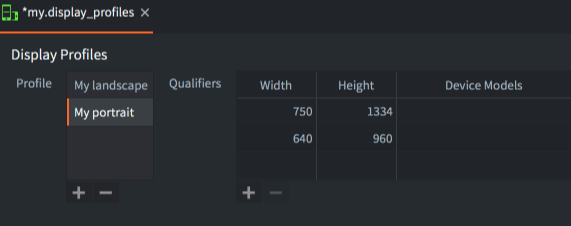
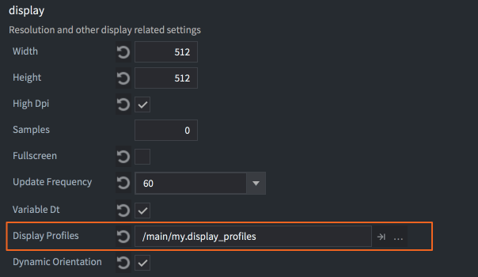
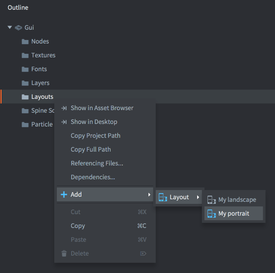
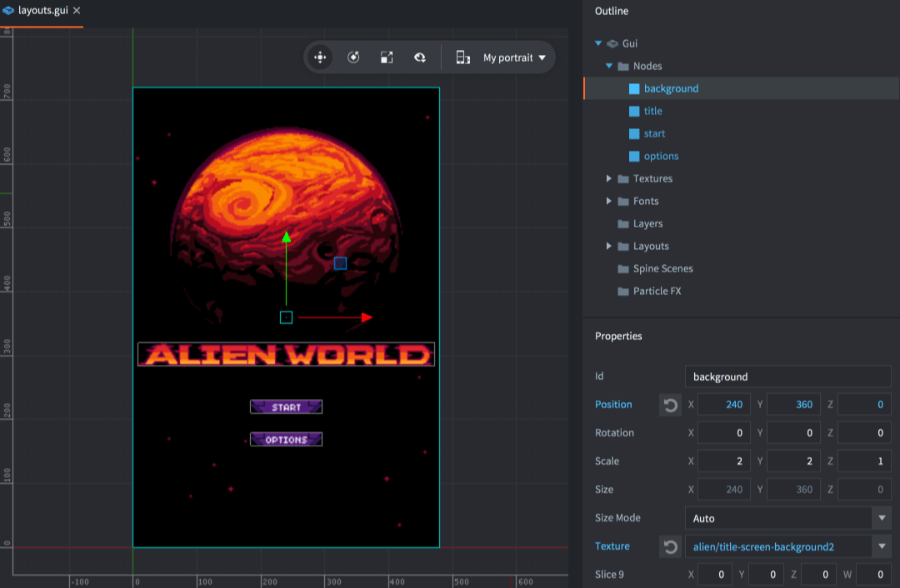
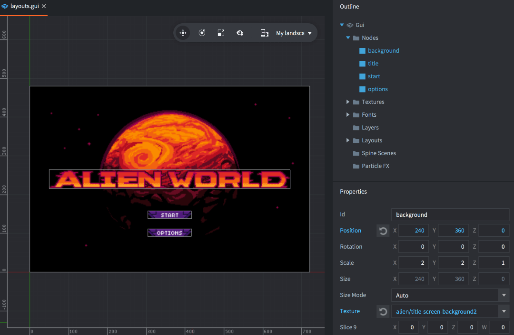

# Układy interfejsu

Układy interfejsu (ang. layouts) to wspierana przez Defold opcja automatycznego dostosowywania się do zmian orientacji ekranu na urządzeniach mobilnych. W tym dokumencie wyjaśniono, jak działa ta funkcjonalność.

Defold supports GUIs that automatically adapt to screen orientation changes on mobile devices. By using this feature you can design GUIs that adapt to the orientation and aspect ratio of a range of screen sizes. It is also possible to create layouts that match particular device models.

## Tworzenie profili wyświetlania

Domyślnie, w ustawieniach *game.project*, używa się wbudowanego pliku z ustawieniami profili wyświetlania (ang. display profiles) ("builtins/render/default.display_profiles"). Domyślne profile to `"Landscape"` (1280 pikseli szerokości i 720 pikseli wysokości) i `"Portrait"` (720 pikseli szerokości i 1280 pikseli wysokości). W profilach tych nie ustawiono modeli urządzeń, dlatego pasują one do dowolnego urządzenia.

Aby utworzyć nowy plik z ustawieniami profili, skopiuj istniejący z folderu "builtins" lub <kbd>kliknij prawym przyciskiem myszy</kbd> w odpowiednim miejscu w widoku *Assets* i wybierz <kbd>New... -> Display Profiles"</kbd>. Nadaj nowemu plikowi odpowiednią nazwę i kliknij <kbd>OK</kbd>.

Edytor otworzy teraz nowy plik do edycji. Dodaj nowe profile, klikając <kbd>+<kbd> na liście *Profiles*. Dla każdego profilu dodaj zestaw "kwalifikatorów" (*qualifiers*) dla profilu:

Width
: Szerokość kwalifikatora w pikselach.

Height
: Wysokość kwalifikatora w pikselach.

Device Models
: Lista modeli urządzeń oddzielonych przecinkami. Nazwa modelu urządzenia pasuje do początku nazwy modelu urządzenia. Przykład: `iPhone10` pasuje do modeli "iPhone10,\*". Nazwy modeli z przecinkami powinny być umieszczone w cudzysłowie, np. `"iPhone10,3", "iPhone10,6"` pasuje do modeli iPhone X (https://www.theiphonewiki.com/wiki/Models). Należy zauważyć, że tylko platformy Android i iOS raportują nazwę modelu urządzenia podczas wywoływania funkcji `sys.get_sys_info`. Inne platformy zwracają pusty ciąg znaków i dlatego nigdy nie wybiorą profilu wyświetlania z kwalifikatorem modelu urządzenia.



Należy również określić, że silnik powinien używać nowych profili. Otwórz *game.project* i wybierz plik z profilami wyświetlania w ustawieniach *Display Profiles* w sekcji *display*.




Jeśli chcesz, aby silnik automatycznie przełączał się między układami w orientacji pionowej i poziomej po obróceniu urządzenia, zaznacz opcję *Dynamic Orientation*. Silnik będzie dynamicznie wybierać pasujący układ i zmieniać wybór w razie zmiany orientacji urządzenia.

## Układy interfejsu

Obecny zestaw profili wyświetlania można wykorzystać do tworzenia wariantów układów (layouts) węzłów interfejsu. Aby dodać nowy układ do sceny interfejsu, kliknij prawym przyciskiem myszy na ikonie *Layouts* w widoku *Outline* i wybierz <kbd>Add ▸ Layout ▸ ...</kbd>.



Podczas edycji sceny interfejsu wszystkie węzły są edytowane w określonym układzie. Obecnie wybrany układ jest widoczny w rozwijanym menu układu sceny interfejsu w pasku narzędziowym. Jeśli nie wybrano żadnego układu, węzły są edytowane w układzie *Default*.




Każda zmiana właściwości węzła dokonana z wybranym układem, nadpisuje właściwość w odniesieniu do układu *Default*. Właściwości, które zostały nadpisane, są oznaczone kolorem niebieskim. Węzły z nadpisanymi właściwościami również są oznaczone kolorem niebieskim. Możesz kliknąć przycisk resetowania obok dowolnej nadpisanej właściwości, aby przywrócić ją do pierwotnej wartości.



Układ nie może usuwać ani tworzyć nowych węzłów, może jedynie nadpisywać właściwości. Jeśli chcesz usunąć węzeł z układu, możesz albo przenieść węzeł poza obszar ekranu, albo usunąć go za pomocą logiki skryptu. Należy także zwrócić uwagę na obecnie wybrany układ. Jeśli dodasz układ do projektu, nowy układ będzie konfigurowany zgodnie z aktualnie wybranym układem. Kopiowanie i wklejanie węzłów uwzględnia obecnie wybrany układ zarówno podczas kopiowania, jak i podczas wklejania.

## Dynamiczny wybór profilu

Dynamiczny dopasowywacz układu ocenia każdy kwalifikator profilu wyświetlania według następujących reguł:

1. Jeśli nie jest ustawiony model urządzenia albo model urządzenia jest i pasuje do profilu, obliczana jest ocena (S) dla kwalifikatora.

2. Ocena (S) jest obliczana na podstawie powierzchni ekranu (`A`), powierzchni z kwalifikatora (`A_Q`), proporcji obrazu ekranu (`R`) i proporcji obrazu z kwalifikatora (`R_Q`).


3. Profil z najniższą oceną jest wybierany, jeśli orientacja (landscape lub portrait) kwalifikatora pasuje do orientacji ekranu.

4. Jeśli nie znaleziono profilu z kwalifikatorem o tej samej orientacji, wybierany jest profil z najlepszą oceną kwalifikatora o innej orientacji.

5. Jeśli nie można wybrać żadnego profilu, stosowany jest profil awaryjny *Default*.

Ponieważ układ *Default* jest stosowany jako profil awaryjny w czasie rzeczywistym, jeśli nie ma lepszego pasującego układu, oznacza to, że jeśli dodasz układ *Landscape*, będzie to najlepsze dopasowanie dla wszystkich orientacji, dopóki nie dodasz także układu *Portrait*.

## Komunikaty o zmianie układu

Kiedy silnik zmienia układ w wyniku obracania urządzenia, wysyłana jest wiadomość `layout_changed` do skryptów komponentów GUI, które są dotknięte zmianą. Komunikat zawiera zahaszowany identyfikator (hashed id) układu, dzięki czemu skrypt może wykonywać logikę zależnie od wybranego układu.

When the engine switches layout as a result of device rotation, a `layout_changed` message is posted to the GUI components' scripts that are affected by the change. The message contains the hashed id of the layout so the script can perform logic depending on which layout is selected:

```lua
function on_message(self, message_id, message, sender)
  if message_id == hash("layout_changed") and message.id == hash("My Landscape") then
    --- zmieniono układ na landscape
  elseif message_id == hash("layout_changed") and message.id == hash("My Portrait") then
    -- zmieniono układ na portrait
  end
end
```

Ponadto, bieżący skrypt renderowania otrzymuje komunikat za każdym razem, gdy zmienia się okno (widok gry), a to obejmuje zmiany orientacji.

```lua
function on_message(self, message_id, message)
  if message_id == hash("window_resized") then
    -- Okno zostało zmienione. message.width i message.height zawierają nowe wymiary okna.
  end
end
```

Przy zmianie orientacji menedżer układu interfejsu automatycznie przeskalowuje i przemieszcza węzły GUI zgodnie z układem i właściwościami węzłów. Jednak treść gry jest renderowana w osobnym przebiegu (domyślnie) z projekcją rozciągania do bieżącego okna. Aby zmienić to zachowanie, należy dostarczyć własny zmodyfikowany skrypt renderowania lub skorzystać z [biblioteki kamer](/assets/).
