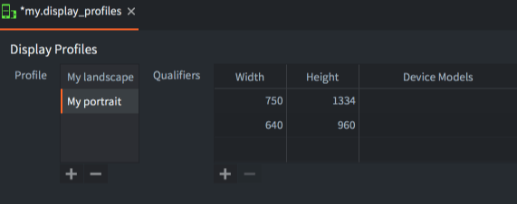
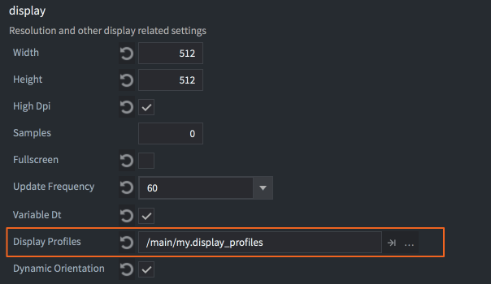
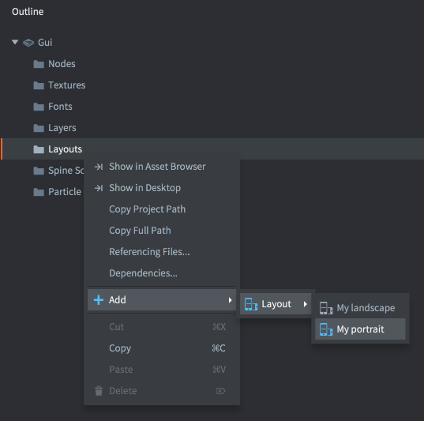
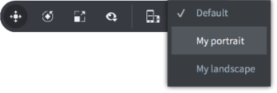
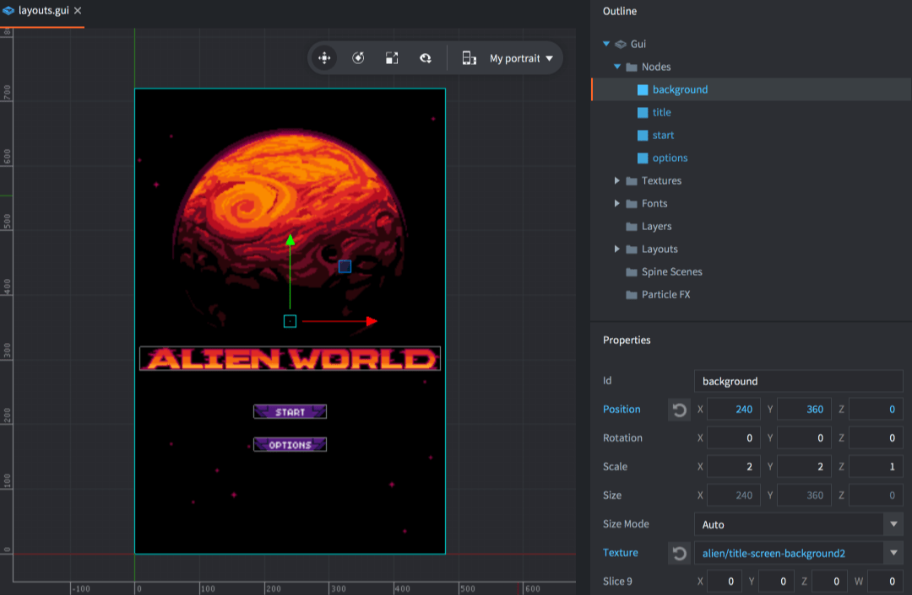
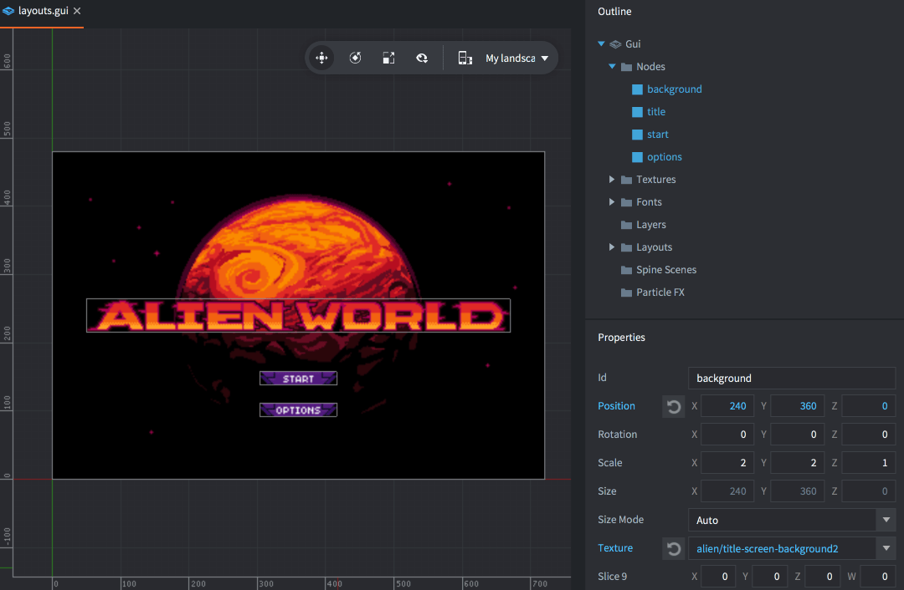

# Układy

Defold obsługuje GUI, które automatycznie dostosowuje się do zmian orientacji ekranu na urządzeniach mobilnych. Dzięki tej funkcji możesz projektować GUI dopasowujące się do orientacji i proporcji obrazu na ekranach o różnych rozmiarach. Możliwe jest też tworzenie układów dopasowanych do konkretnych modeli urządzeń.

## Tworzenie profili wyświetlania

Domyślnie ustawienia w pliku *game.project* wskazują wbudowany plik ustawień profili wyświetlania ("builtins/render/default.display_profiles"). Domyślne profile to "Landscape" (1280 pikseli szerokości i 720 pikseli wysokości) oraz "Portrait" (720 pikseli szerokości i 1280 pikseli wysokości). W tych profilach nie ustawiono modeli urządzeń, więc będą pasować do dowolnego urządzenia.

Aby utworzyć nowy plik profili, skopiuj istniejący z folderu builtins albo użyj <kbd>right click</kbd> na odpowiednim miejscu w widoku *Assets* i wybierz <kbd>New... ▸ Display Profiles</kbd>. Nadaj nowemu plikowi odpowiednią nazwę i kliknij <kbd>Ok</kbd>.

Edytor otworzy teraz nowy plik do edycji. Dodaj nowe profile, klikając <kbd>+</kbd> na liście *Profiles*. Dla każdego profilu dodaj zestaw *qualifiers*:

Width
: Szerokość kwalifikatora w pikselach.

Height
: Wysokość kwalifikatora w pikselach.

Device Models
: Lista modeli urządzeń oddzielonych przecinkami. Nazwa modelu dopasowuje początek nazwy modelu urządzenia, na przykład `iPhone10` dopasuje modele "iPhone10,*". Nazwy modeli zawierające przecinki powinny być ujęte w cudzysłów, czyli `"iPhone10,3", "iPhone10,6"` dopasuje modele iPhone X (zobacz [iPhone wiki](https://www.theiphonewiki.com/wiki/Models)). Pamiętaj, że tylko platformy Android i iOS zwracają model urządzenia przy wywołaniu `sys.get_sys_info()`. Inne platformy zwracają pusty ciąg znaków, więc nigdy nie wybiorą profilu wyświetlania, który ma kwalifikator Device Models.



Musisz też wskazać, że silnik ma używać nowego pliku profili. Otwórz *game.project* i ustaw plik profili wyświetlania w opcji *Display Profiles* w sekcji *display*:



Jeśli chcesz, aby silnik automatycznie przełączał się między układami pionowymi i poziomymi po obróceniu urządzenia, zaznacz pole *Dynamic Orientation*. Silnik będzie wtedy dynamicznie wybierał pasujący układ i zmieniał go przy zmianie orientacji urządzenia.

### Auto Layout Selection (Display Profiles)

W zasobie Display Profiles dostępna jest opcja "Auto Layout Selection" (domyślnie włączona). Gdy jest włączona, silnik automatycznie wybiera najlepiej pasujący układ GUI zarówno podczas tworzenia sceny, jak i przy zmianie rozmiaru okna lub ekranu. Gdy jest wyłączona, silnik nie zmienia układów automatycznie. Wtedy do ręcznego przełączania układów z poziomu skryptu GUI używa się `gui.set_layout()`. To ustawienie jest zapisane w pliku Display Profiles i wpływa na wszystkie sceny GUI.

## Układy GUI

Aktualny zestaw profili wyświetlania można wykorzystać do tworzenia wariantów układów dla węzłów GUI. Aby dodać nowy układ do sceny GUI, użyj <kbd>right click</kbd> na ikonie *Layouts* w widoku *Outline* i wybierz <kbd>Add ▸ Layout ▸ ...</kbd>:



Podczas edycji sceny GUI wszystkie węzły są edytowane w ramach konkretnego układu. Aktualnie wybrany układ jest widoczny na liście rozwijanej układów sceny GUI na pasku narzędzi. Jeśli nie wybierzesz żadnego układu, węzły są edytowane w układzie *Default*.





Każda zmiana właściwości węzła, którą wykonasz przy wybranym układzie, nadpisuje tę właściwość względem układu *Default*. Nadpisane właściwości są oznaczane na niebiesko. Węzły z nadpisanymi właściwościami również są oznaczane na niebiesko. Możesz kliknąć przycisk resetowania obok dowolnej nadpisanej właściwości, aby przywrócić jej pierwotną wartość.



Układ nie może usuwać ani tworzyć nowych węzłów, może jedynie nadpisywać właściwości. Jeśli chcesz usunąć węzeł z układu, możesz przenieść go poza ekran albo usunąć go w logice skryptu. Zwróć też uwagę na aktualnie wybrany układ. Jeśli dodasz nowy układ do projektu, zostanie skonfigurowany zgodnie z aktualnie wybranym układem. Kopiowanie i wklejanie węzłów również uwzględnia aktualnie wybrany układ, zarówno przy kopiowaniu, jak *i* przy wklejaniu.

## Dynamiczny wybór profilu

Gdy "Auto Layout Selection" jest włączone, silnik automatycznie wybiera najlepiej pasujący układ. Mechanizm dynamicznego dopasowania ocenia każdy kwalifikator profilu wyświetlania według następujących reguł:

1. Jeśli nie ustawiono modelu urządzenia albo model urządzenia pasuje, dla kwalifikatora obliczana jest ocena (S).

2. Ocena (S) jest obliczana na podstawie powierzchni ekranu (`A`), powierzchni z kwalifikatora (`A_Q`), proporcji obrazu ekranu (`R`) i proporcji obrazu kwalifikatora (`R_Q`):


3. Wybierany jest profil z kwalifikatorem o najniższej ocenie, jeśli orientacja kwalifikatora (landscape lub portrait) pasuje do orientacji ekranu.

4. Jeśli nie znaleziono profilu z kwalifikatorem o tej samej orientacji, wybierany jest profil z najlepiej ocenionym kwalifikatorem o przeciwnej orientacji.

5. Jeśli nie da się wybrać żadnego profilu, używany jest zapasowy profil *Default*.

Ponieważ układ *Default* jest używany jako zapasowy w czasie działania programu, gdy nie ma lepiej dopasowanego układu, oznacza to, że jeśli dodasz układ "Landscape", będzie on najlepszym dopasowaniem dla *wszystkich* orientacji, dopóki nie dodasz także układu "Portrait".

## Komunikaty o zmianie układu

Gdy układ się zmienia, do skryptu komponentu GUI wysyłana jest wiadomość `layout_changed`. Dzieje się tak, gdy silnik zmienia układ automatycznie ("Auto Layout Selection" jest włączone) albo gdy skrypt wywoła `gui.set_layout()` i układ rzeczywiście się zmieni. Wiadomość zawiera haszowany identyfikator układu, dzięki czemu skrypt może wykonać logikę zależnie od wybranego układu:

```lua
function on_message(self, message_id, message, sender)
  if message_id == hash("layout_changed") and message.id == hash("My Landscape") then
    -- zmiana układu na poziomy
  elseif message_id == hash("layout_changed") and message.id == hash("My Portrait") then
    -- zmiana układu na pionowy
  end
end
```

Dodatkowo aktualny skrypt renderowania otrzymuje wiadomość za każdym razem, gdy zmienia się okno (widok gry), a obejmuje to także zmiany orientacji.

```lua
function on_message(self, message_id, message)
  if message_id == hash("window_resized") then
    -- Rozmiar okna się zmienił. message.width i message.height zawierają
    -- nowe wymiary okna.
  end
end
```

Po zmianie orientacji menedżer układów GUI automatycznie przeskaluje i przemieści węzły GUI zgodnie z układem oraz właściwościami węzłów. Zawartość gry jest jednak domyślnie renderowana w osobnym przebiegu z projekcją stretch-fit do bieżącego okna. Aby zmienić to zachowanie, dostarcz własny zmodyfikowany skrypt renderowania albo skorzystaj z [biblioteki kamer](/assets/).

## Ręczny wybór układu (Lua)

Gdy "Auto Layout Selection" jest wyłączone w używanych Display Profiles, silnik nie będzie przełączać układów automatycznie. W takim przypadku układami zarządza się ręcznie z poziomu skryptu GUI za pomocą następujących funkcji:

### gui.set_layout(layout)

- Przyjmuje `string` albo `hash` (id układu).
- Zwraca wartość logiczną: `true`, jeśli układ istnieje w scenie i został zastosowany; w przeciwnym razie `false`.
- Jeśli układ istnieje w Display Profiles, aktualizuje rozdzielczość sceny do szerokości i wysokości z profilu.
- Wysyła `layout_changed`, gdy układ rzeczywiście się zmieni.

Przykład:

```lua
function init(self)
    -- Ręcznie zastosuj układ "Portrait"
    local ok = gui.set_layout("Portrait")
    if not ok then
        print("Układ Portrait nie został znaleziony w tej scenie")
    end
end
```

### gui.get_layouts()

- Zwraca tabelę mapującą każdy haszowany identyfikator układu na `vmath.vector3(width, height, 0)`.
- Dla układu domyślnego zwraca bieżącą rozdzielczość sceny.

Przykład:

```lua
local layouts = gui.get_layouts()
for id, size in pairs(layouts) do
    print(id, size.x, size.y)
end
```

Uwaga: jeśli układ GUI istnieje w scenie, ale nie występuje w Display Profiles, `gui.set_layout()` nadal zastosuje nadpisania właściwości węzłów dla danego układu, ale nie zmieni rozdzielczości sceny.
