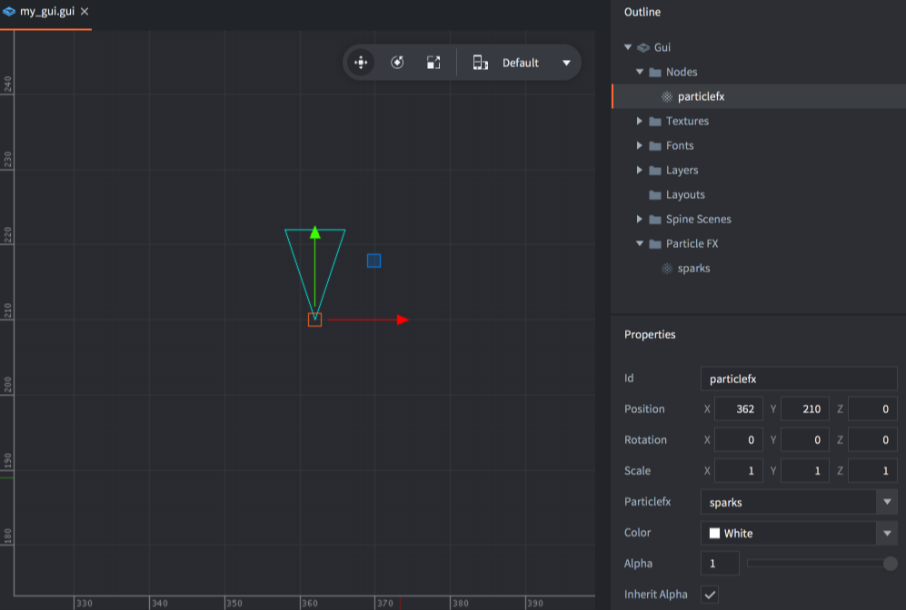

# Węzeł GUI typu text ParticleFX

Węzeł efektu cząsteczkowego (ang. particle effect node) służy do odtwarzania systemów efektów cząsteczkowych na ekranie GUI.

## Dodawanie węzłów ParticleFX

Dodaj nowe węzły cząsteczkowe, <kbd>klikając prawym przyciskiem myszy</kbd> w widoku *Outline* i wybierając kbd>Add ▸ ParticleFX</kbd> lub naciśnij <kbd>A</kbd> i wybierz <kbd>ParticleFX</kbd>.

Możesz użyć efektów cząsteczkowych, które dodałeś do GUI jako źródła efektu. Dodaj efekty cząsteczkowe, <kbd>klikając prawym przyciskiem myszy</kbd> na ikonie folderu *Particle FX* w widoku *Outline* i wybierając <kbd>Add ▸ Particle FX...</kbd>. Następnie ustaw właściwość *Particlefx* na węźle:



## Kontrolowanie efektu

Możesz uruchamiać i zatrzymywać efekt, kontrolując węzeł za pomocą skryptu:
You can start and stop the effect by controlling the node from a script:

```lua
-- uruchomienie efektu cząsteczkowego
local particles_node = gui.get_node("particlefx")
gui.play_particlefx(particles_node)
```

```lua
-- zatrzymanie efektu cząsteczkowego
local particles_node = gui.get_node("particlefx")
gui.stop_particlefx(particles_node)
```

Aby uzyskać szczegółowe informacje na temat działania efektów cząsteczkowych, sprawdź [instrukcję do efektów cząsteczkowych](/manuals/particlefx).
