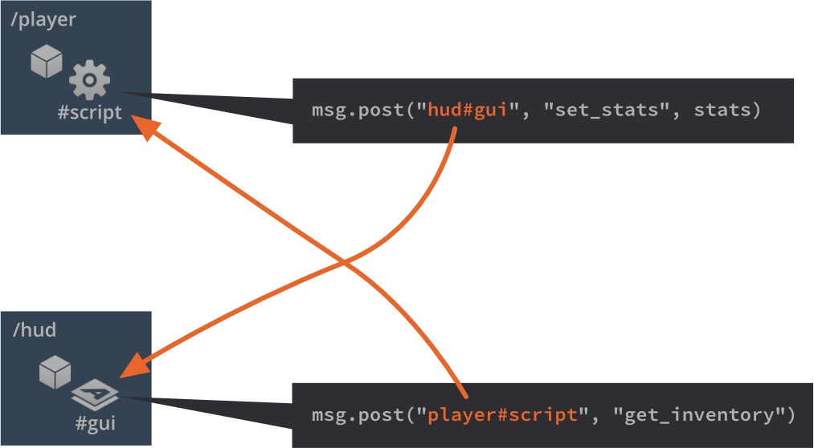
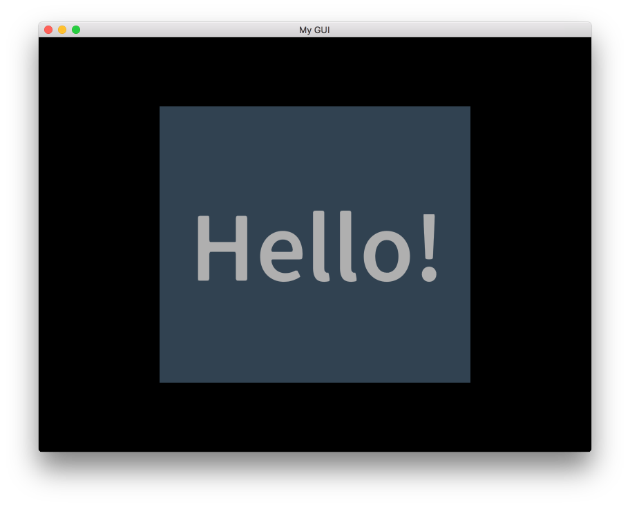

# Skrypty GUI

Aby kontrolować logikę swojego interfejsu GUI i animować węzły, używa się skryptów Lua. Skrypty GUI działają tak samo jak zwykłe skrypty obiektów gry, ale są zapisywane jako inny rodzaj pliku i mają dostęp do innej grupy funkcji: funkcji modułu `gui`.

## Dodawanie skryptu do GUI

Aby dodać skrypt do GUI, najpierw stwórz plik skryptu GUI, klikając <kbd>prawym przyciskiem myszy</kbd> w odpowiednie miejsce w przeglądarce Zasobów i wybierając <kbd>New ▸ Gui Script</kbd> z menu kontekstowego.

Edytor automatycznie otwiera nowy plik skryptu. Bazuje on na szablonie i jest wyposażony w puste funkcje cyklu życia, takie same jak skrypty obiektów gry:

```lua
function init(self)
   -- Add initialization code here
   -- Remove this function if not needed
end

function final(self)
   -- Add finalization code here
   -- Remove this function if not needed
end

function update(self, dt)
   -- Add update code here
   -- Remove this function if not needed
end

function on_message(self, message_id, message, sender)
   -- Add message-handling code here
   -- Remove this function if not needed
end

function on_input(self, action_id, action)
   -- Add input-handling code here
   -- Remove this function if not needed
end

function on_reload(self)
   -- Add input-handling code here
   -- Remove this function if not needed
end
```

Aby przypiąć skrypt do komponentu GUI, otwórz prototyp komponentu GUI (inaczej nazywane "prefabami" lub "szablonami" w innych silnikach) i wybierz korzeń (root) w *Outline*, aby wywołać Właściwości (*Properties*) GUI. Ustaw właściwość *Script* na plik skryptu.


Jeśli komponent GUI został dodany do obiektu gry w dowolnym miejscu gry, skrypt zostanie teraz uruchomiony.

## Przestrzeń nazw "gui"

Skrypty GUI mają dostęp do przestrzeni nazw (ang. namespace) `gui` i [wszystkich funkcji gui](/ref/gui). Przestrzeń nazw `go` dla obiektów gry nie jest dostępna dla GUI, dlatego konieczne jest oddzielenie logiki obiektów gry poprzez skrypty komponentów i komunikację między skryptami GUI a skryptami komponentów obiektów gry. Próby użycia funkcji `go` w skrypcie GUI spowodują błąd:

```lua
function init(self)
   local id = go.get_id()
end
```

```txt
ERROR:SCRIPT: /main/my_gui.gui_script:2: You can only access go.* functions and values from a script instance (.script file)
stack traceback:
   [C]: in function 'get_id'
   /main/my_gui.gui_script:2: in function </main/my_gui.gui_script:1>
```

## Przesyłanie wiadomości

Dowolny komponent GUI z przypisanym skryptem ma zdolność do komunikacji z innymi obiektami w środowisku uruchomieniowym gry poprzez przesyłanie wiadomości, zachowuje się tak samo jak dowolny inny komponent skryptu.

Możesz adresować komponent GUI tak samo, jak dowolny inny komponent skryptu:

```lua
local stats = { score = 4711, stars = 3, health = 6 }
msg.post("hud#gui", "set_stats", stats)
```



## Adresowanie węzłów

Węzły GUI mogą być manipulowane przez skrypt GUI przypisany do komponentu. Każdy węzeł musi mieć unikalne *Id*, które jest ustawiane w edytorze:


*Id* pozwala skryptowi uzyskać dostęp do węzła i manipulować nim za pomocą [funkcji przestrzeni nazw gui](/ref/gui):

```lua
-- rozszerz pasek zdrowia o 10 jednostek
local healthbar_node = gui.get_node("healthbar")
local size = gui.get_size(healthbar_node)
size.x = size.x + 10
gui.set_size(healthbar_node, size)
```

## Dynamicznie tworzone węzły

Aby utworzyć nowy węzeł w czasie rzeczywistym, masz dwie opcje. Pierwsza opcja polega na tworzeniu węzłów od podstaw, wywołując funkcje `gui.new_[type]_node()`. Funkcje te zwracają referencję do nowego węzła, którą można używać do manipulowania węzłem:

```lua
-- Utwórz nowy węzeł typu "box"
local new_position = vmath.vector3(400, 300, 0)
local new_size = vmath.vector3(450, 400, 0)
local new_boxnode = gui.new_box_node(new_position, new_size)
gui.set_color(new_boxnode, vmath.vector4(0.2, 0.26, 0.32, 1))

-- Utwórz nowy węzeł typu "text"
local new_textnode = gui.new_text_node(new_position, "Hello!")
gui.set_font(new_textnode, "sourcesans")
gui.set_color(new_textnode, vmath.vector4(0.69, 0.6, 0.8, 1.0))
```



Alternatywnym sposobem na tworzenie nowych węzłów jest klonowanie istniejącego węzła za pomocą funkcji `gui.clone()` lub drzewa węzłów za pomocą funkcji `gui.clone_tree()`:

```lua
-- sklonuj pasek zdrowia
local healthbar_node = gui.get_node("healthbar")
local healthbar_node_2 = gui.clone(healthbar_node)

-- sklonuj drzewo węzłów przycisku
local button = gui.get_node("my_button")
local new_button_nodes = gui.clone_tree(button)

-- pobierz nowy korzeń drzewa
local new_root = new_button_nodes["my_button"]

-- przesuń korzeń (i dzieci) o 300 w prawo
local root_position = gui.get_position(new_root)
root_position.x = root_position.x + 300
gui.set_position(new_root, root_position)
```

## Dynamiczne identyfikatory węzłów

Dynamicznie tworzone węzły nie posiadają przypisanego identyfikatora. Jest to celowe. Referencje zwracane przez funkcje `gui.new_[type]_node()`, `gui.clone()` i `gui.clone_tree()` są jedyną rzeczą, która jest potrzebna do dostępu do węzłów, i powinieneś śledzić tę referencję.

Dynamically created nodes do not have an id assigned to them. This is by design. The references that are returned from `gui.new_[type]_node()`, `gui.clone()` and `gui.clone_tree()` are the only thing necessary to be able to access the nodes and you should keep track of that reference.

```lua
-- Dodaj węzeł tekstowy
local new_textnode = gui.new_text_node(vmath.vector3(100, 100, 0), "Hello!")
-- "new_textnode" zawiera referencję do węzła.
-- Węzeł nie ma identyfikatora, i to jest w porządku. Nie ma powodu, by używać
-- funkcji `gui.get_node()`, gdy mamy już referencję.
```
