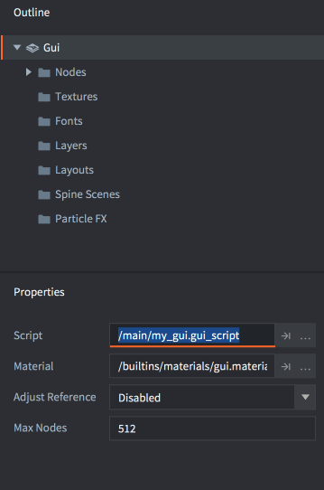
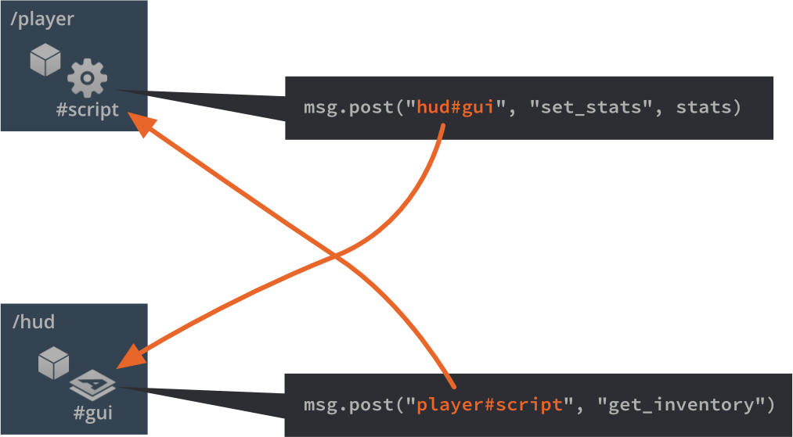
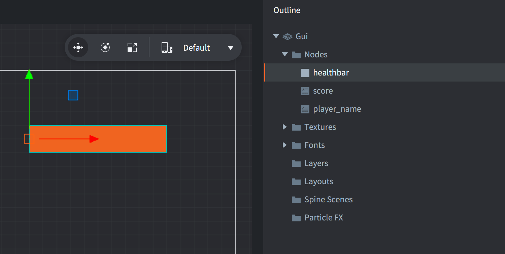
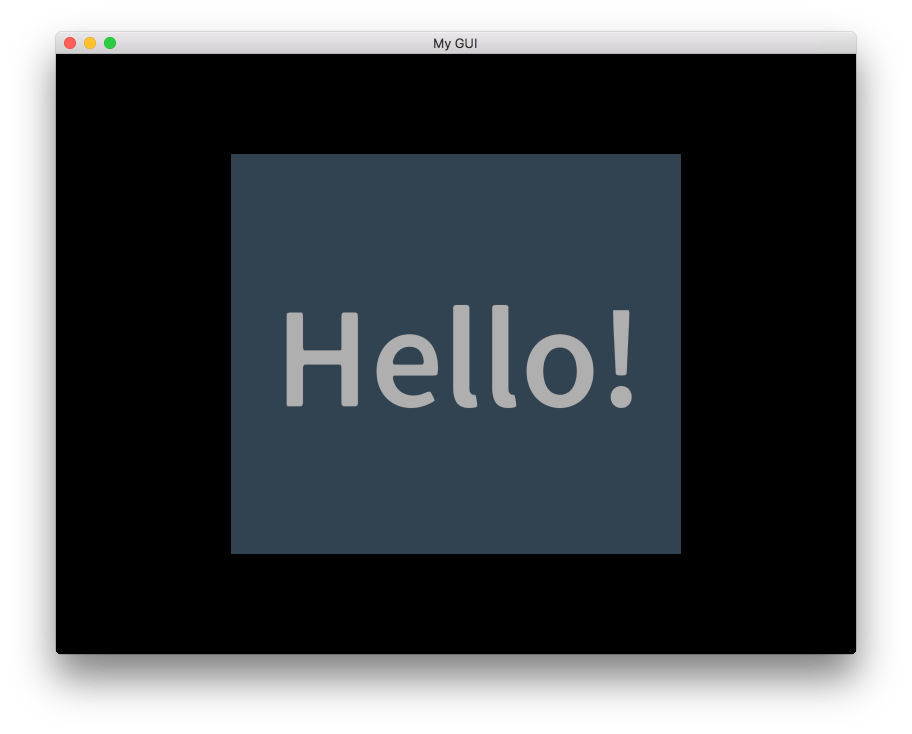

# Skrypty GUI

Aby sterować logiką GUI i animować węzły, używa się skryptów Lua. Skrypty GUI działają tak samo jak zwykłe skrypty obiektów gry, ale są zapisywane jako inny typ pliku i mają dostęp do innego zestawu funkcji: funkcji modułu `gui`.

## Dodawanie skryptu do GUI

Aby dodać skrypt do GUI, najpierw utwórz plik skryptu GUI, klikając <kbd>prawym przyciskiem myszy</kbd> w dowolnym miejscu w panelu *Assets* i wybierając <kbd>New ▸ Gui Script</kbd> z menu kontekstowego.

Edytor automatycznie otworzy nowy plik skryptu. Powstaje on na podstawie szablonu i zawiera puste funkcje cyklu życia, tak samo jak skrypty obiektów gry:

```lua
function init(self)
   -- Dodaj tutaj kod inicjalizacji
   -- Usuń tę funkcję, jeśli nie jest potrzebna
end

function final(self)
   -- Dodaj tutaj kod finalizacji
   -- Usuń tę funkcję, jeśli nie jest potrzebna
end

function update(self, dt)
   -- Dodaj tutaj kod aktualizacji
   -- Usuń tę funkcję, jeśli nie jest potrzebna
end

function on_message(self, message_id, message, sender)
   -- Dodaj tutaj kod obsługi wiadomości
   -- Usuń tę funkcję, jeśli nie jest potrzebna
end

function on_input(self, action_id, action)
   -- Dodaj tutaj kod obsługi wejścia
   -- Usuń tę funkcję, jeśli nie jest potrzebna
end

function on_reload(self)
   -- Dodaj tutaj kod obsługi ponownego wczytania
   -- Usuń tę funkcję, jeśli nie jest potrzebna
end
```

Aby dołączyć skrypt do komponentu GUI, otwórz plik prototypu komponentu GUI, a następnie wybierz korzeń w *Outline*, aby wyświetlić *Properties* GUI. Ustaw właściwość *Script* na plik skryptu.



Jeśli komponent GUI został dodany do obiektu gry w dowolnym miejscu projektu, skrypt zacznie teraz działać.

## Przestrzeń nazw "gui"

Skrypty GUI mają dostęp do przestrzeni nazw `gui` i [wszystkich funkcji gui](/ref/gui). Przestrzeń nazw `go` nie jest dostępna, więc logikę obiektów gry trzeba wydzielić do skryptów komponentów i komunikować się między GUI a skryptami obiektów gry. Każda próba użycia funkcji `go` spowoduje błąd:

```lua
function init(self)
   local id = go.get_id()
end
```

```txt
ERROR:SCRIPT: /main/my_gui.gui_script:2: You can only access go.* functions and values from a script instance (.script file)
stack traceback:
   [C]: in function 'get_id'
   /main/my_gui.gui_script:2: in function </main/my_gui.gui_script:1>
```

## Przesyłanie wiadomości

Każdy komponent GUI z przypisanym skryptem może komunikować się z innymi obiektami w środowisku uruchomieniowym gry za pomocą przesyłania wiadomości, tak samo jak każdy inny komponent skryptu.

Komponent GUI adresuje się tak samo jak każdy inny komponent skryptu:

```lua
local stats = { score = 4711, stars = 3, health = 6 }
msg.post("hud#gui", "set_stats", stats)
```



## Adresowanie węzłów

Węzłami GUI może manipulować skrypt GUI dołączony do komponentu. Każdy węzeł musi mieć unikalne *Id*, ustawiane w edytorze:



*Id* pozwala skryptowi pobrać odwołanie do węzła i manipulować nim za pomocą [funkcji przestrzeni nazw gui](/ref/gui):

```lua
-- rozszerz pasek zdrowia o 10 jednostek
local healthbar_node = gui.get_node("healthbar")
local size = gui.get_size(healthbar_node)
size.x = size.x + 10
gui.set_size(healthbar_node, size)
```

## Dynamicznie tworzone węzły

Aby utworzyć nowy węzeł w czasie działania, masz dwie opcje. Pierwsza polega na tworzeniu węzłów od podstaw przez wywołanie funkcji `gui.new_[type]_node()`. Zwracają one odwołanie do nowego węzła, którego można użyć do dalszej manipulacji:

```lua
-- Utwórz nowy węzeł typu box
local new_position = vmath.vector3(400, 300, 0)
local new_size = vmath.vector3(450, 400, 0)
local new_boxnode = gui.new_box_node(new_position, new_size)
gui.set_color(new_boxnode, vmath.vector4(0.2, 0.26, 0.32, 1))

-- Utwórz nowy węzeł tekstowy
local new_textnode = gui.new_text_node(new_position, "Hello!")
gui.set_font(new_textnode, "sourcesans")
gui.set_color(new_textnode, vmath.vector4(0.69, 0.6, 0.8, 1.0))
```



Drugim sposobem tworzenia nowych węzłów jest sklonowanie istniejącego węzła za pomocą funkcji `gui.clone()` lub drzewa węzłów za pomocą funkcji `gui.clone_tree()`:

```lua
-- sklonuj pasek zdrowia
local healthbar_node = gui.get_node("healthbar")
local healthbar_node_2 = gui.clone(healthbar_node)

-- sklonuj drzewo węzłów przycisku
local button = gui.get_node("my_button")
local new_button_nodes = gui.clone_tree(button)

-- pobierz nowy korzeń drzewa
local new_root = new_button_nodes["my_button"]

-- przesuń korzeń (i dzieci) o 300 w prawo
local root_position = gui.get_position(new_root)
root_position.x = root_position.x + 300
gui.set_position(new_root, root_position)
```

## Id węzłów dynamicznych

Dynamicznie tworzone węzły nie mają przypisanego id. Tak właśnie ma być. Odwołania zwracane przez funkcje `gui.new_[type]_node()`, `gui.clone()` i `gui.clone_tree()` są jedyną potrzebną rzeczą, aby uzyskać dostęp do węzłów, więc należy przechowywać to odwołanie.

```lua
-- Dodaj węzeł tekstowy
local new_textnode = gui.new_text_node(vmath.vector3(100, 100, 0), "Hello!")
-- "new_textnode" zawiera odwołanie do węzła.
-- Węzeł nie ma id i to jest w porządku. Nie ma powodu, aby wywoływać
-- gui.get_node(), skoro odwołanie mamy już pod ręką.
```
