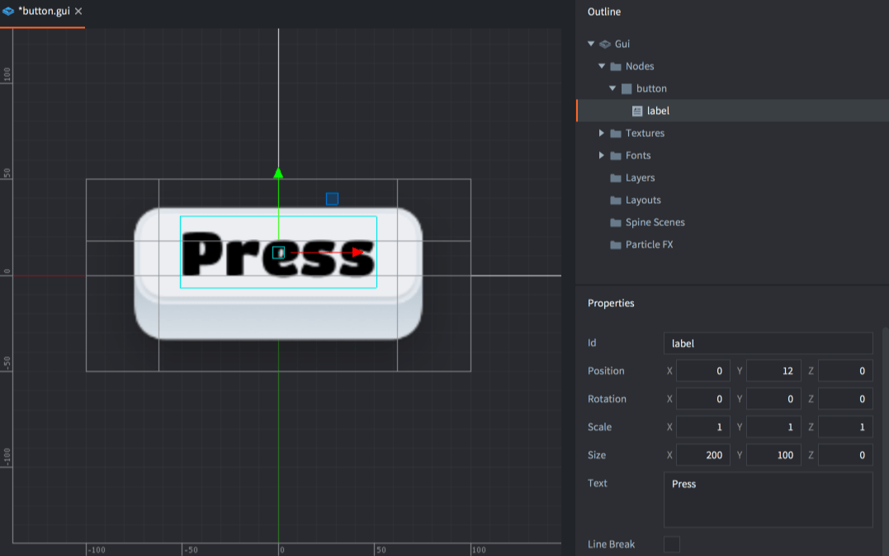
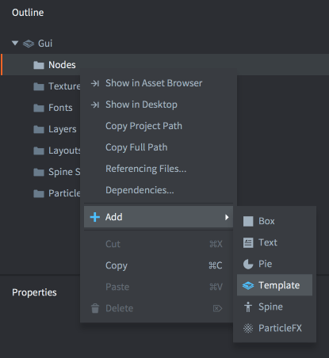
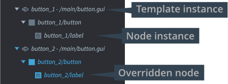

# Węzły szablonów GUI

Węzły szablonów (ang. template nodes) GUI zapewniają potężny mechanizm tworzenia wielokrotnego użytku komponentów GUI na podstawie wspólnych "szablonów" lub "prefabrykatów". Ten podręcznik wyjaśnia tę funkcję i jej użycie.

Szablon GUI to scena GUI, która jest tworzona, węzeł po węźle, w innej scenie GUI. Wartości właściwości węzłów oryginalnych szablonów można wówczas zastępować.

## Tworzenie szablonu

Szablon GUI to zwykła scena GUI, więc tworzy się go tak samo jak każdą inną scenę GUI. <kbd>Kliknij prawym przyciskiem myszy</kbd> w odpowiednim miejscu w panelu Assets i wybierz <kbd>New... ▸ Gui</kbd>.

{srcset="images/gui-templates/create@2x.png 2x"}

Utwórz szablon i zapisz go. Należy zauważyć, że węzły instancji tego szablonu zostaną umieszczone względem położenia początkowego, dlatego dobrym pomysłem jest utworzenie szablonu w pozycji 0, 0, 0.

## Tworzenie instancji na podstawie szablonu

Możesz tworzyć dowolną liczbę instancji opartych na jednej instancji. Utwórz lub otwórz scenę GUI, w której chcesz umieścić szablon, a następnie <kbd>kliknij prawym przyciskiem myszy</kbd> sekcję *Nodes* w widoku *Outline* i wybierz <kbd>Add ▸ Template</kbd>.

{srcset="images/gui-templates/create_instance@2x.png 2x"}

Ustaw właściwość *Template* na plik sceny GUI szablonu.

Możesz dodać dowolną liczbę instancji szablonów, a dla każdej instancji można zastępować właściwości każdego węzła i zmieniać pozycję węzła instancji, kolorowanie, rozmiar, teksturę itp.

{srcset="images/gui-templates/instances@2x.png 2x"}

Każda zmieniona właściwość jest oznaczona kolorem niebieskim w edytorze. Naciśnij przycisk resetowania przy właściwości, aby ustawić jej wartość na wartość z szablonu:

{srcset="images/gui-templates/properties@2x.png 2x"}

Każdy węzeł, który ma zmienione właściwości, jest również kolorowany na niebiesko w widoku *Outline*:

{srcset="images/gui-templates/outline@2x.png 2x"}

Instancja szablonu jest wylistowana jako składana pozycja w widoku *Outline*. Jednak należy zauważyć, że ten element w widoku *nie jest węzłem*. Instancja szablonu nie istnieje także w czasie wykonywania, ale wszystkie węzły, które są częścią instancji, istnieją.

Węzły, które są częścią instancji szablonu, są automatycznie nazwane przyrostkiem i ukośnikiem (`"/"`) do ich *Id*. Przyrostek ten to *Id* ustawione w instancji szablonu.

## Modyfikowanie szablonów w czasie działania programu

Skrypty, które manipulują lub sprawdzają węzły dodane za pomocą szablonów, muszą uwzględniać tylko nazwy węzłów instancji i uwzględniać *Id* instancji szablonu jako prefiks nazwy węzła:

```lua
if gui.pick_node(gui.get_node("button_1/button"), x, y) then
    -- Do something...
end
```

Nie ma węzła odpowiadającego samej instancji szablonu. Jeśli potrzebujesz węzła głównego dla instancji, dodaj go do szablonu.

Jeśli skrypt jest powiązany ze sceną GUI szablonu, skrypt ten nie jest częścią drzewa węzłów instancji. Możesz dołączyć jeden pojedynczy skrypt do każdej sceny GUI, więc twoja logika skryptu musi znajdować się na scenie GUI, na której instancjonujesz swoje szablony.
