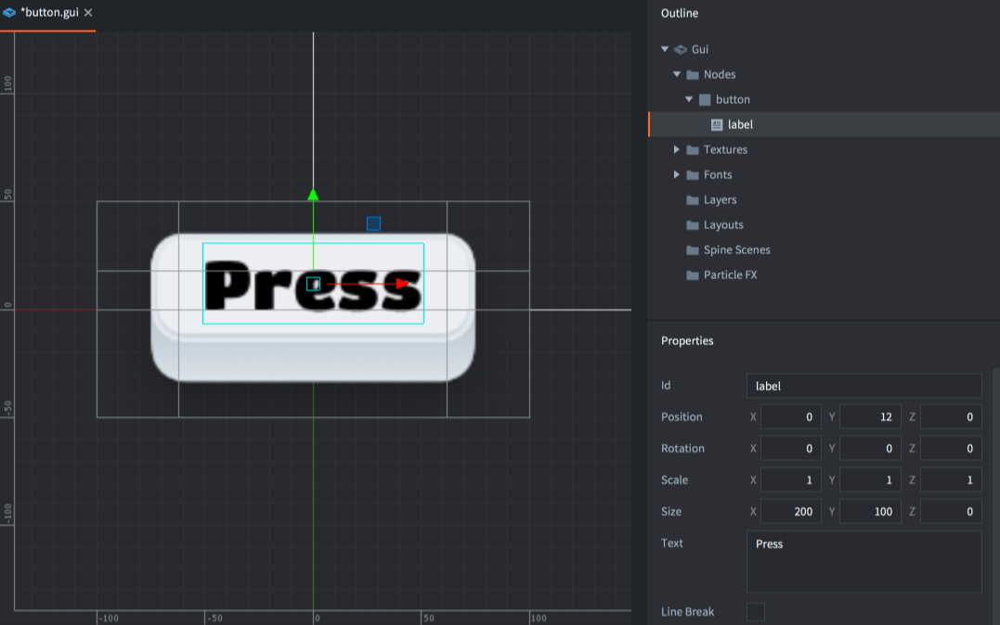
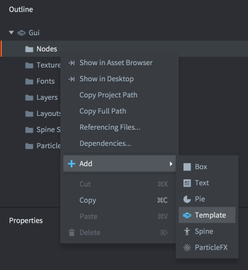
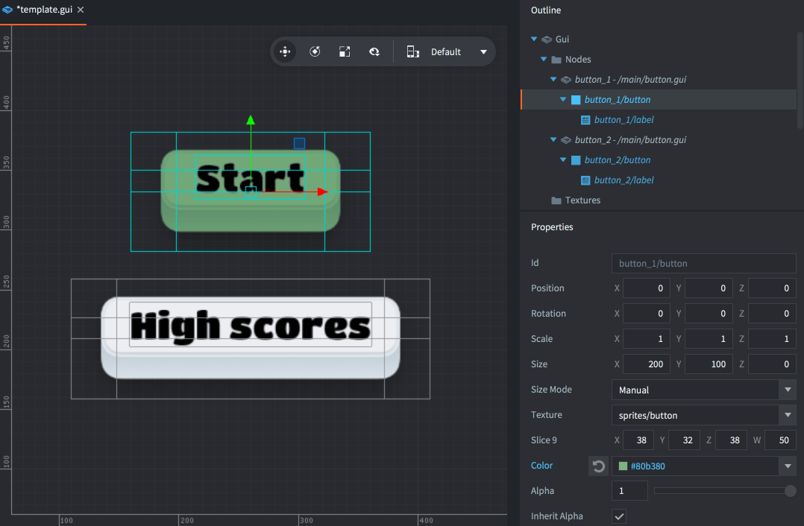
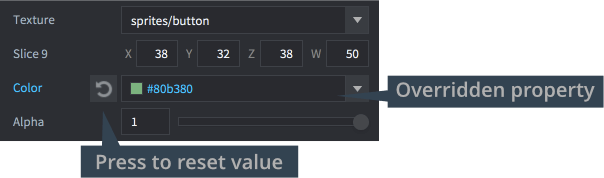
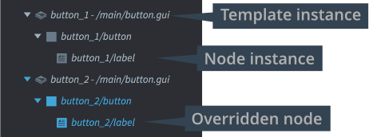

# Węzły szablonów GUI

Węzły szablonów GUI (ang. GUI template nodes) zapewniają wygodny mechanizm tworzenia wielokrotnego użytku komponentów GUI opartych na wspólnych szablonach lub "prefabach". Ta instrukcja wyjaśnia tę funkcję i pokazuje, jak z niej korzystać.

Szablon GUI to scena GUI, która jest instancjonowana, węzeł po węźle, w innej scenie GUI. Każdą wartość właściwości w oryginalnych węzłach szablonu można później nadpisać.

## Tworzenie szablonu

Szablon GUI to zwykła scena GUI, więc tworzy się go tak samo jak każdą inną scenę GUI. <kbd>Right click</kbd> w wybranym miejscu w panelu *Assets* i wybierz <kbd>New... ▸ Gui</kbd>.



Utwórz szablon i zapisz go. Pamiętaj, że węzły instancji zostaną umieszczone względem punktu początkowego, więc najlepiej utworzyć szablon w pozycji 0, 0, 0.

## Tworzenie instancji na podstawie szablonu

Możesz utworzyć dowolną liczbę instancji na podstawie szablonu. Utwórz lub otwórz scenę GUI, w której chcesz umieścić szablon, a następnie <kbd>right click</kbd> sekcję *Nodes* w widoku *Outline* i wybierz <kbd>Add ▸ Template</kbd>.



Ustaw właściwość *Template* na plik sceny GUI szablonu.

Możesz dodać dowolną liczbę instancji szablonu, a dla każdej z nich nadpisywać właściwości poszczególnych węzłów oraz zmieniać pozycję węzła instancji, kolor, rozmiar, teksturę i tak dalej.



Każda zmieniona właściwość jest oznaczana na niebiesko w edytorze. Naciśnij przycisk resetowania obok właściwości, aby przywrócić wartość z szablonu:



Każdy węzeł, który ma nadpisane właściwości, jest również oznaczony na niebiesko w widoku *Outline*:



Instancja szablonu jest widoczna jako zwijany element w widoku *Outline*. Warto jednak pamiętać, że ten element w *Outline* nie jest węzłem. Sama instancja szablonu nie istnieje też w czasie działania programu, ale istnieją wszystkie węzły należące do tej instancji.

Węzły należące do instancji szablonu są automatycznie nazywane z prefiksem i ukośnikiem (`"/"`) dołączonym do ich *Id*. Prefiksem jest *Id* ustawione w instancji szablonu.

## Modyfikowanie szablonów w czasie działania programu

Skrypty, które manipulują węzłami dodanymi za pomocą mechanizmu szablonów lub je odczytują, muszą uwzględniać nazewnictwo węzłów instancji i dodawać *Id* instancji szablonu jako prefiks nazwy węzła:

```lua
if gui.pick_node(gui.get_node("button_1/button"), x, y) then
    -- Wykonaj jakieś działanie...
end
```

Nie istnieje osobny węzeł odpowiadający samej instancji szablonu. Jeśli potrzebujesz węzła głównego dla instancji, dodaj go do szablonu.

Jeśli skrypt jest powiązany ze sceną GUI szablonu, nie należy on do drzewa węzłów instancji. Do każdej sceny GUI możesz dołączyć tylko jeden skrypt, więc logika skryptu musi znajdować się w scenie GUI, w której instancjonujesz szablony.
