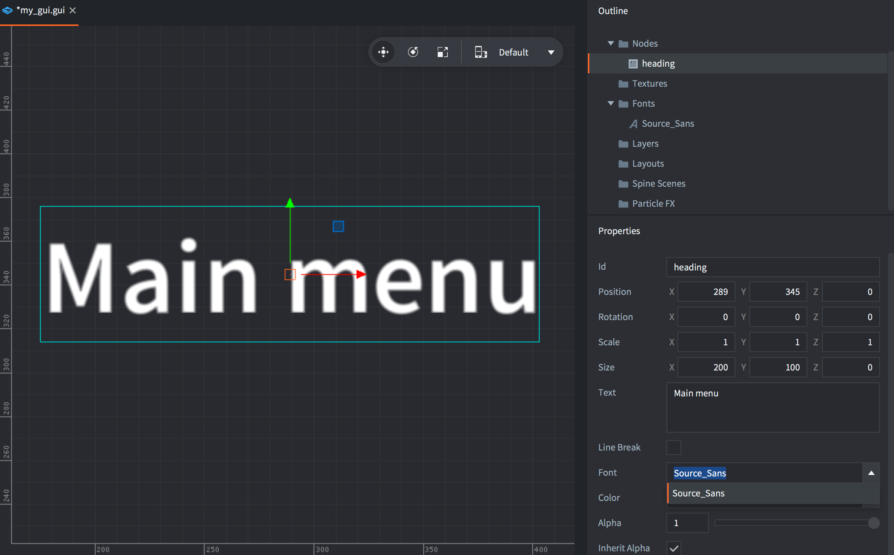
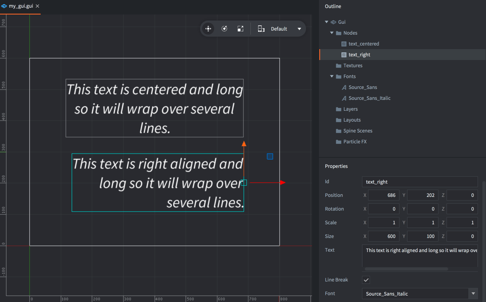

# Węzeł GUI typu text

Defold obsługuje konkretny rodzaj węzła GUI, który umożliwia renderowanie tekstu w scenach GUI. Każdy zasób fontu dodany do projektu może być używany do renderowania węzłów tekstu.

## Dodawanie węzłów tekstowych

Fonty, które chcesz używać w węzłach tekstowych GUI, muszą zostać dodane do komponentu GUI. <kbd>Kliknij prawym przyciskiem myszy</kbd> na folder *Fonts*, użyj górnego menu <kbd>GUI</kbd> lub naciśnij odpowiedni skrót klawiaturowy.



Węzły tekstowe posiadają zestaw specjalnych właściwości:

*Font*
: Każdy węzeł tekstowy, który tworzysz, musi mieć ustawioną właściwość Font.

*Text*
: Ta właściwość zawiera wyświetlany tekst.

*Line Break*
: Wyrównanie tekstu odpowiada ustawieniom punktu obrotu (ang. pivot setting), a ustawienie tej właściwości pozwala na przepływ tekstu na kilku liniach. Szerokość węzła określa, jak tekst się zawija.

## Wyrównanie

Ustawiając punkt obrotu węzła, możesz zmienić tryb wyrównywania tekstu (ang. alignment mode).

*Center*
: Jeśli punkt obrotu jest ustawiony na `Center`, `North` lub `South`, tekst jest wyrównywany do środka.

*Left*
: Jeśli punkt obrotu jest ustawiony na dowolny z trybów `West`, tekst jest wyrównywany do lewej.

*Right*
: Jeśli punkt obrotu jest ustawiony na dowolny z trybów `East`, tekst jest wyrównywany do prawej.



## Modyfikowanie węzłów tekstowych w czasie działania programu

Węzły tekstowe reagują na ogólne funkcje manipulacji węzłami do ustawiania rozmiaru, punktu obrotu, koloru i innych. Istnieje kilka funkcji tylko dla węzłów tekstowych:

* Aby zmienić czcionkę węzła tekstowego, użyj funkcji [`gui.set_font()`](/ref/gui/#gui.set_font).
* Aby zmienić zachowanie podziału linii węzła tekstowego, użyj funkcji [`gui.set_line_break()`](/ref/gui/#gui.set_line_break).
* Aby zmienić zawartość węzła tekstowego, użyj funkcji [`gui.set_text()`](/ref/gui/#gui.set_text).

```lua
function on_message(self, message_id, message, sender)
    if message_id == hash("set_score") then
        local s = gui.get_node("score")
        gui.set_text(s, message.score)
    end
end
```

