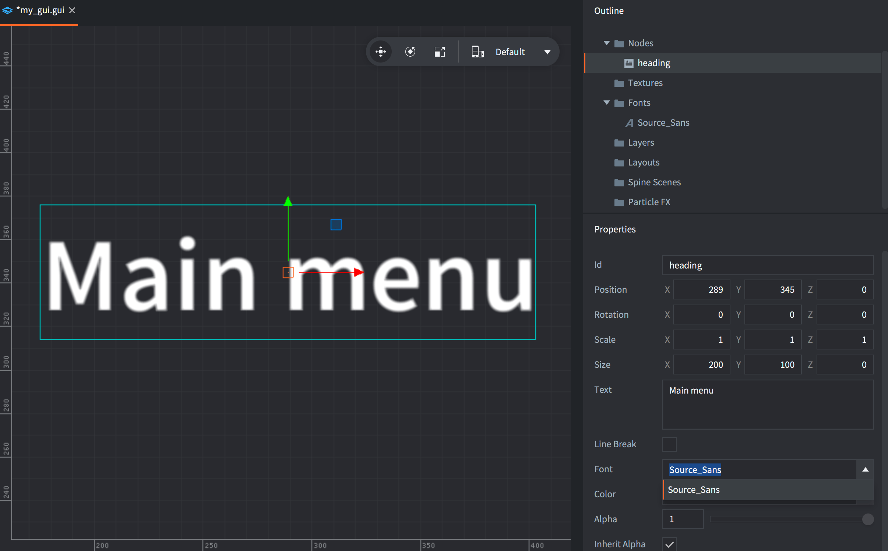
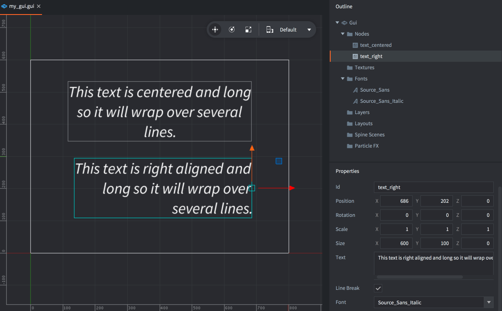

# Węzły tekstowe GUI

Defold obsługuje specjalny typ węzła GUI, który pozwala renderować tekst w scenie GUI. Każdy zasób fontu dodany do projektu może być użyty do renderowania węzłów tekstowych.

## Dodawanie węzłów tekstowych

Fonty, których chcesz używać we węzłach tekstowych GUI, muszą zostać dodane do komponentu GUI. Kliknij prawym przyciskiem myszy folder *Fonts*, użyj górnego menu <kbd>GUI</kbd> albo naciśnij odpowiedni skrót klawiaturowy.



Węzły tekstowe mają zestaw specjalnych właściwości:

*Font*
: Każdy tworzony przez ciebie węzeł tekstowy musi mieć ustawioną właściwość *Font*.

*Text*
: Ta właściwość zawiera wyświetlany tekst.

*Line Break*
: Wyrównanie tekstu zależy od ustawienia pivot, a włączenie tej właściwości pozwala tekstowi łamać się na kilka linii. Szerokość węzła określa miejsce zawijania tekstu.

## Wyrównanie

Ustawiając pivot węzła, możesz zmienić tryb wyrównania tekstu.

*Center*
: Jeśli pivot jest ustawiony na `Center`, `North` lub `South`, tekst jest wyrównany do środka.

*Left*
: Jeśli pivot jest ustawiony na dowolny z trybów `West`, tekst jest wyrównany do lewej.

*Right*
: Jeśli pivot jest ustawiony na dowolny z trybów `East`, tekst jest wyrównany do prawej.



## Modyfikowanie węzłów tekstowych w czasie działania

Węzły tekstowe reagują na ogólne funkcje manipulowania węzłami, które ustawiają rozmiar, pivot, kolor i inne właściwości. Istnieje też kilka funkcji przeznaczonych wyłącznie dla węzłów tekstowych:

* Aby zmienić font węzła tekstowego, użyj funkcji [`gui.set_font()`](/ref/gui/#gui.set_font).
* Aby zmienić zachowanie łamania linii węzła tekstowego, użyj funkcji [`gui.set_line_break()`](/ref/gui/#gui.set_line_break).
* Aby zmienić treść węzła tekstowego, użyj funkcji [`gui.set_text()`](/ref/gui/#gui.set_text).

```lua
function on_message(self, message_id, message, sender)
    if message_id == hash("set_score") then
        local s = gui.get_node("score")
        gui.set_text(s, message.score)
    end
end
```
