# GUI

GUI - Graphical User Interface, czyli graficzny interfejs użytkownika dostarcza elementów, które są w grze wyświetlana zazwyczaj nad światem gry. Defold dostarcza niestandardowy edytor GUI i potężne możliwości skryptowe, które są specjalnie dostosowane do budowy i implementacji interfejsów użytkownika.

Graficzny interfejs użytkownika w Defoldzie to komponent, który tworzysz i przypisujesz do obiektu gry, umieszczając go w kolekcji. Ten komponent ma następujące właściwości:

* Posiada proste, ale potężne funkcje układu (layout), które pozwalają na renderowanie interfejsu użytkownika niezależnie od rozdzielczości i proporcji obrazu.
* Może mieć dołączoną logikę za pomocą skryptu GUI.
* Jest (domyślnie) renderowany na wierzchu innych treści, niezależnie od widoku kamery, więc nawet jeśli masz ruchomą kamerę, twoje elementy interfejsu GUI pozostaną na ekranie. Zachowanie renderowania można zmienić.
* Komponenty GUI są renderowane niezależnie od widoku gry. Dlatego nie są umieszczane w określonym miejscu w edytorze kolekcji, ani nie mają reprezentacji wizualnej w edytorze kolekcji. Komponenty GUI muszą znajdować się w obiekcie gry, który ma swoje miejsce w kolekcji. Zmiana tego miejsca nie ma wpływu na GUI.

## Tworzenie komponentu GUI

Komponenty GUI są tworzone na podstawie pliku prototypu sceny GUI (nazywanego również "prefabem", "szablonem" lub "blueprintem" w innych silnikach). Aby utworzyć nowy komponent GUI, <kbd>kliknij prawym przyciskiem myszy</kbd> w panelu *Assets* i wybierz <kbd>New ▸ Gui</kbd>. Wprowadź nazwę nowego pliku GUI i naciśnij <kbd>OK</kbd>.

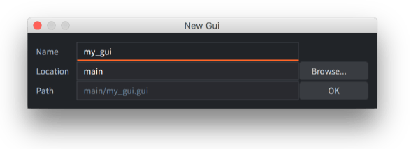{srcset="images/gui/new_gui_file@2x.png 2x"}

Teraz Defold automatycznie otwiera plik w edytorze sceny GUI.

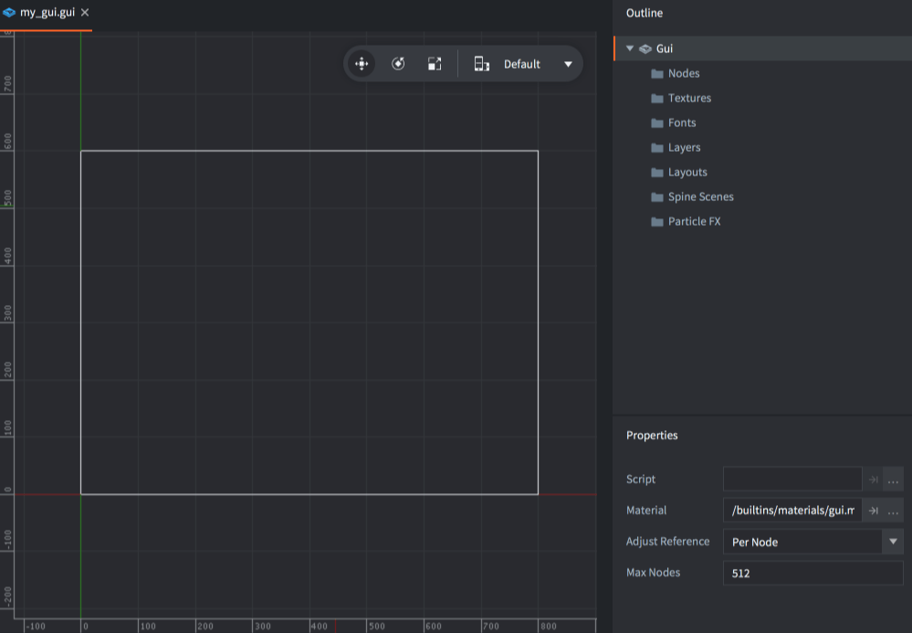{srcset="images/gui/new_gui@2x.png 2x"}

W panelu *Outline* znajdziesz wszystkie elementy GUI: listę węzłów (nodes) i wszelkie zależności (patrz niżej).

Centralny obszar edycji pokazuje GUI. W pasku narzędziowym w prawym górnym rogu obszaru edycji znajdują się narzędzia *Move*, *Rotate* i *Scale* (odpowiednio Przesuń, Obróć i Skaluj), a także selektor układu [layout](/manuals/gui-layouts).

{srcset="images/gui/toolbar@2x.png 2x"}

Biały prostokąt pokazuje obszar wybranego layoutu, o domyślnej szerokości i wysokości ekranu ustawionej w ustawieniach projektu.

Wybierając węzeł "Gui" w panelu *Outline*, zostaną wyświetlone *Properties* komponentu GUI:

Script
: Skrypt GUI przypisany do tego komponentu GUI.

Material
: Materiał używany podczas renderowania tego GUI.

Adjust Reference
: Dostosowanie odniesienia - kontroluje, jak powinien być obliczany Tryb dostosowania (*Adjust Mode*) każdego węzła:

  - `Per Node` - dostosowuje każdy węzeł do dostosowanego rozmiaru węzła nadrzędnego lub zmienionego rozmiaru ekranu.
  - `Disable` - wyłącza tryb dostosowywania węzła. To wymusza, aby wszystkie węzły zachowały swój ustawiony rozmiar.

Max Nodes
: Maksymalna liczba węzłów dla tego GUI.

## Zależności

Drzewo zasobów w grze Defold jest statyczne, więc wszelkie zależności, które potrzebujesz dla swoich węzłów GUI, muszą być dodane do komponentu. W panelu *Outline* grupuje się wszystkie zależności według typu w "folderach":

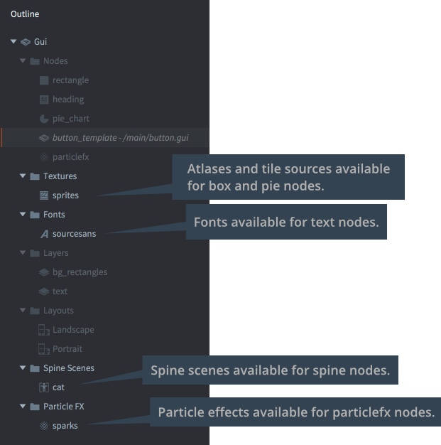{srcset="images/gui/dependencies@2x.png 2x"}

Aby dodać nową zależność, <kbd>kliknij prawym przyciskiem myszy</kbd> root "Gui" w panelu *Outline*, a następnie wybierz <kbd>Add ▸ [typ]</kbd> z kontekstowego menu.

Możesz także <kbd>kliknąć prawym przyciskiem myszy</kbd> na ikonie folderu dla typu, który chcesz dodać, i wybrać <kbd>Add ▸ [typ]</kbd>.

## Typy węzłów

Komponent GUI jest tworzony z zestawu węzłów (nodes). Węzły to proste elementy. Mogą być przesuwane (przesuwane, skalowane i obracane) oraz uporządkowane w hierarchi rodzic-dziecko zarówno w edytorze, jak i w trakcie działania skryptu. Istnieją następujące typy węzłów:

Box node
: {.left}
  Węzeł prostokątny z jednym kolorem, teksturą lub animacją typu flip-book. Zobacz [dokumentację węzła prostokątnego](/manuals/gui-box).

<div style="clear: both;"></div>

Text node
: {.left}
  Wyświetla tekst. Zobacz [dokumentację węzła tekstowego](/manuals/gui-text) for details.

<div style="clear: both;"></div>

Pie node
: {.left}
  Węzeł okrągły lub eliptyczny, który może być częściowo wypełniony (jak pierścień) lub odwrócony. Zobacz [dokumentację węzła pierścienia](/manuals/gui-pie).

<div style="clear: both;"></div>

Template node
: {.left}
  Szablony służą do tworzenia instancji na podstawie innych plików sceny GUI. Zobacz [dokumentację węzła szablonu](/manuals/gui-template).

<div style="clear: both;"></div>

ParticleFX node
: {.left}
  Odtwarza efekt cząsteczkowy. Zobacz [dokumentację węzła ParticleFX](/manuals/gui-particlefx).

<div style="clear: both;"></div>

Aby dodać węzły, kliknij prawym przyciskiem myszy na folderze *Nodes* i wybierz <kbd>Add ▸</kbd>, a następnie <kbd>Box</kbd>, <kbd>Text</kbd>, <kbd>Pie</kbd>, <kbd>Template</kbd> lub <kbd>ParticleFx</kbd>.

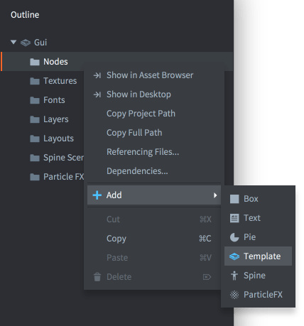{srcset="images/gui/add_node@2x.png 2x"}

Możesz także nacisnąć <kbd>A</kbd> i wybrać typ, który chcesz dodać do GUI.

## Właściwości węzłów

Każdy węzeł ma szeroki zestaw właściwości (properties), które kontrolują jego wygląd:

Id
: Identyfikator węzła. Ta nazwa musi być unikalna w ramach sceny GUI.

Position, Rotation and Scale
: Kontrolują położenie, orientację i skalę węzła. Możesz użyć narzędzi *Move*, *Rotate* i *Scale*  (odpowiednio Przesuń, Obróć i Skaluj), aby zmienić te wartości. Wartości można animować za pomocą skryptu ([dowiedz się więcej](/manuals/property-animation)).

Rozmiar (węzły box, text i pie)
: Rozmiar węzła jest domyślnie automatyczny, ale ustawiając *Size Mode* na `Manual`, możesz zmienić wartość. Rozmiar określa granice węzła i jest używany do wykrywania interakcji z myszą. Tę wartość można animować za pomocą skryptu ([dowiedz się więcej](/manuals/property-animation)).

Size Mode (węzły box i pie)
: Jeśli jest ustawiony na `Automatic`, edytor ustawia rozmiar węzła. Jeśli jest ustawiony na `Manual`, możesz samodzielnie ustawić rozmiar.

Enabled
: Jeśli nie jest zaznaczone, węzeł nie jest renderowany, nie jest animowany i nie można go zaznaczyć za pomocą `gui.pick_node()`. Użyj `gui.set_enabled()` i `gui.is_enabled()` do zmiany w kodzie i sprawdzenia tej właściwości.

Visible
: Jeśli nie jest zaznaczone, węzeł nie jest renderowany, ale wciąż może być animowany i można go zaznaczyć za pomocą `gui.pick_node()`. Użyj `gui.set_visible()` i `gui.get_visible()` do zmiany w kodzie i sprawdzenia tej właściwości.

Text (węzły text)
: Tekst do wyświetlenia na węźle.

Line Break (węzły text)
: Ustaw do zawijania tekstu zgodnie z szerokością węzła.

Font (węzły text)
: Font do użycia podczas renderowania tekstu.

Texture (węzły box i pie)
: Tekstura do narysowania na węźle. Jest to odniesienie do obrazu lub animacji w atlasie lub źródle kafelków.

Slice 9 (węzły box)
: Ustaw, aby zachować rozmiar pikseli tekstury węzła wokół krawędzi i na rogach, gdy węzeł ma zmieniany rozmiar. Zobacz szczegóły w [dokumentacji węzła prostokątnego](/manuals/gui-box).

Inner Radius (węzły pie)
: Wewnętrzny promień węzła, wyrażony wzdłuż osi X. Zobacz [dokumentację węzła pierścienia](/manuals/gui-pie).

Outer Bounds(węzły pie)
: Kontroluje zachowanie zewnętrznych granic. Zobacz [dokumentację węzła pierścienia](/manuals/gui-pie).

Perimeter Vertices  (węzły pie)
: Liczba segmentów, które zostaną użyte do zbudowania kształtu. Zobacz [dokumentację węzła pierścienia](/manuals/gui-pie).

Pie Fill Angle (węzły pie)
: Kąt wypełnienia - ile z pierścienia powinno być wypełnione. Zobacz[dokumentację węzła pierścienia](/manuals/gui-pie).

Template (węzły template)
: Plik sceny GUI do użycia jako szablon na węźle. Zobacz [dokumentację węzła szablonu](/manuals/gui-template).

ParticleFX (węzły ParticleFX)
: Efekt cząsteczkowy do użycia na węźle. Zobacz [dokumentację węzła ParticleFX](/manuals/gui-particlefx).

Color
: Kolor węzła. Jeśli węzeł jest tekstury, kolor zmienia odcień tekstury. Kolor można animować za pomocą skryptu (dowiedz się więcej).

Alpha
: Przejrzystość węzła. Wartość alfa może być animowana za pomocą skryptu ([dowiedz się więcej](/manuals/property-animation)).

Inherit Alpha
: Zaznaczenie tego pola sprawia, że węzeł dziedziczy wartość alfy węzła nadrzędnego. Wartość alfy węzła jest następnie mnożona przez wartość alfy nadrzędnego węzła.

Leading (węzły text)
: Skalująca liczba dla rozstawu międzywierszowego. Wartość `0` oznacza brak rozstawu międzywierszowego. `1` (domyślnie) to normalny rozstaw międzywierszowy.

Tracking (węzły text)
: Skalująca liczba dla odstępu między literami. Domyślnie wynosi `0`.

Layer
: Przypisanie warstwy węzłowi zastępuje normalny porządek rysowania i zamiast tego renderowanie podąża za porządkiem warstwy. Poniżej znajdziesz szczegóły.

Blend mode
: Tryb mieszania kontroluje sposób mieszania się grafiki węzła z grafiką tła:

  - `Alpha` - mieszają się wartości pikseli węzła z tłem. Odpowiada to trybowi "Normal" w oprogramowaniu graficznym.
  - `Add` - dodaje wartości pikseli węzła do tła. Odpowiada to trybowi "Linear Dodge" w niektórym oprogramowaniu graficznym.
  - `Multiply` - mnoży wartości pikseli węzła przez tło.

Pivot
: Oś obrotu - ustawia punkt obrotu węzła. Można to postrzegać jako "punkt centralny" węzła. Każda rotacja, skalowanie lub zmiana rozmiaru będzie zachodzić wokół tego punktu.

Możliwe wartości to `Center`, `North`, `South`, `East`, `West`, `North West`, `North East`, `South West` lub `South East`.

  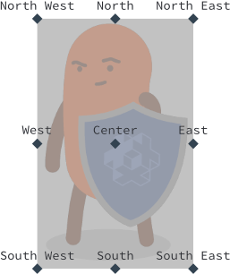{srcset="images/gui/pivot@2x.png 2x"}

Jeśli zmienisz punkt obrotu węzła, węzeł zostanie przesunięty tak, że nowy punkt obrotu będzie znajdować się w pozycji węzła. Węzły tekstowe są ustawiane tak, że `Center` ustawia środek tekstu, `West` ustawia tekst wyrównany do lewej, a `East` ustawia tekst wyrównany do prawej.

X Anchor, Y Anchor
: Kotwiczenie kontroluje, w jaki sposób wertykalna i pozioma pozycja węzła jest zmieniana, gdy granice sceny lub granice węzła nadrzędnego są rozciągane, aby pasować do rzeczywistego rozmiaru ekranu.

  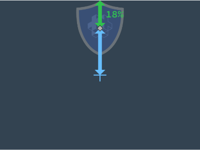{srcset="images/gui/anchoring_unadjusted@2x.png 2x"}

  Dostępne są następujące tryby kotwiczenia:

  - `None` (zarówno *X Anchor*, jak i *Y Anchor*) zachowuje pozycję węzła od centrum węzła nadrzędnego lub sceny, w odniesieniu do jego zmienionego rozmiaru.
  - `Left` lub `Right` (*X Anchor*) skaluje poziomą pozycję węzła, aby zachować pozycję z lewego i prawego brzegu węzła nadrzędnego lub sceny w tej samej proporcji.
  - `Top` lub `Bottom` skaluje pionową pozycję węzła, aby zachować pozycję z górnego i dolnego brzegu węzła nadrzędnego lub sceny w tej samej proporcji.

  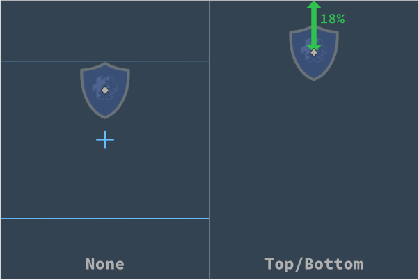{srcset="images/gui/anchoring@2x.png 2x"}

Adjust Mode
: Ustala tryb dostosowania węzła. Ustawienie trybu dostosowania kontroluje, co się dzieje z węzłem, gdy granice sceny lub granice węzła nadrzędnego są dostosowywane, aby pasować do rzeczywistego rozmiaru ekranu.

  Węzeł utworzony w scenie, w której rozdzielczość logiczna jest typową rozdzielczością krajobrazu:

  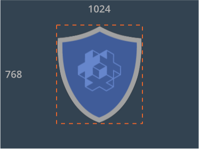{srcset="images/gui/unadjusted@2x.png 2x"}

  Dostępne są następujące tryby dostosowania:

  - `Fit` Dopasowanie sceny do ekranu pionowego powoduje rozciągnięcie sceny. Każdy obszar ograniczający węzła jest podobnie rozciągany. Jednak ustawiając tryb dostosowania, można zachować niezmieniony stosunek szerokości węzła. 
  - `Zoom` skaluje zawartość węzła tak, aby była równa rozciągniętej szerokości lub wysokości prostokątnego obszaru ograniczającego, w zależności od tego, która jest większa. Innymi słowy, zawartość w pełni pokryje rozciągnięty obszar ograniczający węzła.
  - `Stretch` rozciąga zawartość węzła, tak aby wypełniła rozciągnięty obszar ograniczający węzła.

  {srcset="images/gui/adjusted@2x.png 2x"}

  Jeśli właściwość sceny GUI *Adjust Reference* jest ustawiona na `Disabled`, czyli wyłaczona, to ustawienie to będzie ignorowane.

Clipping Mode (węzły box i pie)
: Ustawia tryb przycinania na węźle:

  - `None` renderuje węzeł jak zwykle.
  - `Stencil` powoduje, że obrzeża węzła definiują maskę szablonu, która jest używana do przycinania węzłów podrzędnych węzła.

  Zobacz [instrukcję przycinania GUI](/manuals/gui-clipping).

Clipping Visible (węzły box i pie)
: Ustaw, aby renderować zawartość węzła na obszarze maski szablonu. Zobacz [instrukcję przycinania GUI](/manuals/gui-clipping).

Clipping Inverted (węzły box i pie)
: Odwróć maskę szablonu. Zobacz [instrukcję przycinania GUI](/manuals/gui-clipping).

## Punkt obrotu, Kotwice i Tryb Dostosowywania

Kombinacja właściwości Pivot, Anchors i Adjust Mode umożliwia bardzo elastyczne projektowanie interfejsów GUI, ale może być to dość trudne do zrozumienia bez konkretnego przykładu. Przyjrzyjmy się temu projektowi interfejsu GUI utworzonemu dla ekranu o rozdzielczości 640x1136 pikseli:

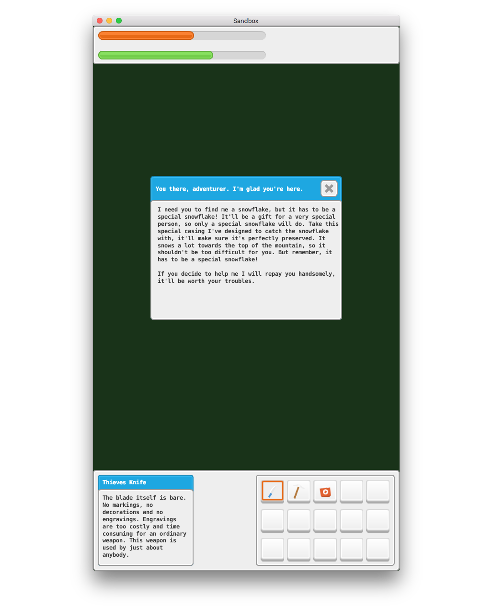

Interfejs użytkownika jest utworzony z kotwicami X i Y ustawionymi na None, a Tryb Dostosowywania Adjust Mode dla każdego węzła pozostawiony na domyślnym ustawieniu Fit. Pivot dla panelu górnego to North, pivot dla panelu dolnego to South, a pivot dla pasków w panelu górnym to West. Reszta węzłów ma punkty obrotu ustawione na Center. Jeśli zmienimy rozmiar okna, aby było szersze, to oto co się stanie:


Teraz, co zrobić, jeśli chcemy, aby górne i dolne paski zawsze miały taką samą szerokość jak ekran? Możemy zmienić Adjust Mode dla paneli tła na kolor szary na Stretch:


To jest lepsze. Panele tła w kolorze szarym będą teraz zawsze rozciągnięte do szerokości okna, ale paski w panelu górnym oraz dwie skrzynki na dole nie są właściwie umieszczone. Jeśli chcemy, aby paski na górze pozostały po lewej stronie, musimy zmienić X Anchor z None na Left:

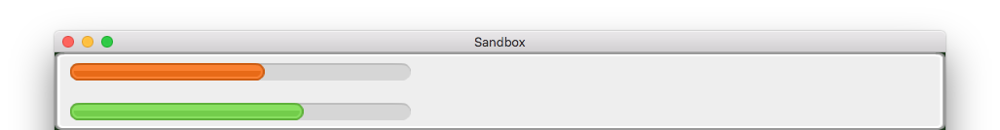

To jest dokładnie tak, jak chcemy, żeby było w przypadku panelu górnego. Paski w panelu górnym miały już punkty obrotu ustawione na West, co oznacza, że będą się ładnie pozycjonować z lewym/zachodnim brzegiem pasków (Pivot) przywiązanych do lewego brzegu panelu nadrzędnego (X Anchor).

Teraz, jeśli ustawimy X Anchor na Left dla lewej skrzynki i na Right dla prawej skrzynki, otrzymamy następujący wynik:


To nie jest dokładnie oczekiwany wynik. Obie skrzynki powinny być tak blisko lewego i prawego brzegu, jak paski w panelu górnym. Powodem tego jest błędne ustawienie punktu obrotu:


Obie skrzynki mają ustawiony punkt obrotu - Pivot na Center. Oznacza to, że gdy ekran staje się szerszy, środek skrzynki (punkt obrotu) pozostaje na tej samej względnej odległości od brzegów. W przypadku lewej skrzynki było to 17% od lewego brzegu w oryginalnym oknie o rozdzielczości 640x1136 pikseli:

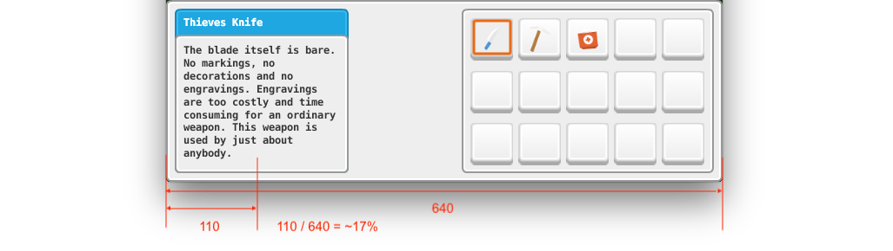

Gdy rozmiar ekranu jest inny, środek lewej skrzynki pozostaje na tej samej odległości 17% od lewego brzegu:

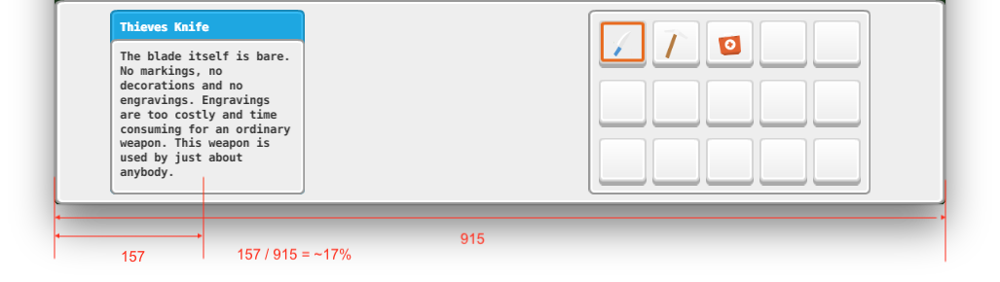

Jeśli zmienimy Pivot z Center na West dla lewej skrzynki i na East dla prawej skrzynki i przesuniemy skrzynki, otrzymamy oczekiwany wynik, nawet gdy ekran zostanie zmieniony w rozmiarze:


## Kolejność rysowania

Wszystkie węzły są renderowane w kolejności, w jakiej są wymienione w folderze "Nodes". Węzeł na górze listy jest rysowany jako pierwszy i będzie więc wyglądać tak, jakby był za innymi węzłami. Ostatni węzeł na liście jest rysowany jako ostatni, co oznacza, że będzie wyglądać tak, jakby był z przodu względem wszystkich innych węzłów. Zmiana wartości Z na węźle nie kontroluje kolejności rysowania; jednakże, jeśli ustawisz wartość Z poza zakresem renderowania swojego skryptu renderującego, węzeł nie będzie już renderowany na ekranie. Możesz również nadpisać kolejność indeksów węzłów warstwami (patrz poniżej).

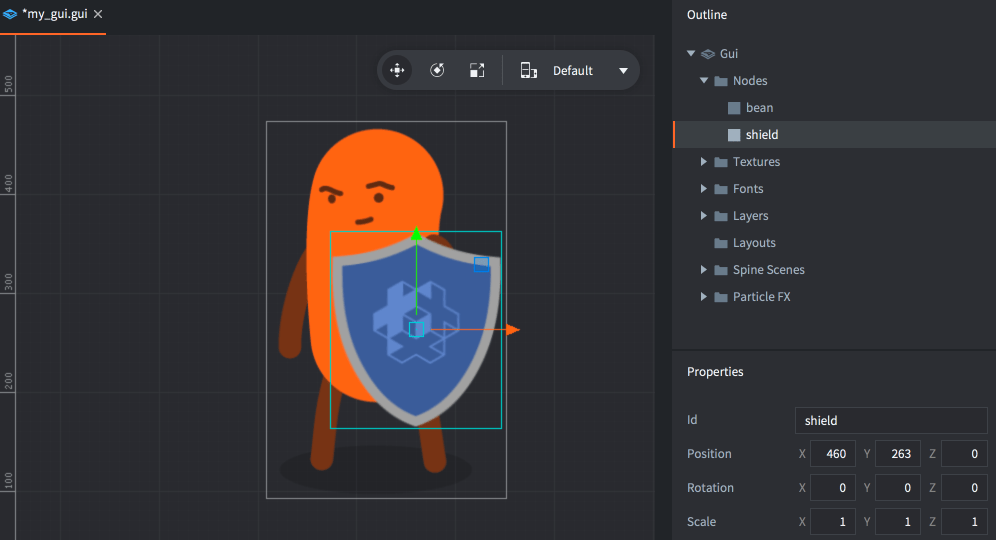{srcset="images/gui/draw_order@2x.png 2x"}

Wybierz węzeł i naciśnij <kbd>Alt + W górę/W dół</kbd>, aby przesunąć węzeł w górę lub w dół i zmienić kolejność indeksu.

Kolejność rysowania można zmieniać w skrypcie:

```lua
local bean_node = gui.get_node("bean")
local shield_node = gui.get_node("shield")

if gui.get_index(shield_node) < gui.get_index(bean_node) then
  gui.move_above(shield_node, bean_node)
end
```

## Hierarchie rodzic-dziecko

Węzeł staje się dzieckiem (ang. child) innego węzła, przeciągając go na węzeł, który chcesz, aby był rodzicem (ang. parent) dziecka. Węzeł z rodzicem dziedziczy transformację (pozycję, obrót i skalę) stosowaną do rodzica i względem punktu obrotu rodzica.

{srcset="images/gui/parent_child@2x.png 2x"}

Rodzice są rysowani przed swoimi dziećmi. Wykorzystaj warstwy, aby zmienić kolejność rysowania węzłów rodzica i dziecka oraz zoptymalizować renderowanie węzłów (patrz poniżej).

## Warstwy i wywołania rysowania

Warstwy (ang. layers) pozwalają na dokładną kontrolę nad tym, w jaki sposób węzły są rysowane i mogą być używane do zmniejszenia liczby wywołań rysowania (ang. draw calls), jakie silnik musi tworzyć, aby narysować scenę GUI. Gdy silnik ma rysować węzły sceny GUI, grupuje je we wskaźniki wywołań rysowania na podstawie następujących warunków:

- Węzły muszą używać tego samego typu.
- Węzły muszą używać tego samego atlasu lub źródła kafelków.
- Węzły muszą być renderowane tym samym trybem mieszania (blend mode).
- Muszą używać tego samego fontu.

Jeśli węzeł różni się od poprzedniego pod względem któregoś z tych punktów, nastąpi przerwanie wskaźnika i zostanie utworzone inne wywołanie rysowania. Przycinanie węzłów (clipping nodes) zawsze przerywa wskaźnik, tak jak i każdy zakres szablonu (stencil scope).

Możliwość organizowania węzłów w hierarchie ułatwia grupowanie węzłów w jednostki łatwo zarządzalne. Jednak hierarchie mogą skutecznie przerywać renderowanie wskaźników, jeśli miesza się różne typy węzłów:

{srcset="images/gui/break_batch@2x.png 2x"}

Kiedy potok renderowania (ang. rendering pipeline) przechodzi przez listę węzłów, zmuszony jest utworzyć oddzielny wskaźnik dla każdego oddzielnego węzła, ponieważ typy są różne. Ogólnie rzecz biorąc, te trzy przyciski będą wymagały sześciu wywołań rysowania.

Przypisując węzłom warstwy, można je uporządkować w inny sposób, co pozwala potokowi renderowania grupować węzły w mniej wywołań rysowania. Zacznij od dodania potrzebnych warstw do sceny. Kliknij prawym przyciskiem na ikonę folderu "Layers" w widoku "Outline" i wybierz "Add ▸ Layer". Zaznacz nową warstwę i przypisz jej właściwość "Name" w widoku "Properties".

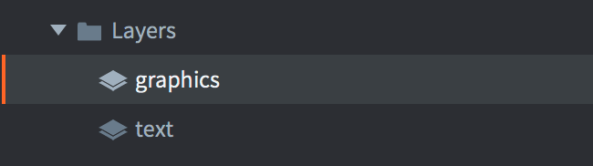{srcset="images/gui/layers@2x.png 2x"}

Następnie ustaw właściwość "Layer" dla każdego węzła na odpowiadającą mu warstwę. Kolejność rysowania warstw ma pierwszeństwo nad zwykłym porządkiem indeksów węzłów, więc ustawienie węzłów graficznych przycisku na warstwę "graphics" i węzłów tekstowych przycisku na warstwę "text" spowoduje następującą kolejność rysowania:

Najpierw wszystkie węzły w warstwie "text", od góry:

  1. "button-1"
  2. "button-2"
  3. "button-3"

Następnie wszystkie węzły w warstwie "tekst", od góry:

  4. "button-text-1"
  5. "button-text-2"
  6. "button-text-3"

Węzły mogą teraz być grupowane w dwóch wywołaniach rysowania, zamiast sześciu. To znaczna wydajnościowa korzyść!

Należy zauważyć, że węzeł potomny (child node) bez ustawionej warstwy dziedziczy domyślne ustawienia warstwy od węzła rodzica. Nieustawienie warstwy na węźle domyślnie dodaje go do warstwy "null", która jest rysowana przed innymi warstwami.
