# GUI

Silnik Defold udostępnia własny edytor GUI oraz rozbudowane możliwości skryptowe, które są specjalnie dopasowane do tworzenia i implementowania interfejsów użytkownika.

Graficzny interfejs użytkownika w Defold to komponent, który tworzysz, dołączasz do obiektu gry i umieszczasz w kolekcji. Taki komponent ma następujące właściwości:

* Ma proste, ale potężne funkcje układu, które pozwalają renderować interfejs użytkownika niezależnie od rozdzielczości i proporcji obrazu.
* Można do niego dołączyć logikę za pomocą skryptu GUI.
* Domyślnie jest renderowany nad inną zawartością, niezależnie od widoku kamery, więc nawet przy ruchomej kamerze elementy GUI pozostaną na ekranie. To zachowanie renderowania można zmienić.

Komponenty GUI są renderowane niezależnie od widoku gry. Z tego powodu nie są umieszczane w konkretnym miejscu w edytorze kolekcji ani nie mają tam reprezentacji wizualnej. Muszą jednak znajdować się w obiekcie gry, który ma swoje miejsce w kolekcji. Zmiana tego położenia nie ma wpływu na GUI.

## Tworzenie komponentu GUI

Komponenty GUI tworzy się z pliku prototypu sceny GUI, znanego też jako "prefab" lub "blueprint" w innych silnikach. Aby utworzyć nowy komponent GUI, <kbd>kliknij prawym przyciskiem myszy</kbd> w panelu *Assets* i wybierz <kbd>New ▸ Gui</kbd>. Wpisz nazwę nowego pliku GUI i naciśnij <kbd>OK</kbd>.

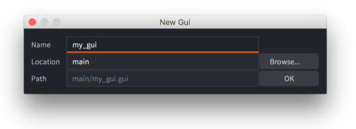

Silnik Defold automatycznie otworzy teraz plik w edytorze sceny GUI.

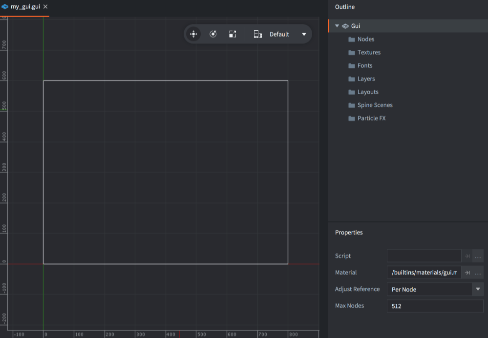

W panelu *Outline* widać całą zawartość GUI: listę węzłów oraz wszystkie zależności (patrz niżej).

Centralny obszar edycji pokazuje GUI. Pasek narzędzi w prawym górnym rogu obszaru edycji zawiera narzędzia *Move*, *Rotate* i *Scale* oraz selektor [layout](/manuals/gui-layouts).


Biały prostokąt pokazuje granice aktualnie wybranego layoutu, o domyślnej szerokości i wysokości ekranu ustawionej w ustawieniach projektu.

## Właściwości GUI

Wybranie głównego węzła "Gui" w panelu *Outline* pokazuje *Properties* komponentu GUI:

*Script*
: Skrypt GUI przypisany do tego komponentu GUI.

*Material*
: Materiał używany podczas renderowania tego GUI. Zwróć uwagę, że z panelu Outline można też dodać do Gui kilka materiałów i przypisać je do poszczególnych węzłów.

*Adjust Reference*
: Określa, jak ma być obliczany *Adjust Mode* każdego węzła:

  - `Per Node` dostosowuje każdy węzeł względem dostosowanego rozmiaru węzła nadrzędnego albo przeskalowanego ekranu.
  - `Disable` wyłącza tryb dostosowania węzła. Wymusza to zachowanie przez wszystkie węzły ustawionego rozmiaru.

*Current Nodes*
: Liczba węzłów aktualnie używanych w tym GUI.

*Max Nodes*
: Maksymalna liczba węzłów dla tego GUI.

*Max Dynamic Textures*
: Maksymalna liczba tekstur, które można utworzyć za pomocą [`gui.new_texture()`](/ref/stable/gui/#gui.new_texture:texture_id-width-height-type-buffer-flip).

## Manipulacja w czasie działania

W czasie działania można manipulować właściwościami GUI ze skryptu komponentu, korzystając z `go.get()` i `go.set()`:

Fonty
: Pobieranie lub ustawianie fontu używanego w GUI.


```lua
go.property("mybigfont", resource.font("/assets/mybig.font"))

function init(self)
  -- pobierz plik fontu aktualnie przypisany do fontu o id 'default'
  print(go.get("#gui", "fonts", { key = "default" })) -- /builtins/fonts/default.font

  -- ustaw font o id 'default' na plik fontu przypisany do właściwości zasobu 'mybigfont'
  go.set("#gui", "fonts", self.mybigfont, { key = "default" })

  -- pobierz nowy plik fontu przypisany do fontu o id 'default'
  print(go.get("#gui", "fonts", { key = "default" })) -- /assets/mybig.font
end
```

Materiały
: Pobieranie lub ustawianie materiału używanego w GUI.


```lua
go.property("myeffect", resource.material("/assets/myeffect.material"))

function init(self)
  -- pobierz plik materiału aktualnie przypisany do materiału o id 'effect'
  print(go.get("#gui", "materials", { key = "effect" })) -- /effect.material

  -- ustaw materiał o id 'effect' na plik materiału przypisany do właściwości zasobu 'myeffect'
  go.set("#gui", "materials", self.myeffect, { key = "effect" })

  -- pobierz nowy plik materiału przypisany do materiału o id 'effect'
  print(go.get("#gui", "materials", { key = "effect" })) -- /assets/myeffect.material
end
```

Tekstury
: Pobieranie lub ustawianie tekstury (atlasu) używanej w GUI.


```lua
go.property("mytheme", resource.atlas("/assets/mytheme.atlas"))

function init(self)
  -- pobierz plik tekstury aktualnie przypisany do tekstury o id 'theme'
  print(go.get("#gui", "textures", { key = "theme" })) -- /theme.atlas

  -- ustaw teksturę o id 'theme' na plik tekstury przypisany do właściwości zasobu 'mytheme'
  go.set("#gui", "textures", self.mytheme, { key = "theme" })

  -- pobierz nowy plik tekstury przypisany do tekstury o id 'theme'
  print(go.get("#gui", "textures", { key = "theme" })) -- /assets/mytheme.atlas
end
```

## Zależności

Drzewo zasobów w grze Defold jest statyczne, więc wszystkie zależności potrzebne węzłom GUI trzeba dodać do komponentu. *Outline* grupuje wszystkie zależności według typu w "folderach":

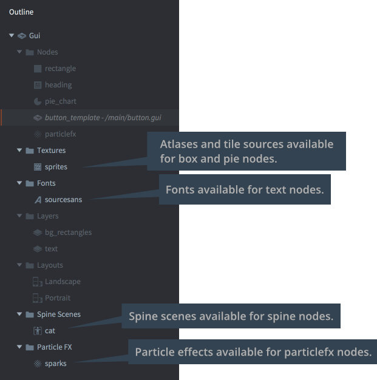

Aby dodać nową zależność, przeciągnij ją z panelu *Asset* do widoku edytora.

Alternatywnie, <kbd>kliknij prawym przyciskiem myszy</kbd> główny węzeł "Gui" w panelu *Outline*, a następnie wybierz <kbd>Add ▸ [type]</kbd> z menu kontekstowego.

Możesz też <kbd>kliknąć prawym przyciskiem myszy</kbd> ikonę folderu dla typu, który chcesz dodać, i wybrać <kbd>Add ▸ [type]</kbd>.

## Typy węzłów

Komponent GUI składa się z zestawu węzłów. Węzły są prostymi elementami. Można je przemieszczać, skalować i obracać oraz układać w hierarchie rodzic-dziecko zarówno w edytorze, jak i w czasie działania, korzystając ze skryptów. Dostępne są następujące typy węzłów:

Box node
: {.left}
  Prostokątny węzeł z pojedynczym kolorem, teksturą albo animacją flip-book. Szczegóły znajdziesz w [dokumentacji węzła Box](/manuals/gui-box).

<div style="clear: both;"></div>

Text node
: {.left}
  Wyświetla tekst. Szczegóły znajdziesz w [dokumentacji węzła Text](/manuals/gui-text).

<div style="clear: both;"></div>

Pie node
: {.left}
  Okrągły lub eliptyczny węzeł, który można częściowo wypełnić albo odwrócić. Szczegóły znajdziesz w [dokumentacji węzła Pie](/manuals/gui-pie).

<div style="clear: both;"></div>

Template node
: {.left}
  Szablony służą do tworzenia instancji na podstawie innych plików scen GUI. Szczegóły znajdziesz w [dokumentacji węzła Template](/manuals/gui-template).

<div style="clear: both;"></div>

ParticleFX node
: {.left}
  Odtwarza efekt cząsteczkowy. Szczegóły znajdziesz w [dokumentacji węzła ParticleFX](/manuals/gui-particlefx).

<div style="clear: both;"></div>

Węzły można dodawać, <kbd>klikając prawym przyciskiem myszy</kbd> folder *Nodes* i wybierając <kbd>Add ▸</kbd>, a potem <kbd>Box</kbd>, <kbd>Text</kbd>, <kbd>Pie</kbd>, <kbd>Template</kbd> lub <kbd>ParticleFx</kbd>.

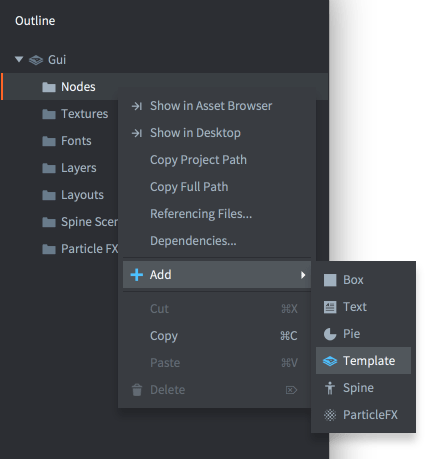

Możesz też nacisnąć <kbd>A</kbd> i wybrać typ, który chcesz dodać do GUI.

## Właściwości węzłów

Każdy węzeł ma rozbudowany zestaw właściwości, które kontrolują jego wygląd:

Id
: Identyfikator węzła. Ta nazwa musi być unikalna w obrębie sceny GUI.

Position, Rotation and Scale
: Określają położenie, orientację i skalowanie węzła. Możesz użyć narzędzi *Move*, *Rotate* i *Scale*, aby zmienić te wartości. Wartości można animować ze skryptu ([dowiedz się więcej](/manuals/property-animation)).

Size (box, text and pie nodes)
: Rozmiar węzła jest domyślnie automatyczny, ale ustawiając *Size Mode* na `Manual`, możesz go zmienić. Rozmiar definiuje granice węzła i jest używany przy sprawdzaniu trafień wejścia. Tę wartość można animować ze skryptu ([dowiedz się więcej](/manuals/property-animation)).

Size Mode (box and pie nodes)
: Jeśli ustawiono `Automatic`, edytor nada węzłowi rozmiar. Jeśli ustawiono `Manual`, możesz ustawić rozmiar samodzielnie.

Enabled
: Jeśli pole jest odznaczone, węzeł nie jest renderowany, nie jest animowany i nie można go wskazać za pomocą `gui.pick_node()`. Użyj `gui.set_enabled()` i `gui.is_enabled()`, aby programowo zmieniać i sprawdzać tę właściwość.

Visible
: Jeśli pole jest odznaczone, węzeł nie jest renderowany, ale nadal można go animować i wskazywać za pomocą `gui.pick_node()`. Użyj `gui.set_visible()` i `gui.get_visible()`, aby programowo zmieniać i sprawdzać tę właściwość.

Text (text nodes)
: Tekst wyświetlany na węźle.

Line Break (text nodes)
: Ustaw, aby tekst zawijał się zgodnie z szerokością węzła.

Font (text nodes)
: Font używany do renderowania tekstu.

Texture (box and pie nodes)
: Tekstura rysowana na węźle. To odwołanie do obrazu albo animacji w atlasie lub źródle kafelków.

Material (box, pie nodes, text and particlefx nodes)
: Materiał używany do rysowania węzła. Może to być materiał dodany do sekcji Materials w Outline albo pusty wybór, który użyje domyślnego materiału przypisanego do komponentu GUI.

Slice 9 (box nodes)
: Ustawia zachowanie tak, aby przy zmianie rozmiaru węzła zachować rozmiar pikseli tekstury wokół krawędzi. Szczegóły znajdziesz w [dokumentacji węzła Box](/manuals/gui-box).

Inner Radius (pie nodes)
: Wewnętrzny promień węzła, wyrażony wzdłuż osi X. Szczegóły znajdziesz w [dokumentacji węzła Pie](/manuals/gui-pie).

Outer Bounds (pie nodes)
: Kontroluje zachowanie zewnętrznych granic. Szczegóły znajdziesz w [dokumentacji węzła Pie](/manuals/gui-pie).

Perimeter Vertices (pie nodes)
: Liczba segmentów użytych do zbudowania kształtu. Szczegóły znajdziesz w [dokumentacji węzła Pie](/manuals/gui-pie).

Pie Fill Angle (pie nodes)
: Określa, jak duża część pie ma być wypełniona. Szczegóły znajdziesz w [dokumentacji węzła Pie](/manuals/gui-pie).

Template (template nodes)
: Plik sceny GUI używany jako szablon dla węzła. Szczegóły znajdziesz w [dokumentacji węzła Template](/manuals/gui-template).

ParticleFX (particlefx nodes)
: Efekt cząsteczkowy używany w tym węźle. Szczegóły znajdziesz w [dokumentacji węzła ParticleFX](/manuals/gui-particlefx).

Color
: Kolor węzła. Jeśli węzeł ma teksturę, kolor nadaje jej odcień. Kolor można animować ze skryptu ([dowiedz się więcej](/manuals/property-animation)).

Alpha
: Przezroczystość węzła. Wartość alfa może być animowana ze skryptu ([dowiedz się więcej](/manuals/property-animation)).

Inherit Alpha
: Zaznaczenie tego pola sprawia, że węzeł dziedziczy wartość alfa węzła nadrzędnego. Wartość alfa węzła jest wtedy mnożona przez wartość alfa rodzica.

Leading (text nodes)
: Skaluje odstęp między wierszami. Wartość `0` oznacza brak odstępu między wierszami. `1` (domyślna) oznacza normalny odstęp między wierszami.

Tracking (text nodes)
: Skaluje odstęp między literami. Domyślnie wynosi 0.

Layer
: Przypisanie warstwy do węzła nadpisuje zwykłą kolejność rysowania i zamiast niej stosuje kolejność warstw. Szczegóły poniżej.

Blend mode
: Kontroluje sposób mieszania grafiki węzła z grafiką tła:
  - `Alpha` miesza wartości pikseli węzła z tłem. Odpowiada to trybowi "Normal" w programach graficznych.
  - `Add` dodaje wartości pikseli węzła do tła. Odpowiada to trybowi "Linear dodge" w niektórych programach graficznych.
  - `Multiply` mnoży wartości pikseli węzła przez tło.
  - `Screen` mnoży odwrotnie wartości pikseli węzła i tła. Odpowiada to trybowi "Screen" w programach graficznych.

Pivot
: Ustawia punkt obrotu węzła. Można go traktować jako "punkt środkowy" węzła. Każdy obrót, skalowanie albo zmiana rozmiaru zachodzą wokół tego punktu.

  Dostępne wartości to `Center`, `North`, `South`, `East`, `West`, `North West`, `North East`, `South West` albo `South East`.

  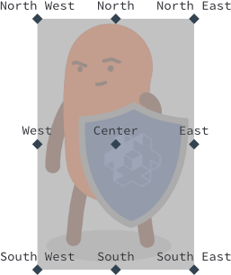

  Jeśli zmienisz pivot węzła, węzeł zostanie przesunięty tak, aby nowy pivot znalazł się w jego pozycji. Węzły tekstowe są wyrównywane tak, że `Center` centruje tekst, `West` wyrównuje go do lewej, a `East` wyrównuje go do prawej.

X Anchor, Y Anchor
: Kotwiczenie określa, jak zmienia się pionowa i pozioma pozycja węzła, gdy granice sceny albo granice węzła nadrzędnego są rozciągane tak, aby dopasować się do fizycznego rozmiaru ekranu.

  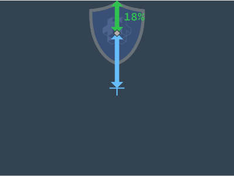

  Dostępne są następujące tryby kotwiczenia:

  - `None` (zarówno dla *X Anchor*, jak i *Y Anchor*) zachowuje pozycję węzła względem środka węzła nadrzędnego albo sceny, w odniesieniu do jego dostosowanego rozmiaru.
  - `Left` albo `Right` (*X Anchor*) skaluje poziomą pozycję węzła tak, aby zachować ją w tej samej proporcji względem lewego i prawego brzegu węzła nadrzędnego albo sceny.
  - `Top` albo `Bottom` (*Y Anchor*) skaluje pionową pozycję węzła tak, aby zachować ją w tej samej proporcji względem górnego i dolnego brzegu węzła nadrzędnego albo sceny.

  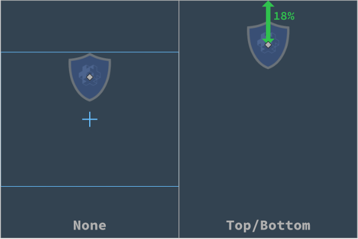

Adjust Mode
: Ustawia tryb dostosowania dla węzła. To ustawienie kontroluje, co dzieje się z węzłem, gdy granice sceny albo granice węzła nadrzędnego są dostosowywane do fizycznego rozmiaru ekranu.

  Węzeł utworzony w scenie, w której logiczna rozdzielczość odpowiada typowej rozdzielczości poziomej:

  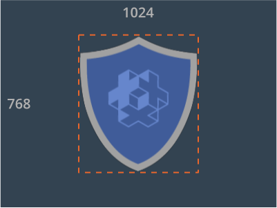

  Dopasowanie sceny do ekranu pionowego powoduje rozciągnięcie sceny. Podobnie rozciągana jest ramka ograniczająca każdego węzła. Ustawiając tryb dostosowania, można jednak zachować proporcje zawartości węzła. Dostępne są następujące tryby:

  - `Fit` skaluje zawartość węzła tak, aby odpowiadała rozciągniętej szerokości albo wysokości ramki ograniczającej, zależnie od tego, która z nich jest mniejsza. Innymi słowy, zawartość zmieści się wewnątrz rozciągniętej ramki ograniczającej węzła.
  - `Zoom` skaluje zawartość węzła tak, aby odpowiadała rozciągniętej szerokości albo wysokości ramki ograniczającej, zależnie od tego, która z nich jest większa. Innymi słowy, zawartość całkowicie pokryje rozciągniętą ramkę ograniczającą węzła.
  - `Stretch` rozciąga zawartość węzła tak, aby wypełniła rozciągniętą ramkę ograniczającą węzła.

  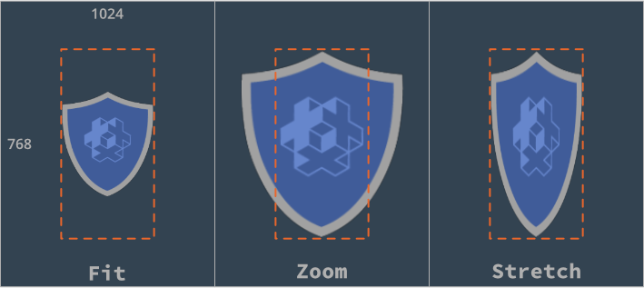

  Jeśli właściwość sceny GUI *Adjust Reference* ma wartość `Disabled`, to ustawienie to zostanie zignorowane.

Clipping Mode (box and pie nodes)
: Ustawia tryb przycinania dla węzła:

  - `None` renderuje węzeł normalnie.
  - `Stencil` sprawia, że granice węzła definiują maskę szablonu używaną do przycinania jego węzłów potomnych.

  Szczegóły znajdziesz w [instrukcji przycinania GUI](/manuals/gui-clipping).

Clipping Visible (box and pie nodes)
: Ustaw, aby renderować zawartość węzła w obszarze maski szablonu. Szczegóły znajdziesz w [instrukcji przycinania GUI](/manuals/gui-clipping).

Clipping Inverted (box and pie nodes)
: Odwraca maskę szablonu. Szczegóły znajdziesz w [instrukcji przycinania GUI](/manuals/gui-clipping).

## Pivot, Anchors i Adjust Mode

Połączenie właściwości Pivot, Anchors i Adjust Mode pozwala bardzo elastycznie projektować GUI, ale bez konkretnego przykładu może być trudno zrozumieć, jak to działa. Weźmy jako przykład taki podgląd GUI utworzony dla ekranu 640x1136:

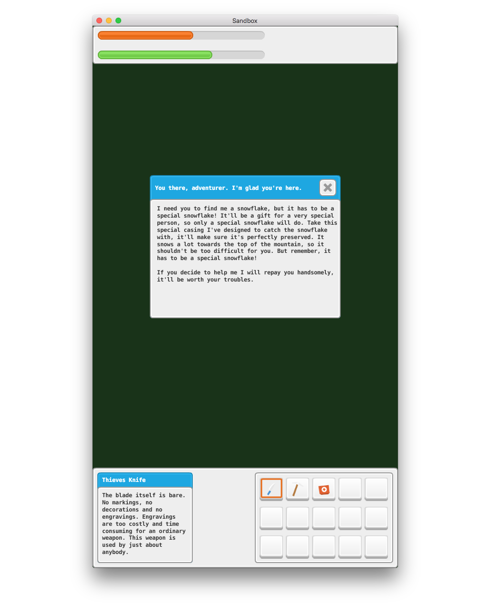

Interfejs użytkownika został utworzony z X i Y Anchors ustawionymi na None, a Adjust Mode każdego węzła pozostawiono na domyślnym Fit. Pivot górnego panelu to North, pivot dolnego panelu to South, a pivot pasków w górnym panelu ustawiono na West. Pozostałe węzły mają pivot ustawiony na Center. Jeśli zmienimy rozmiar okna tak, aby było szersze, stanie się to:

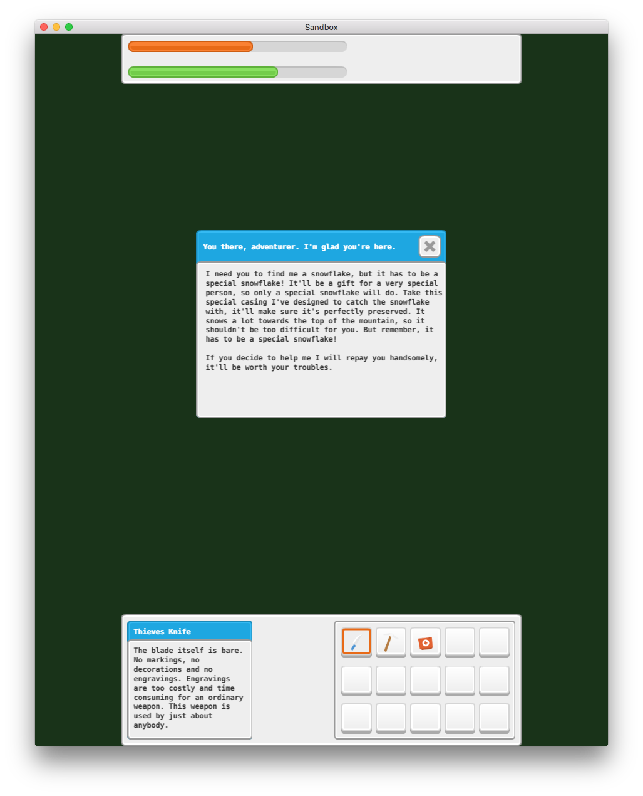

A co, jeśli chcemy, aby górny i dolny pasek zawsze były tak szerokie jak ekran? Możemy zmienić Adjust Mode szarych paneli tła u góry i u dołu na Stretch:

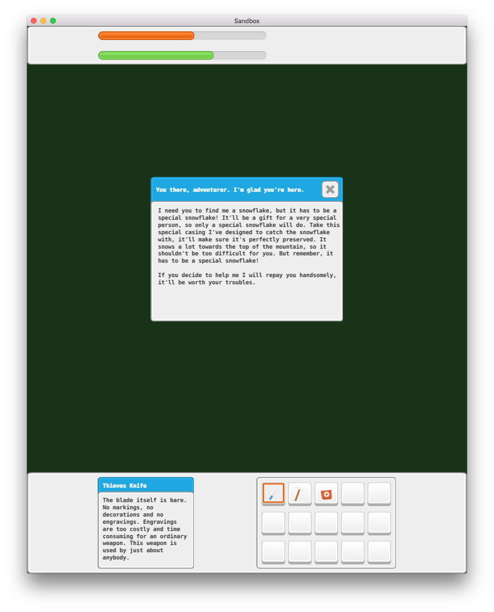

To lepiej. Szare panele tła będą teraz zawsze rozciągane do szerokości okna, ale paski w górnym panelu oraz dwa pola na dole nie są poprawnie ustawione. Jeśli chcemy, aby paski u góry pozostały po lewej stronie, musimy zmienić X Anchor z None na Left:

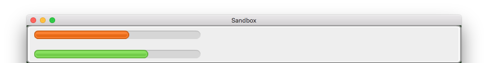

To dokładnie to, czego chcemy w przypadku górnego panelu. Paski w górnym panelu miały już ustawiony pivot West, co oznacza, że będą ładnie pozycjonowane tak, aby lewy/zachodni brzeg pasków był zakotwiczony do lewego brzegu panelu nadrzędnego (X Anchor).

Jeśli teraz ustawimy X Anchor na Left dla lewego pola i na Right dla prawego pola, otrzymamy następujący wynik:

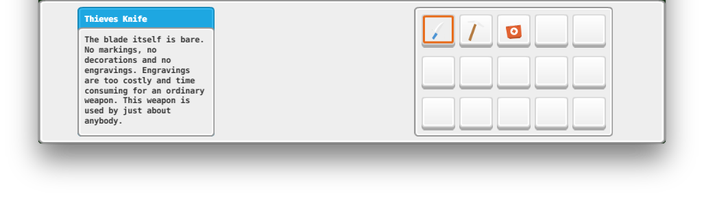

To nie jest do końca oczekiwany rezultat. Oba pola powinny pozostać tak blisko lewego i prawego brzegu, jak paski w górnym panelu. Powodem jest nieprawidłowo ustawiony pivot:


Oba pola mają ustawiony pivot Center. Oznacza to, że gdy ekran staje się szerszy, środkowy punkt (pivot) pól pozostaje w tej samej względnej odległości od brzegów. W przypadku lewego pola wynosiło to 17% od lewego brzegu w oryginalnym oknie 640x1136:

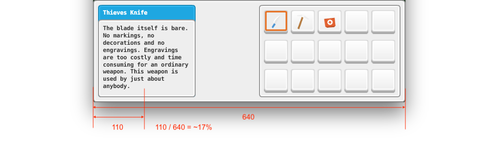

Gdy ekran zostaje przeskalowany, środkowy punkt lewego pola pozostaje w tej samej odległości 17% od lewego brzegu:

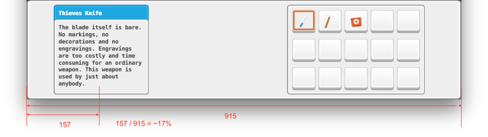

Jeśli zmienimy pivot z Center na West dla lewego pola i na East dla prawego pola, a następnie przestawimy pola, otrzymamy oczekiwany rezultat nawet po zmianie rozmiaru ekranu:

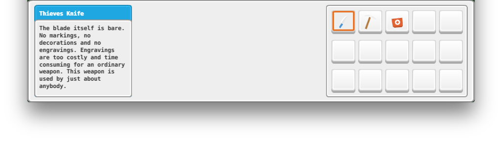

## Kolejność rysowania

Wszystkie węzły są renderowane w kolejności, w jakiej są wymienione w folderze "Nodes". Węzeł na górze listy jest rysowany jako pierwszy i dlatego będzie widoczny za wszystkimi pozostałymi węzłami. Ostatni węzeł na liście jest rysowany jako ostatni, co oznacza, że będzie widoczny przed wszystkimi innymi węzłami. Zmiana wartości Z węzła nie kontroluje jego kolejności rysowania; jeśli jednak ustawisz wartość Z poza zakresem renderowania skryptu do renderowania, węzeł nie będzie już renderowany na ekranie. Kolejność indeksów węzłów można nadpisać za pomocą warstw (patrz niżej).

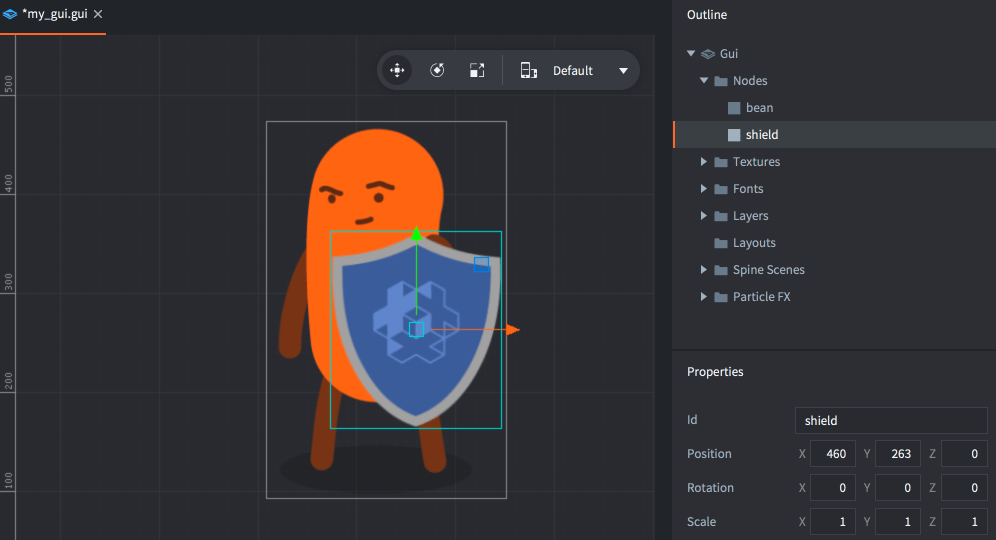

Zaznacz węzeł i naciśnij <kbd>Alt + Up/Down</kbd>, aby przesunąć go w górę lub w dół i zmienić kolejność indeksów.

Kolejność rysowania można też zmieniać w skrypcie:

```lua
local bean_node = gui.get_node("bean")
local shield_node = gui.get_node("shield")

if gui.get_index(shield_node) < gui.get_index(bean_node) then
  gui.move_above(shield_node, bean_node)
end
```

## Hierarchie rodzic-dziecko

Węzeł staje się dzieckiem innego węzła przez przeciągnięcie go na węzeł, który ma być jego rodzicem. Węzeł z rodzicem dziedziczy transformację (pozycję, obrót i skalę) zastosowaną do rodzica oraz względem jego pivota.

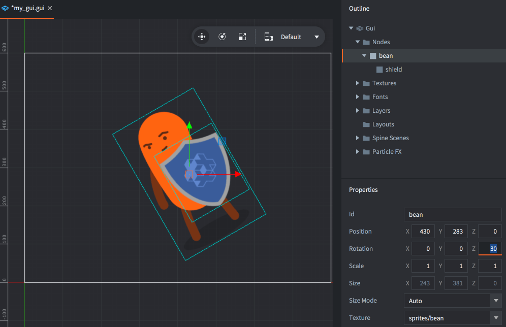

Rodzice są rysowani przed swoimi dziećmi. Używaj warstw, aby zmieniać kolejność rysowania węzłów rodzica i dziecka oraz optymalizować renderowanie węzłów (patrz niżej).

## Warstwy i draw calls

Warstwy dają precyzyjną kontrolę nad tym, jak rysowane są węzły, i można ich użyć do zmniejszenia liczby wywołań rysowania, które silnik musi utworzyć, aby narysować scenę GUI. Gdy silnik ma narysować węzły sceny GUI, grupuje je w partie wywołań rysowania na podstawie następujących warunków:

- Węzły muszą używać tego samego typu.
- Węzły muszą używać tego samego atlasu albo źródła kafelków.
- Węzły muszą być renderowane tym samym trybem mieszania.
- Muszą używać tego samego fontu.

Jeśli węzeł różni się od poprzedniego pod którymkolwiek z tych względów, przerwie partię i utworzy kolejne wywołanie rysowania. Węzły przycinające zawsze przerywają partię, a każdy zakres szablonu również przerywa partię.

Możliwość układania węzłów w hierarchie ułatwia grupowanie ich w wygodne jednostki. Hierarchie mogą jednak skutecznie psuć renderowanie partiami, jeśli miesza się różne typy węzłów:

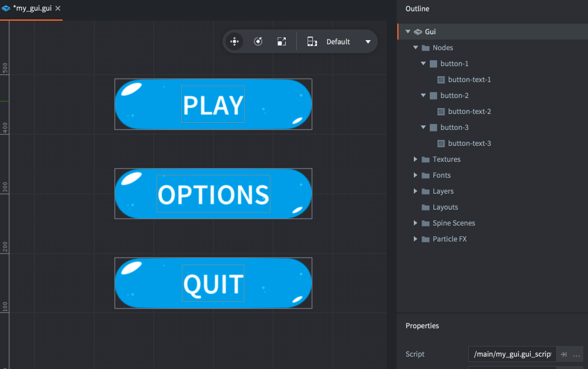

Gdy potok renderowania przechodzi przez listę węzłów, musi utworzyć osobną partię dla każdego węzła, ponieważ typy są różne. W sumie te trzy przyciski będą wymagały sześciu wywołań rysowania.

Przypisując węzłom warstwy, można je uporządkować inaczej, co pozwala potokowi renderowania grupować węzły w mniejszą liczbę wywołań rysowania. Zacznij od dodania potrzebnych warstw do sceny. <kbd>Kliknij prawym przyciskiem myszy</kbd> ikonę folderu "Layers" w panelu *Outline* i wybierz <kbd>Add ▸ Layer</kbd>. Zaznacz nową warstwę i przypisz jej właściwość *Name* w widoku *Properties*.

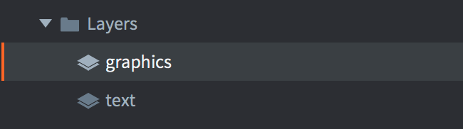

Następnie ustaw właściwość *Layer* każdego węzła na odpowiednią warstwę. Kolejność rysowania warstw ma pierwszeństwo przed zwykłą kolejnością indeksów węzłów, więc ustawienie prostokątnych węzłów przycisków na warstwę "graphics" i tekstowych węzłów przycisków na warstwę "text" da następującą kolejność rysowania:

* Najpierw wszystkie węzły w warstwie "graphics", od góry:

  1. "button-1"
  2. "button-2"
  3. "button-3"

* Następnie wszystkie węzły w warstwie "text", od góry:

  4. "button-text-1"
  5. "button-text-2"
  6. "button-text-3"

Węzły można teraz zgrupować w dwa wywołania rysowania zamiast sześciu. To duży zysk wydajnościowy.

Zwróć uwagę, że węzeł potomny bez ustawionej warstwy dziedziczy niejawnie ustawienie warstwy swojego rodzica. Nieustawienie warstwy na węźle niejawnie dodaje go do warstwy "null", która jest rysowana przed wszystkimi innymi warstwami.
