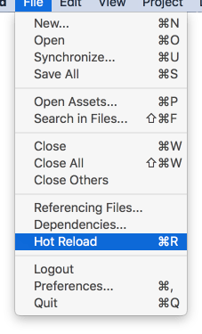
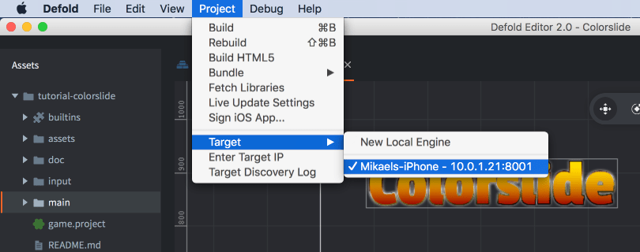
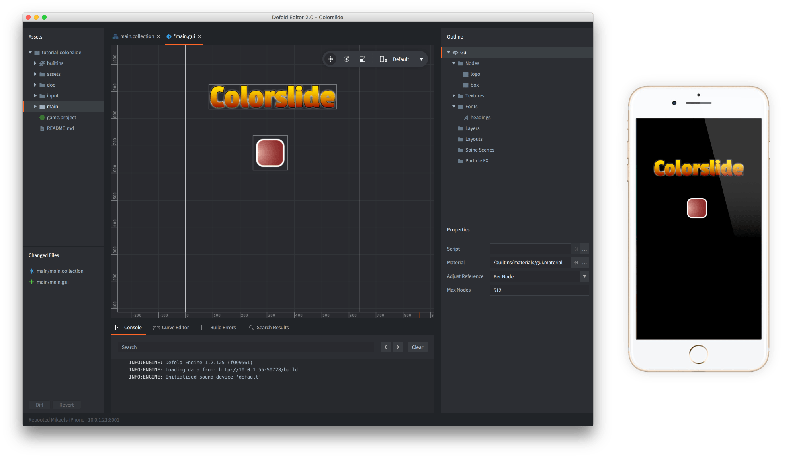
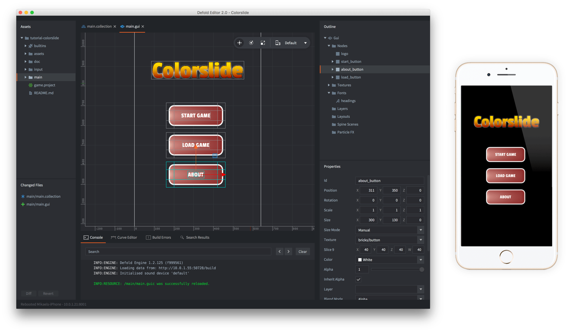

# Szybkie przeładowanie zasobów

Defold umożliwia szybkie przeładowanie zasobów (hot reloading). Podczas tworzenia gry ta funkcja ogromnie przyspiesza niektóre zadania. Pozwala zmieniać kod i zawartość gry, gdy ta działa na żywo. Typowe zastosowania to:

- dostrajanie parametrów rozgrywki w skryptach Lua
- edycja i strojenie elementów graficznych, takich jak efekty cząsteczkowe lub elementy GUI, oraz oglądanie wyników w odpowiednim kontekście
- edycja i strojenie kodu shaderów oraz oglądanie wyników w odpowiednim kontekście
- ułatwienie testowania gry przez ponowne uruchamianie poziomów, ustawianie stanu itd. bez zatrzymywania gry

## Jak wykonać szybkie przeładowanie

Uruchom grę z poziomu edytora (<kbd>Project ▸ Build</kbd>).

Aby przeładować zaktualizowany zasób, po prostu wybierz pozycję menu <kbd>File ▸ Hot Reload</kbd> albo naciśnij odpowiedni skrót na klawiaturze:



## Szybkie przeładowanie na urządzeniu

Funkcja szybkiego przeładowania działa zarówno na urządzeniu, jak i na komputerze. Aby używać jej na urządzeniu, uruchom debugową wersję gry albo [development app](/manuals/dev-app) na urządzeniu mobilnym, a następnie wybierz je jako cel w edytorze:



Od tego momentu, gdy zbudujesz i uruchomisz grę, edytor wyśle wszystkie zasoby do uruchomionej aplikacji na urządzeniu i rozpocznie grę. Każdy plik, który przeładujesz, zostanie zaktualizowany na urządzeniu.

Na przykład, jeśli chcesz dodać kilka przycisków do GUI wyświetlanego w działającej grze na telefonie, po prostu otwórz plik GUI:



Dodaj nowe przyciski, zapisz plik GUI i przeładuj go. Nowe przyciski będą teraz widoczne na ekranie telefonu:



Gdy przeładujesz plik, silnik wypisze w konsoli każdy ponownie załadowany plik zasobu.

## Przeładowanie skryptów

Każdy przeładowany plik skryptu Lua zostanie ponownie wykonany w działającym środowisku Lua.

```lua
local my_value = 10

function update(self, dt)
    print(my_value)
end
```

Zmiana `my_value` na 11 i przeładowanie pliku zadziałają natychmiast:

```text
...
DEBUG:SCRIPT: 10
DEBUG:SCRIPT: 10
DEBUG:SCRIPT: 10
INFO:RESOURCE: /main/hunter.scriptc was successfully reloaded.
DEBUG:SCRIPT: 11
DEBUG:SCRIPT: 11
DEBUG:SCRIPT: 11
...
```

Zwróć uwagę, że szybkie przeładowanie nie zmienia sposobu wykonywania funkcji cyklu życia. Na przykład przy szybkim przeładowaniu nie ma wywołania `init()`. Jeśli jednak ponownie zdefiniujesz funkcje cyklu życia, zostaną użyte ich nowe wersje.

## Przeładowanie modułów Lua

Jeśli w pliku modułu dodasz zmienne do zakresu globalnego, przeładowanie pliku zmieni te globalne zmienne:

```lua
--- my_module.lua
my_module = {}
my_module.val = 10
```

```lua
-- user.script
require "my_module"

function update(self, dt)
    print(my_module.val) -- po przeładowaniu "my_module.lua" zostanie wypisana nowa wartość
end
```

Częstym wzorcem w modułach Lua jest utworzenie lokalnej tabeli, wypełnienie jej, a następnie zwrócenie jej:

```lua
--- my_module.lua
local M = {} -- tutaj tworzony jest nowy obiekt tabeli
M.val = 10
return M
```

```lua
-- user.script
local mm = require "my_module"

function update(self, dt)
    print(mm.val) -- wypisze 10 nawet jeśli zmienisz i przeładujesz "my_module.lua"
end
```

Zmiana i przeładowanie pliku "my_module.lua" _nie_ zmienią zachowania "user.script". Zobacz [instrukcję o modułach](/manuals/modules), aby dowiedzieć się więcej o tym, dlaczego tak się dzieje i jak uniknąć tej pułapki.

## Funkcja `on_reload()`

Każdy komponent skryptu może zdefiniować funkcję `on_reload()`. Jeśli istnieje, zostanie wywołana za każdym razem, gdy skrypt zostanie przeładowany. Jest to przydatne do sprawdzania lub zmieniania danych, wysyłania wiadomości itd.:

```lua
function on_reload(self)
    print(self.velocity)

    msg.post("/level#controller", "setup")
end
```

## Przeładowanie kodu shaderów

Podczas przeładowywania shaderów wierzchołków i fragmentów kod GLSL jest ponownie kompilowany przez sterownik graficzny i wysyłany do GPU. Jeśli kod shaderów spowoduje awarię, co łatwo się zdarza, ponieważ GLSL jest pisany na bardzo niskim poziomie, może to doprowadzić do awarii silnika.
