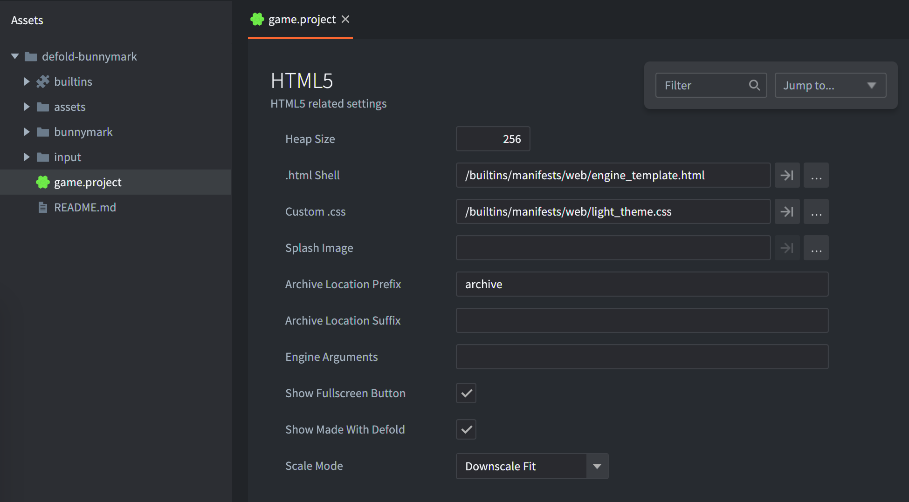
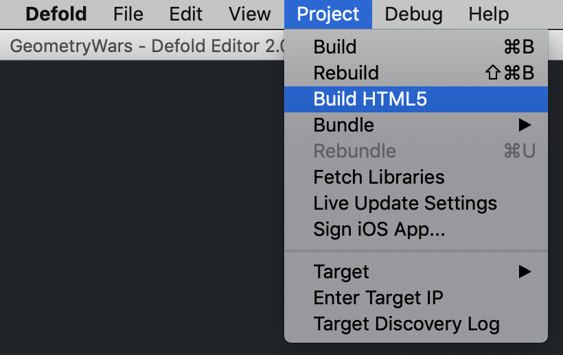
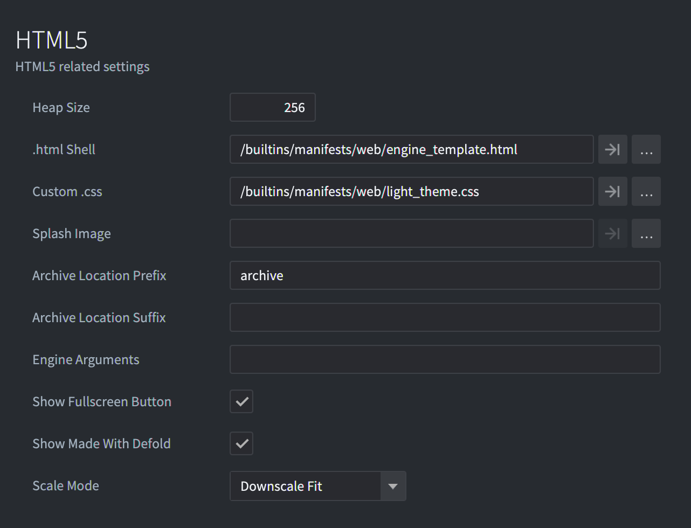
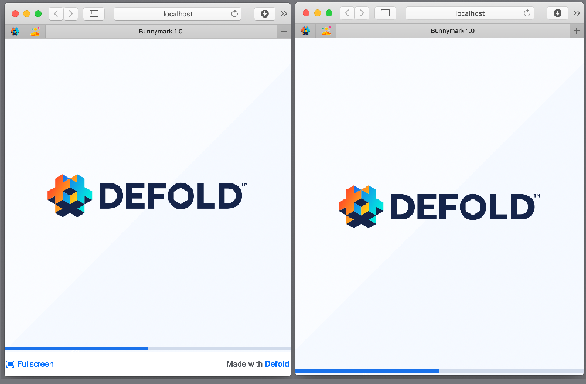

# Tworzenie gier HTML5

Defold obsługuje budowanie gier dla platformy HTML5 przez zwykłe menu bundlowania, tak samo jak dla innych platform. Dodatkowo wynikowa gra jest osadzana na zwykłej stronie HTML, którą można stylować za pomocą prostego systemu szablonów.

Plik *game.project* zawiera ustawienia specyficzne dla HTML5:



## Rozmiar sterty

Wsparcie dla HTML5 w Defold opiera się na Emscripten (zob. http://en.wikipedia.org/wiki/Emscripten). W skrócie tworzy on odizolowany obszar pamięci dla sterty, w którym działa aplikacja. Domyślnie silnik przydziela sporą ilość pamięci (256 MB). Powinno to być więcej niż wystarczające dla typowej gry. W ramach optymalizacji możesz zdecydować się na mniejszą wartość. Aby to zrobić, wykonaj następujące kroki:

1. Ustaw *heap_size* na wybraną wartość. Powinna być wyrażona w megabajtach.
2. Utwórz pakiet HTML5 (zobacz poniżej).

## Testowanie builda HTML5

Do testowania builda HTML5 potrzebny jest serwer HTTP. Defold utworzy taki serwer za ciebie, jeśli wybierzesz <kbd>Project ▸ Build HTML5</kbd>.



Jeśli chcesz przetestować swój pakiet, po prostu wgraj go na zdalny serwer HTTP albo utwórz lokalny serwer, na przykład używając Pythona w folderze pakietu.
Python 2:

```sh
python -m SimpleHTTPServer
```

Python 3:

```sh
python -m http.server
```

lub

```sh
python3 -m http.server
```

::: important
Nie możesz przetestować pakietu HTML5, otwierając pliku `index.html` w przeglądarce. Wymaga to serwera HTTP.
:::

::: important
Jeśli w konsoli zobaczysz błąd `"wasm streaming compile failed: TypeError: Failed to execute ‘compile’ on ‘WebAssembly’: Incorrect response MIME type. Expected ‘application/wasm’."`, upewnij się, że twój serwer używa typu MIME `application/wasm` dla plików `.wasm`.
:::

## Tworzenie pakietu HTML5

Tworzenie zawartości HTML5 w Defold jest proste i odbywa się tak samo jak dla wszystkich innych obsługiwanych platform: wybierz z menu <kbd>Project ▸ Bundle... ▸ HTML5 Application...</kbd>.


Możesz zdecydować, czy chcesz dołączyć do pakietu HTML5 zarówno wersję silnika Defold `asm.js`, jak i WebAssembly (wasm). W większości przypadków wystarczy wybrać WebAssembly, ponieważ [wszystkie nowoczesne przeglądarki obsługują WebAssembly](https://caniuse.com/wasm).

::: important
Nawet jeśli dołączysz do silnika zarówno wersję `asm.js`, jak i `wasm`, przeglądarka pobierze tylko jedną z nich podczas uruchamiania gry. Wersja WebAssembly zostanie pobrana, jeśli przeglądarka ją obsługuje, a wersja `asm.js` zostanie użyta jako alternatywa w rzadkim przypadku, gdy WebAssembly nie jest obsługiwane.
:::

Po kliknięciu przycisku <kbd>Create bundle</kbd> zostaniesz poproszony o wybranie folderu, w którym ma zostać utworzona aplikacja. Po zakończeniu eksportu znajdziesz wszystkie pliki potrzebne do uruchomienia aplikacji.

## Znane problemy i ograniczenia

* Szybkie przeładowanie (Hot Reload) - szybkie przeładowanie nie działa w buildach HTML5. Aplikacje Defold muszą uruchamiać własny niewielki serwer WWW, aby odbierać aktualizacje z edytora, a nie jest to możliwe w buildzie HTML5.
* Internet Explorer 11
  * Audio - Defold odtwarza dźwięk za pomocą HTML5 _WebAudio_ (zob. http://www.w3.org/TR/webaudio), którego Internet Explorer 11 obecnie nie obsługuje. W tej przeglądarce aplikacje przejdą na implementację bez dźwięku.
  * WebGL - Microsoft nie ukończył jeszcze pracy nad implementacją API _WebGL_ (zob. https://www.khronos.org/registry/webgl/specs/latest/). Z tego powodu działa ono gorzej niż w innych przeglądarkach.
  * Tryb pełnoekranowy (Full screen) - tryb pełnoekranowy jest w przeglądarce zawodny.
* Chrome
  * Powolne buildy debug (Slow debug builds) - w buildach debug HTML5 sprawdzamy wszystkie wywołania grafiki WebGL, aby wykrywać błędy. Niestety podczas testowania w Chrome jest to bardzo powolne. Można to wyłączyć, ustawiając pole *Engine Arguments* w *game.project* na `--verify-graphics-calls=false`.
* Obsługa gamepadów (Gamepad support) - [dokumentacja gamepadów](/manuals/input-gamepads/#gamepads-in-html5) zawiera szczególne uwagi i kroki, które mogą być potrzebne w HTML5.

## Dostosowywanie pakietu HTML5

Podczas generowania wersji HTML5 swojej gry Defold udostępnia domyślną stronę WWW. Odwołuje się ona do zasobów stylów i skryptów, które określają sposób prezentacji gry.

Za każdym razem, gdy aplikacja jest eksportowana, ta zawartość jest tworzona od nowa. Jeśli chcesz dostosować którykolwiek z tych elementów, musisz zmodyfikować ustawienia projektu. W tym celu otwórz *game.project* w edytorze Defold i przewiń do sekcji *html5*:



Więcej informacji o każdej opcji znajdziesz w [instrukcji ustawień projektu](/manuals/project-settings/#html5).

::: important
Nie możesz modyfikować plików domyślnego szablonu html/css w folderze `builtins`. Aby wprowadzić swoje zmiany, skopiuj potrzebny plik z `builtins` i ustaw ten plik w *game.project*.
:::

::: important
Canvas nie powinien mieć żadnej ramki ani odstępów wewnętrznych. Jeśli je dodasz, współrzędne wejścia myszy będą nieprawidłowe.
:::

W *game.project* można wyłączyć przycisk `Fullscreen` i link `Made with Defold`.
Defold udostępnia ciemny i jasny motyw dla index.html. Jasny motyw jest ustawiony domyślnie, ale można go zmienić, modyfikując plik `Custom CSS`. W polu `Scale Mode` dostępne są także cztery predefiniowane tryby skalowania.

::: important
Obliczenia dla wszystkich trybów skalowania uwzględniają bieżące DPI ekranu, jeśli włączysz opcję `High Dpi` w *game.project* (sekcja `Display`).
:::

### Downscale Fit i Fit

W trybie `Fit` rozmiar canvasu zostanie zmieniony tak, aby cały obszar gry był widoczny na ekranie przy zachowaniu oryginalnych proporcji. Jedyna różnica w `Downscale Fit` polega na tym, że rozmiar jest zmieniany tylko wtedy, gdy wewnętrzny rozmiar strony WWW jest mniejszy od oryginalnego canvasu gry, ale nie następuje powiększanie, gdy strona WWW jest większa od oryginalnego canvasu gry.


### Stretch

W trybie `Stretch` rozmiar canvasu zostanie zmieniony tak, aby całkowicie wypełnić wewnętrzny rozmiar strony WWW.



### No Scale
W trybie `No Scale` rozmiar canvasu jest dokładnie taki sam, jak zdefiniowany w pliku *game.project*, w sekcji `[display]`.


## Tokeny

Do tworzenia pliku `index.html` używamy języka szablonów [Mustache](https://mustache.github.io/mustache.5.html). Podczas budowania lub tworzenia pakietu pliki HTML i CSS są przepuszczane przez kompilator, który potrafi zastępować wybrane tokeny wartościami zależnymi od ustawień projektu. Tokeny te są zawsze ujęte w podwójne albo potrójne nawiasy klamrowe (`{{TOKEN}}` lub `{{{TOKEN}}}`), zależnie od tego, czy sekwencje znaków mają być escapowane. Ta funkcja może być przydatna, jeśli często zmieniasz ustawienia projektu albo chcesz ponownie używać materiałów w innych projektach.

::: sidenote
Więcej informacji o języku szablonów Mustache znajdziesz w [instrukcji](https://mustache.github.io/mustache.5.html).
:::

Każde ustawienie w *game.project* może być tokenem. Na przykład, jeśli chcesz użyć wartości `Width` z sekcji `Display`:


Otwórz *game.project* jako tekst i sprawdź `[section_name]` oraz nazwę pola, którego chcesz użyć. Następnie możesz użyć go jako tokenu: `{{section_name.field}}` albo `{{{section_name.field}}}`.


Na przykład w szablonie HTML w JavaScript:

```javascript
function doSomething() {
    var x = {{display.width}};
    // ...
}
```

Mamy też następujące własne tokeny:

DEFOLD_SPLASH_IMAGE
: Zapisuje nazwę pliku obrazu startowego albo `false`, jeśli `html5.splash_image` w *game.project* jest puste.


```css
{{#DEFOLD_SPLASH_IMAGE}}
		background-image: url("{{DEFOLD_SPLASH_IMAGE}}");
{{/DEFOLD_SPLASH_IMAGE}}
```

exe-name
: Nazwa projektu bez niedozwolonych znaków.

DEFOLD_CUSTOM_CSS_INLINE
: To miejsce, w którym wstawiana jest bezpośrednio zawartość pliku CSS określonego w ustawieniach *game.project*.


```html
<style>
{{{DEFOLD_CUSTOM_CSS_INLINE}}}
</style>
```

::: important
Ważne jest, aby ten blok wstawiany bezpośrednio pojawił się przed załadowaniem głównego skryptu aplikacji. Ponieważ zawiera znaczniki HTML, to makro powinno używać potrójnych nawiasów klamrowych `{{{TOKEN}}}`, aby sekwencje znaków nie zostały escapowane.
:::

DEFOLD_SCALE_MODE_IS_DOWNSCALE_FIT
: Ten token ma wartość `true`, jeśli `html5.scale_mode` ma ustawienie `Downscale Fit`.

DEFOLD_SCALE_MODE_IS_FIT
: Ten token ma wartość `true`, jeśli `html5.scale_mode` ma ustawienie `Fit`.

DEFOLD_SCALE_MODE_IS_NO_SCALE
: Ten token ma wartość `true`, jeśli `html5.scale_mode` ma ustawienie `No Scale`.

DEFOLD_SCALE_MODE_IS_STRETCH
: Ten token ma wartość `true`, jeśli `html5.scale_mode` ma ustawienie `Stretch`.

DEFOLD_HEAP_SIZE
: Rozmiar sterty określony w *game.project* przez `html5.heap_size`, przeliczony na bajty.

DEFOLD_ENGINE_ARGUMENTS
: Argumenty silnika określone w *game.project* w polu `html5.engine_arguments`, rozdzielone symbolem `,`.

build-timestamp
: Bieżący znacznik czasu kompilacji w sekundach.


## Dodatkowe parametry

Jeśli tworzysz własny szablon, możesz zdefiniować ponownie zestaw parametrów dla loadera silnika. Aby to zrobić, musisz dodać sekcję `<script>` i ponownie zdefiniować wartości w `CUSTOM_PARAMETERS`.
::: important
Twój własny `<script>` powinien znajdować się po sekcji `<script>` z odwołaniem do `dmloader.js`, ale przed wywołaniem funkcji `EngineLoader.load`.
:::
Na przykład:

```
    <script id='custom_setup' type='text/javascript'>
        CUSTOM_PARAMETERS['disable_context_menu'] = false;
        CUSTOM_PARAMETERS['unsupported_webgl_callback'] = function() {
            console.log("Oh-oh. WebGL not supported...");
        }
    </script>
```

`CUSTOM_PARAMETERS` może zawierać następujące pola:

```
'archive_location_filter':
    Funkcja filtrująca, która będzie uruchamiana dla każdej ścieżki archiwum.

'unsupported_webgl_callback':
    Funkcja wywoływana, jeśli WebGL nie jest obsługiwany.

'engine_arguments':
    Lista argumentów (ciągów), które zostaną przekazane do silnika.

'custom_heap_size':
    Liczba bajtów określająca rozmiar sterty pamięci.

'disable_context_menu':
    Wyłącza menu kontekstowe po kliknięciu prawym przyciskiem myszy na elemencie canvas, jeśli ma wartość true.

'retry_time':
    Czas pauzy w sekundach przed ponowną próbą wczytania pliku po błędzie.

'retry_count':
    Liczba prób podejmowanych podczas pobierania pliku.

'can_not_download_file_callback':
    Funkcja wywoływana, jeśli nie uda się pobrać pliku po próbach określonych w 'retry_count'.

'resize_window_callback':
    Funkcja wywoływana, gdy wystąpią zdarzenia resize/orientationchanges/focus.

'start_success':
    Funkcja wywoływana tuż przed main, po pomyślnym wczytaniu.

'update_progress':
    Funkcja wywoływana w miarę aktualizacji postępu. Parametr progress jest aktualizowany w zakresie 0-100.
```

## Operacje na plikach w HTML5

Buildy HTML5 obsługują operacje na plikach, takie jak `sys.save()`, `sys.load()` i `io.open()`, ale sposób ich obsługi wewnętrznej różni się od innych platform. Gdy JavaScript działa w przeglądarce, nie istnieje prawdziwe pojęcie systemu plików, a lokalny dostęp do plików jest blokowany ze względów bezpieczeństwa. Zamiast tego Emscripten (a więc i Defold) używa [IndexedDB](https://developer.mozilla.org/en-US/docs/Web/API/IndexedDB_API/Using_IndexedDB), przeglądarkowej bazy danych służącej do trwałego przechowywania danych, aby utworzyć w przeglądarce wirtualny system plików. Istotną różnicą względem dostępu do systemu plików na innych platformach jest to, że między zapisaniem pliku a rzeczywistym zapisaniem zmiany w bazie danych może wystąpić niewielkie opóźnienie. Zawartość IndexedDB zwykle można sprawdzić w konsoli deweloperskiej przeglądarki.


## Przekazywanie argumentów do gry HTML5

Czasami trzeba przekazać grze dodatkowe argumenty jeszcze przed jej uruchomieniem albo podczas uruchamiania. Może to być na przykład identyfikator użytkownika, token sesji albo informacja, który poziom wczytać przy starcie gry. Można to zrobić na kilka sposobów, z których niektóre opisano tutaj.

### Argumenty silnika

Można określić dodatkowe argumenty silnika podczas konfiguracji i wczytywania silnika. Te dodatkowe argumenty można w czasie działania odczytać za pomocą `sys.get_config()`. Aby dodać pary klucz-wartość, zmodyfikuj pole `engine_arguments` obiektu `extra_params`, które jest przekazywane do silnika podczas wczytywania w `index.html`:


```
    <script id='engine-setup' type='text/javascript'>
    var extra_params = {
        ...,
        engine_arguments: ["--config=foo1=bar1","--config=foo2=bar2"],
        ...
    }
```

Możesz też dodać `--config=foo1=bar1, --config=foo2=bar2` do pola argumentów silnika w sekcji HTML5 pliku *game.project*, a zostanie to wstrzyknięte do wygenerowanego pliku index.html.

W czasie działania wartości odczytasz w ten sposób:

```lua
local foo1 = sys.get_config("foo1")
local foo2 = sys.get_config("foo2")
print(foo1) -- bar1
print(foo2) -- bar2
```


### Parametry zapytania w adresie URL

Możesz przekazać argumenty jako część parametrów zapytania w adresie strony i odczytać je w czasie działania:

```
https://www.mygame.com/index.html?foo1=bar1&foo2=bar2
```

```lua
local url = html5.run("window.location")
print(url)
```

Pełna funkcja pomocnicza pobierająca wszystkie parametry zapytania jako tabelę Lua:

```lua
local function get_query_parameters()
    local url = html5.run("window.location")
    -- pobierz część zapytania z adresu URL (fragment po znaku ?)
    local query = url:match(".*?(.*)")
    if not query then
        return {}
    end

    local params = {}
    -- iteruj po wszystkich parach klucz-wartość
    for kvp in query:gmatch("([^&]+)") do
        local key, value = kvp:match("(.+)=(.+)")
        params[key] = value
    end
    return params
end

function init(self)
    local params = get_query_parameters()
    print(params.foo1) -- bar1
end
```

## Optymalizacje
Gry HTML5 zwykle mają bardzo rygorystyczne wymagania dotyczące początkowego rozmiaru pobieranych danych, czasu uruchamiania i zużycia pamięci, aby gry ładowały się szybko i działały dobrze na słabszych urządzeniach oraz przy wolnych połączeniach internetowych. Aby zoptymalizować grę HTML5, zaleca się skupić na następujących obszarach:

* [Zużycie pamięci](/manuals/optimization-memory)
* [Rozmiar silnika](/manuals/optimization-size)
* [Rozmiar gry](/manuals/optimization-size)

## FAQ
:[FAQ HTML5](../shared/html5-faq.md)
