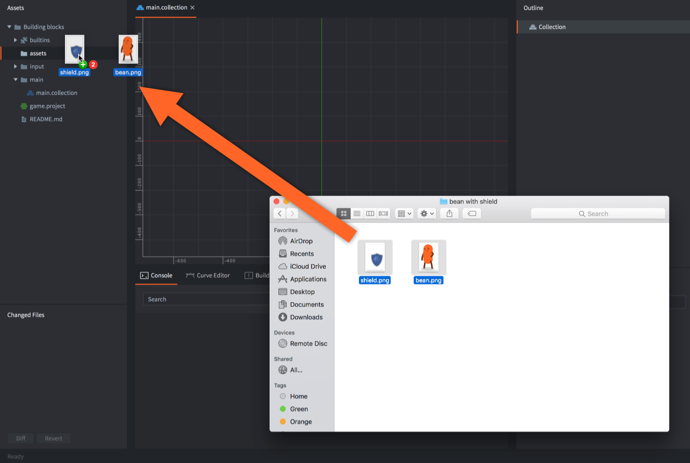

# Importowanie i edytowanie zasobów

Projekt gry zazwyczaj składa się z wielkiej liczby różnego rodzaju zasobów (ang. assets), które są tworzone w wyspecjalizowanych programach do grafiki, modelowania 3D, produkcji plików muzycznych, animacji itp. Defold jest stworzony z myślą o pracy, gdzie wykorzystuje się zewnętrzne narzędzie, żeby potem można zaimportować stworzone zasoby do edytora Defold.

## Importowanie zasobów

Defold wymaga, aby pliki używane w projekcie znajdowały się w hierarchii katalogu projektu. Należy więc zaimportować tam uprzednio wszystkie zasoby, zanim będzie można ich użyć. Aby zaimporotwać zasoby przenieś pliki w Twoim systemie operacyjnym do katalogu projektu lub bezpośrednio przeciągnij nad panel *Assets pane* edytora Defold w odpowiednim katalogu.

{srcset="images/graphics/import@2x.png 2x"}

::: sidenote
Defold wspiera pliki graficzne w formatach PNG i JPEG. Pliki PNG muszą być w formacie 32-bitowym RGBA. Inne pliki graficzne muszą być przekonwertowane do wspieranych, aby móc ich użyć.
:::

## Używanie zasobów

Kiedy zasoby są już zaimportowane do projektu, mogą być wykorzystywane przez różne komponenty silnika Defold:

* Pliki graficzne mogą być używane w różnego rodzaju komponentach wizualnych, często używanych np. w grach 2D. Więcej szczegółów znajdziesz w [tej instrukcji jak importować i używać grafiki 2D](/manuals/importing-graphics).
* Pliki dźwiękowe mogą być używane przez [komponent dźwięku](/manuals/sound) w celu odtwarzania dźwięków.
* Pliki fontów mogą być używane przez [komponent etykiety](/manuals/label) i przez [węzły tekstowe](/manuals/gui-text) w GUI.
* Pliki modeli Collada mogą być używane przez [komponent modeli trójwymiarowych](/manuals/model) w celu wyświetlania i animowania modeli trójwymiarowych. Więcej szczegółów znajdziesz w [tej instrukcji jak importować i używać grafiki 3D](/manuals/importing-models). 

## Edytowanie zewnętrznych zasobów

Defold nie udostępnia narzędzi do edycji plików graficznych, dźwiękowych, modeli 3D czy animacji. Zasoby te muszą być stworzone w przeznaczonych do tego narzędziach i zaimportowane. Defold automatycznie wykrywa zmiany w hierarchii plików i zmiany w zasobach i aktualizuje je w edytorze Defold.

## Edytowanie zasobów Defolda

Edytor Defold zapisuje wszystkie zasoby Defolda w plikach tesktowych, dzięki czemu łatwo jest utrzymywać je w systemach kontroli wersji i tworzyć lub edytować przy użyciu prostych skryptów. Zobacz [ten wątek na forum Defold](https://forum.defold.com/t/deftree-a-python-module-for-editing-defold-files/15210). Warto pamiętać, że nie publikujemy szczegółów formatu naszych plików, ponieważ te ulegają od czasu do czasu zmianie. Możesz również używać [skryptów Edytora](/manuals/editor-scripts/), aby w momencie danych wydarzeń w Edytorze Defold uruchomić skrypt, który dokona operacji i zmodyfikuje zasoby Defolda.

Należy zachować szczególną ostrożność przy zmienianiu plików zasobów Defolda przy użyciu edytorów tekstu czy innych zewnętrznych narzędzi. Jeśli wprowadzi się do pliku błąd, może on spowodować, że Defold nie otworzy danego pliku.

Niektóre zewnętrzne narzędzia takie jak [Tiled](/assets/tiled/) czy [Tilesetter](https://www.tilesetter.org/beta) mogą być używane do automatycznego tworzenia zasobów Defolda (np. tilemap).
