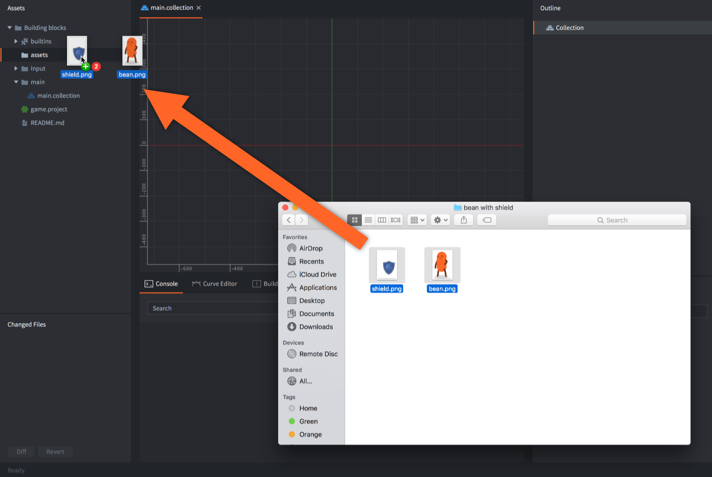
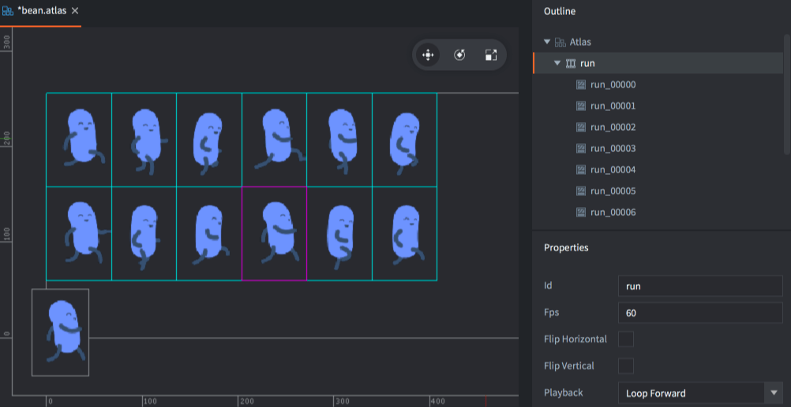
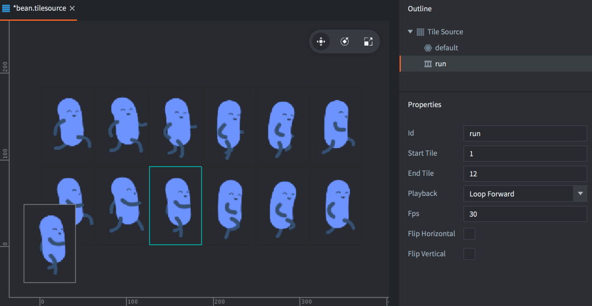
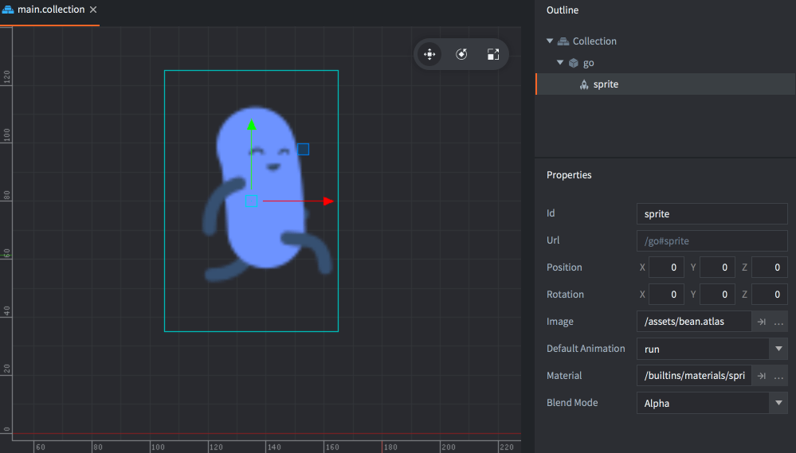
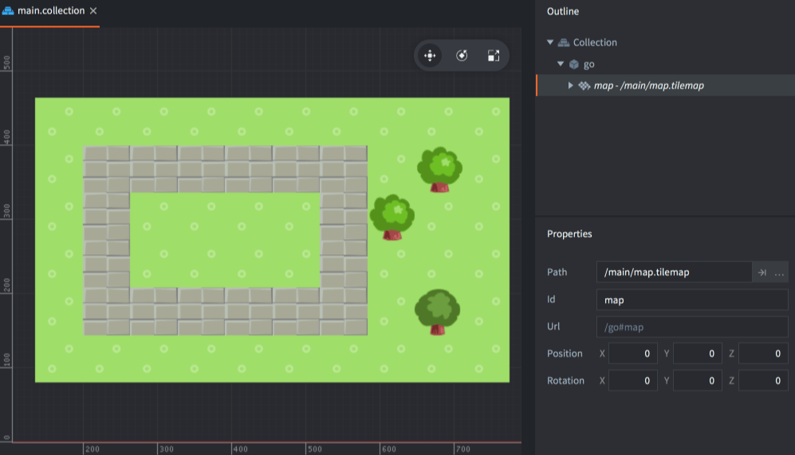
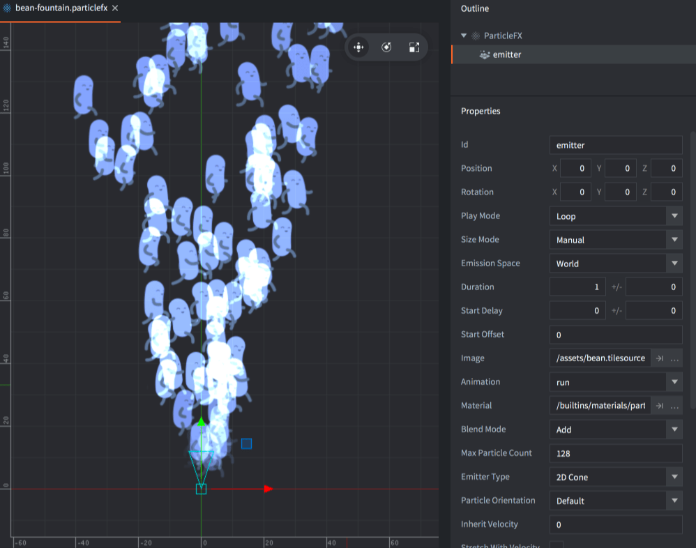
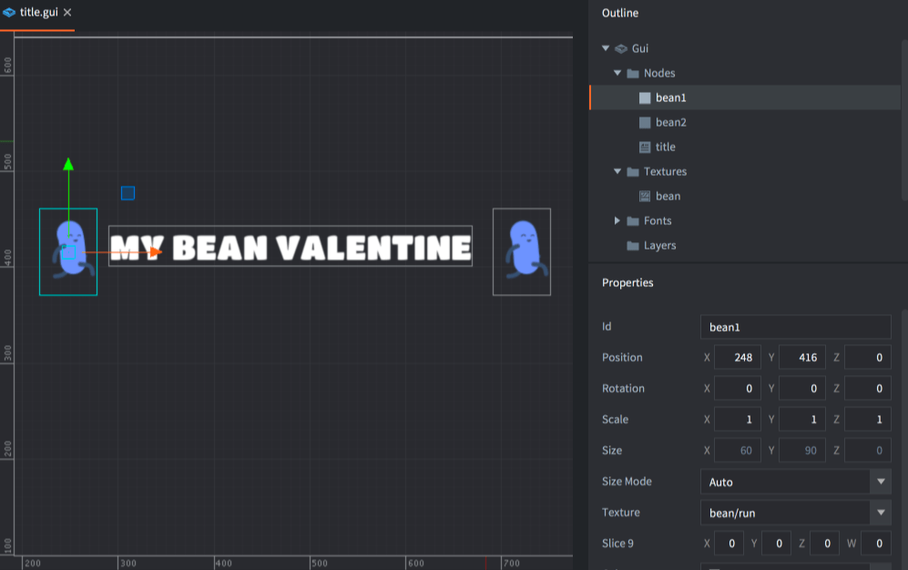

# Importowanie grafiki 2D

Defold obsługuje wiele rodzajów elementów wizualnych często używanych w grach 2D. Defold umożliwia tworzenie statycznych i animowanych sprite'ów, komponentów GUI, efektów cząsteczkowych, map kafelków oraz fontów bitmapowych. Zanim utworzysz którykolwiek z tych elementów wizualnych, musisz zaimportować pliki graficzne, z których chcesz korzystać. Aby to zrobić, przeciągnij pliki z systemu plików na komputerze i upuść je w odpowiednim miejscu w panelu *<kbd>Assets</kbd>* edytora Defold.

::: sidenote
Defold obsługuje obrazy w formatach PNG i JPEG. Inne formaty obrazów trzeba przekonwertować, zanim będzie można z nich korzystać.
:::

## Tworzenie zasobów

Po zaimportowaniu obrazów można użyć ich do tworzenia zasobów specyficznych dla Defold:

{.icon} Atlas
: Atlas zawiera listę oddzielnych plików graficznych, które są automatycznie łączone w większą teksturę. Atlasy mogą zawierać obrazy statyczne i *Animation Groups*, czyli zestawy obrazów tworzących animację poklatkową.

  

Więcej informacji o zasobie atlasu znajdziesz w [instrukcji atlasu](/manuals/atlas).

{.icon} Tile Source
: Tile Source odwołuje się do pliku graficznego, który został już podzielony na mniejsze podobrazy ułożone w regularnej siatce. Innym często używanym określeniem takiego złożonego obrazu jest _sprite sheet_. Tile Source mogą zawierać animacje poklatkowe zdefiniowane przez pierwszy i ostatni kafelek animacji. Można też użyć obrazu do automatycznego dołączania kształtów kolizji do kafelków.

  

Więcej informacji o zasobie Tile Source znajdziesz w [instrukcji źródła kafelków](/manuals/tilesource).

{.icon} Bitmap Font
: Bitmap Font przechowuje swoje glify w arkuszu fontu PNG. Tego typu fonty nie zapewniają poprawy wydajności względem fontów generowanych z plików TrueType lub OpenType, ale mogą zawierać dowolną grafikę, kolory i cienie bezpośrednio w obrazie.

Więcej informacji o fontach bitmapowych znajdziesz w [instrukcji fontów](/manuals/font/#bitmap-bmfonts).

  

## Używanie zasobów

Gdy przekonwertujesz obrazy na pliki Atlas i Tile Source, możesz używać ich do tworzenia kilku różnych rodzajów elementów wizualnych:

{.icon}
: Sprite to statyczny obraz albo animacja poklatkowa wyświetlana na ekranie.

  

Więcej informacji o sprite'ach znajdziesz w [instrukcji sprite'ów](/manuals/sprite).

{.icon} Tile map
: Komponent tile map buduje mapę z kafelków, czyli obrazów i kształtów kolizji pochodzących z Tile Source. Tile map nie mogą korzystać z atlasów.

  

Więcej informacji o tile map znajdziesz w [instrukcji map kafelków](/manuals/tilemap).

{.icon} Particle fx
: Cząstki emitowane przez particle emitter mogą składać się ze statycznego obrazu albo animacji poklatkowej z atlasu lub Tile Source.

  

Więcej informacji o efektach cząsteczkowych znajdziesz w [instrukcji efektów Particle fx](/manuals/particlefx).

{.icon} GUI
: Węzły GUI typu box i pie mogą używać statycznych obrazów i animacji poklatkowych z atlasów oraz Tile Source.

  

Więcej informacji o GUI znajdziesz w [instrukcji GUI](/manuals/gui).
