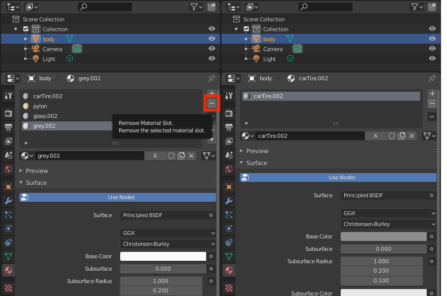
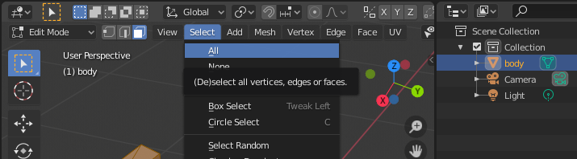
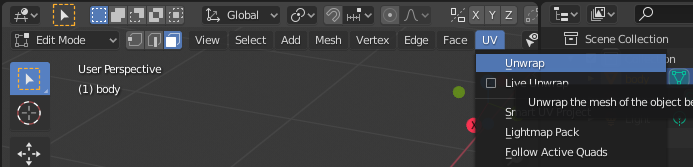
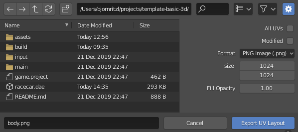
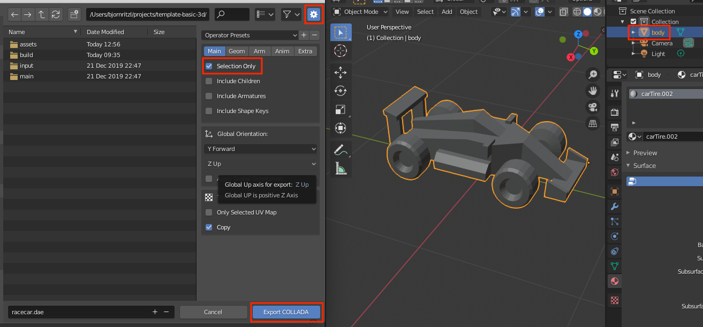

# Importowanie modeli 3D
Defold obecnie wspiera modele, szkielety i animacje tylko w formacie Collada *.dae*. Możesz używać narzędzi takich jak Maya, 3D Max, Sketchup czy Blender do tworzenia i/lub konwertowania modeli trójwymiarowych do formatu Collada. Blender jest jednym z popularniejszych i potężnych narzędzi do modelowania 3D, animacji, a nawet renderowania. Działa na systemach operacyjnych Windows, macOS i Linux i jest dostępny za darmo do pobrania ze strony http://www.blender.org

{srcset="images/model/blender@2x.png 2x"}

## Exportowanie do formatu Collada
Kiedy eksportujesz model 3D do formatu Collada, otrzymujesz plik z rozszerzeniem *.dae*. Plik ten zawiera wszystkie informacje o wierzchołkach (ang. vertices), krawędziach i teksturach (ang. faces), które składają się na model trójwymiarowy, a także współrzędne UV (ang. _UV coordinates_) (które, w skrócie, przypisują daną część tekstury do siatki modelu) jeśli zostały zdefiniowane, kości szkieletu i dane o animacji.

* Szczegółowy opisy wielokątów (ang. polygons) siatki możesz znaleźć na stronie http://en.wikipedia.org/wiki/Polygon_mesh.

* Współrzędne UV i mapowanie UV opisane jest na stronie http://en.wikipedia.org/wiki/UV_mapping.

Defold nakłada pewne ograniczenia na eksportowane dane o animacji:

* Defold obecnie wspiera tylko wypiekane animacje (ang. baked animations). Animacje muszą posiadać macierze dla każdej ramki animacji szkieletowej, a nie pozycję, rotację i skalę w osobnych kluczach.

* Animacje są interpolowane liniowo. Jeśli tworzysz bardziej zaawansowaną krzywą interpolacji animacje muszę być wypiekane przed eksportowaniem (prebaked).

* Klipy animacji (ang. animation clips) w formacie Collada nie są wspierane. W celu używania wielu animacji dla modelu wyeksportuj je do osobnych plików *.dae* i zbierz je w zasób *.animationset* w edytorze Defold.

### Wymagania
Kiedy eksportujesz model do formatu Collada musisz zapewnić spełnienie poniższych wymagań:

* Model musi zawierać pojedynczą siatkę (ang. mesh)
* Model musi używać jednego materiału

#### Łączenie wielu siatek
Możesz użyć np. Blendera do połączenia wielu siatek. Wybierz wszystkie siatki i naciśnij `CTRL`/`CMD` + `J`.

#### Usuwanie materiałów
Możesz użyć np. Blendera do usunięcia dodatkowych materiałó z modeli. Wybierz dany materiał i naciśnij `-`.

#### Exportowanie tekstur
Jeśli nie masz jeszcze gotowej tekstury dla modelu, możesz użyć np. Blendera do wygenerowania tekstury. Powinno się to uczynić przed usunięciem materiałów z modelu. Najpierw wybierz siatkę i wszystkie jej wierzchołki:

Kiedy wszystkie wierzchołki są wybrane, rozwiń (ang. unwrap) siatkę, żeby otrzymać rozkład (ang. layout) UV:

Następnie możesz wyeksportować rozkład UV do pliku graficznego, który później można używać jako teksturę:

## Exportowanie używając Blendera
Możesz eksportować modele do formatu Collada używając opcji Export z menu w Blenderze. Wybierz dany model, wybierz opcję Export i zaznacz opcję "Selection Only".

## Importowanie do Defolda
Żeby zaimportować model, przenieś go do katalogu projektu lub przeciągnij plik *.dae* nad wybrany obraz tekstury w panelu *Assets Pane*.

{srcset="images/model/assets@2x.png 2x"}

## Używanie modeli
Kiedy model 3D jest zaimportowany do Defolda możesz go użyć w [komponencie Model](/manuals/model).
