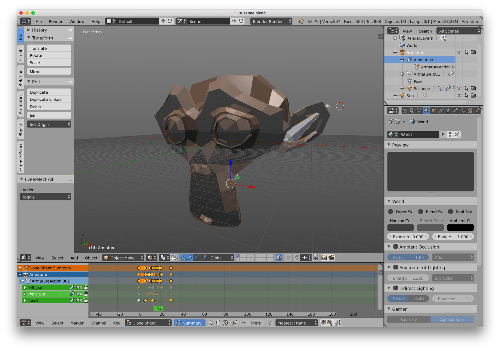
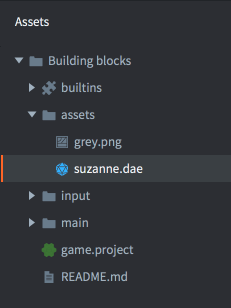
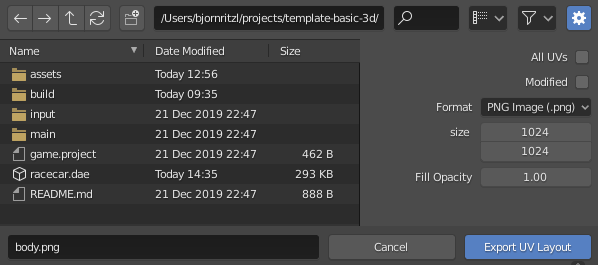
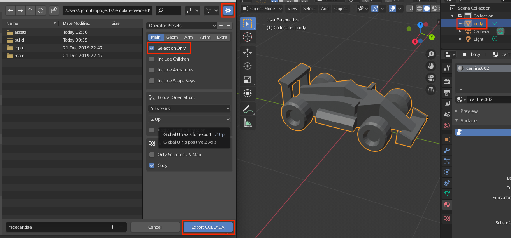

# Importowanie modeli 3D
Defold obecnie obsługuje modele, szkielety i animacje w formacie GL Transmission Format *.glTF*. Możesz użyć narzędzi takich jak Maya, 3D Max, Sketchup i Blender do tworzenia modeli 3D albo konwertowania ich do formatu glTF. Blender to potężny i popularny program do modelowania 3D, animacji i renderowania. Działa w systemach Windows, macOS i Linux i można go bezpłatnie pobrać ze strony http://www.blender.org

## Importowanie do Defold
Aby zaimportować model, po prostu przeciągnij plik *.gltf* albo *.dae* oraz odpowiadający mu obraz tekstury do *<kbd>Assets Pane</kbd>*.

## Używanie modelu
Gdy model jest już zaimportowany do Defold, możesz użyć go w [komponencie Model](/manuals/model).

## Eksport do glTF
Wyeksportowany plik *.gltf* zawiera wszystkie wierzchołki, krawędzie i ściany tworzące model, a także _UV coordinates_ (czyli informację o tym, która część obrazu tekstury odpowiada konkretnej części siatki), jeśli zostały zdefiniowane, kości w szkielecie oraz dane animacji.

* Szczegółowy opis siatek wielokątnych można znaleźć na stronie http://en.wikipedia.org/wiki/Polygon_mesh.

* UV coordinates i UV mapping opisano na stronie http://en.wikipedia.org/wiki/UV_mapping.

Defold nakłada pewne ograniczenia na eksportowane dane animacji:

* Defold obecnie obsługuje tylko baked animations. Animacje muszą mieć macierze dla każdej animowanej kości w każdej klatce kluczowej, a nie osobne klucze pozycji, rotacji i skali.

* Animacje są również interpolowane liniowo. Jeśli używasz bardziej zaawansowanej interpolacji krzywych, animacje muszą zostać wstępnie wypieczone przez eksportera.

### Wymagania
Przy eksporcie modelu warto pamiętać, że nie obsługujemy jeszcze wszystkich funkcji.

Znane problemy i nieobsługiwane funkcje formatu glTF:

* Morph target animations
* Material properties
* Embedded textures

Naszym celem jest pełna obsługa formatu glTF, ale nie jesteśmy jeszcze w tym miejscu.
Jeśli brakuje jakiejś funkcji, zgłoś prośbę o jej dodanie w [naszym repozytorium](https://github.com/defold/defold/issues)

### Eksport tekstury
Jeśli nie masz jeszcze tekstury dla swojego modelu, możesz użyć Blendera do wygenerowania tekstury. Zrób to, zanim usuniesz dodatkowe materiały z modelu. Zacznij od zaznaczenia siatki i wszystkich jej wierzchołków:

Gdy wszystkie wierzchołki są zaznaczone, rozwiń siatkę, aby uzyskać układ UV:

Następnie możesz wyeksportować układ UV do obrazu, którego można użyć jako tekstury:

### Eksportowanie w Blenderze
Model eksportujesz za pomocą opcji Export w menu. Zaznacz model przed wybraniem opcji Export i zaznacz <kbd>Selection Only</kbd>, aby wyeksportować tylko model.

