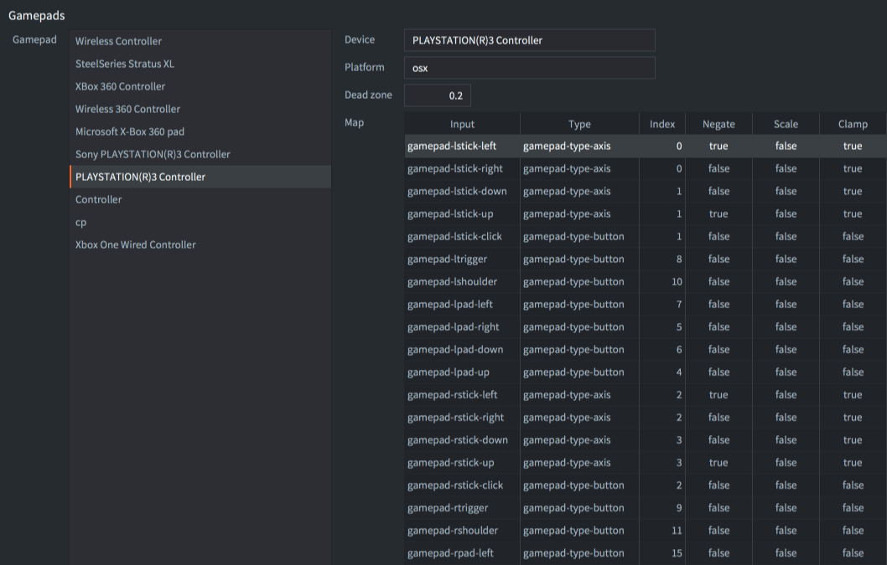
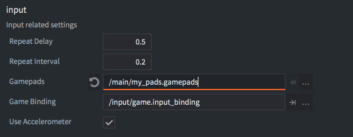

::: sidenote
Zalecamy zapoznanie się z ogólnym sposobem działania wejścia w Defoldzie, jak przechwytuje się wejście, jak wiążę z akcjami oraz w jakiej kolejności skrypty odbierają dane wejściowe. Dowiedz się więcej na temat systemu wejść w [ogólnej instrukcji na temat Wejść](/manuals/input).
:::

# Gamepady

Gamepady w Defoldzie pozwalają na przypisanie standardowego wejścia z gamepada do funkcji gry. Wejście z gamepadów obejmuje przypisanie akcji do:

- Lewej i prawej analogowej gałki (kierunek i kliknięcia)
- Przycisków. Przyciski po prawej stronie zazwyczaj odpowiadają przyciskom "A", "B", "X" i "Y" na kontrolerze Xbox i Nintendo Switch oraz przyciskom "kwadrat", "okrąg", "trójkąt" i "krzyżyk" na kontrolerze PlayStation.
- Lewego i prawego spustu (triggers)
- Lewego i prawego przycisku na ramieniu (shoulder buttons)
- Przycisków Start, Wstecz (Back) i Przewodnika (Guide)


::: important
Poniższe przykłady używają akcji pokazanych na obrazie powyżej. Podobnie jak w przypadku wszystkich innych akcji, możesz dowolnie nazywać akcje wejściowe.
:::

## Przyciski

Przyciski cyfrowe generują zdarzenia naciśnięcia, zwolnienia i powtórzenia. Oto przykład wykrywania wejścia z przycisku cyfrowego (czy naciśnięto lub zwolniono):

```lua
function on_input(self, action_id, action)
    if action_id == hash("gamepad_lpad_left") then
        if action.pressed then
            -- start ruchu w lewo
        elseif action.released then
            -- stop ruchu w lewo
        end
    end
end
```

## Analogowe gałki

Analogowe gałki generują ciągłe zdarzenia wejścia, gdy drążek jest przesuwany poza martwą strefę (ang. dead zone) zdefiniowaną w pliku ustawień gamepada (patrz poniżej). Oto przykład wykrywania wejścia z analogowej gałki:

```lua
function on_input(self, action_id, action)
    if action_id == hash("gamepad_lstick_down") then
        -- lewa gałka ruszona w dół
        print(action.value) -- wartość między 0.0 a -1.0
    end
end
```

Analogowe drążki generują również zdarzenia naciśnięcia i zwolnienia, gdy są przesuwane w kierunku kardynalnym (ang. cardinal directions) powyżej pewnej wartości progowej. Dzięki temu można również używać analogowego drążka jako cyfrowego wejścia kierunkowego:

```lua
function on_input(self, action_id, action)
    if action_id == hash("gamepad_lstick_down") and action.pressed then
        -- lewa gałka ruszona na sam dół
    end
end
```

## Wiele gamepadów

Defold obsługuje wiele gamepadów poprzez system operacyjny urządzenia, akcje ustawiają pole `gamepad` w tabeli akcji, aby wskazać numer gamepada, z którego pochodzi dane wejście:

```lua
function on_input(self, action_id, action)
    if action_id == hash("gamepad_start") then
        if action.gamepad == 0 then
          -- gamepad 0 chce dolaczyc do gry
        end
    end
end
```

## Podłączenie i rozłączenie

Przypisania wejścia od gamepada (ang. gamepad input bindings) dostarczają również dwa osobne przypisania o nazwach `Connected` i `Disconnected`, aby wykrywać, kiedy gamepad jest podłączony (nawet te, które były podłączone od początku) lub odłączony.

```lua
function on_input(self, action_id, action)
    if action_id == hash("gamepad_connected") then
        if action.gamepad == 0 then
          -- gamepad 0 został podłączony
        end
    elseif action_id == hash("gamepad_dicconnected") then
        if action.gamepad == 0 then
          -- gamepad 0 został odłączony
        end
    end
end
```

## Raw gamepady

(Od wersji Defold 1.2.183)

Przypisania wejścia od gamepada dostarczają również osobne przypisanie o nazwie `Raw`, które umożliwia pobranie surowych (bez zastosowanej martwej strefy) danych przycisków, osi i przycisków "hat" dowolnie podłączonego gamepada.

```lua
function on_input(self, action_id, action)
    if action_id == hash("raw") then
        pprint(action.gamepad_buttons)
        pprint(action.gamepad_axis)
        pprint(action.gamepad_hats)
    end
end
```

## Plik ustawień gamepadów

Konfiguracja wejścia od gamepadów wykorzystuje osobny plik mapujący dla każdego rodzaju sprzętowego gamepada. Mapowania gamepadów dla konkretnych typów gamepadów sprzętowych są ustawiane w pliku *gamepads*. Wraz z Defold dostarczany jest wbudowany plik gamepadów z ustawieniami dla popularnych gamepadów:



Jeśli musisz utworzyć nowy plik z ustawieniami gamepadów, udostępniamy proste narzędzie do pomocy:

[Kliknij aby pobrać paczkę gdc.zip](https://forum.defold.com/t/big-thread-of-gamepad-testing/56032).

Narzędzie to zawiera pliki binarne dla systemów Windows, Linux i macOS. Uruchom je z wiersza poleceń:

```sh
./gdc
```

Narzędzie poprosi cię o naciśnięcie różnych przycisków na podłączonym kontrolerze. Następnie wygeneruje nowy plik z ustawieniami gamepadów z prawidłowymi mapowaniami dla twojego kontrolera. Zapisz nowy plik lub połącz go z istniejącym plikiem ustawień gamepadów, a następnie zaktualizuj ustawienie w *game.project*:



### Niezidentyfikowane gamepady

(Od wersji Defold 1.2.186)

Kiedy podłączony jest gamepad i nie ma mapowania dla tego gamepada, gamepad będzie generował tylko akcje "connected", "disconnected" i "raw". W takim przypadku musisz ręcznie zmapować dane surowe gamepada na akcje w twojej grze.

(Od wersji Defold 1.4.8)

Możesz sprawdzić, czy akcja wejścia dla gamepada jest od nieznanego gamepada, czy nie, odczytując wartość `gamepad_unknown` z akcji:

```lua
function on_input(self, action_id, action)
    if action_is == hash("connected") then
        if action.gamepad_unknown then
            print("The connected gamepad is unidentified and will only generate raw input")
        else
            print("The connected gamepad is known and will generate input actions for buttons and sticks")
        end
    end
end
``` 

## Gamepady w HTML5

Gamepady są obsługiwane w projektach HTML5 i generują takie same zdarzenia wejścia jak na innych platformach. Obsługa gamepadów opiera się na [API Gamepad](https://www.w3.org/TR/gamepad/), które jest obsługiwane przez większość przeglądarek ([zobacz wykres obsługi](https://caniuse.com/?search=gamepad)). Jeśli przeglądarka nie obsługuje API Gamepad, Defold będzie ignorować dowolne wywołania związanego z Gamepadem w twoim projekcie. Możesz sprawdzić, czy przeglądarka obsługuje API Gamepad, sprawdzając, czy funkcja `getGamepads` istnieje w obiekcie `navigator`:

```lua
local function supports_gamepads()
    return not html5 or (html5.run('typeof navigator.getGamepads === "function"') == "true")
end

if supports_gamepads() then
    print("Platform supports gamepads")
end
```

Jeśli twoja gra przeglądarkowa działa wewnątrz ramki `iframe`, upewnij się, że `iframe` ma dodane uprawnienie `gamepad`:

```html
<iframe allow="gamepad"></iframe>
```

### Standardowe gamepady

(Od wersji Defold 1.4.1)

Jeśli podłączony gamepad jest zidentyfikowany przez przeglądarkę jako standardowy, używać on będzie mapowania "Standard Gamepad" w [pliku konfiguracji gamepads](/manuals/input-gamepads/#gamepads-settings-file) (mapowanie standardowego gamepada jest dołączone do pliku `default.gamepads` w folderze `/builtins`). Standardowy gamepad ma zdefiniowane 16 przycisków i 2 analogowe gałki z układem podobnym do kontrolerów PlayStation lub Xbox. (zobacz [definicję W3C i układ przycisków](https://w3c.github.io/gamepad/#dfn-standard-gamepad)). Jeśli podłączony gamepad nie jest zidentyfikowany jako standardowy, Defold będzie próbował znaleźć mapowanie odpowiadające typowi kontrolwera w pliku konfiguracji gamepadów.

## Gamepady na systemie Windows

Na systemie Windows obecnie obsługiwane są tylko kontrolery XBox 360. Aby podłączyć kontroler Xbox 360 do komputera z systemem Windows, upewnij się, że jest on skonfigurowany poprawnie, zgodnie z [tym poradnikiem](http://www.wikihow.com/Use-Your-Xbox-360-Controller-for-Windows).

## Gamepady na systemie Android

(Od wersji Defold 1.2.183)

Gamepady są obsługiwane w projektach na platformę Android i generują te same zdarzenia wejścia co na innych platformach. Obsługa gamepadów opiera się na [systemie wejść Androida dla zdarzeń klawiszy i ruchu]https://developer.android.com/training/game-controllers/controller-input).. Zdarzenia wejścia Androida zostaną przetłumaczone na zdarzenia gamepadów Defold, używając tego samego pliku gamepadów, jak opisano powyżej.

Podczas dodawania dodatkowych przypisań gamepadów na platformie Android, możesz skorzystać z poniższych tabel przekształceń zdarzeń Androida na wartości pliku *gamepad*:

| Klawisz - indeks przycisku  | Indeks | Wersja  |
|-----------------------------|--------|---------|
| AKEYCODE_BUTTON_A           | 0      | 1.2.183 |
| AKEYCODE_BUTTON_B           | 1      | 1.2.183 |
| AKEYCODE_BUTTON_C           | 2      | 1.2.183 |
| AKEYCODE_BUTTON_X           | 3      | 1.2.183 |
| AKEYCODE_BUTTON_L1          | 4      | 1.2.183 |
| AKEYCODE_BUTTON_R1          | 5      | 1.2.183 |
| AKEYCODE_BUTTON_Y           | 6      | 1.2.183 |
| AKEYCODE_BUTTON_Z           | 7      | 1.2.183 |
| AKEYCODE_BUTTON_L2          | 8      | 1.2.183 |
| AKEYCODE_BUTTON_R2          | 9      | 1.2.183 |
| AKEYCODE_DPAD_CENTER        | 10     | 1.2.183 |
| AKEYCODE_DPAD_DOWN          | 11     | 1.2.183 |
| AKEYCODE_DPAD_LEFT          | 12     | 1.2.183 |
| AKEYCODE_DPAD_RIGHT         | 13     | 1.2.183 |
| AKEYCODE_DPAD_UP            | 14     | 1.2.183 |
| AKEYCODE_BUTTON_START       | 15     | 1.2.183 |
| AKEYCODE_BUTTON_SELECT      | 16     | 1.2.183 |
| AKEYCODE_BUTTON_THUMBL      | 17     | 1.2.183 |
| AKEYCODE_BUTTON_THUMBR      | 18     | 1.2.183 |
| AKEYCODE_BUTTON_MODE        | 19     | 1.2.183 |
| AKEYCODE_BUTTON_1           | 20     | 1.2.186 |
| AKEYCODE_BUTTON_2           | 21     | 1.2.186 |
| AKEYCODE_BUTTON_3           | 22     | 1.2.186 |
| AKEYCODE_BUTTON_4           | 23     | 1.2.186 |
| AKEYCODE_BUTTON_5           | 24     | 1.2.186 |
| AKEYCODE_BUTTON_6           | 25     | 1.2.186 |
| AKEYCODE_BUTTON_7           | 26     | 1.2.186 |
| AKEYCODE_BUTTON_8           | 27     | 1.2.186 |
| AKEYCODE_BUTTON_9           | 28     | 1.2.186 |
| AKEYCODE_BUTTON_10          | 29     | 1.2.186 |
| AKEYCODE_BUTTON_11          | 30     | 1.2.186 |
| AKEYCODE_BUTTON_12          | 31     | 1.2.186 |
| AKEYCODE_BUTTON_13          | 32     | 1.2.186 |
| AKEYCODE_BUTTON_14          | 33     | 1.2.186 |
| AKEYCODE_BUTTON_15          | 34     | 1.2.186 |
| AKEYCODE_BUTTON_16          | 35     | 1.2.186 |

([Definicje zdarzeń Android `KeyEvent`](https://developer.android.com/ndk/reference/group/input#group___input_1gafccd240f973cf154952fb917c9209719))

| Ruch - indeks przycisku     | Indeks |
|-----------------------------|--------|
| AMOTION_EVENT_AXIS_X        | 0      |
| AMOTION_EVENT_AXIS_Y        | 1      |
| AMOTION_EVENT_AXIS_Z        | 2      |
| AMOTION_EVENT_AXIS_RZ       | 3      |
| AMOTION_EVENT_AXIS_LTRIGGER | 4      |
| AMOTION_EVENT_AXIS_RTRIGGER | 5      |
| AMOTION_EVENT_AXIS_HAT_X    | 6      |
| AMOTION_EVENT_AXIS_HAT_Y    | 7      |

([Definicje Android `MotionEvent`](https://developer.android.com/ndk/reference/group/input#group___input_1ga157d5577a5b2f5986037d0d09c7dc77d))

Użyj tej tabelu w kombinacji z aplikacją testową dla gamepadów z Google Play Store, żeby zobaczyć jakie przyciski wywołują jakie wydarzenia na Twoim gamepadzie.
