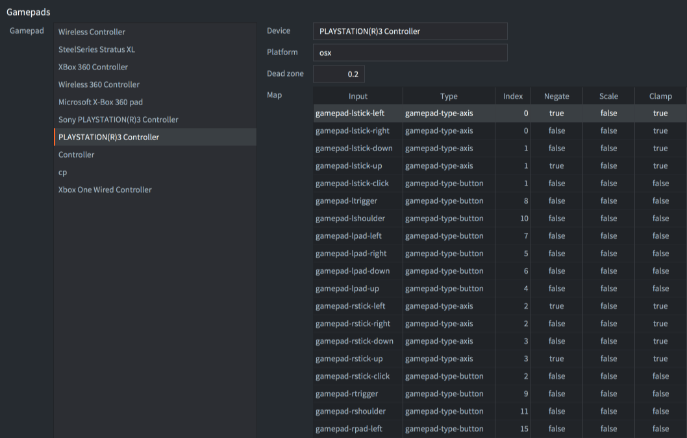
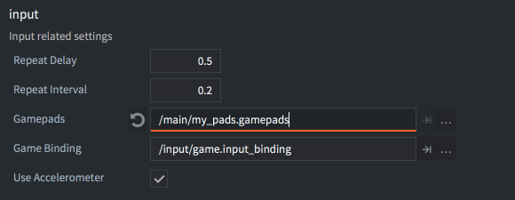

::: sidenote
Zaleca się, aby najpierw zapoznać się z ogólnym sposobem działania wejścia w Defold, z tym, jak odbiera się wejście i w jakiej kolejności trafia ono do plików skryptów. Więcej informacji znajdziesz w [instrukcji Input Overview](/manuals/input).
:::

# Gamepady
Wiązania gamepada pozwalają przypisać standardowe wejście z gamepada do funkcji gry. Wejście z gamepada obejmuje wiązania dla:

- lewej i prawej gałki analogowej: kierunek i kliknięcie
- lewej i prawej krzyżaka cyfrowego. Prawy krzyżak zwykle odpowiada przyciskom "A", "B", "X" i "Y" na kontrolerze Xbox oraz przyciskom "square", "circle", "triangle" i "cross" na kontrolerze PlayStation
- lewego i prawego spustu
- lewego i prawego przycisku naramiennego
- przycisków Start, Back i Guide


::: important
Poniższe przykłady używają akcji pokazanych na obrazie powyżej. Tak jak w przypadku każdego innego wejścia możesz nadać swoim akcjom wejściowym dowolne nazwy.
:::

## Przyciski cyfrowe
Przyciski cyfrowe generują zdarzenia pressed, released i repeated. Poniższy przykład pokazuje, jak wykryć wejście z przycisku cyfrowego (naciśnięcie albo zwolnienie):

```lua
function on_input(self, action_id, action)
    if action_id == hash("gamepad_lpad_left") then
        if action.pressed then
            -- rozpocznij ruch w lewo
        elseif action.released then
            -- zatrzymaj ruch w lewo
        end
    end
end
```

## Gałki analogowe
Gałki analogowe generują ciągłe zdarzenia wejścia, gdy gałka zostanie przesunięta poza martwą strefę zdefiniowaną w pliku ustawień gamepada (patrz niżej). Poniższy przykład pokazuje, jak wykryć wejście z gałki analogowej:

```lua
function on_input(self, action_id, action)
    if action_id == hash("gamepad_lstick_down") then
        -- lewa gałka została przesunięta w dół
        print(action.value) -- wartość między 0.0 a -1.0
    end
end
```

Gałki analogowe generują też zdarzenia pressed i released, gdy są przesuwane w kierunkach kardynalnych powyżej określonej wartości progowej. Dzięki temu można też używać gałki analogowej jako cyfrowego wejścia kierunkowego:

```lua
function on_input(self, action_id, action)
    if action_id == hash("gamepad_lstick_down") and action.pressed then
        -- lewa gałka została przesunięta do skrajnej dolnej pozycji
    end
end
```

## Wiele gamepadów
Defold obsługuje wiele gamepadów przez system operacyjny hosta, a akcje ustawiają pole `gamepad` w tabeli akcji na numer gamepada, z którego pochodzi dane wejście:

```lua
function on_input(self, action_id, action)
    if action_id == hash("gamepad_start") then
        if action.gamepad == 0 then
          -- gamepad 0 chce dołączyć do gry
        end
    end
end
```

## Podłączanie i odłączanie
Wiązania wejścia z gamepada udostępniają też dwa osobne wiązania o nazwach `Connected` i `Disconnected`, aby wykrywać moment podłączenia gamepada, także wtedy, gdy był podłączony od początku, lub jego odłączenia.

```lua
function on_input(self, action_id, action)
    if action_id == hash("gamepad_connected") then
        if action.gamepad == 0 then
          -- gamepad 0 został podłączony
        end
    elseif action_id == hash("gamepad_disconnected") then
        if action.gamepad == 0 then
          -- gamepad 0 został odłączony
        end
    end
end
```

## Surowe gamepady
(Od wersji Defold 1.2.183)

Wiązania wejścia z gamepada udostępniają także osobne wiązanie o nazwie `Raw`, które daje nieprzefiltrowane dane wejściowe przycisków, osi i hatów dowolnego podłączonego gamepada, bez zastosowanej martwej strefy.

```lua
function on_input(self, action_id, action)
    if action_id == hash("raw") then
        pprint(action.gamepad_buttons)
        pprint(action.gamepad_axis)
        pprint(action.gamepad_hats)
    end
end
```

## Plik ustawień gamepadów
Konfiguracja wejścia z gamepada używa osobnego pliku mapowań dla każdego typu sprzętowego gamepada. Mapowania dla konkretnych sprzętowych gamepadów są zapisane w pliku *gamepads*. Defold dostarcza wbudowany plik gamepads z ustawieniami dla popularnych gamepadów:



Jeśli musisz utworzyć nowy plik ustawień gamepadów, dostępne jest proste narzędzie pomocnicze:

[Kliknij, aby pobrać gdc.zip](https://forum.defold.com/t/big-thread-of-gamepad-testing/56032).

Zawiera ono pliki binarne dla systemów Windows, Linux i macOS. Uruchom je z wiersza poleceń:

```sh
./gdc
```

Narzędzie poprosi o naciskanie kolejnych przycisków na podłączonym kontrolerze. Następnie wygeneruje nowy plik gamepads z poprawnymi mapowaniami dla Twojego kontrolera. Zapisz nowy plik albo scal go z istniejącym plikiem gamepads, a potem zaktualizuj ustawienie w *game.project*:



### Niezidentyfikowane gamepady
(Od wersji Defold 1.2.186)

Gdy gamepad jest podłączony i nie ma dla niego mapowania, będzie generował tylko akcje connected, disconnected i raw. W takim przypadku trzeba ręcznie zmapować surowe dane gamepada na akcje w grze.

(Od wersji Defold 1.4.8)

Można sprawdzić, czy akcja wejścia z gamepada pochodzi z nieznanego gamepada, odczytując wartość `gamepad_unknown` z akcji:

```lua
function on_input(self, action_id, action)
    if action_id == hash("connected") then
        if action.gamepad_unknown then
            print("The connected gamepad is unidentified and will only generate raw input")
        else
            print("The connected gamepad is known and will generate input actions for buttons and sticks")
        end
    end
end
``` 

## Gamepady w HTML5
Gamepady są obsługiwane w buildach HTML5 i generują te same zdarzenia wejścia co na innych platformach. Obsługa gamepadów opiera się na [Gamepad API](https://www.w3.org/TR/gamepad/), które jest obsługiwane przez większość przeglądarek ([sprawdź tabelę zgodności](https://caniuse.com/?search=gamepad)). Jeśli przeglądarka nie obsługuje Gamepad API, Defold po prostu zignoruje wszystkie wiązania gamepada w projekcie. Możesz sprawdzić, czy przeglądarka obsługuje Gamepad API, testując, czy funkcja `getGamepads` istnieje w obiekcie `navigator`:

```lua
local function supports_gamepads()
    return not html5 or (html5.run('typeof navigator.getGamepads === "function"') == "true")
end

if supports_gamepads() then
    print("Platform supports gamepads")
end
```

Jeśli gra działa wewnątrz `iframe`, upewnij się też, że `iframe` ma dodane uprawnienie `gamepad`:

```html
<iframe allow="gamepad"></iframe>
```

### Standardowe gamepady
(Od wersji Defold 1.4.1)

Jeśli podłączony gamepad zostanie rozpoznany przez przeglądarkę jako standardowy gamepad, użyje mapowania "Standard Gamepad" z [pliku ustawień gamepads](/manuals/input-gamepads/#gamepads-settings-file) (mapowanie standardowego gamepada jest dołączone do pliku `default.gamepads` w `/builtins`). Standardowy gamepad ma 16 przycisków i 2 gałki analogowe, a układ przycisków jest podobny do kontrolera PlayStation lub Xbox (więcej informacji znajdziesz w [definicji i układzie przycisków W3C](https://w3c.github.io/gamepad/#dfn-standard-gamepad)). Jeśli podłączony gamepad nie zostanie rozpoznany jako standardowy, Defold poszuka w pliku ustawień gamepadów mapowania pasującego do jego typu sprzętowego.

## Gamepady w Windows
W systemie Windows obecnie obsługiwane są tylko kontrolery Xbox 360. Aby podłączyć kontroler 360 do komputera z Windows, upewnij się, że został poprawnie skonfigurowany zgodnie z [tym poradnikiem](http://www.wikihow.com/Use-Your-Xbox-360-Controller-for-Windows).

## Gamepady w Android
(Od wersji Defold 1.2.183)

Gamepady są obsługiwane w buildach Android i generują te same zdarzenia wejścia co na innych platformach. Obsługa gamepadów opiera się na [systemie wejścia Android dla zdarzeń klawiszy i ruchu](https://developer.android.com/training/game-controllers/controller-input). Zdarzenia wejścia Android są tłumaczone na zdarzenia gamepada Defold przy użyciu tego samego pliku *gamepad* opisanego powyżej.

Przy dodawaniu dodatkowych wiązań gamepada w Android możesz użyć poniższych tabel do przetłumaczenia zdarzeń wejścia Android na wartości pliku *gamepad*:

| Zdarzenie klawisza do indeksu przycisku | Indeks | Wersja |
|-----------------------------------------|-------|--------|
| `AKEYCODE_BUTTON_A`           | 0     | 1.2.183 |
| `AKEYCODE_BUTTON_B`           | 1     | 1.2.183 |
| `AKEYCODE_BUTTON_C`           | 2     | 1.2.183 |
| `AKEYCODE_BUTTON_X`           | 3     | 1.2.183 |
| `AKEYCODE_BUTTON_L1`          | 4     | 1.2.183 |
| `AKEYCODE_BUTTON_R1`          | 5     | 1.2.183 |
| `AKEYCODE_BUTTON_Y`           | 6     | 1.2.183 |
| `AKEYCODE_BUTTON_Z`           | 7     | 1.2.183 |
| `AKEYCODE_BUTTON_L2`          | 8     | 1.2.183 |
| `AKEYCODE_BUTTON_R2`          | 9     | 1.2.183 |
| `AKEYCODE_DPAD_CENTER`        | 10    | 1.2.183 |
| `AKEYCODE_DPAD_DOWN`          | 11    | 1.2.183 |
| `AKEYCODE_DPAD_LEFT`          | 12    | 1.2.183 |
| `AKEYCODE_DPAD_RIGHT`         | 13    | 1.2.183 |
| `AKEYCODE_DPAD_UP`            | 14    | 1.2.183 |
| `AKEYCODE_BUTTON_START`       | 15    | 1.2.183 |
| `AKEYCODE_BUTTON_SELECT`      | 16    | 1.2.183 |
| `AKEYCODE_BUTTON_THUMBL`      | 17    | 1.2.183 |
| `AKEYCODE_BUTTON_THUMBR`      | 18    | 1.2.183 |
| `AKEYCODE_BUTTON_MODE`        | 19    | 1.2.183 |
| `AKEYCODE_BUTTON_1`           | 20    | 1.2.186 |
| `AKEYCODE_BUTTON_2`           | 21    | 1.2.186 |
| `AKEYCODE_BUTTON_3`           | 22    | 1.2.186 |
| `AKEYCODE_BUTTON_4`           | 23    | 1.2.186 |
| `AKEYCODE_BUTTON_5`           | 24    | 1.2.186 |
| `AKEYCODE_BUTTON_6`           | 25    | 1.2.186 |
| `AKEYCODE_BUTTON_7`           | 26    | 1.2.186 |
| `AKEYCODE_BUTTON_8`           | 27    | 1.2.186 |
| `AKEYCODE_BUTTON_9`           | 28    | 1.2.186 |
| `AKEYCODE_BUTTON_10`          | 29    | 1.2.186 |
| `AKEYCODE_BUTTON_11`          | 30    | 1.2.186 |
| `AKEYCODE_BUTTON_12`          | 31    | 1.2.186 |
| `AKEYCODE_BUTTON_13`          | 32    | 1.2.186 |
| `AKEYCODE_BUTTON_14`          | 33    | 1.2.186 |
| `AKEYCODE_BUTTON_15`          | 34    | 1.2.186 |
| `AKEYCODE_BUTTON_16`          | 35    | 1.2.186 |

([Definicje `KeyEvent` Android](https://developer.android.com/ndk/reference/group/input#group___input_1gafccd240f973cf154952fb917c9209719))

| Zdarzenie ruchu do indeksu osi | Indeks |
|-------------------------------|-------|
| `AMOTION_EVENT_AXIS_X`        | 0     |
| `AMOTION_EVENT_AXIS_Y`        | 1     |
| `AMOTION_EVENT_AXIS_Z`        | 2     |
| `AMOTION_EVENT_AXIS_RZ`       | 3     |
| `AMOTION_EVENT_AXIS_LTRIGGER` | 4     |
| `AMOTION_EVENT_AXIS_RTRIGGER` | 5     |
| `AMOTION_EVENT_AXIS_HAT_X`    | 6     |
| `AMOTION_EVENT_AXIS_HAT_Y`    | 7     |

([Definicje `MotionEvent` Android](https://developer.android.com/ndk/reference/group/input#group___input_1ga157d5577a5b2f5986037d0d09c7dc77d))

Użyj tej tabeli razem z aplikacją testową gamepadów ze Sklepu Google Play, aby ustalić, do jakiego zdarzenia przypisany jest każdy przycisk na Twoim gamepadzie.
