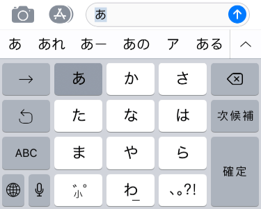

::: sidenote
Zalecamy zapoznanie się z ogólnym sposobem działania wejścia w Defoldzie, jak przechwytuje się wejście, jak wiążę z akcjami oraz w jakiej kolejności skrypty odbierają dane wejściowe. Dowiedz się więcej na temat systemu wejść w [ogólnej instrukcji na temat Wejść](/manuals/input).
:::

# Obsługa klawiatury

Wyzwalacze klawiszy (ang. key triggers) pozwalają przypisywać pojedyncze klawisze klawiatury do akcji w grze. Każdy klawisz jest mapowany osobno na odpowiadającą mu akcję. Wyzwalacze klawiszy są używane do przypisywania konkretnych przycisków do określonych funkcji, na przykład ruchu postaci przy użyciu klawiszy strzałek lub WASD. Jeśli potrzebujesz odczytać dowolne dane wejściowe z klawiatury, użyj wyzwalaczy tekstowych (zobacz poniżej).


```lua
function on_input(self, action_id, action)
    if action_id == hash("left") then
        if action.pressed then
            -- rozpocznij ruch w lewo
        elseif action.released then
            -- zakończ ruch w lewo
        end
    end
end
```

# Obsługa tekstu

Wyzwalacze tekstowe (ang. text triggers) służą do odczytywania dowolnego tekstu wprowadzanego za pomocą klawiatury. Istnieją dwa rodzaje wyzwalaczy tekstowych: tekstowy (text) i oznaczony tekst (marked text).


## Tekst

Wyzwalacz `text` służy do przechwytywania standardowego tekstu wprowadzanego za pomocą klawiatury. Ustawia pole `text` w tabeli akcji na ciąg znaków zawierający wprowadzoną literę. Akcja zostaje uruchomiona tylko w momencie naciśnięcia klawisza, nie wysyła akcji `released` lub `repeated`.

```lua
function on_input(self, action_id, action)
    if action_id == hash("text") then
        -- Concatenate the typed character to the "user" node...
        local node = gui.get_node("user")
        local name = gui.get_text(node)
        name = name .. action.text
        gui.set_text(node, name)
    end
end
```

## Zaznaczony tekst

Wyzwalacz marked-text jest używany głównie w klawiaturach azjatyckich, gdzie wiele naciśnięć klawiszy może mapować się na pojedyncze wprowadzone znaki. Na przykład w klawiaturze iOS "Japanese-Kana" użytkownik może wprowadzać kombinacje, a górna część klawiatury wyświetla dostępne symbole lub sekwencje symboli, które można wprowadzić.



- Każde naciśnięcie klawisza generuje osobną akcję i ustawia pole text akcji na obecnie wprowadzoną sekwencję symboli (tzw. "oznaczony tekst").
- Gdy użytkownik wybierze symbol lub kombinację symboli, wysłana zostanie osobna akcja typu `text` (jeśli jest ona skonfigurowana na liście przypisań wejścia). Oddzielna akcja ustawia pole text akcji na ostateczną sekwencję symboli.
