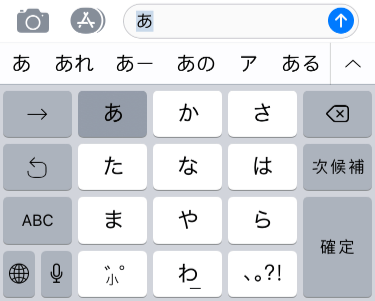

::: sidenote
Zalecamy zapoznanie się z ogólnym sposobem działania wejścia w silniku Defold, z tym, jak odbiera się dane wejściowe, oraz z kolejnością, w jakiej skrypty otrzymują wejście. Dowiedz się więcej o systemie wejścia w [instrukcji przeglądowej dotyczącej wejścia](/manuals/input).
:::

# Wyzwalacze klawiszy
Wyzwalacze klawiszy pozwalają przypisywać pojedyncze klawisze klawiatury do akcji w grze. Każdy klawisz jest mapowany osobno na odpowiadającą mu akcję. Wyzwalacze klawiszy służą do powiązania konkretnych przycisków z określonymi funkcjami, na przykład ruchem postaci przy użyciu klawiszy strzałek lub WASD. Jeśli potrzebujesz odczytywać dowolne dane wejściowe z klawiatury, użyj wyzwalaczy tekstowych (zobacz niżej).


```lua
function on_input(self, action_id, action)
    if action_id == hash("left") then
        if action.pressed then
            -- rozpocznij ruch w lewo
        elseif action.released then
            -- zakończ ruch w lewo
        end
    end
end
```

# Wyzwalacze tekstowe
Wyzwalacze tekstowe służą do odczytywania dowolnego tekstu wprowadzanego za pomocą klawiatury. Istnieją dwa rodzaje wyzwalaczy tekstowych: text i marked text.


## Tekst
Wyzwalacz `text` przechwytuje zwykły tekst wprowadzany za pomocą klawiatury. Ustawia pole `text` w tabeli akcji na łańcuch znaków zawierający wpisany znak. Akcja jest uruchamiana tylko przy naciśnięciu klawisza; nie są wysyłane akcje `released` ani `repeated`.

```lua
function on_input(self, action_id, action)
    if action_id == hash("text") then
        -- Dołącz wpisany znak do węzła "user"...
        local node = gui.get_node("user")
        local name = gui.get_text(node)
        name = name .. action.text
        gui.set_text(node, name)
    end
end
```

## Oznaczony tekst
Wyzwalacz `marked-text` jest używany głównie na klawiaturach azjatyckich, gdzie wiele naciśnięć klawiszy może składać się na pojedyncze wejście. Na przykład na klawiaturze iOS "Japanese-Kana" użytkownik może wpisywać kombinacje, a górna część klawiatury wyświetla dostępne symbole lub sekwencje symboli, które można wprowadzić.



- Każde naciśnięcie klawisza generuje osobną akcję i ustawia pole `text` akcji na aktualnie wpisaną sekwencję symboli, czyli „marked text”.
- Gdy użytkownik wybierze symbol lub kombinację symboli, zostanie wysłana osobna akcja wyzwalacza typu `text` (jeśli jest skonfigurowana na liście wiązań wejść). Ta osobna akcja ustawia pole `text` akcji na końcową sekwencję symboli.
