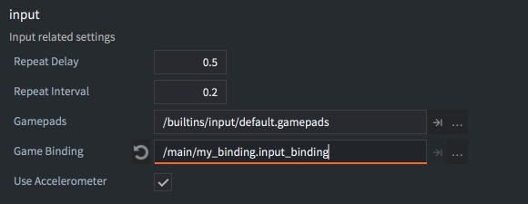
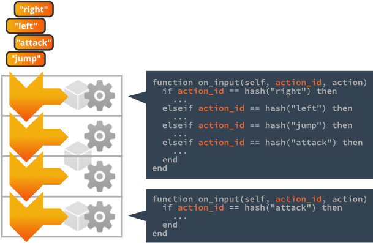
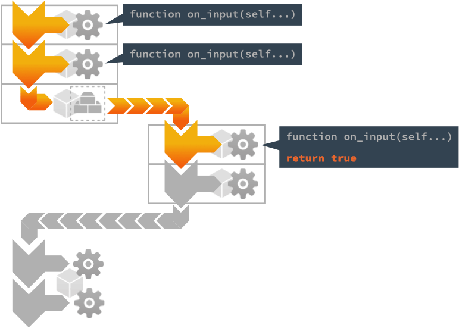
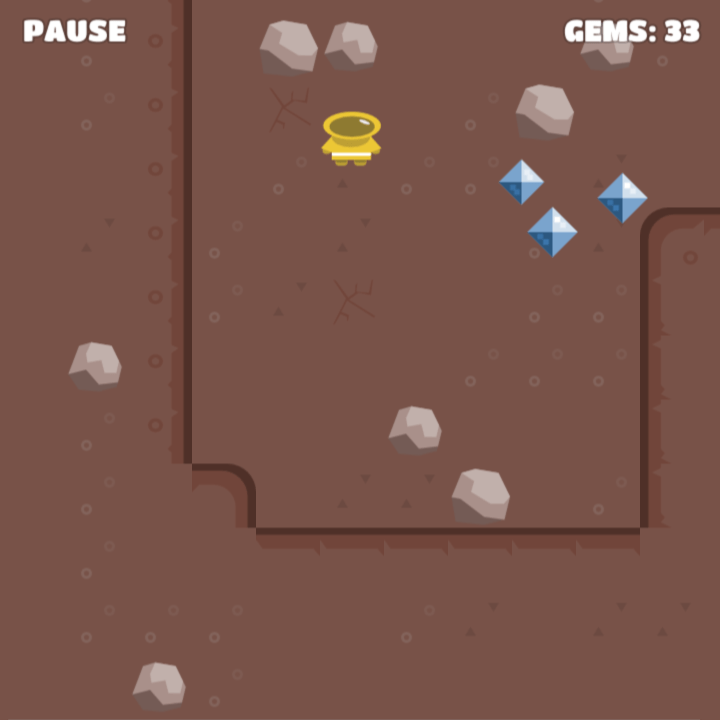
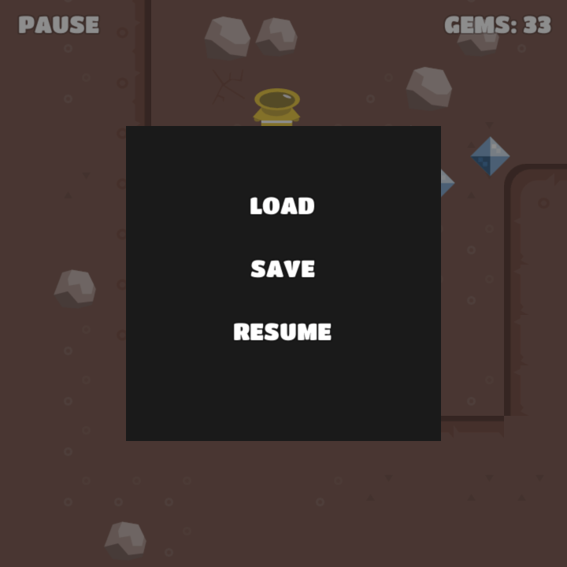

# Urządzenia wejścia

Wszystkie dane wejściowe użytkownika (z klawiatury, myszki, ekranu dotykowego lub innego kontrolera) są przechwytywane przez silnik i wysyłane jako akcje do komponentów skryptów oraz komponentów skryptów GUI w obiektach gry, które zdobyły aktywne skupienie na wejścia (ang. input focus) i implementują funkcję cyklu życia `on_input()`. Niniejsza instrukcja wyjaśnia, jak skonfigurować wiązania wejścia (ang. input bindings) do przechwytywania danych wejściowych oraz jak tworzyć kod, który na nie reaguje.

System wejściowy wykorzystuje zestaw prostych i potężnych koncepcji, pozwalających na zarządzanie danymi wejściowymi w sposób dostosowany do potrzeb Twojej gry.


Devices
: Urządzenia wejściowe, które są częścią lub podłączone do twojego komputera lub urządzenia mobilnego, dostarczają dane wejściowe na poziomie systemu operacyjnego, które przesyłane są do środowiska uruchomieniowego Defold. Obsługiwane są następujące typy urządzeń:

  1. Keyboard - Klawiatura (pojedynczy klawisz oraz wprowadzanie tekstu)
  2. Mouse - Mysz (pozycja, naciśnięcia przycisków i akcje kółka myszy)
  3. Single and multi-touch - jedno- i wielopunktowy ekran dotykowy (na urządzeniach z systemem iOS i Android oraz na przeglądarkach HTML5)
  4. Gamepads - Gamepady (obsługiwane przez system operacyjny i zmapowane w pliku [gamepads](#gamepads-settings-file))

Input bindings
: Wiązania wejścia - przed przekazaniem danych wejściowych do skryptu dane wejściowe z urządzenia są tłumaczone na konkretne *akcje* za pomocą tabeli wiązań wejścia (ang. input bindings table).

Actions
: Akcje są identyfikowane przez (zahaszowane) nazwy określone w pliku wiązań wejścia. Każda akcja zawiera także istotne dane na temat danych wejściowych: czy przycisk jest naciśnięty lub zwolniony, współrzędne myszy i dotyku itp.

Input listeners
: Każdy komponent skryptu lub skrypt GUI może odbierać akcje wejścia przez zdobycie skupienia wejścia (ang. *acquiring input focus*). Kilku słuchaczy (ang. listener) może być aktywnych jednocześnie.

Input stack
: Lista (stos) słuchaczy wejścia, z pierwszym zdobywającym skupienie na dole stosu i ostatnim zdobywającym na górze.

Consuming input
: Skrypt może wybrać, aby skonsumować dane wejściowe, uniemożliwiając ich odbieranie przez słuchaczy niżej w stosie.

## Konfigurowanie wiązań wejścia

Wiązania wejścia (input bindings) to tabela o zasięgu projektu, która pozwala określić, jak dane wejściowe z urządzenia powinny być tłumaczone na konkretne *akcje* przed ich przesłaniem do komponentów skryptów i skryptów GUI. Aby utworzyć nowy plik wiązań wejścia, <kbd>kliknij prawym przyciskiem myszy</kbd> w lokalizacji w panelu *Assets* i wybierz <kbd>New... ▸ Input Binding</kbd>. Aby użyć nowego pliku, zmień ustawienie *Game Binding* w pliku *game.project*.



Domyślny plik wiązań wejścia jest automatycznie tworzony w każdym nowym projekcie, więc zazwyczaj nie ma potrzeby tworzenia nowego pliku wiązań. Domyślny plik nazywa się "game.input_binding" i znajduje się w folderze "input" w głównym katalogu projektu. <kbd>Kliknij dwukrotnie</kbd> na plik, aby otworzyć go w edytorze:


Aby utworzyć nowe wiązanie, kliknij przycisk <kbd>+</kbd> u dołu odpowiedniego typu wyzwalacza (ang. trigger). Każde wprowadzenie ma dwie pola:

*Input*
: Surowe dane wejściowe do nasłuchiwania, wybierane z przewijanej listy dostępnych wejść.

*Action*
: Nazwa akcji nadawana akcjom wejściowym podczas ich tworzenia i przesyłania do skryptów. Tę samą nazwę akcji można przypisać wielu wejściom. Na przykład, można przypisać klawisz <kbd>Spacja</kbd> i przycisk "A" pada do akcji `skok`. Należy pamiętać, że wejścia dotykowe (touch inputs) niestety nie mogą mieć tych samych nazw akcji co inne wejścia.

## Rodzaje wyzwalaczy

Istnieje pięć różnych rodzajów wyzwalaczy (ang. triggers) specyficznych dla urządzenia, które można utworzyć:
There are five device specific types of triggers that you can create:

Key Triggers
: Wyzwalacze uruchamiane przez klawisze klawiatury. Każdy klawisz jest mapowany osobno na odpowiadającą akcję. Więcej informacji można znaleźć w osobnej [instrukcji do wejść klawiszy i tekstowego](/manuals/input-key-and-text).

Text Triggers
: Wyzwalacze tekstu służą do odczytywania dowolnych danych wejściowych. Więcej informacji można znaleźć w osobnej [instrukcji do wejść klawiszy i tekstowego](/manuals/input-key-and-text)

Mouse Triggers
: Wejście z przycisków myszy i kółek przewijania myszy (scroll wheel). Więcej informacji można znaleźć w [instrukcji do wejść myszy i dotykowych](/manuals/input-mouse-and-touch).

Touch Triggers
: Dostępne są wyzwalacze typu jednopunktowego i wielopunktowego na urządzeniach z systemem iOS i Android w aplikacjach natywnych oraz w grach HTML5. Więcej informacji można znaleźć w [instrukcji do wejść myszy i dotykowych](/manuals/input-mouse-and-touch).

Gamepad Triggers
: Wyzwalacze gamepadów pozwalają na przypisanie standardowego wejścia z gamepada do funkcji gry. Więcej informacji można znaleźć w [instrukcji do gamepadów](/manuals/input-gamepads).

### Wejście akcelerometru

Oprócz pięciu różnych rodzajów wyzwalaczy wymienionych powyżej, Defold obsługuje również wejście akcelerometru w aplikacjach natywnych na systemy Android i iOS. Sprawdź pole "Use Accelerometer" w sekcji "Input" w pliku *game.project*.

In addition to the five different trigger types listed above Defold also supports accelerometer input in native Android and iOS applications. Check the Use Accelerometer box in the Input section of your *game.project* file.

```lua
function on_input(self, action_id, action)
    if action.acc_x and action.acc_y and action.acc_z then
        -- react to accelerometer data
    end
end
```

## Input focus

Aby nasłuchiwać akcji wejścia w komponencie skryptu lub skrypcie GUI, należy wysłać wiadomość `acquire_input_focus` do obiektu gry zawierającego ten komponent:

```lua
-- tell the current game object (".") to acquire input focus
msg.post(".", "acquire_input_focus")
```

Ta wiadomość nakazuje silnikowi dodać komponenty zdolne do obsługi wejścia (skrypty, komponenty GUI i pełnomocnicy kolekcji) w obiektach gry do stosu wejścia: *input stack*. Komponenty obiektu gry są umieszczane na szczycie stosu wejścia; komponent, który został dodany ostatni, będzie na górze stosu. Należy zauważyć, że jeśli obiekt gry zawiera więcej niż jeden składnik zdolny do obsługi wejścia, wszystkie składniki zostaną dodane do stosu:


Jeśli obiekt gry, który już zdobył skupienie wejścia, robi to ponownie, jego komponenty zostaną przeniesione na górę stosu.

## Przekazywanie akcji wejścia i on_input()

Akcje wejściowe są rozpakowywane ze stosu wejścia od góry do dołu.



Dowolny komponent znajdujący się na stosie zawierający funkcję [on_input()](/ref/go#on_input) będzie miał tę funkcję wywoływaną dla każdej akcji wejściowej w trakcie klatki, z następującymi argumentami:

`self`
: Bieżąca instancja skryptu.

`action_id`
: Zahaszowana nazwa akcji, zgodnie z konfiguracją w plikach wiązań wejścia.

`action`
: Tabela zawierająca przydatne dane na temat akcji, takie jak wartość wejścia, jego położenie (pozycje absolutne i różnice), czy przycisk został *wciśnięty* itp. Zobacz więcej szczegółów w opisie funkcji [on_input()](/ref/go#on_input).

```lua
function on_input(self, action_id, action)
  if action_id == hash("left") and action.pressed then
    -- ruch w lew
    local pos = go.get_position()
    pos.x = pos.x - 100
    go.set_position(pos)
  elseif action_id == hash("right") and action.pressed then
    -- ruch w prawo
    local pos = go.get_position()
    pos.x = pos.x + 100
    go.set_position(pos)
  end
end
```


### Skupienie wejścia i składniki kolekcji proxy

Każdy świat gry, który jest dynamicznie ładowany za pomocą komponentu pełnomocnika kolekcji (collection proxy), posiada własny stos wejścia. Aby akcje trafiły na stos wejścia załadowanego świata, komponent proxy musi znajdować się na stosie wejścia głównego świata. Wszystkie składniki na stosie załadowanego świata obsługiwane są przed kontynuacją przekazywania akcji w dół stosu głównego:


::: important
To powszechny błąd, że zapomina się wysłać wiadomość `acquire_input_focus` do obiektu gry zawierającego komponent kolekcji proxy. Pominięcie tego kroku uniemożliwia odbieranie akcji wejścia przez składniki na stosie załadowanego świata.
:::


### Zwalnianie wejścia

Aby przestać nasłuchiwać akcji wejścia, wyślij wiadomość `release_input_focus` do obiektu gry. Ta wiadomość usunie komponenty obiektu gry ze stosu wejścia:

```lua
-- informuj bieżący obiekt gry (".") o zwolnieniu skupienia wejścia
msg.post(".", "release_input_focus")
```

## Konsumowanie danych wejściowych

Funkcja `on_input()` komponentu może aktywnie kontrolować, czy akcje powinny być przekazywane dalej na stosie, czy też nie:

- Jeśli `on_input()` zwraca `false`, lub nic nie jest zwracane (również zwracania wartości `nil` jest tak traktowane w Lua), akcje wejściowe zostaną przekazane do następnego komponentu na stosie wejścia.
- Jeśli `on_input()` zwraca `true`, dane wejściowe zostaną skonsumowane, co oznacza, że żaden komponent na stosie wejścia nie otrzyma danych wejściowych. Należy zauważyć, że dotyczy to wszystkich stosów wejścia. Komponent na stosie załadowanego świata może zużyć dane wejściowe, uniemożliwiając komponentom na stosie głównym ich odbieranie:



Istnieje wiele dobrych przypadków użycia, w których konsumowanie danych wejściowych zapewnia prosty i potężny sposób na przesuwanie danych wejściowych między różnymi częściami gry. Na przykład, jeśli potrzebujesz menu wysuwane, które tymczasowo jest jedyną częścią gry nasłuchującą na wejście:



Menu pauzy jest początkowo ukryte i wyłączone (disabled), a gdy gracz dotknie elementu HUD "PAUSE", jest włączane:

```lua
function on_input(self, action_id, action)
    if action_id == hash("mouse_press") and action.pressed then
        -- Czy gracz nacisnął PAUSE?
        local pausenode = gui.get_node("pause")
        if gui.pick_node(pausenode, action.x, action.y) then
            -- Poinformuj menu pauzy o przejęciu kontroli..
            msg.post("pause_menu", "show")
        end
    end
end
```



Menu pauzy GUI zdobywa skupienie wejścia i konsumuje dane wejściowe, uniemożliwiając odbieranie danych wejściowych innych niż te istotne dla menu wysuwanego:

```lua
function on_message(self, message_id, message, sender)
  if message_id == hash("show") then
    -- Pokaż menu pauzy.
    local node = gui.get_node("pause_menu")
    gui.set_enabled(node, true)

    -- Zdobądź skupienie wejścia.
    msg.post(".", "acquire_input_focus")
  end
end

function on_input(self, action_id, action)
  if action_id == hash("mouse_press") and action.pressed then

    -- zrób coś...

    local resumenode = gui.get_node("resume")
    if gui.pick_node(resumenode, action.x, action.y) then
        -- Ukryj menu pauzy
        local node = gui.get_node("pause_menu")
        gui.set_enabled(node, false)

        -- Zwolnij wejście.
        msg.post(".", "release_input_focus")
    end
  end

  -- Skonsumuj wszystkie dane wejściowe. Cokolwiek poniżej nas na stosie wejścia
  -- nigdy nie zobaczy danych wejściowych, dopóki nie zwolnimy skupienia wejścia.
  return true
end
```
