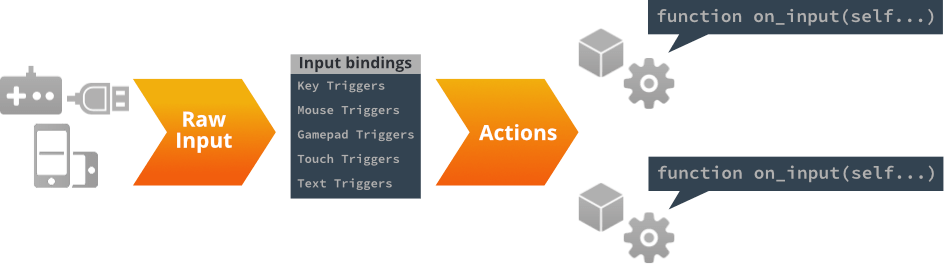
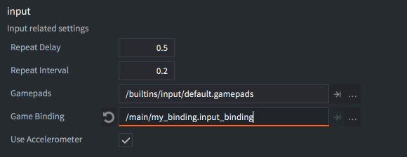
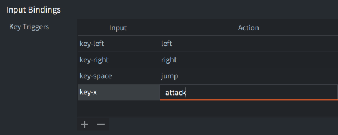
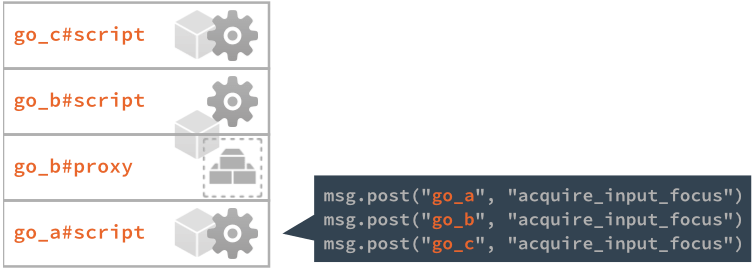
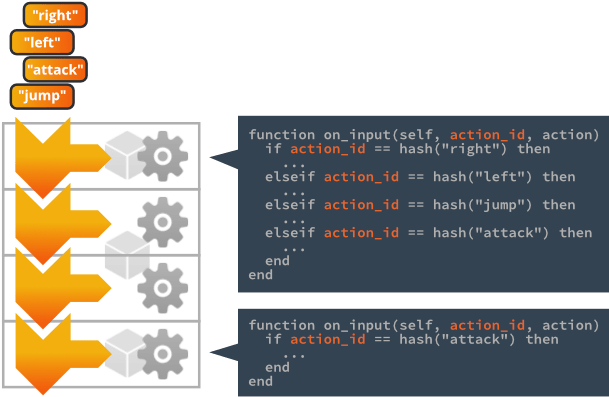
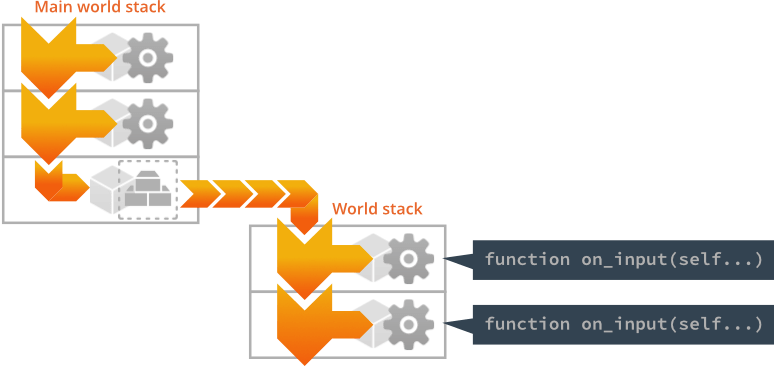
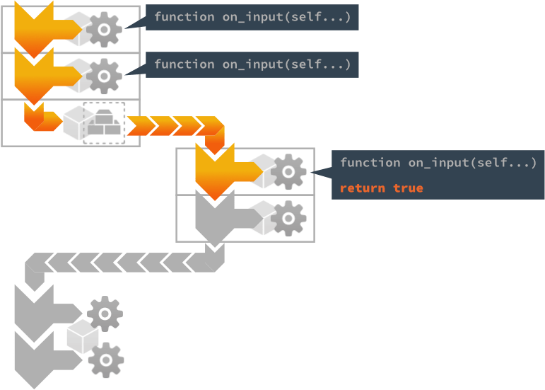
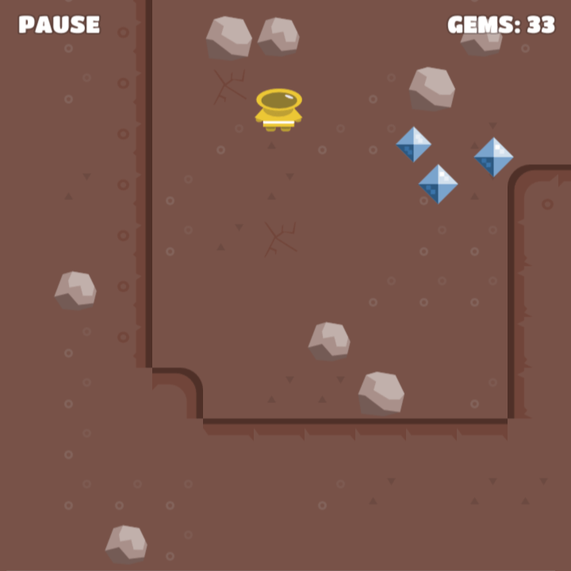
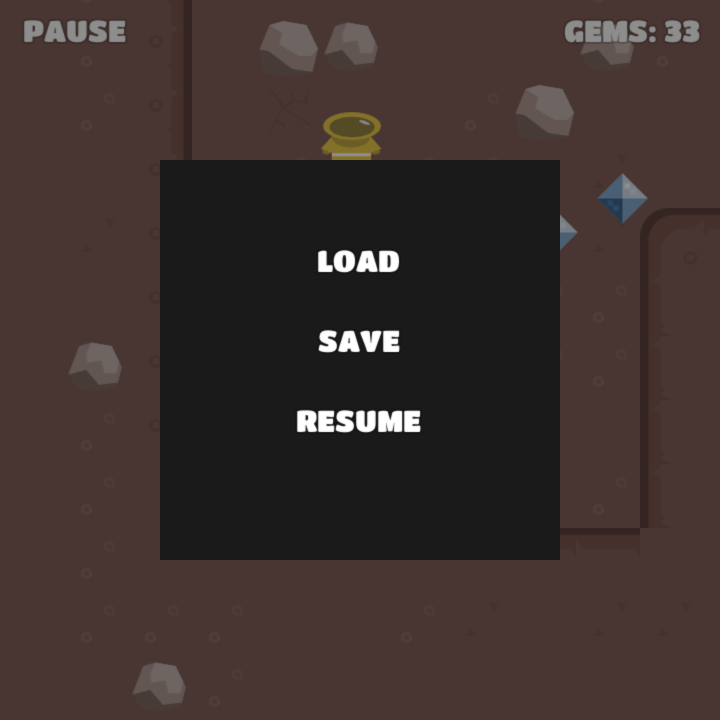

# Wejście

Całe wejście użytkownika jest przechwytywane przez silnik i wysyłane jako akcje do komponentów skryptów oraz komponentów skryptów GUI w obiektach gry, które zdobyły skupienie wejścia (ang. input focus) i implementują funkcję `on_input()`. Niniejsza instrukcja wyjaśnia, jak skonfigurować wiązania wejścia, aby przechwytywać zdarzenia z urządzeń, oraz jak pisać kod reagujący na te akcje.

System wejścia korzysta z zestawu prostych, ale bardzo elastycznych pojęć, dzięki czemu możesz zarządzać wejściem w sposób najlepiej dopasowany do swojej gry.



Urządzenia
: Urządzenia wejściowe, wbudowane w komputer albo do niego podłączone, a także podłączone do urządzenia mobilnego, dostarczają do środowiska uruchomieniowego Defold dane wejściowe na poziomie systemowym. Obsługiwane są następujące typy urządzeń:

  1. Keyboard - klawiatura, zarówno pojedyncze klawisze, jak i wprowadzanie tekstu
  2. Mouse - mysz, czyli pozycja, kliknięcia przycisków i akcje kółka myszy
  3. Single and multi-touch - pojedynczy i wielodotyk, dostępny na urządzeniach z systemem iOS i Android oraz w HTML5 na urządzeniach mobilnych
  4. Gamepads - gamepady, obsługiwane przez system operacyjny i mapowane w pliku [gamepads](#gamepads-settings-file)

Wiązania wejścia
: Zanim wejście zostanie wysłane do skryptu, surowe dane z urządzenia są tłumaczone na znaczące *akcje* za pomocą tabeli wiązań wejścia.

Akcje
: Akcje są identyfikowane przez haszowane nazwy, które podajesz w pliku wiązań wejścia. Każda akcja zawiera też istotne dane o wejściu: czy przycisk został naciśnięty lub zwolniony, współrzędne myszy i dotyku itp.

Nasłuchiwacze wejścia
: Każdy komponent skryptu albo skrypt GUI może odbierać akcje wejścia, jeśli przejmie *skupienie wejścia*. Kilku nasłuchiwaczy może być aktywnych jednocześnie.

Stos wejścia
: Lista nasłuchiwaczy wejścia, w której pierwszy, który przejął skupienie, znajduje się na dole stosu, a ostatni na jego szczycie.

Konsumowanie wejścia
: Skrypt może zdecydować o skonsumowaniu odebranego wejścia, co uniemożliwia przekazanie go dalej do nasłuchiwaczy znajdujących się niżej w stosie.

## Konfigurowanie wiązań wejścia

Wiązania wejścia to tabela obejmująca cały projekt, która pozwala określić, jak wejście z urządzeń ma być tłumaczone na nazwane *akcje* przed przekazaniem ich do komponentów skryptów i skryptów GUI. Aby utworzyć nowy plik wiązań wejścia, kliknij prawym przyciskiem myszy lokalizację w widoku *Assets* i wybierz <kbd>New... ▸ Input Binding</kbd>. Aby silnik używał nowego pliku, zmień wpis *Game Binding* w pliku *game.project*.



Domyślny plik wiązań wejścia jest automatycznie tworzony w każdym nowym szablonie projektu, więc zwykle nie ma potrzeby tworzenia nowego pliku. Domyślny plik nazywa się "game.input_binding" i znajduje się w folderze "input" w katalogu głównym projektu. Kliknij dwukrotnie ten plik, aby otworzyć go w edytorze:



Aby utworzyć nowe wiązanie, kliknij przycisk <kbd>+</kbd> na dole odpowiedniej sekcji typu wyzwalacza. Każdy wpis ma dwa pola:

*Input*
: Surowe wejście, którego chcesz nasłuchiwać, wybierane z przewijanej listy dostępnych wejść.

*Action*
: Nazwa akcji nadawana akcjom wejściowym w chwili ich tworzenia i przekazywania do skryptów. Tę samą nazwę akcji można przypisać do wielu wejść. Na przykład możesz przypisać klawisz <kbd>Space</kbd> i przycisk gamepada "A" do akcji `jump`. Pamiętaj, że istnieje znany błąd, przez który wejścia dotykowe nie mogą mieć tych samych nazw akcji co inne wejścia.

## Rodzaje wyzwalaczy

Istnieje pięć typów wyzwalaczy zależnych od urządzenia, które możesz utworzyć:

Wyzwalacze klawiszy (Key Triggers)
: Wejście z pojedynczego klawisza klawiatury. Każdy klawisz mapowany jest osobno do odpowiadającej mu akcji. Więcej informacji znajdziesz w [instrukcji o wejściu z klawiatury i tekście](/manuals/input-key-and-text).

Wyzwalacze tekstu (Text Triggers)
: Wyzwalacze tekstu służą do odczytywania dowolnego wejścia tekstowego. Więcej informacji znajdziesz w [instrukcji o wejściu z klawiatury i tekście](/manuals/input-key-and-text).

Wyzwalacze myszy (Mouse Triggers)
: Wejście z przycisków myszy oraz kółka myszy. Więcej informacji znajdziesz w [instrukcji o wejściu z myszy i dotyku](/manuals/input-mouse-and-touch).

Wyzwalacze dotyku (Touch Triggers)
: Wyzwalacze typu single-touch i multi-touch są dostępne na urządzeniach z systemem iOS i Android w aplikacjach natywnych oraz w pakietach HTML5. Więcej informacji znajdziesz w [instrukcji o wejściu z myszy i dotyku](/manuals/input-mouse-and-touch).

Wyzwalacze gamepada (Gamepad Triggers)
: Wyzwalacze gamepada pozwalają przypisać standardowe wejście z gamepada do funkcji gry. Więcej informacji znajdziesz w [instrukcji o gamepadach](/manuals/input-gamepads).

### Wejście z akcelerometru

Oprócz pięciu rodzajów wyzwalaczy wymienionych powyżej Defold obsługuje także wejście z akcelerometru w natywnych aplikacjach na Android i iOS. Zaznacz pole Use Accelerometer w sekcji Input pliku *game.project*.

```lua
function on_input(self, action_id, action)
    if action.acc_x and action.acc_y and action.acc_z then
        -- reaguj na dane z akcelerometru
    end
end
```

## Skupienie wejścia

Aby nasłuchiwać akcji wejścia w komponencie skryptu lub skrypcie GUI, należy wysłać wiadomość `acquire_input_focus` do obiektu gry, który zawiera ten komponent:

```lua
-- każ bieżącemu obiektowi gry (".") przejąć skupienie wejścia
msg.post(".", "acquire_input_focus")
```

Ta wiadomość nakazuje silnikowi dodać do *stosu wejścia* komponenty obsługujące wejście w obiektach gry, czyli komponenty skryptów, komponenty GUI oraz pełnomocniki kolekcji. Komponenty obiektu gry trafiają na szczyt stosu wejścia; komponent dodany jako ostatni znajdzie się najwyżej. Jeśli obiekt gry zawiera więcej niż jeden komponent obsługujący wejście, wszystkie zostaną dodane do stosu:



Jeśli obiekt gry, który już przejął skupienie wejścia, zrobi to ponownie, jego komponenty zostaną przeniesione na szczyt stosu.

## Rozsyłanie akcji wejścia i `on_input()`

Akcje wejścia są rozsyłane zgodnie ze stosem wejścia, od góry do dołu.



Każdy komponent znajdujący się na stosie, który zawiera funkcję `on_input()`, będzie miał tę funkcję wywołaną raz dla każdej akcji wejścia w danej klatce, z następującymi argumentami:

`self`
: Bieżąca instancja skryptu.

`action_id`
: Haszowana nazwa akcji, zgodnie z konfiguracją w wiązaniach wejścia.

`action`
: Tabela zawierająca przydatne dane o akcji, takie jak wartość wejścia, jego położenie (pozycje bezwzględne i różnicowe), czy wejście przycisku zostało `pressed` itd. Szczegóły znajdziesz w [opisie on_input()](/ref/go#on_input).

```lua
function on_input(self, action_id, action)
  if action_id == hash("left") and action.pressed then
    -- przesuń w lewo
    local pos = go.get_position()
    pos.x = pos.x - 100
    go.set_position(pos)
  elseif action_id == hash("right") and action.pressed then
    -- przesuń w prawo
    local pos = go.get_position()
    pos.x = pos.x + 100
    go.set_position(pos)
  end
end
```

### Skupienie wejścia i komponenty pełnomocnika kolekcji

Każdy świat gry ładowany dynamicznie przez pełnomocnika kolekcji ma własny stos wejścia. Aby rozsyłanie akcji mogło dotrzeć do stosu wejścia załadowanego świata, komponent pełnomocnika musi znajdować się na stosie wejścia głównego świata. Wszystkie komponenty na stosie załadowanego świata są obsługiwane przed kontynuowaniem rozsyłania w dół głównego stosu:



::: important
To częsty błąd: zapomina się wysłać `acquire_input_focus` do obiektu gry zawierającego komponent pełnomocnika kolekcji. Pominięcie tego kroku uniemożliwia dotarcie wejścia do jakichkolwiek komponentów na stosie wejścia załadowanego świata.
:::

### Zwalnianie wejścia

Aby przestać nasłuchiwać akcji wejścia, wyślij wiadomość `release_input_focus` do obiektu gry. Ta wiadomość usunie komponenty obiektu gry ze stosu wejścia:

```lua
-- każ bieżącemu obiektowi gry (".") zwolnić skupienie wejścia
msg.post(".", "release_input_focus")
```

## Konsumowanie wejścia

Funkcja `on_input()` komponentu może aktywnie decydować, czy akcje mają być przekazywane dalej w stosie, czy nie:

- Jeśli `on_input()` zwraca `false` albo nie zwraca niczego, wejście zostanie przekazane do następnego komponentu na stosie wejścia.
- Jeśli `on_input()` zwraca `true`, wejście zostaje skonsumowane. Żaden komponent niżej w stosie wejścia nie otrzyma tego wejścia. Dotyczy to wszystkich stosów wejścia. Komponent na stosie świata załadowanego przez pełnomocnika może skonsumować wejście i uniemożliwić komponentom na głównym stosie jego odbiór:



Istnieje wiele dobrych zastosowań, w których konsumowanie wejścia zapewnia prosty i skuteczny sposób przekazywania sterowania między różnymi częściami gry. Na przykład wtedy, gdy potrzebujesz wysuwanego menu, które przez chwilę jest jedyną częścią gry nasłuchującą wejścia:



Menu pauzy jest początkowo ukryte (wyłączone), a gdy gracz dotknie elementu HUD "PAUSE", zostaje włączone:

```lua
function on_input(self, action_id, action)
    if action_id == hash("mouse_press") and action.pressed then
        -- czy gracz nacisnął "PAUSE"?
        local pausenode = gui.get_node("pause")
        if gui.pick_node(pausenode, action.x, action.y) then
            -- poinformuj menu pauzy, żeby przejęło sterowanie
            msg.post("pause_menu", "show")
        end
    end
end
```



GUI menu pauzy przejmuje skupienie wejścia i konsumuje wejście, uniemożliwiając odbiór wszystkiego poza tym, co jest istotne dla wysuwanego menu:

```lua
function on_message(self, message_id, message, sender)
  if message_id == hash("show") then
    -- pokaż menu pauzy
    local node = gui.get_node("pause_menu")
    gui.set_enabled(node, true)

    -- przejmij skupienie wejścia
    msg.post(".", "acquire_input_focus")
  end
end

function on_input(self, action_id, action)
  if action_id == hash("mouse_press") and action.pressed then

    -- wykonaj jakieś działanie...

    local resumenode = gui.get_node("resume")
    if gui.pick_node(resumenode, action.x, action.y) then
        -- ukryj menu pauzy
        local node = gui.get_node("pause_menu")
        gui.set_enabled(node, false)

        -- zwolnij skupienie wejścia
        msg.post(".", "release_input_focus")
    end
  end

  -- skonsumuj całe wejście. Cokolwiek znajduje się niżej na stosie wejścia
  -- nigdy nie zobaczy tego wejścia, dopóki nie zwolnimy skupienia wejścia.
  return true
end
```
